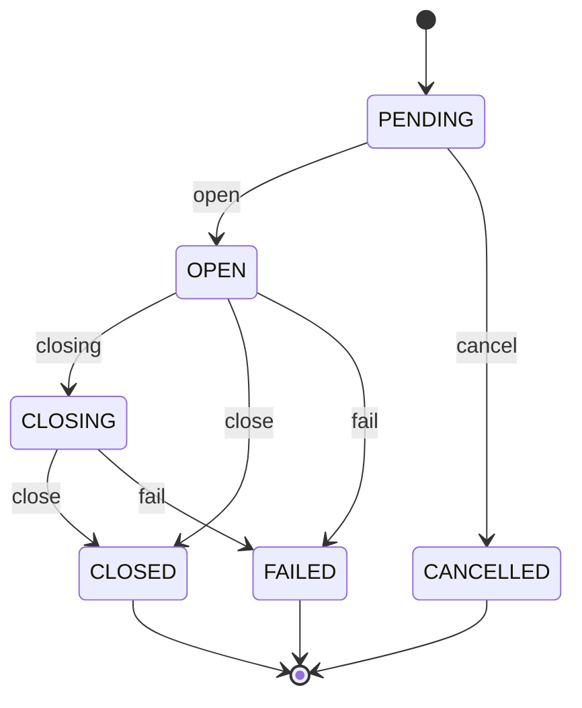

# API

The API is a stateful service that persists positions, orders, guardrail state, and account risk state in Postgres. Redis is optional.

## Position Lifecycle



## Key Endpoints

- `POST /positions` — create a new position (guardrail + risk gates enforced)
- `POST /positions/{id}/open` — mark position open
- `POST /positions/{id}/close` — close and update guardrail + account state
- `GET /guardrail/{strategy_id}/{pair}` — guardrail state
- `GET /risk/{strategy_id}` — account risk state
- `POST /risk/{strategy_id}/reset` — clear halt and reset streak
- `POST /risk/{strategy_id}/halt` — manual kill‑switch
- `POST /risk/{strategy_id}/resume` — resume after manual halt
- `GET /metrics` — Prometheus metrics (if enabled)

## Validation Endpoints

- `GET /validation/pipeline/{bar}` — summary metrics
- `GET /validation/db/{bar}` — DB metrics
- `GET /validation/compare/{bar}` — pipeline vs DB comparison
- `GET /validation/predictions/{bar}/{pair}` — signal alignment check

## Config

API settings are loaded from YAML and can be overridden via environment variables:

- `configs/api.yaml`
- `CONFIG_PATH` (override file path)

### Example
```yaml
guardrail_loss_streak: 3
guardrail_cooldown_days: 7
max_daily_loss_pct: 0.05
max_dd_pct: 0.10
max_pair_exposure_pct: 0.10
pair_weights_path: configs/pair_weights.yaml
```
