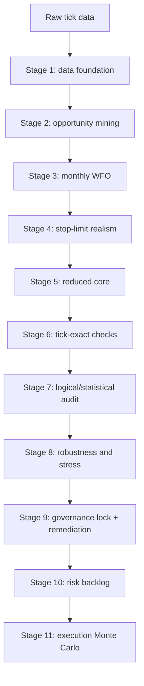

# Architecture

This repository currently runs as a research-first OCO pipeline, not an always-on API service.

## Current Runtime Model

## Source of Truth
- Process and controls: `docs/strategy_bible/`
- Generated stage evidence: `docs/strategy_bible/generated/`
- Analysis reports: `docs/analysis/`
- Contract checks: `data/analysis/tick_opportunity_mining/docs_contract_checks.csv`

## Architecture Boundary
- Mandatory: offline/research pipeline and governance artifacts.
- Outputs: Live execution locks and allowed state matrices.
- Current production research scope: `EURUSD`, `GBPUSD`, `USDJPY`.

## Next Integration Step
When execution integration is enabled, treat it as a thin adapter over the Stage 9 lock and Stage 4 stop-limit contract, not as a separate strategy engine.

## Rolling Historical Evidence

<!-- GENERATED:SYSREF:ARCHITECTURE:START -->
- generated_at_utc: `2026-03-05T14:42:34Z`
- symbols_covered: `EURUSD,GBPUSD,USDJPY,USDCHF,AUDUSD,USDCAD`
- stop-limit_reference: `stage_04_execution_realism`
- artifact_sources:
  - `data/analysis/tick_opportunity_mining/oco_execution_drift_monthly.csv`
  - `data/analysis/tick_opportunity_mining/oco_threshold_sensitivity.csv`
  - `data/analysis/tick_opportunity_mining/operator_action_status.csv`
  - `data/analysis/tick_opportunity_mining/oco_alert_disposition.csv`
  - `data/analysis/tick_opportunity_mining/execution_mc_symbol_scenarios.csv`
  - `data/analysis/tick_opportunity_mining/docs_contract_checks.csv`
  - `data/analysis/tick_opportunity_mining/run_delta_summary.csv`

#### Rolling Snapshot By Symbol
| symbol   | latest_month   | drift_fill_rate   | drift_overshoot_p95   | w13_fragility   | policy_quantile   | mc_s1_lb95   | reduced_mean_gross   |   non_green_actions |   non_green_alerts |
|:---------|:---------------|:------------------|:----------------------|:----------------|:------------------|:-------------|:---------------------|--------------------:|-------------------:|
| EURUSD   |                |                   |                       |                 |                   |              |                      |                   0 |                  0 |
| GBPUSD   |                |                   |                       |                 |                   |              |                      |                   0 |                  0 |
| USDJPY   |                |                   |                       |                 |                   |              |                      |                   0 |                  0 |
| USDCHF   |                |                   |                       |                 |                   |              |                      |                   0 |                  0 |
| AUDUSD   |                |                   |                       |                 |                   |              |                      |                   0 |                  0 |
| USDCAD   |                |                   |                       |                 |                   |              |                      |                   0 |                  0 |

#### Rolling Trend (Last 3 Months)
| symbol   |   months_used | fill_rate_mean_3m   | overshoot_p95_mean_3m   |
|:---------|--------------:|:--------------------|:------------------------|
| EURUSD   |             0 |                     |                         |
| GBPUSD   |             0 |                     |                         |
| USDJPY   |             0 |                     |                         |
| USDCHF   |             0 |                     |                         |
| AUDUSD   |             0 |                     |                         |
| USDCAD   |             0 |                     |                         |

#### Governance Snapshot
|   checks_failed |   high_critical_failed | max_age_hours_c6   |   run_delta_metric_rows_changed |   run_delta_gate_rows_changed |
|----------------:|-----------------------:|:-------------------|--------------------------------:|------------------------------:|
|               0 |                      0 |                    |                               0 |                             0 |
<!-- GENERATED:SYSREF:ARCHITECTURE:END -->
