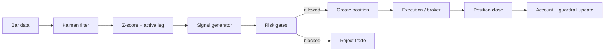
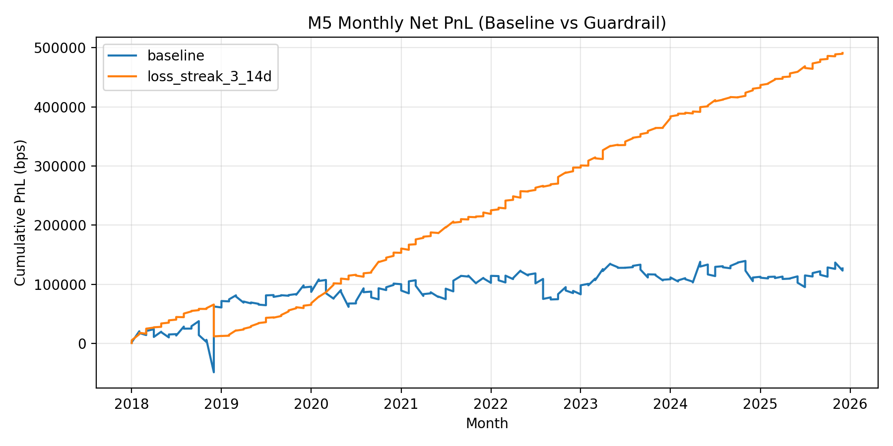
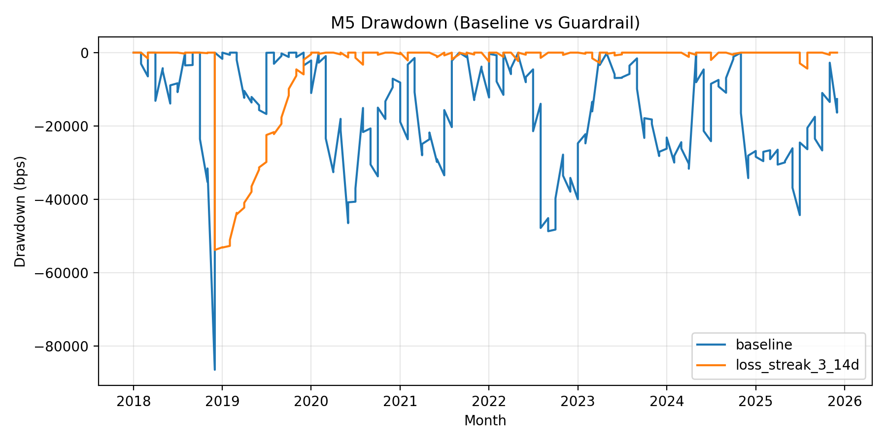
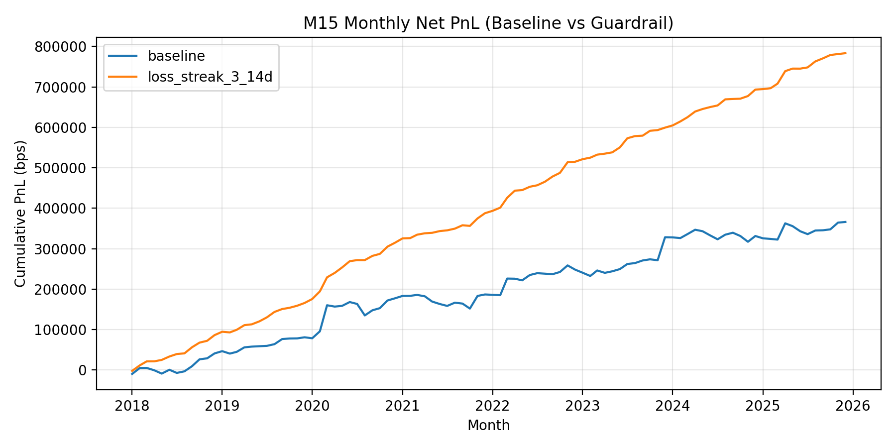
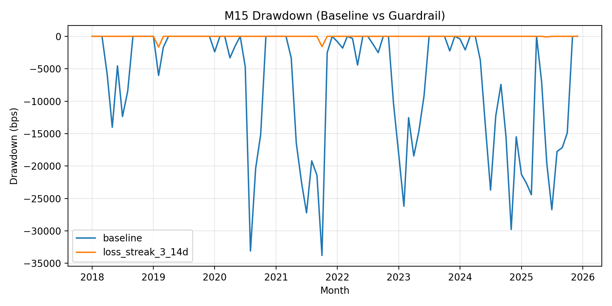

# Architecture

This page describes the runtime flow and the main components of the Behemoth system.

## System Flow

## Runtime Components

- **Signal engine**: `src/behemoth/core/*` computes Kalman states, Z‑scores, and active‑leg selection.
- **API**: `services/api/*` manages position state, guardrail, and risk limits.
- **Database**: Postgres stores positions, orders, and guardrail/account state.
- **Cache**: Redis is optional for hot position reads.

## Data Ownership

- **Market bars**: `data/global_*`
- **Events**: `data/events/events_*`
- **Analysis**: `data/analysis/*`

## Charts

Guardrail impact charts are maintained in `docs/figures/`:

