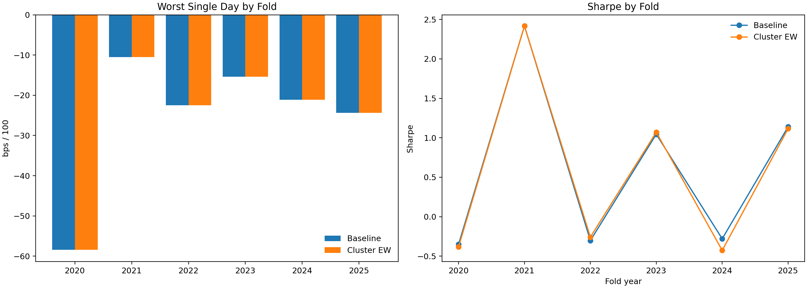
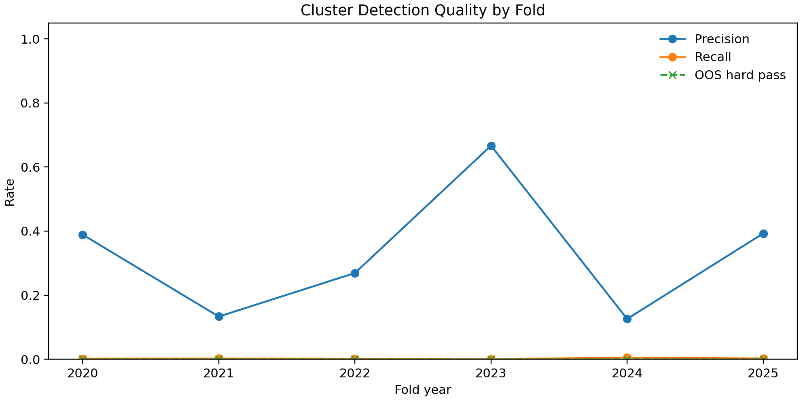
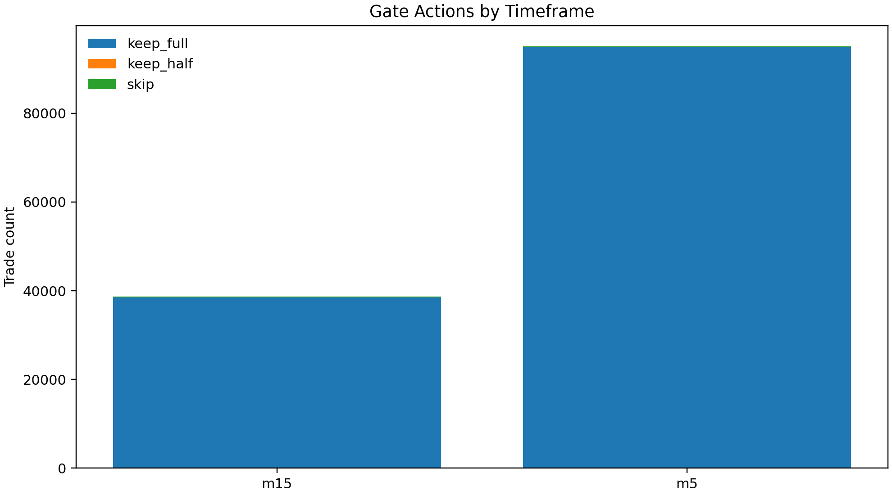
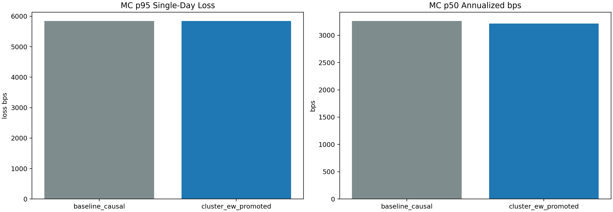
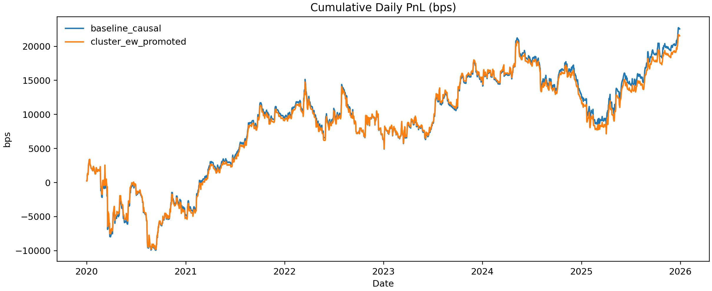
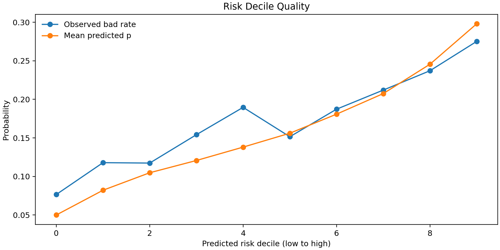

# Cluster Early-Warning Report (m5_mom__m15_momrev__m60_rev)

- Generated from prefix: `cluster_ew_m5mom_m15momrev_m60rev`
- Mix in focus: `m5_mom__m15_momrev__m60_rev`

## Headline Summary
| variant             | trades   |   mean_pnl_per_trade_bps |   sharpe | annualized_bps_calendar   |   cagr | worst_single_day_bps   | max_daily_dd_bps   |
|:--------------------|:---------|-------------------------:|---------:|:--------------------------|-------:|:-----------------------|:-------------------|
| baseline_causal     | 29,805   |                    0.757 |    0.4   | 3,761.905                 |  0.025 | -5,843.476             | -13,336.578        |
| cluster_ew_promoted | 29,735   |                    0.724 |    0.383 | 3,592.820                 |  0.024 | -5,843.476             | -13,648.418        |

## Fold Breakdown
|   year |   t1 |   t2 |   base_mean_pnl_per_trade_bps |   candidate_mean_pnl_per_trade_bps |   base_sharpe |   candidate_sharpe | base_worst_single_day_bps   | candidate_worst_single_day_bps   |   cluster_precision |   cluster_recall | oos_hard_pass   |
|-------:|-----:|-----:|------------------------------:|-----------------------------------:|--------------:|-------------------:|:----------------------------|:---------------------------------|--------------------:|-----------------:|:----------------|
|   2020 | 0.35 | 0.35 |                        -0.819 |                             -0.891 |        -0.352 |             -0.384 | -5,843.476                  | -5,843.476                       |               0.389 |            0.002 | False           |
|   2021 | 0.35 | 0.35 |                         3.165 |                              3.165 |         2.416 |              2.416 | -1,054.000                  | -1,054.000                       |               0.133 |            0.003 | False           |
|   2022 | 0.35 | 0.55 |                        -0.771 |                             -0.661 |        -0.303 |             -0.259 | -2,248.730                  | -2,248.730                       |               0.269 |            0.001 | False           |
|   2023 | 0.35 | 0.35 |                         2.071 |                              2.122 |         1.045 |              1.07  | -1,541.760                  | -1,541.760                       |               0.667 |            0.001 | False           |
|   2024 | 0.35 | 0.35 |                        -0.379 |                             -0.573 |        -0.28  |             -0.427 | -2,111.549                  | -2,111.549                       |               0.126 |            0.005 | False           |
|   2025 | 0.35 | 0.4  |                         1.82  |                              1.787 |         1.139 |              1.116 | -2,437.630                  | -2,437.630                       |               0.393 |            0.003 | False           |

## Figures

## Interpretation Notes
- `worst_single_day_bps` is the single worst daily PnL (non-cumulative).
- `max_daily_dd_bps` is cumulative drawdown measured on the daily equity curve.
- `cluster_precision/recall` are computed on labeled short-leg trades in each OOS fold.
- `oos_hard_pass` requires DD improvement plus return/trade floors from the plan.
