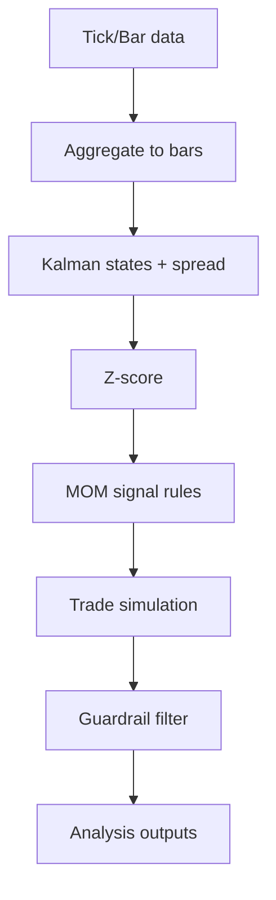

# Data Pipeline

This section documents how data is transformed into signals and analysis datasets.

## Flow

## Key Inputs

- **Bars**: `data/global_5m`, `data/global_15m`
- **Pairs**: defined in `pipelines/build_events_m5.py` and `pipelines/build_events_m15.py`

## Outputs

- **Events**: `data/events/events_m5_8yr_v3_mom.csv`, `data/events/events_m15_8yr_v3_mom.csv`
- **Analysis**: `data/analysis/*`

## Causality

- Entry logic only uses data up to the entry bar.
- Exits use Z‑score crossings computed from prior bars.
- Guardrail uses only realized PnL at **trade close**.
