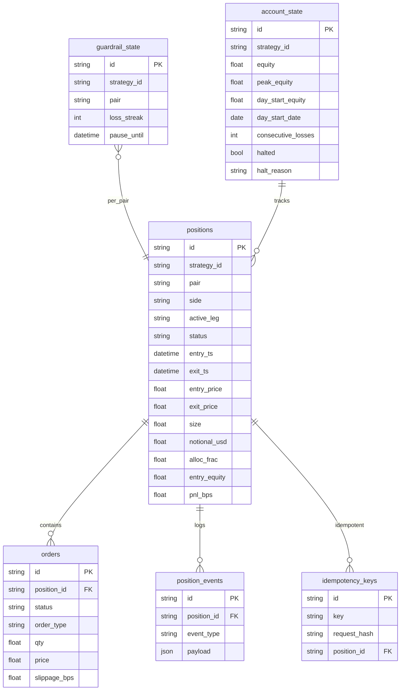

# Database Schema Diagram

```mermaid
erDiagram
  positions ||--o{ orders : contains
  positions ||--o{ position_events : logs
  positions ||--o{ idempotency_keys : idempotent
  guardrail_state }o--|| positions : per_pair
  account_state ||--o{ positions : tracks

  positions {
    string id PK
    string strategy_id
    string pair
    string side
    string active_leg
    string status
    datetime entry_ts
    datetime exit_ts
    float entry_price
    float exit_price
    float size
    float notional_usd
    float alloc_frac
    float entry_equity
    float pnl_bps
  }

  orders {
    string id PK
    string position_id FK
    string status
    string order_type
    float qty
    float price
    float slippage_bps
  }

  position_events {
    string id PK
    string position_id FK
    string event_type
    json payload
  }

  idempotency_keys {
    string id PK
    string key
    string request_hash
    string position_id FK
  }

  guardrail_state {
    string id PK
    string strategy_id
    string pair
    int loss_streak
    datetime pause_until
  }

  account_state {
    string id PK
    string strategy_id
    float equity
    float peak_equity
    float day_start_equity
    date day_start_date
    int consecutive_losses
    bool halted
    string halt_reason
  }
```
