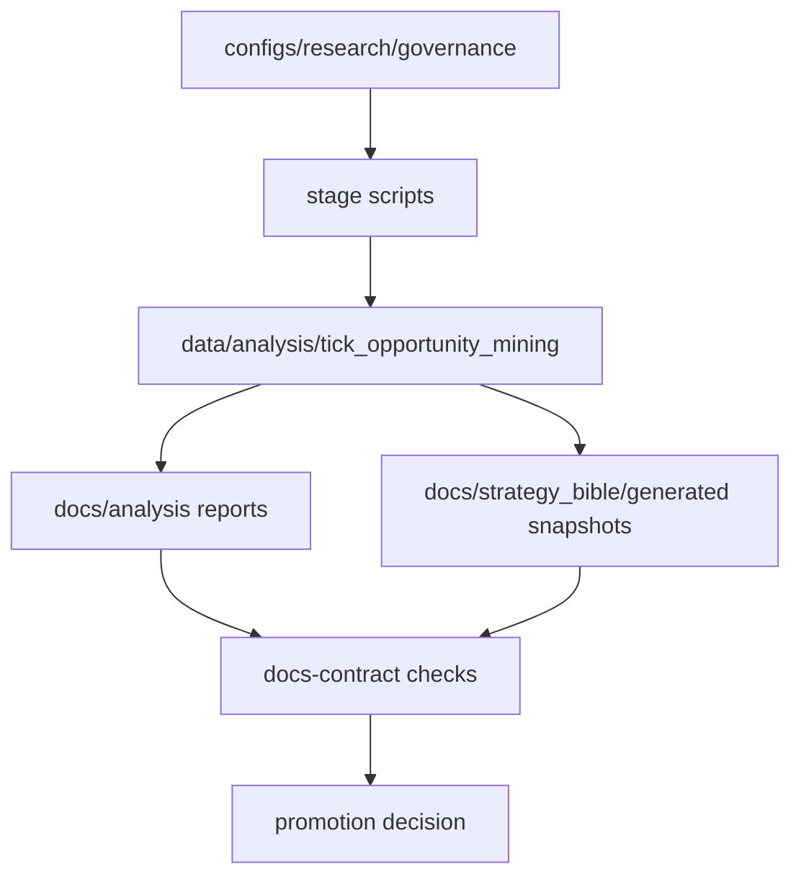

# Persistence Diagram

The relational DB path is optional. The mandatory path is the artifact contract path shown above.

## Rolling Historical Evidence

<!-- GENERATED:SYSREF:DB_SCHEMA_DIAGRAM:START -->
- generated_at_utc: `2026-03-23T20:07:53Z`
- symbols_covered: `EURUSD,GBPUSD,USDJPY,USDCHF,AUDUSD,USDCAD`
- stop-limit_reference: `stage_04_execution_realism`
- artifact_sources:
  - `data/analysis/tick_opportunity_mining/oco_execution_drift_monthly.csv`
  - `data/analysis/tick_opportunity_mining/oco_threshold_sensitivity.csv`
  - `data/analysis/tick_opportunity_mining/operator_action_status.csv`
  - `data/analysis/tick_opportunity_mining/oco_alert_disposition.csv`
  - `data/analysis/tick_opportunity_mining/ftmo_allocator_monitoring_metrics.csv`
  - `data/analysis/tick_opportunity_mining/ftmo_reservation_reconciliation.csv`
  - `data/analysis/tick_opportunity_mining/execution_mc_symbol_scenarios.csv`
  - `data/analysis/tick_opportunity_mining/docs_contract_checks.csv`
  - `data/analysis/tick_opportunity_mining/run_delta_summary.csv`

#### Rolling Snapshot By Symbol
| symbol   | latest_month   |   drift_fill_rate |   drift_overshoot_p95 |   w13_fragility |   policy_quantile |   mc_s1_lb95 | reduced_mean_gross   |   non_green_actions |   non_green_alerts |   ftmo_block_rate |   ftmo_budget_exceeded_rate |   ftmo_stale_pending_count | ftmo_reconciliation_pass   |
|:---------|:---------------|------------------:|----------------------:|----------------:|------------------:|-------------:|:---------------------|--------------------:|-------------------:|------------------:|----------------------------:|---------------------------:|:---------------------------|
| EURUSD   | 2026-02        |            0.0513 |                47.395 |          0.5039 |               0.9 |       1.18   |                      |                   7 |                 16 |               0.4 |                         0.2 |                          0 | false                      |
| GBPUSD   | 2026-02        |            0.0278 |                64.2   |          0.4116 |               0.9 |       0.8109 |                      |                   1 |                 14 |               0   |                         0   |                          0 | true                       |
| USDJPY   | 2026-02        |            0.0283 |                88.9   |          0.5923 |               0.9 |       1.0729 |                      |                   1 |                 15 |               0   |                         0   |                          0 | true                       |
| USDCHF   | 2026-02        |            0.0454 |                44.7   |          0.3023 |               0.9 |       0.7029 |                      |                   1 |                 15 |               0   |                         0   |                          0 | true                       |
| AUDUSD   | 2026-02        |            0.0432 |                39     |          0.2601 |               0.9 |       0.4893 |                      |                   2 |                 12 |               0   |                         0   |                          0 | true                       |
| USDCAD   | 2026-02        |            0.0604 |                69.6   |          0.4037 |               0.9 |       0.5715 |                      |                   2 |                 13 |               0   |                         0   |                          0 | true                       |

#### Rolling Trend (Last 3 Months)
| symbol   |   months_used |   fill_rate_mean_3m |   overshoot_p95_mean_3m |
|:---------|--------------:|--------------------:|------------------------:|
| EURUSD   |             3 |              0.3567 |                 46.8317 |
| GBPUSD   |             3 |              0.3438 |                 47.1333 |
| USDJPY   |             3 |              0.3476 |                 57.5783 |
| USDCHF   |             3 |              0.3388 |                 40.9667 |
| AUDUSD   |             3 |              0.3494 |                 30.6867 |
| USDCAD   |             3 |              0.3555 |                 35.9    |

#### Governance Snapshot
|   checks_failed |   high_critical_failed |   max_age_hours_c6 |   run_delta_metric_rows_changed |   run_delta_gate_rows_changed |
|----------------:|-----------------------:|-------------------:|--------------------------------:|------------------------------:|
|               2 |                      1 |           0.001635 |                              12 |                             0 |
<!-- GENERATED:SYSREF:DB_SCHEMA_DIAGRAM:END -->
