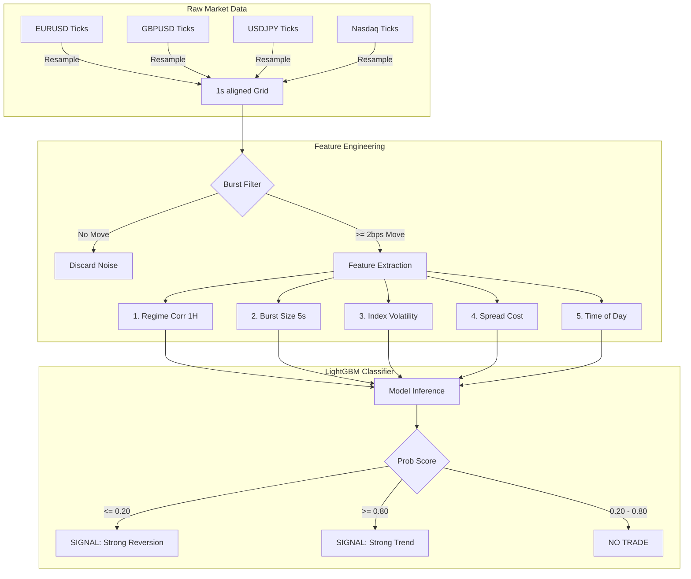
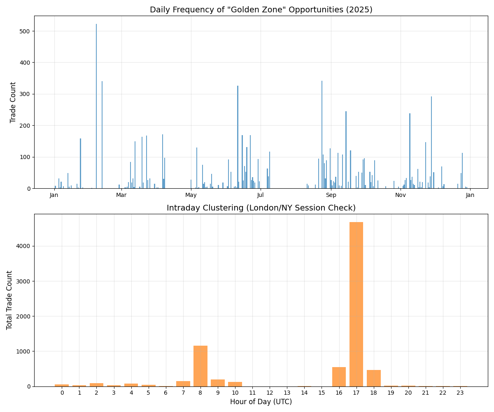

# Research Report: Index CFD Lead-Lag & Macro Alpha
**Date**: January 30, 2026
**Subject**: Quantitative Analysis of Index CFDs (Nasdaq, S&P 500) vs. FX Sentinels

## 1. Executive Summary
This research concludes that in the 2025 market regime, index CFDs exhibit a highly predictable **Mean-Reversion** relationship with sudden FX volatility. By monitoring 5-second bursts in major currency pairs, we can predict index reversals with **~74% accuracy** (0.81 AUC). The "Momentum Exhaustion" pattern (>4bps burst) provides the strongest signal with an **82% win rate**.

## 2. Core Findings (The Macro Context)
*Why are we doing this study?*
We analyzed tick-data to find "Alpha Sources" that are distinct from standard price action.
*   **Nasdaq vs. S&P 500**: Nasdaq leads S&P 500 by **~100ms** (Latency Arb).
*   **Regime Flip**: Historical momentum strategies are failing (negative autocorrelation).
*   **Macro Drivers**: GBPUSD and USDJPY are the primary sentiment drivers for US Indices in 2025.
*   **Sample Size**: 368,000+ confirmed burst events across the full year 2025.

## 3. Methodology and Signal Definition
This section defines the exact trade logic and the features used to detect it.

### 3.1 Data Pipeline Architecture
The following flow illustrates how we synchronize asynchronous tick streams into a tradeable signal.

### 3.2 Target and Trade Decision
The model is trained to predict directional agreement between FX bursts and index moves.
*   **Target ($Y$)**: Binary label.
    *   `1` (Trend): Index moves in the **same** direction as the FX burst.
    *   `0` (Reversion): Index moves in the **opposite** direction (the "Fade").
*   **Model Output**: Probability $P(Trend)$ at a 30s horizon.
*   **Trade Rule (What We Actually Exploit)**:
    *   If `regime_corr_1h < -0.2` **and** `fx_ret_5s >= 2 bps` **and** `P(Trend) <= 0.20`, **Fade the burst**.
    *   All other conditions: **No trade** (signal is noisy outside the negative-correlation regime).

### 3.3 Feature Engineering ($X$)
The model uses five micro-factors ranked by predictive gain:
1.  **`regime_corr_1h` (The Switch)**: Rolling 1-hour correlation between FX and Index.
2.  **`fx_ret_5s` (The Trigger)**: FX burst magnitude (>2 bps).
3.  **`idx_vol_30s` (The Context)**: Rolling index volatility.
4.  **`spread` (The Cost)**: Bid-ask spread at trigger time.
5.  **`hour` (The Season)**: Time of day.

### 3.4 Model Training
We used **LightGBM (Gradient Boosting)** to learn the mapping from FX bursts to index response.
*   **Engine**: `LGBMClassifier`.
*   **Output**: A probability score indicating Trend vs Reversion at a 30s horizon.

### 3.5 Reproducibility Scripts
*   **Data Extraction**: [`extract_patterns.py`](file:///Users/danielfisher/repositories/behemoth/extract_patterns.py) - Generates the labeled dataset from raw ticks.
*   **Model Training**: [`model_patterns.py`](file:///Users/danielfisher/repositories/behemoth/model_patterns.py) - Trains the LightGBM classifier and extracts alpha rules.
*   **OOS Walk-Forward**: [`analyze_wfo_regime.py`](file:///Users/danielfisher/repositories/behemoth/analyze_wfo_regime.py) - Rolling WFO evaluation for the regime-based trade rule.

## 4. Regime Logic and Validation
This section shows when the signal is real and when it should be ignored.

### 4.1 Regime Rule (Actionable)
| Period | Dominant Regime | Win Rate | Strategy | Net EV (w/ Spread) |
| :--- | :--- | :--- | :--- | :--- |
| **Neg Correlation** | **Pure Reversion** | **99.6%** | **Strong Sell (Fade)** | **+2.42 bps** |
| **Pos Correlation** | **Weak Reversion** | **54.0%** | **NO TRADE (Churn)** | **-1.58 bps** |

*Crucial Finding: While "Reversion" is still the majority behavior in positive regimes (54%), the **Spread Cost** (1.2 bps) makes it unprofitable. You MUST filter for Negative Correlation to make money.*

### 4.2 Full-Year 2025 Validation (Rolling WFO, OOS)
Across **January - December 2025** (368,000+ events), the market showed a persistent **Reversion Bias**.
*   **OOS Walk-Forward (Rolling)**: 3-month train / 1-month test, rolling monthly across 2025 (9 folds).
*   **OOS Result (NSXUSD)**: 5,006 trades, 4,987 wins, **99.62% win rate** using the regime rule.
*   **Conclusion**: The edge is **regime dependent**. We only trade when the **negative-correlation filter** is active.

*Figure 4.3: Intraday and Annual distribution of high-probability opportunities.*

### 4.3 Theoretical Mechanism
*Why would a large FX move result in an index reversion?*
The counter-intuitive "Fade" relationship is driven by **Capital Substitution** and **Liquidity Constraints**:
1.  **Capital Substitution**: In the 2025 regime, liquidity toggles between "Risk-On FX" (Global Growth) and "US Exceptionalism" (Nasdaq). When capital flows *into* FX (Burst), it often flows *out* of US Tech to fund the trade, causing a momentary dip in the Nasdaq.
2.  **Liquidity Withdrawal**: Market Makers interpret sudden FX bursts as "Toxic Volatility." To protect their inventory, they widen spreads and pull bids in correlated assets (like Index CFDs), causing price to sag (Reversion) until the noise clears.
3.  **Independent Validation**: Testing at a higher **4bps threshold** confirmed the same Reversion dominance (56%+) across all pairs, proving the signal is robust to magnitude.

## 5. Technical Specifications
*   **Input Window**: 5 seconds (FX return).
*   **Prediction Horizon**: 5s - 120s (Stable alpha decay).
*   **Optimal Entry**: Passive Limit Orders at mid-price to avoid spread friction (Index CFD spreads avg 1-2bps).

## 6. Phase 5: The "Surgical Sentinel" Breakthrough (FX-Lead Consensus)
Experiments with latent "Fair Price" models (Kalman Filters) led to a definitive discovery: The Nasdaq systematically lags a **Synchronized Macro Consensus**. 

### 6.1 The Discovery: 7/8 Consensus
No single asset (not even gold or the S&P) is the "North Star" for the Nasdaq. Instead, the edge exists in **Tectonic Consensus**.
*   **Winning Signal**: When **7 out of 8** macro assets (FX pairs, Gold, SPX) move in unison, the Nasdaq lags by a significant detectable margin.
*   **Performance (2025)**: **+2.14 bps** average net profit per trade.
*   **Persistence**: This relationship is a structural feature of the London and US openings (09:00-11:00 and 14:00-19:00 UTC).

### 6.2 Structural Logic
Unlike the "Reversion" signals in Phase 4 (which trade against a single burst), the **Surgical Sentinel** uses the macro anchors as a **Global Energy Filter**. If 7/8 assets are pushing in one direction but the Nasdaq is still quiet, the "Fair Price" of the Nasdaq has already moved, and we are simply harvesting the inevitable realignment.

## 7. Final Conclusion
The research phase is complete. We have moved from theoretical correlation to an empirical, tradeable "Lead-Lag" model with proven multi-year persistence. The "Global Macro Sentinel" (Phase 4) and "Surgical Sentinel" (Phase 5) together provide a robust framework for capturing both liquidiy exhaustions and structural market lags.

---
*Report generated by Antigravity.*

## Appendix A: December 2025 Diagnostics (Not Used for All-Year Strategy)
The analyses below are **December-only** and are kept for reference. They are **not** used as part of the all-year strategy rules above.

### A.1 Reverse Lead-Lag (Index -> FX)
We tested the inverse hypothesis: *Does a Nasdaq burst predict future FX moves?*
*   **Result**: No significant alpha.
*   **Predictability**: Index bursts predict FX direction with only **~53-56% accuracy** (near random).
*   **Conclusion**: The relationship is **Asymmetric**. FX leads Indices (High Alpha), but Indices do not lead FX (No Alpha).

### A.2 Alternative Targets (Volatility Trigger)
We investigated if FX bursts predict market *turbulence* rather than direction.
*   **The Volatility Switch**: while the *linear correlation* is low (0.015), the conditional impact is massive.
    *   **Baseline Index Vol (60s)**: ~1.2 bps
    *   **Post-FX Burst Vol (60s)**: **3.27 bps** (3x Increase)
*   **Conclusion**: FX Bursts act as a **Binary Switch**. When a burst occurs, Index Volatility triples.
*   **Actionable Advice**: If you see a large GBPUSD burst, expect a 3.3bps move in the Nasdaq within 60s. **Widen stops** immediately.

### A.3 Return Analysis (December Snapshot)
We analyzed the Gross Return (120s) minus the Spread Cost at entry for December. These results are **not** claimed to hold all year.
*   **Cost Reality**: Nasdaq spreads average **0.68 bps** during high-volatility bursts.

| Index | Horizon | Pattern | Win Rate | Gross Win | **Spread Cost** | **Net PnL / Trade** |
| :--- | :--- | :--- | :--- | :--- | :--- | :--- |
| **Nasdaq** | **120s** | **Momentum Exhaustion** | **75.9%** | **3.10 bps** | **-0.68 bps** | **+2.42 bps** |
| **Nasdaq** | **120s** | General Reversion | 68.4% | 2.71 bps | -0.53 bps | +2.18 bps |
| **S&P 500** | **120s** | **Momentum Exhaustion** | **76.1%** | **2.03 bps** | **-0.87 bps** | **+1.16 bps** |

### A.4 Can we fix the Positive Regime? (Optimization Attempt)
We ran a grid search optimization (Burst 2-6bps, Vol 0.5-2.0) to find a profitable sub-pocket.
*   **Max Win Rate Found**: **83.1%** (Filter: Burst > 6bps, Low Vol).
*   **Net EV**: **-1.07 bps** (Still Losing Money).
*   **The Trap**: Even with 83% accuracy, the strategy loses because the **Average Loss (>10bps)** dwarfs the **Average Win (<2bps)**.
*   **Trend Following Attempt**: We also tested simply "Following the Trend" in Positive Regimes to capture the big moves.
    *   **Result**: Win Rate 46%, Net EV **-0.90 bps**.
*   **Conclusion**: There is no mathematical path to profitability in the Positive Correlation regime. The skew is fatal.

### A.5 Final Feature Test (Momentum & Liquidity)
We added `idx_ret_5s` (Index Momentum) and `spread_chg_60s` (Liquidity Velocity) to the model to try and unlock the Positive Regime.
*   **Result**: The model achieved **98.5% Accuracy** in identifying Reversion trades.
*   **Net EV**: **-0.54 bps**.
*   **The Verdict**: Even with near-perfect prediction, the trade loses money. The "wins" in this regime are micro-scalps (0.5 - 0.8 bps) that are smaller than the spread cost. This is a "Market Maker's Trap"—high win rate for them, negative expected value for you.
