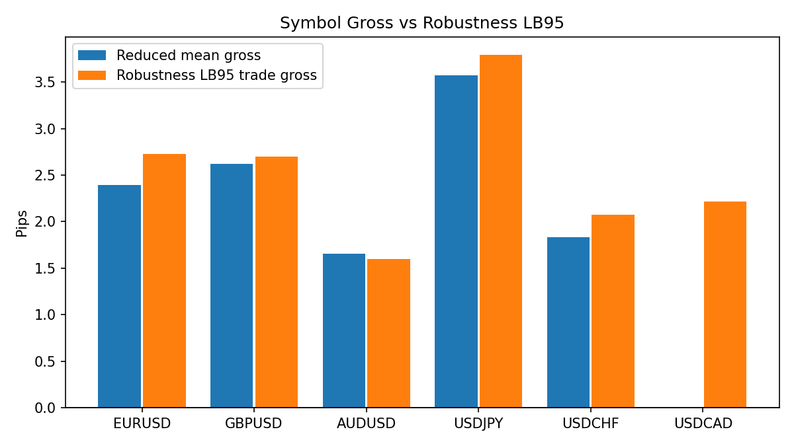
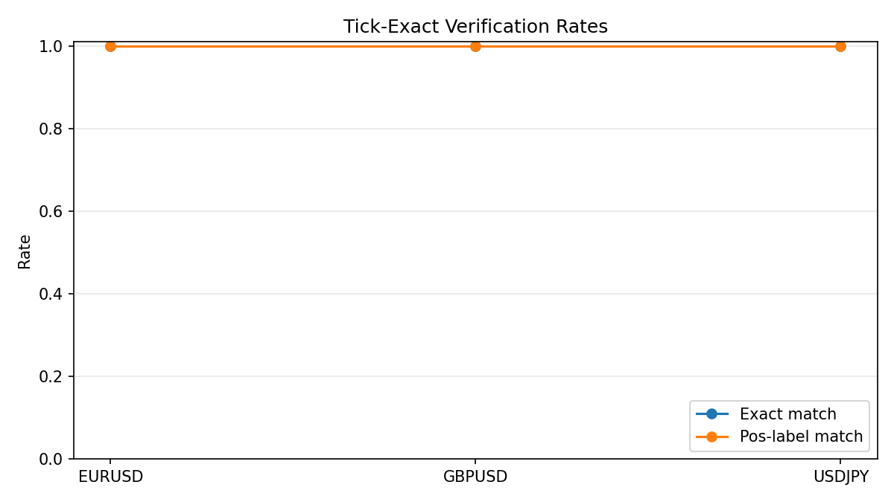

# Pipeline Snapshot

- generated_at: `2026-03-23 20:05:07 UTC`
- title: `OCO Rolling Strategy Bible`

## Authority Note
- Authority label: `generated truth snapshot`
- Authoritative for: current per-symbol status, current gate outcomes, and current top-level readiness summary across the active symbol universe.
- Not authoritative for: narrative interpretation, remediation priority, or policy exceptions on its own.
- Depends on: the strategy bible build process and the current rolling artifact set consumed by `scripts/build_oco_strategy_bible.py`.

## Symbol Summary
| symbol   |   mean_gross_pips |   lb95_month_mean_gross_pips |   positive_months |   months_total |   rows_total |   fill_rate_overall |   exact_match_rate |   pos_label_match_rate | tick_exact_overall_pass   |   robustness_quantile |   robustness_rows |   robustness_mean_gross_pips |   robustness_lb95_trade_mean_gross_pips |   robustness_positive_months |   robustness_months |   tick_overshoot_mean_pips |   tick_overshoot_p95_pips | api_signal_parity_pass   | api_execution_parity_pass   | api_parity_verdict   |   api_selected_missing_expected |   api_selected_extra_runtime |   api_execution_failed_checks_high_critical | gate_reduced_lb95_month_gt0   | gate_tick_exact   | gate_robust_lb95_trade_gt0   | gate_robust_months_majority   | gate_api_signal_parity   | gate_api_execution_parity   | gate_api_parity   | symbol_all_gates_pass   |
|:---------|------------------:|-----------------------------:|------------------:|---------------:|-------------:|--------------------:|-------------------:|-----------------------:|:--------------------------|----------------------:|------------------:|-----------------------------:|----------------------------------------:|-----------------------------:|--------------------:|---------------------------:|--------------------------:|:-------------------------|:----------------------------|:---------------------|--------------------------------:|-----------------------------:|--------------------------------------------:|:------------------------------|:------------------|:-----------------------------|:------------------------------|:-------------------------|:----------------------------|:------------------|:------------------------|
| EURUSD   |           2.3906  |                     1.4302   |                 8 |             15 |         4320 |            0.970568 |                  1 |                      1 | True                      |                   0.9 |              5934 |                      2.83795 |                                 2.72549 |                           10 |                  10 |                   0.803633 |                      0.9  | True                     | True                        | green                |                               0 |                            0 |                                           0 | True                          | True              | True                         | True                          | True                     | True                        | True              | True                    |
| GBPUSD   |           2.6216  |                     2.09206  |                11 |             15 |         8918 |            0.883933 |                  1 |                      1 | True                      |                   0.9 |             12161 |                      2.77239 |                                 2.69625 |                           11 |                  11 |                   2.65752  |                     18.42 | True                     | True                        | green                |                               0 |                            0 |                                           0 | True                          | True              | True                         | True                          | True                     | True                        | True              | True                    |
| AUDUSD   |           1.65684 |                     0.992865 |                 9 |             15 |         4722 |            0.858545 |                  1 |                      1 | True                      |                   0.9 |              7789 |                      1.6767  |                                 1.59632 |                           11 |                  11 |                   1.24815  |                      6.7  | True                     | True                        | green                |                               0 |                            0 |                                           0 | True                          | True              | True                         | True                          | True                     | True                        | True              | True                    |
| USDJPY   |           3.572   |                     2.87881  |                11 |             15 |         8611 |            0.842399 |                  1 |                      1 | True                      |                   0.9 |             13266 |                      3.88653 |                                 3.79579 |                           11 |                  11 |                   2.69543  |                     17.7  | True                     | True                        | green                |                               0 |                            0 |                                           0 | True                          | True              | True                         | True                          | True                     | True                        | True              | True                    |
| USDCHF   |           1.8317  |                     1.28827  |                11 |             15 |         4874 |            0.854189 |                  1 |                      1 | True                      |                   0.9 |             10408 |                      2.15095 |                                 2.07321 |                           11 |                  11 |                   1.23741  |                      4.6  | True                     | True                        | green                |                               0 |                            0 |                                           0 | True                          | True              | True                         | True                          | True                     | True                        | True              | True                    |
| USDCAD   |         nan       |                     1.23389  |                10 |             15 |         7083 |            0.941388 |                  1 |                      1 | True                      |                   0.9 |              7809 |                      2.30917 |                                 2.21911 |                           11 |                  11 |                   1.51483  |                      5.9  | True                     | True                        | green                |                               0 |                            0 |                                           0 | True                          | True              | True                         | True                          | True                     | True                        | True              | True                    |

## Stage Gate Status
| symbol   | gate_reduced_lb95_month_gt0   | gate_tick_exact   | gate_robust_lb95_trade_gt0   | gate_robust_months_majority   | gate_api_signal_parity   | gate_api_execution_parity   | gate_api_parity   | symbol_all_gates_pass   |
|:---------|:------------------------------|:------------------|:-----------------------------|:------------------------------|:-------------------------|:----------------------------|:------------------|:------------------------|
| EURUSD   | True                          | True              | True                         | True                          | True                     | True                        | True              | True                    |
| GBPUSD   | True                          | True              | True                         | True                          | True                     | True                        | True              | True                    |
| AUDUSD   | True                          | True              | True                         | True                          | True                     | True                        | True              | True                    |
| USDJPY   | True                          | True              | True                         | True                          | True                     | True                        | True              | True                    |
| USDCHF   | True                          | True              | True                         | True                          | True                     | True                        | True              | True                    |
| USDCAD   | True                          | True              | True                         | True                          | True                     | True                        | True              | True                    |

## Figures
- `fig01_symbol_gross_vs_lb95.png`
  
- `fig02_symbol_tick_exact_rates.png`
  