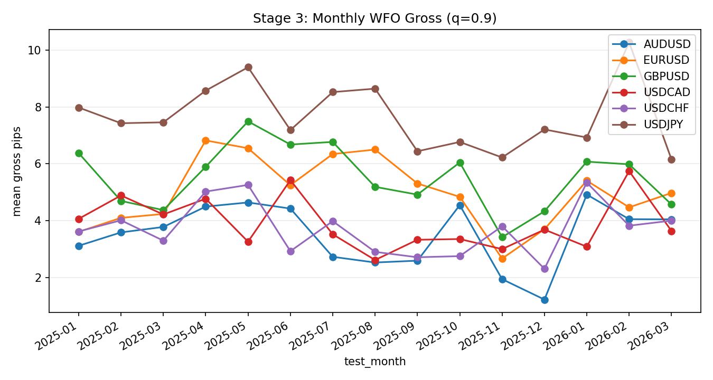

### Auto Snapshot - Stage 03

- generated_at: `2026-02-26 22:19:06 UTC`
- Execution threshold summary is aligned to quantile=0.9.
- Metrics are strictly month-forward (3M train -> 1M test).

#### Key Results
| symbol   |   months |   auc_mean |   brier_mean |   test_rows_total |
|:---------|---------:|-----------:|-------------:|------------------:|
| EURUSD   |        9 |   0.526973 |     0.249766 |        3.3563e+06 |
| GBPUSD   |        9 |   0.522514 |     0.24961  |        4.2722e+06 |
| USDJPY   |        9 |   0.526568 |     0.247866 |        4.5452e+06 |

#### Details
| symbol   |   months |   mean_coverage |   mean_gross_pips |   rows_selected |
|:---------|---------:|----------------:|------------------:|----------------:|
| EURUSD   |        9 |       0.0953233 |          0.884677 |          325515 |
| GBPUSD   |        9 |       0.096381  |          0.996288 |          414128 |
| USDJPY   |        9 |       0.101975  |          1.33948  |          459585 |

#### Plots

#### Overfitting Diagnostics (Exec Quantile)
| symbol   |   quantile |   rows |   months |   positive_months |   lb95_trade_mean_gross_pips |   lb95_trade_mean_gross_pips_iid |   lb95_trade_mean_gross_pips_month_block |   pvalue_month_mean_gt0 |   pvalue_bonferroni |   pvalue_fdr_bh |   uplift_vs_null_pips |   pvalue_perm_uplift |   pvalue_perm_fdr_bh | majority_positive_months   | bonferroni_pass_10pct   | fdr_pass_10pct   | perm_fdr_pass_10pct   |
|:---------|-----------:|-------:|---------:|------------------:|-----------------------------:|---------------------------------:|-----------------------------------------:|------------------------:|--------------------:|----------------:|----------------------:|---------------------:|---------------------:|:---------------------------|:------------------------|:-----------------|:----------------------|
| EURUSD   |        0.9 | 325515 |        9 |                 9 |                      1.02232 |                              nan |                                      nan |             1.15261e-09 |         1.15261e-09 |     1.15261e-09 |                   nan |                  nan |                  nan | True                       | True                    | True             | False                 |
| GBPUSD   |        0.9 | 414128 |        9 |                 9 |                      1.00211 |                              nan |                                      nan |             0           |         0           |     0           |                   nan |                  nan |                  nan | True                       | True                    | True             | False                 |
| USDJPY   |        0.9 | 459585 |        9 |                 9 |                      1.36145 |                              nan |                                      nan |             0           |         0           |     0           |                   nan |                  nan |                  nan | True                       | True                    | True             | False                 |

- Interpretation: these diagnostics are computed on WFO out-of-sample predictions only.
- `bonferroni_pass_10pct` and `fdr_pass_10pct` summarize multiplicity-adjusted significance at alpha=0.10.

#### Leakage/Label Integrity (WFO Focus)
| symbol   |   checks_total |   checks_failed |   high_critical_failed |
|:---------|---------------:|----------------:|-----------------------:|
| EURUSD   |              6 |               0 |                      0 |
| GBPUSD   |              6 |               0 |                      0 |
| USDJPY   |              6 |               0 |                      0 |
