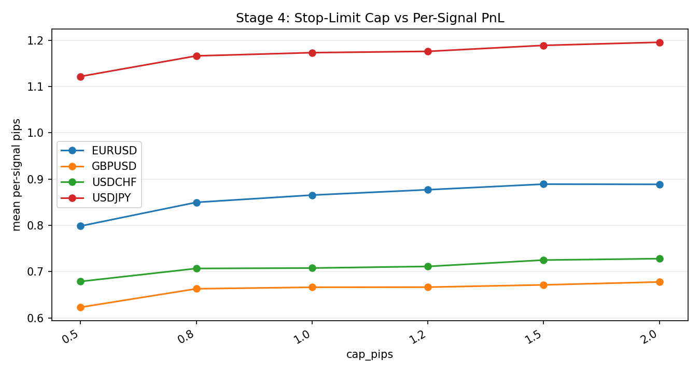

### Auto Snapshot - Stage 04

- generated_at: `2026-02-27 07:37:02 UTC`
- Execution realism is applied with tick first-cross overshoot.
- Cap curve highlights fill-rate versus signal-level expectancy.
- E11-E13 are informational execution diagnostics: session dispersion, plateau width, and non-fill opportunity cost.

#### Key Results
| symbol   |   rows |   touch_found_rate |   base_mean_gross_pips |   tick_overshoot_mean_pips |   tick_overshoot_p95_pips |   e11_session_overshoot_dispersion |   e12_cap_plateau_width_pips |   e13_nonfill_opportunity_cost_pips |
|:---------|-------:|-------------------:|-----------------------:|---------------------------:|--------------------------:|-----------------------------------:|-----------------------------:|------------------------------------:|
| EURUSD   | 324963 |           0.999985 |                1.04109 |                   0.136206 |                       0.5 |                           0.851988 |                          0.7 |                            0.116807 |
| GBPUSD   | 414128 |           0.999978 |                1.01745 |                   0.141476 |                       0.5 |                           1.20518  |                          0.7 |                            0.11825  |
| USDJPY   | 459585 |           0.999954 |                1.37853 |                   0.221513 |                       0.7 |                           0.958511 |                          0.7 |                            0.185352 |

#### Details
| symbol   |   cap_pips |   fill_rate |   mean_per_signal_full_overshoot |
|:---------|-----------:|------------:|---------------------------------:|
| EURUSD   |        0.8 |    0.975843 |                         0.849812 |
| EURUSD   |        1   |    0.986275 |                         0.865469 |
| EURUSD   |        1.2 |    0.990054 |                         0.877019 |
| EURUSD   |        1.5 |    0.993919 |                         0.889102 |
| GBPUSD   |        0.8 |    0.980955 |                         0.858803 |
| GBPUSD   |        1   |    0.988796 |                         0.87368  |
| GBPUSD   |        1.2 |    0.990858 |                         0.875675 |
| GBPUSD   |        1.5 |    0.993398 |                         0.878747 |
| USDJPY   |        0.8 |    0.963719 |                         1.11047  |
| USDJPY   |        1   |    0.978787 |                         1.13374  |
| USDJPY   |        1.2 |    0.983461 |                         1.13861  |
| USDJPY   |        1.5 |    0.990209 |                         1.1564   |

#### Plots

#### Execution Risk Pre-Live
| symbol   |   checks_total |   checks_failed |   high_critical_failed |   e02_min_month_fill_rate |   e03_tail_above_cap |   e10_lb95_month_signal_net |
|:---------|---------------:|----------------:|-----------------------:|--------------------------:|---------------------:|----------------------------:|
| EURUSD   |             10 |               0 |                      0 |                  0.985912 |           0.00993051 |                    0.541982 |
| GBPUSD   |             10 |               0 |                      0 |                  0.985112 |           0.00912057 |                    0.787315 |
| USDJPY   |             10 |               0 |                      0 |                  0.974161 |           0.0164939  |                    0.958587 |
