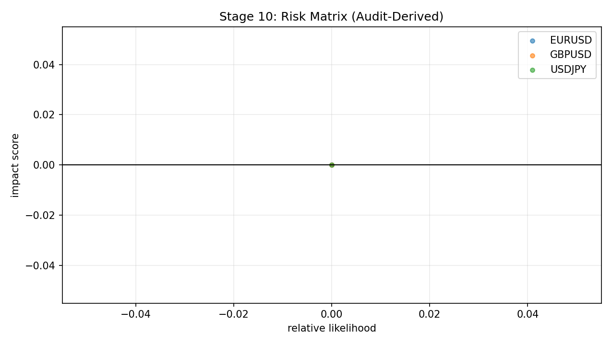

### Auto Snapshot - Stage 10

- generated_at: `2026-03-06 13:50:11 UTC`
- Risk backlog is derived from current logical-audit failures.
- When no failures exist, residual risks remain model/process assumptions rather than hard contract breaks.

#### Key Results
| status                 |   failed_checks |
|:-----------------------|----------------:|
| no_open_audit_failures |               0 |

#### Interpretation Notes
- Risk backlog is derived from current logical-audit failures.
- When no failures exist, residual risks remain model/process assumptions rather than hard contract breaks.

#### Action Trigger Summary
| trigger            | threshold_or_signal   | action_code                   | action_summary                                                          |
|:-------------------|:----------------------|:------------------------------|:------------------------------------------------------------------------|
| hard_gate_fail     | status=fail           | A3_HALT_RECALIBRATE           | Block promotion and rerun upstream stage diagnostics before continuing. |
| monitoring_warning | band=amber            | A0_MONITOR/A1_RECALIBRATE_CAP | Apply stage runbook remediation and confirm next-run recovery.          |

#### Details
| symbol   | severity_if_fail   |   total_checks |   failed_checks |
|:---------|:-------------------|---------------:|----------------:|
| AUDUSD   | critical           |              3 |               0 |
| AUDUSD   | high               |              5 |               0 |
| AUDUSD   | medium             |              2 |               0 |
| EURUSD   | critical           |              3 |               0 |
| EURUSD   | high               |              5 |               0 |
| EURUSD   | medium             |              2 |               0 |
| GBPUSD   | critical           |              3 |               0 |
| GBPUSD   | high               |              5 |               0 |
| GBPUSD   | medium             |              2 |               0 |
| USDCAD   | critical           |              3 |               0 |
| USDCAD   | high               |              5 |               0 |
| USDCAD   | medium             |              2 |               0 |
| USDCHF   | critical           |              3 |               0 |
| USDCHF   | high               |              5 |               0 |
| USDCHF   | medium             |              2 |               0 |
| USDJPY   | critical           |              3 |               0 |
| USDJPY   | high               |              5 |               0 |
| USDJPY   | medium             |              2 |               0 |

#### Plots

- Risk SLA tracker exists but has no open rows. `source=data/analysis/tick_opportunity_mining/risk_sla_tracker.csv`
