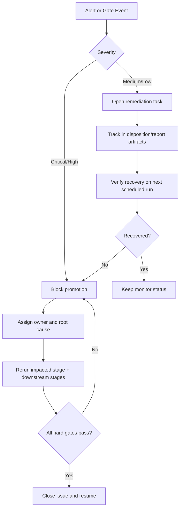

# OCO Operator Runbook

## Objective
Provide deterministic daily, weekly, and monthly operating actions for OCO pipeline governance and incident handling.

## Operating Cadence
| cadence | owner | purpose |
| --- | --- | --- |
| Daily | execution research | detect execution drift and active alert bands |
| Weekly | research + risk | assess threshold drift, lock drift, and near-fail pressure |
| Monthly | research lead | approve WFO roll-forward, reduced-core stability, and release readiness |

## Daily Checks
| trigger | threshold / signal | severity | owner | action | evidence artifact | SLA |
| --- | --- | --- | --- | --- | --- | --- |
| Overshoot tail drift | `E_DRIFT_OVERSHOOT_P95` in `amber` | medium | execution research | apply cap/session review and monitor next run | `docs/analysis/oco_execution_drift_report.md` | 1 business day |
| Fill-rate deterioration | `E_DRIFT_FILL_DROP` in `red` | high | execution research | block symbol promotion; recalibrate cap policy | `data/analysis/tick_opportunity_mining/oco_execution_drift_alerts.csv` | immediate |
| Unmapped non-green alerts | missing disposition rows | high | research | create/remediate disposition record | `data/analysis/tick_opportunity_mining/oco_alert_disposition.csv` | same day |

## Weekly Checks
| trigger | threshold / signal | severity | owner | action | evidence artifact | SLA |
| --- | --- | --- | --- | --- | --- | --- |
| Threshold fragility | `TS01_W13_THRESHOLD_FRAGILITY` in amber/red | medium/high | WFO research | retune lookback/cadence candidate set and rerun Stage 3 report | `docs/analysis/oco_threshold_sensitivity_report.md` | 2 business days |
| Lock drift | `G03_lock_drift_flags > 0` | high | research lead | block deploy path and refresh lock from validated artifacts | `docs/analysis/run_delta_dashboard.md` | immediate |
| Near-fail pressure | `G01_near_fail_count` rising for 3 runs | medium | risk | open MRM review task and tighten checks | `docs/analysis/operator_action_report.md` | 3 business days |

## Monthly Checks
| trigger | threshold / signal | severity | owner | action | evidence artifact | SLA |
| --- | --- | --- | --- | --- | --- | --- |
| Reduced-core capacity drop | `rows` below configured floor | high | research lead | hold release and rerun reduced-core selection | `docs/analysis/*_oco_reduced_core_rolling_report.md` | immediate |
| Registry drift | any `RU*` high/critical failure | high | research lead | enforce universe lock refresh before promotion | `docs/analysis/oco_rule_universe_registry_report.md` | immediate |
| Robustness degradation | Stage 8 LB95 turns non-positive | high | risk + research | freeze promotion and re-evaluate assumptions | `docs/analysis/oco_edge_clarity_report.md` | immediate |

## Decision Tree

## Escalation Matrix
| condition | escalation path |
| --- | --- |
| any high/critical gate fail | research lead -> risk owner -> deployment hold |
| repeated amber on same metric for 3 runs | research lead -> model risk review |
| expired accepted exception | research lead -> immediate re-approval or remediation closure |

## Mandatory Evidence Per Incident
- Triggering metric/check id and observed value.
- Action chosen (`action_code`) and owner.
- Timestamped rerun evidence after remediation.
- Closure rationale with link to updated report artifact.

## Linked Governance Artifacts
- `docs/analysis/oco_execution_drift_report.md`
- `docs/analysis/oco_alert_remediation_report.md`
- `docs/analysis/oco_threshold_sensitivity_report.md`
- `docs/analysis/oco_rule_universe_registry_report.md`
- `docs/analysis/operator_action_report.md`

## Linked Stage Specs
- `docs/strategy_bible/stage_07_logical_and_statistical_audit.md`
- `docs/strategy_bible/stage_09_live_governance_and_deployment.md`
- `docs/strategy_bible/stage_10_known_risks_and_backlog.md`
