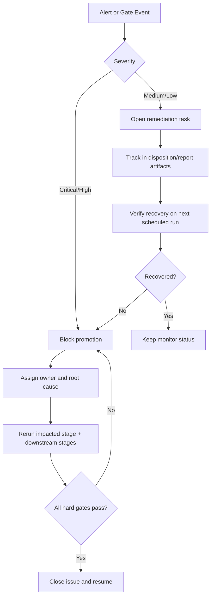

# Operator Runbook

## Objective
Provide deterministic operating actions for strategy governance, JForex runtime review, and the supervised barrier-manager demo-session shakedown.

## Operating Cadence
| cadence | owner | purpose |
| --- | --- | --- |
| Daily | execution research | detect execution drift and active alert bands |
| Weekly | research + risk | assess threshold drift, lock drift, and near-fail pressure |
| Monthly | research lead | approve WFO roll-forward, reduced-core stability, and release readiness |

## JForex Live Session

- Start live paper trading with `make jforex-live`.
- The runner warms each symbol from local Dukascopy parquet, then bridges to near-real-time broker history before enabling new entries.
- `READY` means the symbol may open new entries, `STALE_PAUSED` means the feed is stale and new entries are paused, and `ERROR_PAUSED` means startup warmup or bridge failed.
- The freshness SLA is `30s`; a symbol is only tradable when its last ingested tick is no more than 30 seconds old.
- Runtime readiness status is written to `data/analysis/backtest_reconcile/runtime/live_symbol_readiness.json`.

## Dukascopy Demo Certification Checklist
1. Run the preflight checks below before the session window opens.
2. Start monitoring with `make demo-cert-monitor`.
3. Start the live/demo runner with `make jforex-live`.
4. Observe readiness, predict/action flow, and runtime anomalies during the session.
5. Run `make stage14-jforex-cert` after the session.
6. Review the evidence bundle in the order below.
7. Classify the shakedown and capture the exposed gaps.

### Preflight
1. Confirm the active symbol universe is `EURUSD, GBPUSD, USDJPY, USDCHF, AUDUSD, USDCAD`.
2. Confirm the operator has the Grafana/Prometheus links printed by `make demo-cert-monitor`.
3. Confirm the expected evidence paths under `data/analysis/backtest_reconcile/` are writable and discoverable.
4. Confirm the session will be treated as a supervised shakedown, not as already-hardened recurring certification.

### Session Start
1. Start the monitor with `make demo-cert-monitor`.
2. Start live paper trading with `make jforex-live`.
3. Record the session start time and watch for `READY` transitions.
4. Treat `READY` as the signal that a symbol may open new entries.
5. Treat `STALE_PAUSED` as a freshness pause and `ERROR_PAUSED` as a startup or bridge failure.

### Live Observation Window
1. Observe the full session trace for `predict/action` sequencing, barrier scan lifecycle progression, and action submission.
2. Confirm the freshness SLA stays within `30s` for symbols that remain live.
3. Confirm `predict/action` activity appears for every active symbol in the session-scoped deployable universe once bars advance.
4. Distinguish intentional kill-switch blocked actions from unexpected blocked orders.
5. Treat a blocked action as intentional only when the runtime events and operator intent both show the kill-switch or equivalent pause mechanism was engaged.
6. Treat unexpected blocked orders as a runtime anomaly, not as a normal control event.

### Post-Session Evidence Review
1. Inspect `data/analysis/backtest_reconcile/runtime/live_symbol_readiness.json`.
2. Inspect the per-symbol runtime trace in `data/analysis/backtest_reconcile/{SYMBOL}_jforex_runtime_events.csv`.
3. Run `make stage14-jforex-cert`.
4. Inspect the generated session summaries in `data/analysis/backtest_reconcile/`.
5. Inspect `docs/analysis/stage14_jforex_runtime_certification_report.md`.
6. Inspect `docs/strategy_bible/generated/stage_14_snapshot.md`.
7. Classify the run and fill in the shakedown gap-capture table.

### Session Outcome Definitions
- `pass`: the required evidence bundle exists and is readable, active symbols in the session-scoped deployable universe satisfy the readiness contract for the session, `predict/action` activity is present and healthy, no hard execution-lifecycle anomalies occurred, and the session outcome can be reconstructed deterministically from the evidence.
- `conditional fail`: the evidence bundle exists and is usable, the session remains diagnostically valuable, and degradations or anomalies require follow-up before the run can count as a clean certified session.
- `fail`: required evidence is missing, unreadable, or malformed; one or more symbols in the session-scoped deployable universe never reach required operational readiness; the `predict/action` path is broken; hard execution-lifecycle anomalies occur; or unresolved execution failures invalidate trust in the session outcome.

### Escalation Rules
- Treat any `fail` outcome as an immediate escalation to the research lead and risk owner.
- Treat hard execution-lifecycle anomalies, unresolved execution failures, or unexpected blocked orders that prevent safe operation as deployment-hold conditions until reviewed.
- Record the triggering metric or trace row, the chosen operator action, and the remediation owner in the incident record.

### Kill-Switch and Blocked-Order Handling
- An intentional kill-switch blocked action is an expected control outcome when it is documented in the runtime events and aligns with the operator's session intent.
- An intentional kill-switch blocked action does not by itself create a `fail` outcome.
- An unexpected blocked order is a runtime anomaly and must be treated as evidence of degraded execution behavior.
- If unexpected blocked orders are isolated and the evidence bundle remains usable, classify the run as `conditional fail`.
- If unexpected blocked orders indicate broken `predict/action` flow, repeated lifecycle drift, or unresolved execution failure, classify the run as `fail`.

### Shakedown Gap Capture
Record every exposed gap using this format:

| gap_type | observed_symptom | affected_command_or_artifact | blocked_classification | follow_up_owner |
| --- | --- | --- | --- | --- |
| missing_artifact |  |  | yes/no |  |
| unclear_step |  |  | yes/no |  |
| validator_or_report_ambiguity |  |  | yes/no |  |
| runtime_anomaly |  |  | yes/no |  |
| too_manual |  |  | yes/no |  |

## Daily Checks
| trigger | threshold / signal | severity | owner | action | evidence artifact | SLA |
| --- | --- | --- | --- | --- | --- | --- |
| Overshoot tail drift | `E_DRIFT_OVERSHOOT_P95` in `amber` | medium | execution research | apply cap/session review and monitor next run | `docs/analysis/oco_execution_drift_report.md` | 1 business day |
| Fill-rate deterioration | `E_DRIFT_FILL_DROP` in `red` | high | execution research | block symbol promotion; recalibrate cap policy | `data/analysis/tick_opportunity_mining/oco_execution_drift_alerts.csv` | immediate |
| Unmapped non-green alerts | missing disposition rows | high | research | create/remediate disposition record | `data/analysis/tick_opportunity_mining/oco_alert_disposition.csv` | same day |

## Weekly Checks
| trigger | threshold / signal | severity | owner | action | evidence artifact | SLA |
| --- | --- | --- | --- | --- | --- | --- |
| Threshold fragility | `TS01_W13_THRESHOLD_FRAGILITY` in amber/red | medium/high | WFO research | retune lookback/cadence candidate set and rerun Stage 3 report | `docs/analysis/oco_threshold_sensitivity_report.md` | 2 business days |
| Lock drift | `G03_lock_drift_flags > 0` | high | research lead | block deploy path and refresh lock from validated artifacts | `docs/analysis/run_delta_dashboard.md` | immediate |
| Near-fail pressure | `G01_near_fail_count` rising for 3 runs | medium | risk | open MRM review task and tighten checks | `docs/analysis/operator_action_report.md` | 3 business days |

## Monthly Checks
| trigger | threshold / signal | severity | owner | action | evidence artifact | SLA |
| --- | --- | --- | --- | --- | --- | --- |
| Stage-3 model staleness | latest prediction month `<` current test month | high | research lead | block deployment; rerun Stage 3 monthly WFO and downstream Stage 5+ | `data/analysis/tick_opportunity_mining/wfo_*/<SYMBOL>_oco_monthly_predictions.parquet` | immediate |
| Reduced-core capacity drop | `rows` below configured floor | high | research lead | hold release and rerun reduced-core selection | `docs/analysis/*_oco_reduced_core_rolling_report.md` | immediate |
| Stage 12 API parity red | `gate_api_parity=false` for any active symbol | critical | research lead | block deployment; rerun historical API parity and resolve signal/execution drift before promotion | `data/analysis/backtest_reconcile/<SYMBOL>_stage12_api_parity_summary.csv` | immediate |
| Registry drift | any `RU*` high/critical failure | high | research lead | enforce universe lock refresh before promotion | `docs/analysis/oco_rule_universe_registry_report.md` | immediate |
| Robustness degradation | Stage 8 LB95 turns non-positive | high | risk + research | freeze promotion and re-evaluate assumptions | `docs/analysis/oco_edge_clarity_report.md` | immediate |

## Monthly Retrain Checklist (Stage 3 -> Stage 5)
1. Confirm latest Stage-3 predictions include the current test month for each active symbol.
2. Confirm CatBoost **one-month validity** policy and **monthly retrain** policy are satisfied; prior month predictions are not reused for current month decisions.
3. Confirm Stage-3 threshold provenance fields are present and causal (`threshold_source` in `rolling_history|train_fallback|train_quantile|no_history`) and that selected rows are never `no_history`.
4. Rebuild stop-limit detail artifacts from latest predictions.
5. Re-run reduced-core rolling selection using latest Stage-3 outputs.
6. Verify docs-contract and stage-integrity checks pass before any release decision.

## Freshness and Staleness Rules
- Default freshness limit for governed evidence artifacts: `168h` (7 days).
- If any required artifact is stale, treat release readiness as `blocked` until regenerated.
- Primary freshness evidence:
- `docs/analysis/oco_docs_contract_report.md` (`C6 generated_artifacts_recency`)
- `docs/analysis/oco_alert_remediation_report.md`
- `docs/analysis/oco_governance_explainability_report.md`
- Recovery commands:
```bash
make docs-contract-ci
uv run python scripts/build_oco_strategy_bible.py \
  --manifest configs/research/docs/oco_bible_manifest.yaml --strict false
uv run mkdocs build
```

## Decision Tree


## Stage 12 Operating Note
- Stage 12 is the canonical historical API parity gate against reduced-core truth.
- Truth source for this gate is repo-side reduced-core output, not cTrader backtest output.
- Historical parity uses three non-negotiable mechanics:
- `history_tail` warmup preserves exact fixed-tick bar phase across the full prior history.
- locked prediction-universe gating limits API evaluation to repo `(candidate_uid, close_ts)` rows for that model month.
- execution parity is validated only after signal parity is measured against reduced-core truth.
- Practical meaning:
- if Stage 12 is red, do not rely on Stage 3, Stage 5, Stage 6, or cTrader-side sanity checks to infer deployability.
- if `selected_extra_runtime > 0`, treat it as over-admission by the API.
- if `selected_missing_expected > 0`, treat it as missed reduced-core truth.
- if execution parity is red with signal parity green, treat it as lifecycle translation drift rather than model drift.

## Escalation Matrix
| condition | escalation path |
| --- | --- |
| any high/critical gate fail | research lead -> risk owner -> deployment hold |
| repeated amber on same metric for 3 runs | research lead -> model risk review |
| expired accepted exception | research lead -> immediate re-approval or remediation closure |

## Mandatory Evidence Per Incident
- Triggering metric/check id and observed value.
- Action chosen (`action_code`) and owner.
- Timestamped rerun evidence after remediation.
- Closure rationale with link to updated report artifact.

## Linked Governance Artifacts
- `docs/analysis/oco_execution_drift_report.md`
- `docs/analysis/oco_alert_remediation_report.md`
- `docs/analysis/oco_governance_explainability_report.md`
- `docs/analysis/oco_threshold_sensitivity_report.md`
- `docs/analysis/oco_rule_universe_registry_report.md`
- `docs/analysis/operator_action_report.md`

## Linked Stage Specs
- `docs/strategy_bible/stage_07_logical_and_statistical_audit.md`
- `docs/strategy_bible/stage_09_live_governance_and_deployment.md`
- `docs/strategy_bible/stage_10_known_risks_and_backlog.md`
- `docs/strategy_bible/stage_12_api_parity.md`
