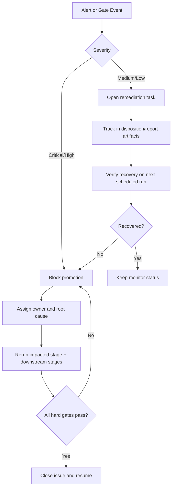

# OCO Operator Runbook

## Objective
Provide deterministic daily, weekly, and monthly operating actions for OCO pipeline governance and incident handling.

## Terminology
- `FAIL` means the validation or certification process is invalid or out of contract.
- `NO_GO` means a symbol is not approved for deployment even if the underlying certification process completed correctly.
- Use `Runtime Variance`, `Material Drift`, and `Parity Breach` as explanatory labels in stage-specific interpretation notes, not as replacement statuses.

## Operating Cadence
| cadence | owner | purpose |
| --- | --- | --- |
| Daily | execution research | detect execution drift and active alert bands |
| Weekly | research + risk | assess threshold drift, lock drift, and near-fail pressure |
| Monthly | research lead | approve Monthly WFO roll-forward, Reduced-Core Rolling stability, and promotion readiness |

## JForex Live Session

- Start live paper trading with `make jforex-live`.
- The runner warms each symbol from local Dukascopy parquet, then bridges to near-real-time broker history before enabling new entries.
- `READY` means the symbol may open new entries, `STALE_PAUSED` means the feed is stale and new entries are paused, and `ERROR_PAUSED` means startup warmup or bridge failed.
- The freshness SLA is `30s`; a symbol is only tradable when its last ingested tick is no more than 30 seconds old.
- Runtime readiness status is written to `data/analysis/backtest_reconcile/runtime/live_symbol_readiness.json`.

## Dukascopy Demo Certification Checklist
1. Run `make demo-cert-monitor`.
2. Open Grafana and the provisioned JForex dashboard.
3. Run `make jforex-live`.
4. Wait for all 6 symbols to reach `READY`.
5. Confirm tick staleness stays within the `30s` SLA.
6. Confirm predict activity appears for all 6 symbols once bars advance.
7. Inspect `data/analysis/backtest_reconcile/runtime/live_symbol_readiness.json`.
8. Classify the run using the definitions below.

### Certification Outcome Definitions
- `PASS`: all 6 symbols reach `READY`, all 6 ingest live ticks, all 6 demonstrate live predict activity once bars advance, and no symbol remains `STALE_PAUSED` or `ERROR_PAUSED` during the observation window.
- `conditional fail`: all 6 symbols reach `READY`, but one or more symbols later become stale or show missing or suspect predict-path activity.
- `FAIL`: any symbol never reaches `READY`, lands in `ERROR_PAUSED`, remains `STALE_PAUSED`, or fails to demonstrate live predict activity during the certification window.

## Daily Checks
| trigger | threshold / signal | severity | owner | action | evidence artifact | SLA |
| --- | --- | --- | --- | --- | --- | --- |
| Overshoot tail drift | `E_DRIFT_OVERSHOOT_P95` in `amber` | medium | execution research | apply cap/session review and monitor next run | `docs/analysis/oco_execution_drift_report.md` | 1 business day |
| Fill-rate deterioration | `E_DRIFT_FILL_DROP` in `red` | high | execution research | block symbol promotion; recalibrate cap policy | `data/analysis/tick_opportunity_mining/oco_execution_drift_alerts.csv` | immediate |
| Unmapped non-green alerts | missing disposition rows | high | research | create/remediate disposition record | `data/analysis/tick_opportunity_mining/oco_alert_disposition.csv` | same day |

## Weekly Checks
| trigger | threshold / signal | severity | owner | action | evidence artifact | SLA |
| --- | --- | --- | --- | --- | --- | --- |
| Threshold fragility | `TS01_W13_THRESHOLD_FRAGILITY` in amber/red | medium/high | WFO research | retune lookback/cadence candidate set and rerun Stage 3 report | `docs/analysis/oco_threshold_sensitivity_report.md` | 2 business days |
| Lock drift | `G03_lock_drift_flags > 0` | high | research lead | block promotion path and refresh lock from validated artifacts | `docs/analysis/run_delta_dashboard.md` | immediate |
| Near-fail pressure | `G01_near_fail_count` rising for 3 runs | medium | risk | open MRM review task and tighten checks | `docs/analysis/operator_action_report.md` | 3 business days |

## Monthly Checks
| trigger | threshold / signal | severity | owner | action | evidence artifact | SLA |
| --- | --- | --- | --- | --- | --- | --- |
| Stage-3 model staleness | latest prediction month `<` current test month | high | research lead | block deployment; rerun Stage 3 monthly WFO and downstream Stage 5+ | `data/analysis/tick_opportunity_mining/wfo_*/<SYMBOL>_oco_monthly_predictions.parquet` | immediate |
| Reduced-core capacity drop | `rows` below configured floor | high | research lead | hold release and rerun reduced-core selection | `docs/analysis/*_oco_reduced_core_rolling_report.md` | immediate |
| Stage 12 API parity FAIL | `gate_api_parity=false` for any active symbol | critical | research lead | block deployment; rerun historical API parity and resolve any Parity Breach or Material Drift before promotion | `data/analysis/backtest_reconcile/<SYMBOL>_stage12_api_parity_summary.csv` | immediate |
| Registry drift | any `RU*` high/critical failure | high | research lead | enforce universe lock refresh before promotion | `docs/analysis/oco_rule_universe_registry_report.md` | immediate |
| Robustness degradation | Stage 8 LB95 turns non-positive | high | risk + research | freeze promotion and re-evaluate assumptions | `docs/analysis/oco_edge_clarity_report.md` | immediate |

## Monthly Retrain Checklist (Stage 3 -> Stage 5)
1. Confirm latest Stage-3 predictions include the current test month for each active symbol.
2. Confirm CatBoost **one-month validity** policy and **monthly retrain** policy are satisfied; prior month predictions are not reused for current month decisions.
3. Confirm Stage-3 threshold provenance fields are present and causal (`threshold_source` in `rolling_history|train_fallback|train_quantile|no_history`) and that selected rows are never `no_history`.
4. Rebuild stop-limit detail artifacts from latest predictions.
5. Re-run reduced-core rolling selection using latest Stage-3 outputs.
6. Verify docs-contract and stage-integrity checks pass before any release decision.

## Freshness and Staleness Rules
- Default freshness limit for governed evidence artifacts: `168h` (7 days).
- If any required artifact is stale, treat promotion readiness as `blocked` until regenerated.
- Primary freshness evidence:
- `docs/analysis/oco_docs_contract_report.md` (`C6 generated_artifacts_recency`)
- `docs/analysis/oco_alert_remediation_report.md`
- `docs/analysis/oco_governance_explainability_report.md`
- Recovery commands:
```bash
make docs-contract-ci
uv run python scripts/build_oco_strategy_bible.py \
  --manifest configs/research/docs/oco_bible_manifest.yaml --strict false
uv run mkdocs build
```

## Decision Tree


## Stage 12 Operating Note
- Stage 12 is the canonical historical API parity gate against reduced-core truth.
- Truth source for this gate is repo-side reduced-core output, not cTrader backtest output.
- Historical parity uses three non-negotiable mechanics:
- `history_tail` warmup preserves exact fixed-tick bar phase across the full prior history.
- locked prediction-universe gating limits API evaluation to repo `(candidate_uid, close_ts)` rows for that model month.
- execution parity is validated only after signal parity is measured against reduced-core truth.
- Practical meaning:
- if Stage 12 is FAIL, do not rely on Stage 3, Stage 5, Stage 6, or cTrader-side sanity checks to infer deployability.
- if `selected_extra_runtime > 0`, treat it as over-admission by the API.
- if `selected_missing_expected > 0`, treat it as missed reduced-core truth.
- if execution parity is FAIL with signal parity passing, treat it as lifecycle Material Drift rather than model drift.

## Escalation Matrix
| condition | escalation path |
| --- | --- |
| any high/critical gate resolves to `FAIL` | research lead -> risk owner -> deployment hold |
| repeated amber on same metric for 3 runs | research lead -> model risk review |
| expired accepted exception | research lead -> immediate re-approval or remediation closure |

## Mandatory Evidence Per Incident
- Triggering metric/check id and observed value.
- Action chosen (`action_code`) and owner.
- Timestamped rerun evidence after remediation.
- Closure rationale with link to updated report artifact.

## Linked Governance Artifacts
- `docs/analysis/oco_execution_drift_report.md`
- `docs/analysis/oco_alert_remediation_report.md`
- `docs/analysis/oco_governance_explainability_report.md`
- `docs/analysis/oco_threshold_sensitivity_report.md`
- `docs/analysis/oco_rule_universe_registry_report.md`
- `docs/analysis/operator_action_report.md`

## Linked Stage Specs
- `docs/strategy_bible/stage_07_logical_and_statistical_audit.md`
- `docs/strategy_bible/stage_09_live_governance_and_deployment.md`
- `docs/strategy_bible/stage_10_known_risks_and_backlog.md`
- `docs/strategy_bible/stage_12_api_parity.md`
