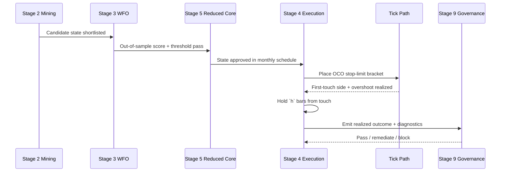

# OCO Signal Lifecycle Reference

## Objective
Document one complete OCO signal lifecycle from candidate selection through execution, hold logic, and governance controls.

## Scope
- Strategy family: `oco_first_touch` (only `oco_first_touch` is mined; `oco_first_touch_clean` was removed 2026-05 because its win rate was conditioned on `~both` — future information / look-ahead bias)
- Runtime contract: stop-limit entry, `from_touch` hold mode
- Symbols: EURUSD, GBPUSD, USDJPY, USDCHF, AUDUSD, USDCAD (example timeline shown on EURUSD)

## Lifecycle Sequence

## Example Timeline (Concrete Fields)
| step | timestamp_utc | stage | key fields | outcome |
| --- | --- | --- | --- | --- |
| 1 | 2025-08-04T07:00:00Z | Stage 2 | `state_id=oco_first_touch__all__k2`, `bar_ticks=100`, `horizon=6` | candidate in hypothesis frontier |
| 2 | 2025-08-04T07:00:00Z | Stage 3 | `pred_prob=0.94`, `thr_day=0.90`, `selected=1` | event passes causal rolling threshold |
| 3 | 2025-08-04T07:00:00Z | Stage 5 | `state_in_reduced_schedule=1` | state is eligible for live-style execution |
| 4 | 2025-08-04T07:00:00Z | Stage 4 | `barrier_pips=2`, `side=buy`, `barrier_px=1.27840`, `cap_pips=1.0` | stop-limit armed |
| 5 | 2025-08-04T07:00:34Z | Tick path | `touch_found_tick=1`, `overshoot_tick_pips=0.22` | fill accepted under cap |
| 6 | 2025-08-04T07:10:00Z | Hold logic | `oco_hold_mode=from_touch`, `h=6` | position held to touch+6 bars |
| 7 | 2025-08-04T07:10:00Z | Realization | `target_gross_pips=1.31`, `extra_slip=0.22`, `realized=1.09` | trade contributes positive gross |
| 8 | 2025-08-31T00:00:00Z | Governance | `E_DRIFT_OVERSHOOT_P95`, `band=green` | no remediation required |

## Data Columns Used By Stage
| stage | required fields |
| --- | --- |
| 2 | `selection_pass`, `annualized_test_fills`, `mean_gross_pips_test`, `family`, `state_id`, `horizon` |
| 3 | `pred_prob`, rolling threshold history, `test_month`, `target_gross_pips` |
| 4 | `touch_found_tick`, `overshoot_tick_pips`, `barrier_pips`, `horizon`, `target_gross_pips` |
| 5 | reduced schedule state keys (`family`, `state_id`, `barrier_pips`, `horizon`) |
| 9/10 | `metric_id`, `band`, `action_code`, `status`, `expires_utc` |

## Interpretation Notes
- The entry trigger and the hold horizon use the same event timestamp anchor, but the hold countdown starts at touch time (`from_touch`).
- `no_touch` rows are retained under current runtime contract and are explicitly represented in monthly diagnostics.
- Execution realism is dominated by overshoot/cap behavior, so stop-limit cap governance is part of edge preservation, not post-trade reporting only.

## Failure Branches
- `no_touch` within horizon: trade records zero fill contribution; event still enters diagnostic denominators.
- `overshoot > cap`: event treated as non-fill under cap policy.
- governance hard-fail (`critical/high`): deployment promotion blocked until stage rerun and issue closure.

## Runbook Hand-off
- Operator actions for lifecycle failures are governed by `docs/strategy_bible/operator_runbook.md`.
- Stage details remain canonical in `docs/strategy_bible/stage_02_opportunity_mining.md`, `docs/strategy_bible/stage_03_monthly_wfo.md`, `docs/strategy_bible/stage_04_execution_realism.md`, and `docs/strategy_bible/stage_09_live_governance_and_deployment.md`.

## Traceability
- `scripts/run_tick_opportunity_mining.py`
- `scripts/run_tick_opportunity_monthly_wfo.py`
- `scripts/select_reduced_core_regimes.py`
- `scripts/analyze_oco_stop_limit_tickfill.py`
- `scripts/validate_oco_live_governance.py`
