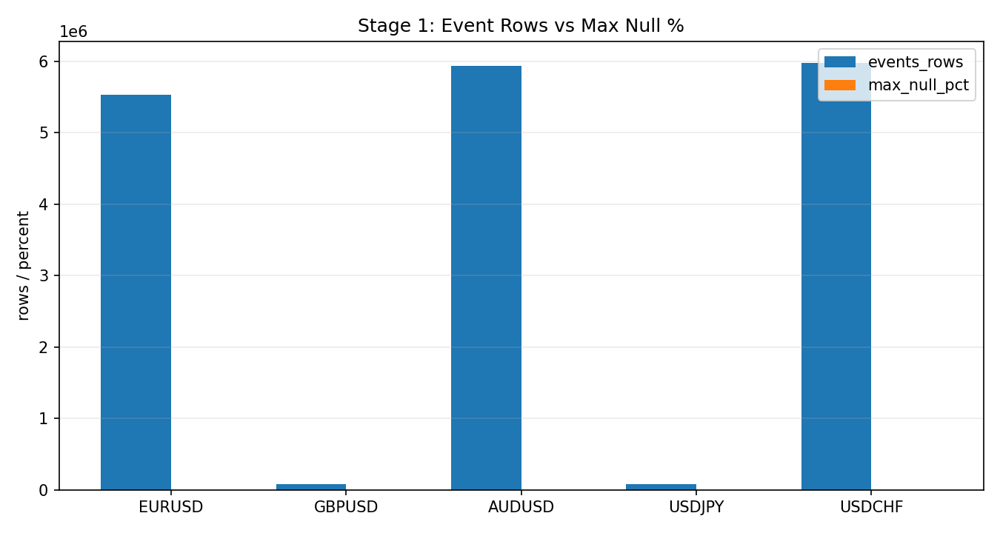
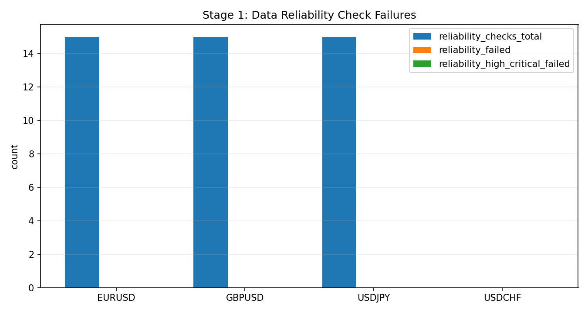

# Stage 1 - Data Foundation

## Objective
Define and verify the minimum data-quality contract required for causal OCO research and deployment decisions.

## Inputs
- Event parquet produced by WFO prep:
- `data/analysis/tick_opportunity_mining/wfo_*/<SYMBOL>_oco_events_eval*.parquet`
- Reliability audit artifacts:
- `data/analysis/tick_opportunity_mining/data_reliability_checks.csv`
- `data/analysis/tick_opportunity_mining/data_reliability_issues.csv`

## Process
- Validate required columns and parse quality.
- Validate timestamp monotonicity, duplication, and hourly/session coverage.
- Compute Stage-1 drift diagnostics (`D16-D18`) for edge-context monitoring.

## Exact Calculations
- `D16_spread_regime_shift_z`:
- `(last_month_mean(cost_est_pips) - mean(previous_months)) / std(previous_months)`
- `D17_gap_burst_ratio`:
- `mean( delta_t_seconds > 10 * median_positive_delta_t_seconds )`
- `D18_clock_jitter_cv`:
- `std(residual_ratio_clipped) / mean(residual_ratio_clipped)`
- where `residual_ratio = delta_t_seconds / median(delta_t_seconds by hour-of-week)`
- clipping is 5th-95th percentile of residual ratio
- companion metric `D18_clock_jitter_cv_raw = std(delta_t_seconds) / median_positive_delta_t_seconds`

## Causality / Leakage Controls
- Uses contemporaneous bar metadata only.
- No forward labels used in Stage 1 calculations.

## Failure Modes
- Timestamp precision collapse causes artificial zero-interval bursts.
- Duplicate timestamps reduce effective sample diversity.
- Session under-coverage creates regime bias.

## Interpretation Guide
- `D16` near 0: stable cost regime.
- `D16` large magnitude: cost regime shift requiring review.
- `D17` near 0: low gap-burst risk.
- `D18` high: unstable spacing after session baseline normalization; treat timing-sensitive execution assumptions cautiously.

## Validation Gates
Hard gates come from `DR*` checks in reliability audit.
- `DR01-DR15` are deployment-relevant quality gates.
- `D16-D18` are informational diagnostics.

## Canonical Analysis Reports
- `docs/analysis/data_reliability_report.md`

## Reproduction Commands
```bash
uv run python scripts/audit_data_reliability.py \
  --symbols EURUSD,GBPUSD,USDJPY \
  --out-checks-csv data/analysis/tick_opportunity_mining/data_reliability_checks.csv \
  --out-issues-csv data/analysis/tick_opportunity_mining/data_reliability_issues.csv \
  --report-out docs/analysis/data_reliability_report.md
```

## Traceability
- `scripts/audit_data_reliability.py`
- `docs/analysis/data_reliability_report.md`
- `docs/strategy_bible/generated/stage_01_snapshot.md`

## Generated Run Snapshot
<!-- GENERATED:STAGE_01:START -->
### Auto Snapshot - Stage 01

- generated_at: `2026-02-27 11:41:32 UTC`
- Contract check uses eval-year event tables consumed by WFO.
- Null percentages should remain near 0 for required modeling fields.
- Timezone contract rows include parse rate, monotonicity, DST and offset anomaly checks.
- Data reliability checks add schema, parse-rate, duplicate timestamp, OHLC consistency, and session coverage gates.
- Edge diagnostics D16-D18 are informational and track drift, bursty gaps, and clock jitter.

#### Key Results
| symbol   |   events_rows |   cost_est_pips_null_pct |   range_pips_null_pct |   hl_first_null_pct |   reliability_checks_total |   reliability_failed |   reliability_high_critical_failed |   d16_spread_regime_shift_z |   d17_gap_burst_ratio |   d18_clock_jitter_cv |   d18_clock_jitter_cv_raw |
|:---------|--------------:|-------------------------:|----------------------:|--------------------:|---------------------------:|---------------------:|-----------------------------------:|----------------------------:|----------------------:|----------------------:|--------------------------:|
| EURUSD   |       5536229 |                        0 |                     0 |                   0 |                         15 |                    0 |                                  0 |                    -1.12735 |           0.000298398 |              0.63644  |                   7.90046 |
| GBPUSD   |       6000000 |                        0 |                     0 |                   0 |                         15 |                    0 |                                  0 |                    -1.778   |           0.0002085   |              0.592694 |                   7.41284 |
| USDJPY   |       6000000 |                        0 |                     0 |                   0 |                         15 |                    0 |                                  0 |                    -1.12367 |           0.0002315   |              0.608004 |                  10.4984  |

#### Details
| symbol   |   events_rows |   cost_est_pips_null_pct |   range_pips_null_pct |   spread_z_null_pct |   tick_rate_z_null_pct |   vel_cost_units_h1_null_pct |   hl_first_null_pct |   d16_spread_regime_shift_z |   d17_gap_burst_ratio |   d18_clock_jitter_cv |   d18_clock_jitter_cv_raw |   reliability_checks_total |   reliability_failed |   reliability_high_critical_failed |
|:---------|--------------:|-------------------------:|----------------------:|--------------------:|-----------------------:|-----------------------------:|--------------------:|----------------------------:|----------------------:|----------------------:|--------------------------:|---------------------------:|---------------------:|-----------------------------------:|
| EURUSD   |       5536229 |                        0 |                     0 |                   0 |                      0 |                            0 |                   0 |                    -1.12735 |           0.000298398 |              0.63644  |                   7.90046 |                         15 |                    0 |                                  0 |
| GBPUSD   |       6000000 |                        0 |                     0 |                   0 |                      0 |                            0 |                   0 |                    -1.778   |           0.0002085   |              0.592694 |                   7.41284 |                         15 |                    0 |                                  0 |
| USDJPY   |       6000000 |                        0 |                     0 |                   0 |                      0 |                            0 |                   0 |                    -1.12367 |           0.0002315   |              0.608004 |                  10.4984  |                         15 |                    0 |                                  0 |

#### Plots



#### Data Reliability Failed Checks
_empty_
<!-- GENERATED:STAGE_01:END -->
