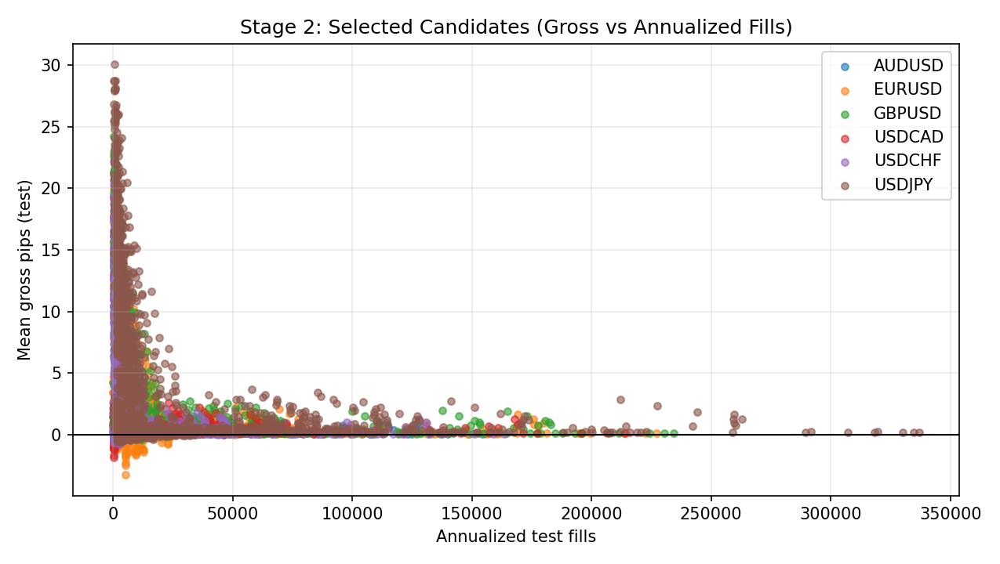

# Stage 2 - Opportunity Mining

## Objective
Mine high-count, gross-positive OCO opportunity families as hypotheses before model filtering and robustness controls.

## Inputs
- Candidate catalogs:
- `data/analysis/tick_opportunity_mining/<SYMBOL>_oco_candidates.csv`
- Key candidate fields:
- `selection_pass`, `annualized_test_fills`, `mean_gross_pips_test`, `family`, `state_id`, `bar_ticks`, `horizon`

## Process
- Enumerate OCO state families and horizons.
- Keep broad candidate frontier (`selection_pass`) for downstream filtering.
- Compute concentration/smoothness diagnostics (`M01-M03`).
- Constrain mining outputs to a pre-registered rule universe contract used by downstream reduced-core and live governance.

## Exact Calculations
- `edge_weight = annualized_test_fills * mean_gross_pips_test`
- `M01_top3_contrib_share = sum(top3 edge_weight by state block) / sum(all edge_weight)`
- `M02_smoothness_abs_jump = median(abs(diff(mean_gross_pips_test across adjacent horizon)))`
- `M03_positive_density = mean(mean_gross_pips_test > 0 among selection_pass)`

## Pre-Registered Rule-Universe Contract
- Registry artifact: `configs/research/governance/oco_rule_universe_registry.yaml`
- Required frozen fields:
- `symbols`
- `allowed_families`
- `allowed_barrier_keep`
- `allowed_horizon_keep`
- `selection_mode_contract`
- `locked_runtime_contract`
- Integrity rule:
- Canonical payload hash (SHA-256 over sorted JSON with `hash_sha256` removed) must match `hash_sha256` in registry.
- Contract validation artifacts:
- `data/analysis/tick_opportunity_mining/oco_rule_universe_registry_checks.csv`
- `data/analysis/tick_opportunity_mining/oco_rule_universe_registry_issues.csv`
- `docs/analysis/oco_rule_universe_registry_report.md`
- Purpose:
- Prevent silent expansion of families/barriers/horizons after seeing results, which is a primary overfitting pathway in mining workflows.

## Causality / Leakage Controls
- Mining outputs are hypothesis-generation only.
- No deployment gating at this stage without downstream WFO/robustness confirmation.
- Rule universe is locked before reduced-core/live selection and checked against frozen governance locks (`RU06-RU09`).

## Failure Modes
- Edge concentration in very few states (fragile alpha).
- Non-smooth parameter surfaces indicating noisy search.
- Post-hoc over-interpretation without Stage 3/8 controls.

## Interpretation Guide
- Lower `M01` is better diversification.
- Lower `M02` indicates smoother, less brittle parameter landscape.
- Higher `M03` indicates a denser positive frontier.

## Validation Gates
- Informational at Stage 2.
- Hard pass/fail occurs later via Stage 3, Stage 7, Stage 8.
- Governance contract gate: registry checks must have zero high/critical failures (`C33` at docs-contract level).

## Canonical Analysis Reports
- `docs/analysis/eurusd_tick_opportunity_mining_report.md`
- `docs/analysis/gbpusd_tick_opportunity_mining_report.md`
- `docs/analysis/usdjpy_tick_opportunity_mining_report.md`
- `docs/analysis/oco_rule_universe_registry_report.md`
- `docs/strategy_bible/signal_lifecycle_reference.md`

## Operator Decision Tree
- If any hard gate in this stage fails, block promotion and escalate using the operator runbook.
- If only warning/amber diagnostics trigger, continue with mitigation and add an owner/deadline in remediation artifacts.

## How To Run
- Run the `Reproduction Commands` in this stage exactly as listed.
- Confirm artifacts are refreshed and timestamps are current before interpreting outcomes.

## How To Interpret Outputs
- Read `Key Results` first for pass/fail posture and core health metrics.
- Use `Interpretation Notes` and `Action Trigger Summary` to map observed values to operational actions.

## What To Do If It Fails
- `critical/high`: halt deployment progression, remediate root cause, rerun stage and downstream dependent stages.
- `medium/low`: open tracked remediation with owner and ETA, monitor for recurrence in next cycle.

## Reproduction Commands
```bash
uv run python scripts/run_tick_opportunity_mining.py \
  --config configs/research/experiments/eurusd_tick_opportunity_mining.yaml
uv run python scripts/validate_oco_rule_universe_registry.py
```

## Traceability
- `scripts/run_tick_opportunity_mining.py`
- `scripts/validate_oco_rule_universe_registry.py`
- `docs/analysis/*_tick_opportunity_mining_report.md`
- `docs/analysis/oco_rule_universe_registry_report.md`
- `docs/strategy_bible/generated/stage_02_snapshot.md`

## Generated Run Snapshot
<!-- GENERATED:STAGE_02:START -->
### Auto Snapshot - Stage 02

- generated_at: `2026-02-27 16:58:38 UTC`
- selection_pass candidates are broad hypotheses only.
- Scatter shows the high-count >0 gross opportunity frontier.
- M01-M03 quantify concentration risk, horizon smoothness, and positive-edge density.

#### Key Results
| symbol   |   candidates_total |   selected_total |   selected_mean_gross_pips |   selected_median_annualized |   m01_top3_contrib_share |   m02_smoothness_abs_jump |   m03_positive_density |
|:---------|-------------------:|-----------------:|---------------------------:|-----------------------------:|-------------------------:|--------------------------:|-----------------------:|
| EURUSD   |               2160 |              737 |                    1.19563 |                      15514.1 |                0.0486952 |                 0.0940589 |                      1 |
| GBPUSD   |               2160 |              762 |                    1.22153 |                      18903.7 |                0.0508144 |                 0.0744663 |                      1 |
| USDJPY   |               2160 |              995 |                    1.92264 |                      20211.8 |                0.04021   |                 0.0981752 |                      1 |

#### Interpretation Notes
- selection_pass candidates are broad hypotheses only.
- Scatter shows the high-count >0 gross opportunity frontier.
- M01-M03 quantify concentration risk, horizon smoothness, and positive-edge density.

#### Action Trigger Summary
| trigger            | threshold_or_signal   | action_code                   | action_summary                                                          |
|:-------------------|:----------------------|:------------------------------|:------------------------------------------------------------------------|
| hard_gate_fail     | status=fail           | A3_HALT_RECALIBRATE           | Block promotion and rerun upstream stage diagnostics before continuing. |
| monitoring_warning | band=amber            | A0_MONITOR/A1_RECALIBRATE_CAP | Apply stage runbook remediation and confirm next-run recovery.          |

#### Plots


#### Edge Contribution by State Block
| symbol   | family                | state_id                                  |   bar_ticks |   horizon |   edge_weight |   contrib_share |
|:---------|:----------------------|:------------------------------------------|------------:|----------:|--------------:|----------------:|
| EURUSD   | oco_first_touch_clean | oco_first_touch_clean__all__k2            |         100 |         6 |        273060 |      0.0197535  |
| EURUSD   | oco_first_touch_clean | oco_first_touch_clean__all__k2            |         100 |         5 |        225779 |      0.0163332  |
| EURUSD   | oco_first_touch_clean | oco_first_touch_clean__all__k2            |         100 |         4 |        174293 |      0.0126086  |
| EURUSD   | oco_first_touch_clean | oco_first_touch_clean__low_cost_q30__k2   |         100 |         6 |        155374 |      0.01124    |
| EURUSD   | oco_first_touch_clean | oco_first_touch_clean__high_range_q70__k2 |         100 |         6 |        145548 |      0.0105291  |
| EURUSD   | oco_first_touch_clean | oco_first_touch_clean__all__k3            |         100 |         6 |        143860 |      0.010407   |
| EURUSD   | oco_first_touch_clean | oco_first_touch_clean__high_range_q70__k2 |         100 |         5 |        124395 |      0.00899893 |
| EURUSD   | oco_first_touch_clean | oco_first_touch_clean__low_cost_q30__k2   |         100 |         5 |        121071 |      0.00875842 |
| GBPUSD   | oco_first_touch_clean | oco_first_touch_clean__all__k2            |         100 |         6 |        316345 |      0.0189299  |
| GBPUSD   | oco_first_touch_clean | oco_first_touch_clean__all__k2            |         100 |         5 |        266813 |      0.015966   |
| GBPUSD   | oco_first_touch_clean | oco_first_touch_clean__low_cost_q50__k2   |         100 |         6 |        266020 |      0.0159185  |
| GBPUSD   | oco_first_touch_clean | oco_first_touch_clean__low_cost_q50__k2   |         100 |         5 |        224246 |      0.0134188  |
| GBPUSD   | oco_first_touch_clean | oco_first_touch_clean__all__k2            |         100 |         4 |        209899 |      0.0125602  |
| GBPUSD   | oco_first_touch_clean | oco_first_touch_clean__low_cost_q30__k2   |         100 |         6 |        191214 |      0.0114421  |
| GBPUSD   | oco_first_touch_clean | oco_first_touch_clean__all__k3            |         100 |         6 |        180164 |      0.0107809  |
| GBPUSD   | oco_first_touch_clean | oco_first_touch_clean__low_cost_q50__k2   |         100 |         4 |        175963 |      0.0105295  |
| USDJPY   | oco_first_touch_clean | oco_first_touch_clean__all__k2            |         100 |         6 |        605018 |      0.0154148  |
| USDJPY   | oco_first_touch_clean | oco_first_touch_clean__all__k2            |         100 |         5 |        531927 |      0.0135526  |
| USDJPY   | oco_first_touch_clean | oco_first_touch_clean__all__k2            |         100 |         4 |        441263 |      0.0112426  |
| USDJPY   | oco_first_touch_clean | oco_first_touch_clean__all__k3            |         100 |         6 |        426780 |      0.0108736  |
| USDJPY   | oco_first_touch_clean | oco_first_touch_clean__low_cost_q50__k2   |         100 |         6 |        385493 |      0.00982171 |
| USDJPY   | oco_first_touch_clean | oco_first_touch_clean__all__k3            |         100 |         5 |        338588 |      0.00862664 |
| USDJPY   | oco_first_touch_clean | oco_first_touch_clean__low_cost_q50__k2   |         100 |         5 |        336760 |      0.00858006 |
| USDJPY   | oco_first_touch_clean | oco_first_touch_clean__all__k2            |         100 |         3 |        330929 |      0.00843151 |

#### Overfitting Diagnostics (Downstream, Exec Quantile)
| symbol   |   quantile |   rows |   months |   positive_months |   lb95_trade_mean_gross_pips |   lb95_trade_mean_gross_pips_iid |   lb95_trade_mean_gross_pips_month_block |   pvalue_month_mean_gt0 |   pvalue_bonferroni |   pvalue_fdr_bh |   uplift_vs_null_pips |   pvalue_perm_uplift |   pvalue_perm_fdr_bh | majority_positive_months   | bonferroni_pass_10pct   | fdr_pass_10pct   | perm_fdr_pass_10pct   |
|:---------|-----------:|-------:|---------:|------------------:|-----------------------------:|---------------------------------:|-----------------------------------------:|------------------------:|--------------------:|----------------:|----------------------:|---------------------:|---------------------:|:---------------------------|:------------------------|:-----------------|:----------------------|
| EURUSD   |        0.9 | 325515 |        9 |                 9 |                      1.02232 |                              nan |                                      nan |             1.15261e-09 |         1.15261e-09 |     1.15261e-09 |                   nan |                  nan |                  nan | True                       | True                    | True             | False                 |
| GBPUSD   |        0.9 | 414128 |        9 |                 9 |                      1.00211 |                              nan |                                      nan |             0           |         0           |     0           |                   nan |                  nan |                  nan | True                       | True                    | True             | False                 |
| USDJPY   |        0.9 | 459585 |        9 |                 9 |                      1.36145 |                              nan |                                      nan |             0           |         0           |     0           |                   nan |                  nan |                  nan | True                       | True                    | True             | False                 |

- Interpretation: Stage 2 mining is accepted only as hypothesis generation; false-discovery control is enforced downstream via Stage 3/8 out-of-sample evaluation.
- Multiplicity fields (`pvalue_bonferroni`, `pvalue_fdr_bh`) are reported at the execution quantile and should be used with LB95/month-consistency, not in isolation.
<!-- GENERATED:STAGE_02:END -->
