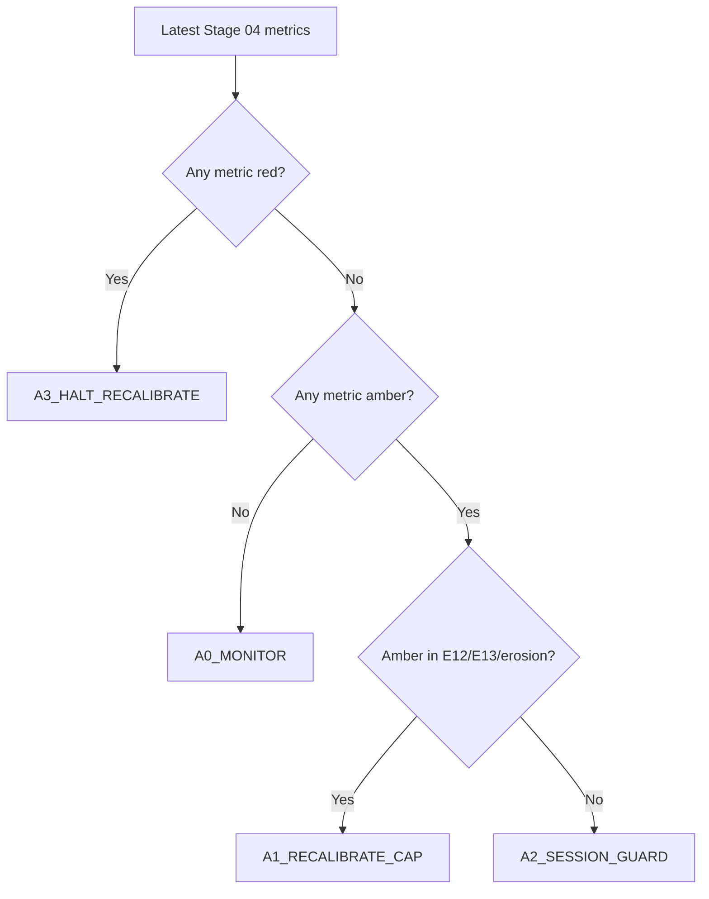

# Stage 4 - Execution Realism (Stop-Limit)

## Objective
Convert bar-level OCO outcomes to tick-aware stop-limit realism and quantify execution-driven EV erosion.

## Inputs
- Tickfill detail:
`data/analysis/tick_opportunity_mining/stop_limit_tickfill_fullcap/<SYMBOL>_stop_limit_tickfill_detail.csv`
- Cap sweep:
`data/analysis/tick_opportunity_mining/stop_limit_tickfill_fullcap/<SYMBOL>_stop_limit_tickfill_caps.csv`
- Summary:
`data/analysis/tick_opportunity_mining/stop_limit_tickfill_fullcap/summary.csv`
- Stage 04 policy output:
`data/analysis/tick_opportunity_mining/stage04_execution_policy_status.csv`
- Stage 04 session cap policy output:
`data/analysis/tick_opportunity_mining/stage04_cap_policy_by_session.csv`

## Process
- Reconstruct first-touch execution with tick-first crossing.
- Apply stop-limit cap sweep and classify execution-policy bands.
- Quantify cap robustness and overshoot/session dispersion diagnostics (`E11-E13`).
- Build causal rolling session caps before session-dispersion diagnostics.

## Exact Calculations
- session cap at event `t`: `q0.90(overshoot)` over `[t-20d, t)` with `min_periods=200`
- cap fallback chain: session cap -> global cap -> static symbol q0.90 fallback
- `overshoot_capped = min(overshoot_tick_pips, cap_applied_pips)`
- `E11_session_overshoot_dispersion = std(mean_overshoot_capped_by_session) / mean(mean_overshoot_capped_by_session)`
- `E12_cap_plateau_width_pips`:
- width of cap interval where per-signal performance >= 95% of best
- `E13_nonfill_opportunity_cost_pips`:
- `(mean_per_signal_no_extra_slip - mean_per_signal_full_overshoot) * fill_rate` at best cap
- `erosion_spread_fee_plus_slip = base_mean_gross_pips - best_cap_mean_per_signal_full_overshoot`

### Execution Contract Semantics (Stop-Limit)
- A touch event is rebuilt from candidate metadata (`bar_ticks`, `horizon`, `barrier_pips`, `side`) and bar-level first-touch logic.
- For each touch bar, the first tick crossing the barrier is found inside `[touch_open_ts, touch_close_ts]`.
- Overshoot is measured in pips from barrier to first crossing tick:
- Buy side: `overshoot = (first_tick_px - barrier_px) / pip`
- Sell side: `overshoot = (barrier_px - first_tick_px) / pip`
- Cap (`cap_pips`) means maximum allowed overshoot for fill acceptance:
- Fill if `touch_found_tick == 1` and `overshoot_tick_pips <= cap_pips`
- No fill otherwise

### Why Stop-Limit (vs Market / Passive Limit)
- Market-at-touch captures almost all triggers but pays worst overshoot tails during bursty ticks.
- Passive limit can avoid overshoot but misses momentum breaks when price does not retrace.
- Stop-limit is the controllable middle ground: trigger on break, but reject fills with excessive overshoot.

### What a Cap Is
- `cap_pips` is the maximum entry slippage tolerance after trigger.
- Smaller caps improve realized entry quality but reduce fill rate.
- Larger caps increase fill rate but admit more adverse overshoot.
- Stage 04 policy chooses and monitors this trade-off explicitly.

### Stage 04 Policy Bands and Actions
- Metrics and directions:
- `E11_session_overshoot_dispersion` lower is better
- `E12_cap_plateau_width_pips` higher is better
- `E13_nonfill_opportunity_cost_pips` lower is better
- `erosion_spread_fee_plus_slip` lower is better
- `tick_overshoot_p95_pips` lower is better
- Bands:
- `green`: within stable operating region
- `amber`: degraded but tradable with mitigation
- `red`: unsafe; halt/recalibrate before relying on results
- Action codes:
- `A0_MONITOR`: continue, no parameter change
- `A1_RECALIBRATE_CAP`: rerun cap sweep and reselect cap
- `A2_SESSION_GUARD`: add session-specific safeguards/filters
- `A3_HALT_RECALIBRATE`: pause deployment and revalidate
- `A9_DATA_GAP`: missing diagnostics; block until resolved

### Cap Recalibration Decision Tree


### Degradation Playbooks
- `A1_RECALIBRATE_CAP`:
- Recompute cap sweep on most recent month and prior train window.
- Require stable `E12` plateau and non-negative per-signal expectancy at selected cap.
- `A2_SESSION_GUARD`:
- Identify worst overshoot UTC buckets and gate/scale entries in those sessions.
- Re-check `E11` after guard.
- `A3_HALT_RECALIBRATE`:
- Stop symbol for deployment.
- Re-run Stage 03 -> Stage 08 checks after recalibration.
- `A9_DATA_GAP`:
- Do not interpret Stage 04 pass/fail.
- Regenerate missing stop-limit detail/cap artifacts and rerun docs-contract checks.

### Worked Example
- If `E12` collapses from `0.7` to `0.2` pips while `E13` rises above `0.35`, cap robustness is unstable.
- Policy outcome should escalate to `A3_HALT_RECALIBRATE` because slippage sensitivity dominates expectancy.

## Causality / Leakage Controls
- Uses realized tick path around touch events only.
- No future month leakage in execution diagnostics.

## Failure Modes
- Overshoot tail thickening in specific sessions.
- Performance dependent on razor-thin cap choice.
- Unrealistic fill assumptions causing optimistic net.

## Interpretation Guide
- Lower `E11` indicates more uniform execution quality across sessions.
- Larger `E12` indicates more robust cap choice.
- Higher `E13` indicates more opportunity loss from realistic fill behavior.

## Validation Gates
- Hard execution gates live in `E01-E10` preflight audit.
- `E11-E13` are informational hardening diagnostics.
- Stage 04 policy status (`stage04_execution_policy_status.csv`) must map every required metric to band + action.

## Canonical Analysis Reports
- `docs/analysis/oco_execution_risk_prelive_report.md`
- `docs/analysis/oco_stop_limit_tickfill_fullcap_report.md`
- `docs/analysis/oco_execution_drift_report.md`
- `docs/strategy_bible/signal_lifecycle_reference.md`
- `docs/strategy_bible/operator_runbook.md`

## Operator Decision Tree
- If any hard gate in this stage fails, block promotion and escalate using the operator runbook.
- If only warning/amber diagnostics trigger, continue with mitigation and add an owner/deadline in remediation artifacts.

## How To Run
- Run the `Reproduction Commands` in this stage exactly as listed.
- Confirm artifacts are refreshed and timestamps are current before interpreting outcomes.

## How To Interpret Outputs
- Read `Key Results` first for pass/fail posture and core health metrics.
- Use `Interpretation Notes` and `Action Trigger Summary` to map observed values to operational actions.

## What To Do If It Fails
- `critical/high`: halt deployment progression, remediate root cause, rerun stage and downstream dependent stages.
- `medium/low`: open tracked remediation with owner and ETA, monitor for recurrence in next cycle.

## Reproduction Commands
```bash
uv run python scripts/analyze_oco_stop_limit_tickfill.py \
  --symbols EURUSD,GBPUSD,USDJPY,USDCHF,AUDUSD,USDCAD
uv run python scripts/build_oco_execution_drift_report.py

uv run python scripts/build_oco_strategy_bible.py \
  --manifest configs/research/docs/oco_bible_manifest.yaml --strict false
```

## Traceability
- `scripts/analyze_oco_stop_limit_tickfill.py`
- `scripts/build_oco_execution_drift_report.py`
- `docs/analysis/oco_stop_limit_tickfill_fullcap_report.md`
- `docs/strategy_bible/generated/stage_04_snapshot.md`

## Generated Run Snapshot
<!-- GENERATED:STAGE_04:START -->
### Auto Snapshot - Stage 04

- generated_at: `2026-03-30 10:10:58 UTC`
- Execution realism is applied with tick first-cross overshoot.
- Session-aware rolling caps are built causally (20D lookback, q=0.90) before E11 dispersion is measured.
- Cap curve highlights fill-rate versus signal-level expectancy.
- E11-E13 are informational execution diagnostics: session dispersion, plateau width, and non-fill opportunity cost.
- Policy status artifact: data/analysis/tick_opportunity_mining/stage04_execution_policy_status.csv
- Session cap artifact: data/analysis/tick_opportunity_mining/stage04_cap_policy_by_session.csv

#### Key Results
| symbol   |   rows |   touch_found_rate |   base_mean_gross_pips |   tick_overshoot_mean_pips |   tick_overshoot_p95_pips |   e11_session_overshoot_dispersion |   e12_cap_plateau_width_pips |   e13_nonfill_opportunity_cost_pips |
|:---------|-------:|-------------------:|-----------------------:|---------------------------:|--------------------------:|-----------------------------------:|-----------------------------:|------------------------------------:|
| EURUSD   | 452740 |           0.902628 |                1.06508 |                    1.91862 |                      11.7 |                           0.722889 |                          1.2 |                           0.109312  |
| GBPUSD   | 452740 |           0.902628 |                1.06508 |                    1.91862 |                      11.7 |                           0.662491 |                          1.2 |                           0.0842798 |
| AUDUSD   | 452740 |           0.902628 |                1.06508 |                    1.91862 |                      11.7 |                           0.855659 |                          1.5 |                           0.0626421 |
| USDJPY   | 452740 |           0.902628 |                1.06508 |                    1.91862 |                      11.7 |                           0.296119 |                          1.2 |                           0.134731  |
| USDCHF   | 452740 |           0.902628 |                1.06508 |                    1.91862 |                      11.7 |                           0.372574 |                          1.2 |                           0.0884671 |
| USDCAD   | 452740 |           0.902628 |                1.06508 |                    1.91862 |                      11.7 |                           1.14194  |                          1   |                           0.131179  |

#### Interpretation Notes
- Execution realism is applied with tick first-cross overshoot.
- Session-aware rolling caps are built causally (20D lookback, q=0.90) before E11 dispersion is measured.
- Cap curve highlights fill-rate versus signal-level expectancy.

#### Action Trigger Summary
| symbol   | metric_id                         | band   | severity   | action_code           | action_summary         | owner     |
|:---------|:----------------------------------|:-------|:-----------|:----------------------|:-----------------------|:----------|
| AUDUSD   | E11_session_overshoot_dispersion  | red    | high       | A3_HALT_AND_REMEDIATE | escalate and remediate | execution |
| AUDUSD   | E12_cap_plateau_width_pips        | green  | info       | A0_MONITOR            | within policy band     | execution |
| AUDUSD   | E13_nonfill_opportunity_cost_pips | green  | info       | A0_MONITOR            | within policy band     | execution |
| EURUSD   | E11_session_overshoot_dispersion  | red    | high       | A3_HALT_AND_REMEDIATE | escalate and remediate | execution |
| EURUSD   | E12_cap_plateau_width_pips        | green  | info       | A0_MONITOR            | within policy band     | execution |
| EURUSD   | E13_nonfill_opportunity_cost_pips | green  | info       | A0_MONITOR            | within policy band     | execution |
| GBPUSD   | E11_session_overshoot_dispersion  | red    | high       | A3_HALT_AND_REMEDIATE | escalate and remediate | execution |
| GBPUSD   | E12_cap_plateau_width_pips        | green  | info       | A0_MONITOR            | within policy band     | execution |
| GBPUSD   | E13_nonfill_opportunity_cost_pips | green  | info       | A0_MONITOR            | within policy band     | execution |
| USDCAD   | E11_session_overshoot_dispersion  | red    | high       | A3_HALT_AND_REMEDIATE | escalate and remediate | execution |
| USDCAD   | E12_cap_plateau_width_pips        | green  | info       | A0_MONITOR            | within policy band     | execution |
| USDCAD   | E13_nonfill_opportunity_cost_pips | green  | info       | A0_MONITOR            | within policy band     | execution |

#### Details
| symbol   |   cap_pips |   fill_rate |   mean_per_signal_full_overshoot |
|:---------|-----------:|------------:|---------------------------------:|
| AUDUSD   |        0.5 |    0.779328 |                         0.344807 |
| AUDUSD   |        0.8 |    0.794424 |                         0.358485 |
| AUDUSD   |        1   |    0.799645 |                         0.358063 |
| AUDUSD   |        1.2 |    0.802464 |                         0.361811 |
| AUDUSD   |        1.5 |    0.806574 |                         0.357742 |
| AUDUSD   |        2   |    0.810071 |                         0.355544 |
| EURUSD   |        0.5 |    0.829685 |                         1.08969  |
| EURUSD   |        0.8 |    0.861341 |                         1.14503  |
| EURUSD   |        1   |    0.872368 |                         1.15668  |
| EURUSD   |        1.2 |    0.876773 |                         1.17171  |
| EURUSD   |        1.5 |    0.881155 |                         1.19003  |
| EURUSD   |        2   |    0.885328 |                         1.19508  |
| GBPUSD   |        0.5 |    0.74579  |                         0.641261 |
| GBPUSD   |        0.8 |    0.775168 |                         0.670323 |
| GBPUSD   |        1   |    0.781626 |                         0.679717 |
| GBPUSD   |        1.2 |    0.784228 |                         0.680333 |
| GBPUSD   |        1.5 |    0.787708 |                         0.679828 |
| GBPUSD   |        2   |    0.791128 |                         0.678867 |
| USDCAD   |        0.5 |    0.736875 |                         0.64384  |
| USDCAD   |        0.8 |    0.783198 |                         0.696992 |
| USDCAD   |        1   |    0.798264 |                         0.71985  |
| USDCAD   |        1.2 |    0.805703 |                         0.724904 |
| USDCAD   |        1.5 |    0.814194 |                         0.745853 |
| USDCAD   |        2   |    0.823161 |                         0.754567 |
| USDCHF   |        0.5 |    0.78686  |                         0.485887 |
| USDCHF   |        0.8 |    0.809568 |                         0.509492 |
| USDCHF   |        1   |    0.816174 |                         0.51167  |
| USDCHF   |        1.2 |    0.8206   |                         0.514741 |
| USDCHF   |        1.5 |    0.826821 |                         0.51639  |
| USDCHF   |        2   |    0.83248  |                         0.511575 |
| USDJPY   |        0.5 |    0.734881 |                         0.849308 |
| USDJPY   |        0.8 |    0.775511 |                         0.897059 |
| USDJPY   |        1   |    0.788978 |                         0.918888 |
| USDJPY   |        1.2 |    0.793576 |                         0.924014 |
| USDJPY   |        1.5 |    0.80047  |                         0.936937 |
| USDJPY   |        2   |    0.804849 |                         0.94247  |

#### Plots


#### Execution Risk Pre-Live
| symbol   |   checks_total |   checks_failed |   high_critical_failed |   e02_min_month_fill_rate |   e03_tail_above_cap |   e10_lb95_month_signal_net |
|:---------|---------------:|----------------:|-----------------------:|--------------------------:|---------------------:|----------------------------:|
| EURUSD   |             10 |               4 |                      4 |                 0.0314103 |            0.0580301 |                    0.788227 |
| GBPUSD   |             10 |               4 |                      4 |                 0.0297991 |            0.113089  |                    0.529265 |
| AUDUSD   |             10 |               4 |                      4 |                 0.0417622 |            0.0938864 |                    0.170857 |
| USDJPY   |             10 |               4 |                      4 |                 0.0285511 |            0.111624  |                    0.704621 |
| USDCHF   |             10 |               4 |                      4 |                 0.0476378 |            0.0896491 |                    0.21574  |
| USDCAD   |             10 |               4 |                      4 |                 0.0484032 |            0.107381  |                    0.387223 |

#### Policy Status
| symbol   |   metrics_total |   green_metric_count |   amber_metric_count |   red_metric_count | worst_band   | recommended_action_code   | recommended_action_summary                                       | red_metrics                                          | amber_metrics                                                 |
|:---------|----------------:|---------------------:|---------------------:|-------------------:|:-------------|:--------------------------|:-----------------------------------------------------------------|:-----------------------------------------------------|:--------------------------------------------------------------|
| AUDUSD   |               5 |                    3 |                    0 |                  2 | red          | A3_HALT_RECALIBRATE       | execution erosion too high; halt symbol until recalibrated       | erosion_spread_fee_plus_slip,tick_overshoot_p95_pips |                                                               |
| EURUSD   |               5 |                    4 |                    0 |                  1 | red          | A3_HALT_RECALIBRATE       | overshoot tail unsafe; halt and revalidate execution assumptions | tick_overshoot_p95_pips                              |                                                               |
| GBPUSD   |               5 |                    3 |                    1 |                  1 | red          | A3_HALT_RECALIBRATE       | overshoot tail unsafe; halt and revalidate execution assumptions | tick_overshoot_p95_pips                              | erosion_spread_fee_plus_slip                                  |
| USDCAD   |               5 |                    2 |                    2 |                  1 | red          | A3_HALT_RECALIBRATE       | overshoot tail unsafe; halt and revalidate execution assumptions | tick_overshoot_p95_pips                              | E11_session_overshoot_dispersion,erosion_spread_fee_plus_slip |
| USDCHF   |               5 |                    3 |                    0 |                  2 | red          | A3_HALT_RECALIBRATE       | execution erosion too high; halt symbol until recalibrated       | erosion_spread_fee_plus_slip,tick_overshoot_p95_pips |                                                               |
| USDJPY   |               5 |                    4 |                    0 |                  1 | red          | A3_HALT_RECALIBRATE       | overshoot tail unsafe; halt and revalidate execution assumptions | tick_overshoot_p95_pips                              |                                                               |

- policy_csv: `data/analysis/tick_opportunity_mining/stage04_execution_policy_status.csv`

#### Policy Metric Mapping (Detail)
| symbol   | metric_id                         |   metric_value | band   | action_code         | green_threshold   | amber_threshold   |
|:---------|:----------------------------------|---------------:|:-------|:--------------------|:------------------|:------------------|
| EURUSD   | E11_session_overshoot_dispersion  |      0.722889  | green  | A0_MONITOR          | <= 1.0000         | <= 1.3000         |
| EURUSD   | E12_cap_plateau_width_pips        |      1.2       | green  | A0_MONITOR          | >= 0.5000         | >= 0.3000         |
| EURUSD   | E13_nonfill_opportunity_cost_pips |      0.109312  | green  | A0_MONITOR          | <= 0.2000         | <= 0.3500         |
| EURUSD   | erosion_spread_fee_plus_slip      |     -0.129999  | green  | A0_MONITOR          | <= 0.3000         | <= 0.5000         |
| EURUSD   | tick_overshoot_p95_pips           |     11.7       | red    | A3_HALT_RECALIBRATE | <= 0.7000         | <= 1.0000         |
| GBPUSD   | E11_session_overshoot_dispersion  |      0.662491  | green  | A0_MONITOR          | <= 1.0000         | <= 1.3000         |
| GBPUSD   | E12_cap_plateau_width_pips        |      1.2       | green  | A0_MONITOR          | >= 0.5000         | >= 0.3000         |
| GBPUSD   | E13_nonfill_opportunity_cost_pips |      0.0842798 | green  | A0_MONITOR          | <= 0.2000         | <= 0.3500         |
| GBPUSD   | erosion_spread_fee_plus_slip      |      0.384748  | amber  | A1_RECALIBRATE_CAP  | <= 0.3000         | <= 0.5000         |
| GBPUSD   | tick_overshoot_p95_pips           |     11.7       | red    | A3_HALT_RECALIBRATE | <= 0.7000         | <= 1.0000         |
| AUDUSD   | E11_session_overshoot_dispersion  |      0.855659  | green  | A0_MONITOR          | <= 1.0000         | <= 1.3000         |
| AUDUSD   | E12_cap_plateau_width_pips        |      1.5       | green  | A0_MONITOR          | >= 0.5000         | >= 0.3000         |
| AUDUSD   | E13_nonfill_opportunity_cost_pips |      0.0626421 | green  | A0_MONITOR          | <= 0.2000         | <= 0.3500         |
| AUDUSD   | erosion_spread_fee_plus_slip      |      0.703269  | red    | A3_HALT_RECALIBRATE | <= 0.3000         | <= 0.5000         |
| AUDUSD   | tick_overshoot_p95_pips           |     11.7       | red    | A3_HALT_RECALIBRATE | <= 0.7000         | <= 1.0000         |
| USDJPY   | E11_session_overshoot_dispersion  |      0.296119  | green  | A0_MONITOR          | <= 1.0000         | <= 1.3000         |
| USDJPY   | E12_cap_plateau_width_pips        |      1.2       | green  | A0_MONITOR          | >= 0.5000         | >= 0.3000         |
| USDJPY   | E13_nonfill_opportunity_cost_pips |      0.134731  | green  | A0_MONITOR          | <= 0.2000         | <= 0.3500         |
| USDJPY   | erosion_spread_fee_plus_slip      |      0.12261   | green  | A0_MONITOR          | <= 0.3000         | <= 0.5000         |
| USDJPY   | tick_overshoot_p95_pips           |     11.7       | red    | A3_HALT_RECALIBRATE | <= 0.7000         | <= 1.0000         |
| USDCHF   | E11_session_overshoot_dispersion  |      0.372574  | green  | A0_MONITOR          | <= 1.0000         | <= 1.3000         |
| USDCHF   | E12_cap_plateau_width_pips        |      1.2       | green  | A0_MONITOR          | >= 0.5000         | >= 0.3000         |
| USDCHF   | E13_nonfill_opportunity_cost_pips |      0.0884671 | green  | A0_MONITOR          | <= 0.2000         | <= 0.3500         |
| USDCHF   | erosion_spread_fee_plus_slip      |      0.548691  | red    | A3_HALT_RECALIBRATE | <= 0.3000         | <= 0.5000         |
| USDCHF   | tick_overshoot_p95_pips           |     11.7       | red    | A3_HALT_RECALIBRATE | <= 0.7000         | <= 1.0000         |
| USDCAD   | E11_session_overshoot_dispersion  |      1.14194   | amber  | A2_SESSION_GUARD    | <= 1.0000         | <= 1.3000         |
| USDCAD   | E12_cap_plateau_width_pips        |      1         | green  | A0_MONITOR          | >= 0.5000         | >= 0.3000         |
| USDCAD   | E13_nonfill_opportunity_cost_pips |      0.131179  | green  | A0_MONITOR          | <= 0.2000         | <= 0.3500         |
| USDCAD   | erosion_spread_fee_plus_slip      |      0.310513  | amber  | A1_RECALIBRATE_CAP  | <= 0.3000         | <= 0.5000         |
| USDCAD   | tick_overshoot_p95_pips           |     11.7       | red    | A3_HALT_RECALIBRATE | <= 0.7000         | <= 1.0000         |

#### Session Rolling Cap Policy
| symbol   | session_bucket   |   lookback_days |   cap_quantile |   cap_pips |   rows_used |   session_cap_rows |   global_cap_rows |   fallback_rows |
|:---------|:-----------------|----------------:|---------------:|-----------:|------------:|-------------------:|------------------:|----------------:|
| EURUSD   | ASIA             |              20 |            0.9 |      31.6  |       95545 |              95345 |                11 |             189 |
| EURUSD   | LATE             |              20 |            0.9 |      20.2  |       19833 |              18738 |              1091 |               4 |
| EURUSD   | LONDON           |              20 |            0.9 |      48.14 |       86088 |              85888 |               200 |               0 |
| EURUSD   | NY               |              20 |            0.9 |      23.6  |      164477 |             164277 |               200 |               0 |
| GBPUSD   | ASIA             |              20 |            0.9 |      29.7  |       77854 |              77654 |               108 |              92 |
| GBPUSD   | LATE             |              20 |            0.9 |      26.65 |       12632 |              11957 |               675 |               0 |
| GBPUSD   | LONDON           |              20 |            0.9 |      62.8  |      138419 |             138219 |                92 |             108 |
| GBPUSD   | NY               |              20 |            0.9 |      37.1  |      161294 |             161094 |               200 |               0 |
| AUDUSD   | ASIA             |              20 |            0.9 |      27.2  |      148062 |             147862 |                60 |             140 |
| AUDUSD   | LATE             |              20 |            0.9 |      31.8  |       13238 |              12247 |               931 |              60 |
| AUDUSD   | LONDON           |              20 |            0.9 |      32.2  |       60712 |              60512 |               200 |               0 |
| AUDUSD   | NY               |              20 |            0.9 |      42.1  |      137779 |             137579 |               200 |               0 |
| USDJPY   | ASIA             |              20 |            0.9 |      67.7  |      229497 |             229297 |                23 |             177 |
| USDJPY   | LATE             |              20 |            0.9 |      75.3  |       26590 |              26291 |               276 |              23 |
| USDJPY   | LONDON           |              20 |            0.9 |      92.54 |       77436 |              77236 |               200 |               0 |
| USDJPY   | NY               |              20 |            0.9 |      52.9  |       90053 |              89853 |               200 |               0 |
| USDCHF   | ASIA             |              20 |            0.9 |      20.4  |       71562 |              71362 |                50 |             150 |
| USDCHF   | LATE             |              20 |            0.9 |      22.4  |       11195 |               9972 |              1175 |              48 |
| USDCHF   | LONDON           |              20 |            0.9 |      43.7  |       97614 |              97414 |               198 |               2 |
| USDCHF   | NY               |              20 |            0.9 |      17    |      149439 |             149239 |               200 |               0 |
| USDCAD   | ASIA             |              20 |            0.9 |      18.8  |       76820 |              76620 |               155 |              45 |
| USDCAD   | LATE             |              20 |            0.9 |      64.4  |       15990 |              14664 |              1171 |             155 |
| USDCAD   | LONDON           |              20 |            0.9 |      69.6  |       64648 |              64448 |               200 |               0 |
| USDCAD   | NY               |              20 |            0.9 |      33.3  |      251042 |             250842 |               200 |               0 |
<!-- GENERATED:STAGE_04:END -->
