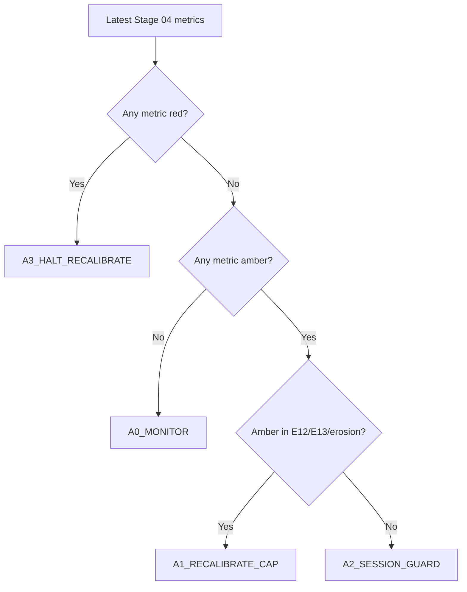

# Stage 4 - Execution Realism (Stop-Limit)

## Objective
Convert bar-level OCO outcomes to tick-aware stop-limit realism and quantify execution-driven EV erosion.

## Inputs
- Tickfill detail:
`data/analysis/tick_opportunity_mining/stop_limit_tickfill_fullcap/<SYMBOL>_stop_limit_tickfill_detail.csv`
- Cap sweep:
`data/analysis/tick_opportunity_mining/stop_limit_tickfill_fullcap/<SYMBOL>_stop_limit_tickfill_caps.csv`
- Summary:
`data/analysis/tick_opportunity_mining/stop_limit_tickfill_fullcap/summary.csv`
- Stage 04 policy output:
`data/analysis/tick_opportunity_mining/stage04_execution_policy_status.csv`
- Stage 04 session cap policy output:
`data/analysis/tick_opportunity_mining/stage04_cap_policy_by_session.csv`

## Process
- Reconstruct first-touch execution with tick-first crossing.
- Apply stop-limit cap sweep and classify execution-policy bands.
- Quantify cap robustness and overshoot/session dispersion diagnostics (`E11-E13`).
- Build causal rolling session caps before session-dispersion diagnostics.

## Exact Calculations
- session cap at event `t`: `q0.90(overshoot)` over `[t-20d, t)` with `min_periods=200`
- cap fallback chain: session cap -> global cap -> static symbol q0.90 fallback
- `overshoot_capped = min(overshoot_tick_pips, cap_applied_pips)`
- `E11_session_overshoot_dispersion = std(mean_overshoot_capped_by_session) / mean(mean_overshoot_capped_by_session)`
- `E12_cap_plateau_width_pips`:
- width of cap interval where per-signal performance >= 95% of best
- `E13_nonfill_opportunity_cost_pips`:
- `(mean_per_signal_no_extra_slip - mean_per_signal_full_overshoot) * fill_rate` at best cap
- `erosion_spread_fee_plus_slip = base_mean_gross_pips - best_cap_mean_per_signal_full_overshoot`

### Execution Contract Semantics (Stop-Limit)
- A touch event is rebuilt from candidate metadata (`bar_ticks`, `horizon`, `barrier_pips`, `side`) and bar-level first-touch logic.
- For each touch bar, the first tick crossing the barrier is found inside `[touch_open_ts, touch_close_ts]`.
- Overshoot is measured in pips from barrier to first crossing tick:
- Buy side: `overshoot = (first_tick_px - barrier_px) / pip`
- Sell side: `overshoot = (barrier_px - first_tick_px) / pip`
- Cap (`cap_pips`) means maximum allowed overshoot for fill acceptance:
- Fill if `touch_found_tick == 1` and `overshoot_tick_pips <= cap_pips`
- No fill otherwise

### Why Stop-Limit (vs Market / Passive Limit)
- Market-at-touch captures almost all triggers but pays worst overshoot tails during bursty ticks.
- Passive limit can avoid overshoot but misses momentum breaks when price does not retrace.
- Stop-limit is the controllable middle ground: trigger on break, but reject fills with excessive overshoot.

### What a Cap Is
- `cap_pips` is the maximum entry slippage tolerance after trigger.
- Smaller caps improve realized entry quality but reduce fill rate.
- Larger caps increase fill rate but admit more adverse overshoot.
- Stage 04 policy chooses and monitors this trade-off explicitly.

### Stage 04 Policy Bands and Actions
- Metrics and directions:
- `E11_session_overshoot_dispersion` lower is better
- `E12_cap_plateau_width_pips` higher is better
- `E13_nonfill_opportunity_cost_pips` lower is better
- `erosion_spread_fee_plus_slip` lower is better
- `tick_overshoot_p95_pips` lower is better
- Bands:
- `green`: within stable operating region
- `amber`: degraded but tradable with mitigation
- `red`: unsafe; halt/recalibrate before relying on results
- Action codes:
- `A0_MONITOR`: continue, no parameter change
- `A1_RECALIBRATE_CAP`: rerun cap sweep and reselect cap
- `A2_SESSION_GUARD`: add session-specific safeguards/filters
- `A3_HALT_RECALIBRATE`: pause deployment and revalidate
- `A9_DATA_GAP`: missing diagnostics; block until resolved

### Cap Recalibration Decision Tree


### Degradation Playbooks
- `A1_RECALIBRATE_CAP`:
- Recompute cap sweep on most recent month and prior train window.
- Require stable `E12` plateau and non-negative per-signal expectancy at selected cap.
- `A2_SESSION_GUARD`:
- Identify worst overshoot UTC buckets and gate/scale entries in those sessions.
- Re-check `E11` after guard.
- `A3_HALT_RECALIBRATE`:
- Stop symbol for deployment.
- Re-run Stage 03 -> Stage 08 checks after recalibration.
- `A9_DATA_GAP`:
- Do not interpret Stage 04 pass/fail.
- Regenerate missing stop-limit detail/cap artifacts and rerun docs-contract checks.

### Worked Example
- If `E12` collapses from `0.7` to `0.2` pips while `E13` rises above `0.35`, cap robustness is unstable.
- Policy outcome should escalate to `A3_HALT_RECALIBRATE` because slippage sensitivity dominates expectancy.

## Causality / Leakage Controls
- Uses realized tick path around touch events only.
- No future month leakage in execution diagnostics.

## Failure Modes
- Overshoot tail thickening in specific sessions.
- Performance dependent on razor-thin cap choice.
- Unrealistic fill assumptions causing optimistic net.

## Interpretation Guide
- Lower `E11` indicates more uniform execution quality across sessions.
- Larger `E12` indicates more robust cap choice.
- Higher `E13` indicates more opportunity loss from realistic fill behavior.

## Validation Gates
- Hard execution gates live in `E01-E10` preflight audit.
- `E11-E13` are informational hardening diagnostics.
- Stage 04 policy status (`stage04_execution_policy_status.csv`) must map every required metric to band + action.

## Canonical Analysis Reports
- `docs/analysis/oco_execution_risk_prelive_report.md`
- `docs/analysis/oco_stop_limit_tickfill_fullcap_report.md`
- `docs/analysis/oco_execution_drift_report.md`
- `docs/strategy_bible/signal_lifecycle_reference.md`
- `docs/strategy_bible/operator_runbook.md`

## Operator Decision Tree
- If any hard gate in this stage fails, block promotion and escalate using the operator runbook.
- If only warning/amber diagnostics trigger, continue with mitigation and add an owner/deadline in remediation artifacts.

## How To Run
- Run the `Reproduction Commands` in this stage exactly as listed.
- Confirm artifacts are refreshed and timestamps are current before interpreting outcomes.

## How To Interpret Outputs
- Read `Key Results` first for pass/fail posture and core health metrics.
- Use `Interpretation Notes` and `Action Trigger Summary` to map observed values to operational actions.

## What To Do If It Fails
- `critical/high`: halt deployment progression, remediate root cause, rerun stage and downstream dependent stages.
- `medium/low`: open tracked remediation with owner and ETA, monitor for recurrence in next cycle.

## Reproduction Commands
```bash
uv run python scripts/analyze_oco_stop_limit_tickfill.py \
  --symbols EURUSD,GBPUSD,USDJPY,USDCHF,AUDUSD,USDCAD
uv run python scripts/build_oco_execution_drift_report.py

uv run python scripts/build_oco_strategy_bible.py \
  --manifest configs/research/docs/oco_bible_manifest.yaml --strict false
```

## Traceability
- `scripts/analyze_oco_stop_limit_tickfill.py`
- `scripts/build_oco_execution_drift_report.py`
- `docs/analysis/oco_stop_limit_tickfill_fullcap_report.md`
- `docs/strategy_bible/generated/stage_04_snapshot.md`

## Generated Run Snapshot
<!-- GENERATED:STAGE_04:START -->
### Auto Snapshot - Stage 04

- generated_at: `2026-03-06 13:50:11 UTC`
- Execution realism is applied with tick first-cross overshoot.
- Session-aware rolling caps are built causally (20D lookback, q=0.90) before E11 dispersion is measured.
- Cap curve highlights fill-rate versus signal-level expectancy.
- E11-E13 are informational execution diagnostics: session dispersion, plateau width, and non-fill opportunity cost.
- Policy status artifact: data/analysis/tick_opportunity_mining/stage04_execution_policy_status.csv
- Session cap artifact: data/analysis/tick_opportunity_mining/stage04_cap_policy_by_session.csv

#### Key Results
| symbol   |   rows |   touch_found_rate |   base_mean_gross_pips |   tick_overshoot_mean_pips |   tick_overshoot_p95_pips |   e11_session_overshoot_dispersion |   e12_cap_plateau_width_pips |   e13_nonfill_opportunity_cost_pips |
|:---------|-------:|-------------------:|-----------------------:|---------------------------:|--------------------------:|-----------------------------------:|-----------------------------:|------------------------------------:|
| EURUSD   | 527101 |           0.998391 |                 1.0177 |                   0.211795 |                       0.8 |                           0.20533  |                          1.2 |                           0.120942  |
| GBPUSD   | 527101 |           0.998391 |                 1.0177 |                   0.211795 |                       0.8 |                           0.270871 |                          1.2 |                           0.120835  |
| AUDUSD   | 527101 |           0.998391 |                 1.0177 |                   0.211795 |                       0.8 |                           0.300633 |                          1.5 |                           0.0973822 |
| USDJPY   | 527101 |           0.998391 |                 1.0177 |                   0.211795 |                       0.8 |                           0.125103 |                          1.2 |                           0.196782  |
| USDCHF   | 527101 |           0.998391 |                 1.0177 |                   0.211795 |                       0.8 |                           0.821574 |                          1.2 |                           0.11134   |
| USDCAD   | 527101 |           0.998391 |                 1.0177 |                   0.211795 |                       0.8 |                           0.333909 |                          0.8 |                           0.165545  |

#### Interpretation Notes
- Execution realism is applied with tick first-cross overshoot.
- Session-aware rolling caps are built causally (20D lookback, q=0.90) before E11 dispersion is measured.
- Cap curve highlights fill-rate versus signal-level expectancy.

#### Action Trigger Summary
| symbol   | metric_id                         | band   | severity   | action_code   | action_summary     | owner     |
|:---------|:----------------------------------|:-------|:-----------|:--------------|:-------------------|:----------|
| AUDUSD   | E11_session_overshoot_dispersion  | green  | info       | A0_MONITOR    | within policy band | execution |
| AUDUSD   | E12_cap_plateau_width_pips        | green  | info       | A0_MONITOR    | within policy band | execution |
| AUDUSD   | E13_nonfill_opportunity_cost_pips | green  | info       | A0_MONITOR    | within policy band | execution |
| EURUSD   | E11_session_overshoot_dispersion  | green  | info       | A0_MONITOR    | within policy band | execution |
| EURUSD   | E12_cap_plateau_width_pips        | green  | info       | A0_MONITOR    | within policy band | execution |
| EURUSD   | E13_nonfill_opportunity_cost_pips | green  | info       | A0_MONITOR    | within policy band | execution |
| GBPUSD   | E11_session_overshoot_dispersion  | green  | info       | A0_MONITOR    | within policy band | execution |
| GBPUSD   | E12_cap_plateau_width_pips        | green  | info       | A0_MONITOR    | within policy band | execution |
| GBPUSD   | E13_nonfill_opportunity_cost_pips | green  | info       | A0_MONITOR    | within policy band | execution |
| USDCAD   | E11_session_overshoot_dispersion  | green  | info       | A0_MONITOR    | within policy band | execution |
| USDCAD   | E12_cap_plateau_width_pips        | green  | info       | A0_MONITOR    | within policy band | execution |
| USDCAD   | E13_nonfill_opportunity_cost_pips | green  | info       | A0_MONITOR    | within policy band | execution |

#### Details
| symbol   |   cap_pips |   fill_rate |   mean_per_signal_full_overshoot |
|:---------|-----------:|------------:|---------------------------------:|
| AUDUSD   |        0.5 |    0.955051 |                         0.460457 |
| AUDUSD   |        0.8 |    0.975076 |                         0.474302 |
| AUDUSD   |        1   |    0.981533 |                         0.47995  |
| AUDUSD   |        1.2 |    0.98373  |                         0.484197 |
| AUDUSD   |        1.5 |    0.986688 |                         0.483152 |
| AUDUSD   |        2   |    0.989463 |                         0.484219 |
| EURUSD   |        0.5 |    0.939603 |                         1.15916  |
| EURUSD   |        0.8 |    0.972205 |                         1.2169   |
| EURUSD   |        1   |    0.983658 |                         1.23373  |
| EURUSD   |        1.2 |    0.987821 |                         1.2446   |
| EURUSD   |        1.5 |    0.992082 |                         1.25984  |
| EURUSD   |        2   |    0.995805 |                         1.26298  |
| GBPUSD   |        0.5 |    0.948256 |                         0.809964 |
| GBPUSD   |        0.8 |    0.980789 |                         0.839491 |
| GBPUSD   |        1   |    0.988325 |                         0.850274 |
| GBPUSD   |        1.2 |    0.990337 |                         0.853557 |
| GBPUSD   |        1.5 |    0.992933 |                         0.855123 |
| GBPUSD   |        2   |    0.995112 |                         0.858745 |
| USDCAD   |        0.5 |    0.892305 |                         0.655983 |
| USDCAD   |        0.8 |    0.946699 |                         0.724883 |
| USDCAD   |        1   |    0.965403 |                         0.753222 |
| USDCAD   |        1.2 |    0.973113 |                         0.768981 |
| USDCAD   |        1.5 |    0.98062  |                         0.789321 |
| USDCAD   |        2   |    0.988129 |                         0.798923 |
| USDCHF   |        0.5 |    0.940111 |                         0.535644 |
| USDCHF   |        0.8 |    0.963024 |                         0.556003 |
| USDCHF   |        1   |    0.969853 |                         0.555434 |
| USDCHF   |        1.2 |    0.972992 |                         0.557683 |
| USDCHF   |        1.5 |    0.978859 |                         0.567544 |
| USDCHF   |        2   |    0.983429 |                         0.570804 |
| USDJPY   |        0.5 |    0.913721 |                         1.07119  |
| USDJPY   |        0.8 |    0.960701 |                         1.12419  |
| USDJPY   |        1   |    0.976161 |                         1.14186  |
| USDJPY   |        1.2 |    0.981258 |                         1.14664  |
| USDJPY   |        1.5 |    0.988448 |                         1.15832  |
| USDJPY   |        2   |    0.992745 |                         1.16518  |

#### Plots


#### Execution Risk Pre-Live
| symbol   |   checks_total |   checks_failed |   high_critical_failed |   e02_min_month_fill_rate |   e03_tail_above_cap |   e10_lb95_month_signal_net |
|:---------|---------------:|----------------:|-----------------------:|--------------------------:|---------------------:|----------------------------:|
| EURUSD   |             10 |               0 |                      0 |                  0.982913 |           0.0120075  |                    1.01939  |
| GBPUSD   |             10 |               0 |                      0 |                  0.980556 |           0.00966105 |                    0.758192 |
| AUDUSD   |             10 |               0 |                      0 |                  0.967436 |           0.0100915  |                    0.235633 |
| USDJPY   |             10 |               0 |                      0 |                  0.96919  |           0.0186887  |                    1.04015  |
| USDCHF   |             10 |               0 |                      0 |                  0.940036 |           0.0250009  |                    0.257279 |
| USDCAD   |             10 |               0 |                      0 |                  0.930754 |           0.0253186  |                    0.526809 |

#### Policy Status
| symbol   |   metrics_total |   green_metric_count |   amber_metric_count |   red_metric_count | worst_band   | recommended_action_code   | recommended_action_summary                                 | red_metrics                  | amber_metrics                                        |
|:---------|----------------:|---------------------:|---------------------:|-------------------:|:-------------|:--------------------------|:-----------------------------------------------------------|:-----------------------------|:-----------------------------------------------------|
| AUDUSD   |               5 |                    3 |                    1 |                  1 | red          | A3_HALT_RECALIBRATE       | execution erosion too high; halt symbol until recalibrated | erosion_spread_fee_plus_slip | tick_overshoot_p95_pips                              |
| EURUSD   |               5 |                    4 |                    1 |                  0 | amber        | A2_SESSION_GUARD          | overshoot tail elevated; apply session guard and monitor   |                              | tick_overshoot_p95_pips                              |
| GBPUSD   |               5 |                    4 |                    1 |                  0 | amber        | A2_SESSION_GUARD          | overshoot tail elevated; apply session guard and monitor   |                              | tick_overshoot_p95_pips                              |
| USDCAD   |               5 |                    4 |                    1 |                  0 | amber        | A2_SESSION_GUARD          | overshoot tail elevated; apply session guard and monitor   |                              | tick_overshoot_p95_pips                              |
| USDCHF   |               5 |                    3 |                    2 |                  0 | amber        | A2_SESSION_GUARD          | overshoot tail elevated; apply session guard and monitor   |                              | erosion_spread_fee_plus_slip,tick_overshoot_p95_pips |
| USDJPY   |               5 |                    4 |                    1 |                  0 | amber        | A2_SESSION_GUARD          | overshoot tail elevated; apply session guard and monitor   |                              | tick_overshoot_p95_pips                              |

- policy_csv: `data/analysis/tick_opportunity_mining/stage04_execution_policy_status.csv`

#### Policy Metric Mapping (Detail)
| symbol   | metric_id                         |   metric_value | band   | action_code         | green_threshold   | amber_threshold   |
|:---------|:----------------------------------|---------------:|:-------|:--------------------|:------------------|:------------------|
| EURUSD   | E11_session_overshoot_dispersion  |      0.20533   | green  | A0_MONITOR          | <= 1.0000         | <= 1.3000         |
| EURUSD   | E12_cap_plateau_width_pips        |      1.2       | green  | A0_MONITOR          | >= 0.5000         | >= 0.3000         |
| EURUSD   | E13_nonfill_opportunity_cost_pips |      0.120942  | green  | A0_MONITOR          | <= 0.2000         | <= 0.3500         |
| EURUSD   | erosion_spread_fee_plus_slip      |     -0.245282  | green  | A0_MONITOR          | <= 0.3000         | <= 0.5000         |
| EURUSD   | tick_overshoot_p95_pips           |      0.8       | amber  | A2_SESSION_GUARD    | <= 0.7000         | <= 1.0000         |
| GBPUSD   | E11_session_overshoot_dispersion  |      0.270871  | green  | A0_MONITOR          | <= 1.0000         | <= 1.3000         |
| GBPUSD   | E12_cap_plateau_width_pips        |      1.2       | green  | A0_MONITOR          | >= 0.5000         | >= 0.3000         |
| GBPUSD   | E13_nonfill_opportunity_cost_pips |      0.120835  | green  | A0_MONITOR          | <= 0.2000         | <= 0.3500         |
| GBPUSD   | erosion_spread_fee_plus_slip      |      0.158954  | green  | A0_MONITOR          | <= 0.3000         | <= 0.5000         |
| GBPUSD   | tick_overshoot_p95_pips           |      0.8       | amber  | A2_SESSION_GUARD    | <= 0.7000         | <= 1.0000         |
| AUDUSD   | E11_session_overshoot_dispersion  |      0.300633  | green  | A0_MONITOR          | <= 1.0000         | <= 1.3000         |
| AUDUSD   | E12_cap_plateau_width_pips        |      1.5       | green  | A0_MONITOR          | >= 0.5000         | >= 0.3000         |
| AUDUSD   | E13_nonfill_opportunity_cost_pips |      0.0973822 | green  | A0_MONITOR          | <= 0.2000         | <= 0.3500         |
| AUDUSD   | erosion_spread_fee_plus_slip      |      0.53348   | red    | A3_HALT_RECALIBRATE | <= 0.3000         | <= 0.5000         |
| AUDUSD   | tick_overshoot_p95_pips           |      0.8       | amber  | A2_SESSION_GUARD    | <= 0.7000         | <= 1.0000         |
| USDJPY   | E11_session_overshoot_dispersion  |      0.125103  | green  | A0_MONITOR          | <= 1.0000         | <= 1.3000         |
| USDJPY   | E12_cap_plateau_width_pips        |      1.2       | green  | A0_MONITOR          | >= 0.5000         | >= 0.3000         |
| USDJPY   | E13_nonfill_opportunity_cost_pips |      0.196782  | green  | A0_MONITOR          | <= 0.2000         | <= 0.3500         |
| USDJPY   | erosion_spread_fee_plus_slip      |     -0.147479  | green  | A0_MONITOR          | <= 0.3000         | <= 0.5000         |
| USDJPY   | tick_overshoot_p95_pips           |      0.8       | amber  | A2_SESSION_GUARD    | <= 0.7000         | <= 1.0000         |
| USDCHF   | E11_session_overshoot_dispersion  |      0.821574  | green  | A0_MONITOR          | <= 1.0000         | <= 1.3000         |
| USDCHF   | E12_cap_plateau_width_pips        |      1.2       | green  | A0_MONITOR          | >= 0.5000         | >= 0.3000         |
| USDCHF   | E13_nonfill_opportunity_cost_pips |      0.11134   | green  | A0_MONITOR          | <= 0.2000         | <= 0.3500         |
| USDCHF   | erosion_spread_fee_plus_slip      |      0.446895  | amber  | A1_RECALIBRATE_CAP  | <= 0.3000         | <= 0.5000         |
| USDCHF   | tick_overshoot_p95_pips           |      0.8       | amber  | A2_SESSION_GUARD    | <= 0.7000         | <= 1.0000         |
| USDCAD   | E11_session_overshoot_dispersion  |      0.333909  | green  | A0_MONITOR          | <= 1.0000         | <= 1.3000         |
| USDCAD   | E12_cap_plateau_width_pips        |      0.8       | green  | A0_MONITOR          | >= 0.5000         | >= 0.3000         |
| USDCAD   | E13_nonfill_opportunity_cost_pips |      0.165545  | green  | A0_MONITOR          | <= 0.2000         | <= 0.3500         |
| USDCAD   | erosion_spread_fee_plus_slip      |      0.218776  | green  | A0_MONITOR          | <= 0.3000         | <= 0.5000         |
| USDCAD   | tick_overshoot_p95_pips           |      0.8       | amber  | A2_SESSION_GUARD    | <= 0.7000         | <= 1.0000         |

#### Session Rolling Cap Policy
| symbol   | session_bucket   |   lookback_days |   cap_quantile |   cap_pips |   rows_used |   session_cap_rows |   global_cap_rows |   fallback_rows |
|:---------|:-----------------|----------------:|---------------:|-----------:|------------:|-------------------:|------------------:|----------------:|
| EURUSD   | ASIA             |              20 |            0.9 |        0.2 |      134338 |             134138 |               120 |              80 |
| EURUSD   | LATE             |              20 |            0.9 |        0.1 |       15531 |              14653 |               878 |               0 |
| EURUSD   | LONDON           |              20 |            0.9 |        0.2 |      175233 |             175033 |               200 |               0 |
| EURUSD   | NY               |              20 |            0.9 |        0.3 |      128920 |             128720 |                80 |             120 |
| GBPUSD   | ASIA             |              20 |            0.9 |        0.3 |      169263 |             169063 |                13 |             187 |
| GBPUSD   | LATE             |              20 |            0.9 |        0.1 |        7371 |               5852 |              1516 |               3 |
| GBPUSD   | LONDON           |              20 |            0.9 |        0.3 |      185668 |             185468 |               200 |               0 |
| GBPUSD   | NY               |              20 |            0.9 |        0.6 |       69836 |              69636 |               195 |               5 |
| AUDUSD   | ASIA             |              20 |            0.9 |        0.2 |       92037 |              91837 |               139 |              61 |
| AUDUSD   | LATE             |              20 |            0.9 |        0.2 |       26871 |              26637 |               210 |              24 |
| AUDUSD   | LONDON           |              20 |            0.9 |        0.2 |      154353 |             154153 |               200 |               0 |
| AUDUSD   | NY               |              20 |            0.9 |        0.3 |      137094 |             136894 |                85 |             115 |
| USDJPY   | ASIA             |              20 |            0.9 |        0.5 |      175298 |             175098 |               152 |              48 |
| USDJPY   | LATE             |              20 |            0.9 |        0.4 |       25787 |              25587 |               157 |              43 |
| USDJPY   | LONDON           |              20 |            0.9 |        0.5 |      137602 |             137402 |               200 |               0 |
| USDJPY   | NY               |              20 |            0.9 |        0.6 |      120935 |             120735 |                91 |             109 |
| USDCHF   | ASIA             |              20 |            0.9 |        0.2 |      151049 |             150849 |                28 |             172 |
| USDCHF   | LATE             |              20 |            0.9 |        0.3 |        5076 |               3736 |              1329 |              11 |
| USDCHF   | LONDON           |              20 |            0.9 |        0.2 |      144786 |             144586 |               200 |               0 |
| USDCHF   | NY               |              20 |            0.9 |        0.4 |       60918 |              60718 |               183 |              17 |
| USDCAD   | ASIA             |              20 |            0.9 |        0.3 |       97291 |              97091 |                91 |             109 |
| USDCAD   | LATE             |              20 |            0.9 |        0.3 |       11484 |              10500 |               984 |               0 |
| USDCAD   | LONDON           |              20 |            0.9 |        0.3 |      242084 |             241884 |               200 |               0 |
| USDCAD   | NY               |              20 |            0.9 |        0.4 |      175136 |             174936 |               109 |              91 |
<!-- GENERATED:STAGE_04:END -->
