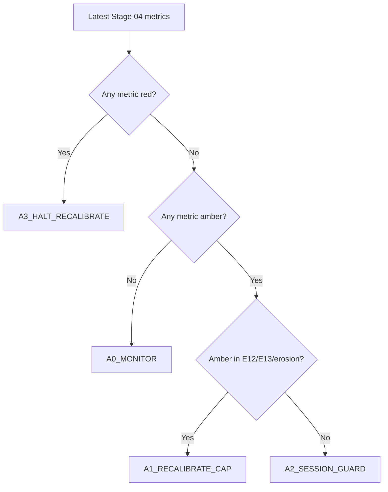

# Stage 4 - Execution Realism (Stop-Limit)

## Objective
Convert bar-level OCO outcomes to tick-aware stop-limit realism and quantify execution-driven EV erosion.

## Inputs
- Tickfill detail:
`data/analysis/tick_opportunity_mining/stop_limit_tickfill_fullcap/<SYMBOL>_stop_limit_tickfill_detail.csv`
- Cap sweep:
`data/analysis/tick_opportunity_mining/stop_limit_tickfill_fullcap/<SYMBOL>_stop_limit_tickfill_caps.csv`
- Summary:
`data/analysis/tick_opportunity_mining/stop_limit_tickfill_fullcap/summary.csv`
- Stage 04 policy output:
`data/analysis/tick_opportunity_mining/stage04_execution_policy_status.csv`
- Stage 04 session cap policy output:
`data/analysis/tick_opportunity_mining/stage04_cap_policy_by_session.csv`

## Process
- Reconstruct first-touch execution with tick-first crossing.
- Apply stop-limit cap sweep and classify execution-policy bands.
- Quantify cap robustness and overshoot/session dispersion diagnostics (`E11-E13`).
- Build causal rolling session caps before session-dispersion diagnostics.

## Exact Calculations
- session cap at event `t`: `q0.90(overshoot)` over `[t-20d, t)` with `min_periods=200`
- cap fallback chain: session cap -> global cap -> static symbol q0.90 fallback
- `overshoot_capped = min(overshoot_tick_pips, cap_applied_pips)`
- `E11_session_overshoot_dispersion = std(mean_overshoot_capped_by_session) / mean(mean_overshoot_capped_by_session)`
- `E12_cap_plateau_width_pips`:
- width of cap interval where per-signal performance >= 95% of best
- `E13_nonfill_opportunity_cost_pips`:
- `(mean_per_signal_no_extra_slip - mean_per_signal_full_overshoot) * fill_rate` at best cap
- `erosion_spread_fee_plus_slip = base_mean_gross_pips - best_cap_mean_per_signal_full_overshoot`

### Execution Contract Semantics (Stop-Limit)
- A touch event is rebuilt from candidate metadata (`bar_ticks`, `horizon`, `barrier_pips`, `side`) and bar-level first-touch logic.
- For each touch bar, the first tick crossing the barrier is found inside `[touch_open_ts, touch_close_ts]`.
- Overshoot is measured in pips from barrier to first crossing tick:
- Buy side: `overshoot = (first_tick_px - barrier_px) / pip`
- Sell side: `overshoot = (barrier_px - first_tick_px) / pip`
- Cap (`cap_pips`) means maximum allowed overshoot for fill acceptance:
- Fill if `touch_found_tick == 1` and `overshoot_tick_pips <= cap_pips`
- No fill otherwise

### Why Stop-Limit (vs Market / Passive Limit)
- Market-at-touch captures almost all triggers but pays worst overshoot tails during bursty ticks.
- Passive limit can avoid overshoot but misses momentum breaks when price does not retrace.
- Stop-limit is the controllable middle ground: trigger on break, but reject fills with excessive overshoot.

### What a Cap Is
- `cap_pips` is the maximum entry slippage tolerance after trigger.
- Smaller caps improve realized entry quality but reduce fill rate.
- Larger caps increase fill rate but admit more adverse overshoot.
- Stage 04 policy chooses and monitors this trade-off explicitly.

### Stage 04 Policy Bands and Actions
- Metrics and directions:
- `E11_session_overshoot_dispersion` lower is better
- `E12_cap_plateau_width_pips` higher is better
- `E13_nonfill_opportunity_cost_pips` lower is better
- `erosion_spread_fee_plus_slip` lower is better
- `tick_overshoot_p95_pips` lower is better
- Bands:
- `green`: within stable operating region
- `amber`: degraded but tradable with mitigation
- `red`: unsafe; halt/recalibrate before relying on results
- Action codes:
- `A0_MONITOR`: continue, no parameter change
- `A1_RECALIBRATE_CAP`: rerun cap sweep and reselect cap
- `A2_SESSION_GUARD`: add session-specific safeguards/filters
- `A3_HALT_RECALIBRATE`: pause deployment and revalidate
- `A9_DATA_GAP`: missing diagnostics; block until resolved

### Cap Recalibration Decision Tree


### Degradation Playbooks
- `A1_RECALIBRATE_CAP`:
- Recompute cap sweep on most recent month and prior train window.
- Require stable `E12` plateau and non-negative per-signal expectancy at selected cap.
- `A2_SESSION_GUARD`:
- Identify worst overshoot UTC buckets and gate/scale entries in those sessions.
- Re-check `E11` after guard.
- `A3_HALT_RECALIBRATE`:
- Stop symbol for deployment.
- Re-run Stage 03 -> Stage 08 checks after recalibration.
- `A9_DATA_GAP`:
- Do not interpret Stage 04 pass/fail.
- Regenerate missing stop-limit detail/cap artifacts and rerun docs-contract checks.

### Worked Example
- If `E12` collapses from `0.7` to `0.2` pips while `E13` rises above `0.35`, cap robustness is unstable.
- Policy outcome should escalate to `A3_HALT_RECALIBRATE` because slippage sensitivity dominates expectancy.

## Causality / Leakage Controls
- Uses realized tick path around touch events only.
- No future month leakage in execution diagnostics.

## Failure Modes
- Overshoot tail thickening in specific sessions.
- Performance dependent on razor-thin cap choice.
- Unrealistic fill assumptions causing optimistic net.

## Interpretation Guide
- Lower `E11` indicates more uniform execution quality across sessions.
- Larger `E12` indicates more robust cap choice.
- Higher `E13` indicates more opportunity loss from realistic fill behavior.

## Validation Gates
- Hard execution gates live in `E01-E10` preflight audit.
- `E11-E13` are informational hardening diagnostics.
- Stage 04 policy status (`stage04_execution_policy_status.csv`) must map every required metric to band + action.

## Canonical Analysis Reports
- `docs/analysis/oco_execution_risk_prelive_report.md`
- `docs/analysis/oco_stop_limit_tickfill_fullcap_report.md`
- `docs/analysis/oco_execution_drift_report.md`
- `docs/strategy_bible/signal_lifecycle_reference.md`
- `docs/strategy_bible/operator_runbook.md`

## Operator Decision Tree
- If any hard gate in this stage fails, block promotion and escalate using the operator runbook.
- If only warning/amber diagnostics trigger, continue with mitigation and add an owner/deadline in remediation artifacts.

## How To Run
- Run the `Reproduction Commands` in this stage exactly as listed.
- Confirm artifacts are refreshed and timestamps are current before interpreting outcomes.

## How To Interpret Outputs
- Read `Key Results` first for pass/fail posture and core health metrics.
- Use `Interpretation Notes` and `Action Trigger Summary` to map observed values to operational actions.

## What To Do If It Fails
- `critical/high`: halt deployment progression, remediate root cause, rerun stage and downstream dependent stages.
- `medium/low`: open tracked remediation with owner and ETA, monitor for recurrence in next cycle.

## Reproduction Commands
```bash
uv run python scripts/analyze_oco_stop_limit_tickfill.py \
  --symbols EURUSD,GBPUSD,USDJPY,USDCHF,AUDUSD,USDCAD
uv run python scripts/build_oco_execution_drift_report.py

uv run python scripts/build_oco_strategy_bible.py \
  --manifest configs/research/docs/oco_bible_manifest.yaml --strict false
```

## Traceability
- `scripts/analyze_oco_stop_limit_tickfill.py`
- `scripts/build_oco_execution_drift_report.py`
- `docs/analysis/oco_stop_limit_tickfill_fullcap_report.md`
- `docs/strategy_bible/generated/stage_04_snapshot.md`

## Generated Run Snapshot
<!-- GENERATED:STAGE_04:START -->
### Auto Snapshot - Stage 04

- generated_at: `2026-04-12 17:21:09 UTC`
- Execution realism is applied with tick first-cross overshoot.
- Session-aware rolling caps are built causally (20D lookback, q=0.90) before E11 dispersion is measured.
- Cap curve highlights fill-rate versus signal-level expectancy.
- E11-E13 are informational execution diagnostics: session dispersion, plateau width, and non-fill opportunity cost.
- Policy status artifact: data/analysis/tick_opportunity_mining/stage04_execution_policy_status.csv
- Session cap artifact: data/analysis/tick_opportunity_mining/stage04_cap_policy_by_session.csv

#### Key Results
| symbol   |   rows |   touch_found_rate |   base_mean_gross_pips |   tick_overshoot_mean_pips |   tick_overshoot_p95_pips |   e11_session_overshoot_dispersion |   e12_cap_plateau_width_pips |   e13_nonfill_opportunity_cost_pips |
|:---------|-------:|-------------------:|-----------------------:|---------------------------:|--------------------------:|-----------------------------------:|-----------------------------:|------------------------------------:|
| EURUSD   |  47190 |           0.992414 |                4.03178 |                   0.116783 |                       0.4 |                          0.377896  |                          1.5 |                           0.101956  |
| GBPUSD   |  47190 |           0.992414 |                4.03178 |                   0.116783 |                       0.4 |                          0.0973022 |                          1.5 |                           0.105239  |
| AUDUSD   |  47190 |           0.992414 |                4.03178 |                   0.116783 |                       0.4 |                          0.17529   |                          1.5 |                           0.062335  |
| USDJPY   |  47190 |           0.992414 |                4.03178 |                   0.116783 |                       0.4 |                          0.253072  |                          1.2 |                           0.182184  |
| USDCHF   |  47190 |           0.992414 |                4.03178 |                   0.116783 |                       0.4 |                          0.196247  |                          1.5 |                           0.0872835 |
| USDCAD   |  47190 |           0.992414 |                4.03178 |                   0.116783 |                       0.4 |                          0.305139  |                          1.5 |                           0.100596  |

#### Interpretation Notes
- Execution realism is applied with tick first-cross overshoot.
- Session-aware rolling caps are built causally (20D lookback, q=0.90) before E11 dispersion is measured.
- Cap curve highlights fill-rate versus signal-level expectancy.

#### Action Trigger Summary
| symbol   | metric_id                         | band   | severity   | action_code    | action_summary     | owner     |
|:---------|:----------------------------------|:-------|:-----------|:---------------|:-------------------|:----------|
| AUDUSD   | E11_session_overshoot_dispersion  | green  | info       | A0_MONITOR     | within policy band | execution |
| AUDUSD   | E12_cap_plateau_width_pips        | green  | info       | A0_MONITOR     | within policy band | execution |
| AUDUSD   | E13_nonfill_opportunity_cost_pips | green  | info       | A0_MONITOR     | within policy band | execution |
| EURUSD   | E11_session_overshoot_dispersion  | amber  | medium     | A2_RECALIBRATE | review and monitor | execution |
| EURUSD   | E12_cap_plateau_width_pips        | green  | info       | A0_MONITOR     | within policy band | execution |
| EURUSD   | E13_nonfill_opportunity_cost_pips | green  | info       | A0_MONITOR     | within policy band | execution |
| GBPUSD   | E11_session_overshoot_dispersion  | green  | info       | A0_MONITOR     | within policy band | execution |
| GBPUSD   | E12_cap_plateau_width_pips        | green  | info       | A0_MONITOR     | within policy band | execution |
| GBPUSD   | E13_nonfill_opportunity_cost_pips | green  | info       | A0_MONITOR     | within policy band | execution |
| USDCAD   | E11_session_overshoot_dispersion  | green  | info       | A0_MONITOR     | within policy band | execution |
| USDCAD   | E12_cap_plateau_width_pips        | green  | info       | A0_MONITOR     | within policy band | execution |
| USDCAD   | E13_nonfill_opportunity_cost_pips | green  | info       | A0_MONITOR     | within policy band | execution |

#### Details
| symbol   |   cap_pips |   fill_rate |   mean_per_signal_full_overshoot |
|:---------|-----------:|------------:|---------------------------------:|
| AUDUSD   |        0.5 |    0.952527 |                          3.52679 |
| AUDUSD   |        0.8 |    0.962625 |                          3.56055 |
| AUDUSD   |        1   |    0.9649   |                          3.57062 |
| AUDUSD   |        1.2 |    0.965766 |                          3.5713  |
| AUDUSD   |        1.5 |    0.966856 |                          3.56876 |
| AUDUSD   |        2   |    0.968362 |                          3.57071 |
| EURUSD   |        0.5 |    0.949047 |                          4.74426 |
| EURUSD   |        0.8 |    0.974144 |                          4.88585 |
| EURUSD   |        1   |    0.982937 |                          4.92456 |
| EURUSD   |        1.2 |    0.985906 |                          4.93974 |
| EURUSD   |        1.5 |    0.988884 |                          4.94022 |
| EURUSD   |        2   |    0.991311 |                          4.9654  |
| GBPUSD   |        0.5 |    0.948878 |                          5.22649 |
| GBPUSD   |        0.8 |    0.975125 |                          5.34036 |
| GBPUSD   |        1   |    0.980374 |                          5.36332 |
| GBPUSD   |        1.2 |    0.98197  |                          5.36809 |
| GBPUSD   |        1.5 |    0.984252 |                          5.37147 |
| GBPUSD   |        2   |    0.98597  |                          5.38001 |
| USDCAD   |        0.5 |    0.950371 |                          3.81987 |
| USDCAD   |        0.8 |    0.978957 |                          3.91423 |
| USDCAD   |        1   |    0.984573 |                          3.92441 |
| USDCAD   |        1.2 |    0.986353 |                          3.92683 |
| USDCAD   |        1.5 |    0.98807  |                          3.92838 |
| USDCAD   |        2   |    0.989722 |                          3.93469 |
| USDCHF   |        0.5 |    0.948855 |                          3.71552 |
| USDCHF   |        0.8 |    0.963769 |                          3.76856 |
| USDCHF   |        1   |    0.968302 |                          3.7771  |
| USDCHF   |        1.2 |    0.970586 |                          3.76939 |
| USDCHF   |        1.5 |    0.973839 |                          3.77651 |
| USDCHF   |        2   |    0.975638 |                          3.78576 |
| USDJPY   |        0.5 |    0.91941  |                          7.00961 |
| USDJPY   |        0.8 |    0.96296  |                          7.29186 |
| USDJPY   |        1   |    0.975612 |                          7.38236 |
| USDJPY   |        1.2 |    0.979529 |                          7.40487 |
| USDJPY   |        1.5 |    0.985259 |                          7.45304 |
| USDJPY   |        2   |    0.988984 |                          7.46228 |

#### Plots


#### Policy Status
| symbol   |   metrics_total |   green_metric_count |   amber_metric_count |   red_metric_count | worst_band   | recommended_action_code   | recommended_action_summary                                       | red_metrics   | amber_metrics                |
|:---------|----------------:|---------------------:|---------------------:|-------------------:|:-------------|:--------------------------|:-----------------------------------------------------------------|:--------------|:-----------------------------|
| AUDUSD   |               5 |                    4 |                    1 |                  0 | amber        | A1_RECALIBRATE_CAP        | execution erosion elevated; recalibrate cap/slippage assumptions |               | erosion_spread_fee_plus_slip |
| EURUSD   |               5 |                    5 |                    0 |                  0 | green        | A0_MONITOR                | within execution policy limits; monitor only                     |               |                              |
| GBPUSD   |               5 |                    5 |                    0 |                  0 | green        | A0_MONITOR                | within execution policy limits; monitor only                     |               |                              |
| USDCAD   |               5 |                    5 |                    0 |                  0 | green        | A0_MONITOR                | within execution policy limits; monitor only                     |               |                              |
| USDCHF   |               5 |                    5 |                    0 |                  0 | green        | A0_MONITOR                | within execution policy limits; monitor only                     |               |                              |
| USDJPY   |               5 |                    5 |                    0 |                  0 | green        | A0_MONITOR                | within execution policy limits; monitor only                     |               |                              |

- policy_csv: `data/analysis/tick_opportunity_mining/stage04_execution_policy_status.csv`

#### Policy Metric Mapping (Detail)
| symbol   | metric_id                         |   metric_value | band   | action_code        | green_threshold   | amber_threshold   |
|:---------|:----------------------------------|---------------:|:-------|:-------------------|:------------------|:------------------|
| EURUSD   | E11_session_overshoot_dispersion  |      0.377896  | green  | A0_MONITOR         | <= 1.0000         | <= 1.3000         |
| EURUSD   | E12_cap_plateau_width_pips        |      1.5       | green  | A0_MONITOR         | >= 0.5000         | >= 0.3000         |
| EURUSD   | E13_nonfill_opportunity_cost_pips |      0.101956  | green  | A0_MONITOR         | <= 0.2000         | <= 0.3500         |
| EURUSD   | erosion_spread_fee_plus_slip      |     -0.933617  | green  | A0_MONITOR         | <= 0.3000         | <= 0.5000         |
| EURUSD   | tick_overshoot_p95_pips           |      0.4       | green  | A0_MONITOR         | <= 0.7000         | <= 1.0000         |
| GBPUSD   | E11_session_overshoot_dispersion  |      0.0973022 | green  | A0_MONITOR         | <= 1.0000         | <= 1.3000         |
| GBPUSD   | E12_cap_plateau_width_pips        |      1.5       | green  | A0_MONITOR         | >= 0.5000         | >= 0.3000         |
| GBPUSD   | E13_nonfill_opportunity_cost_pips |      0.105239  | green  | A0_MONITOR         | <= 0.2000         | <= 0.3500         |
| GBPUSD   | erosion_spread_fee_plus_slip      |     -1.34823   | green  | A0_MONITOR         | <= 0.3000         | <= 0.5000         |
| GBPUSD   | tick_overshoot_p95_pips           |      0.4       | green  | A0_MONITOR         | <= 0.7000         | <= 1.0000         |
| AUDUSD   | E11_session_overshoot_dispersion  |      0.17529   | green  | A0_MONITOR         | <= 1.0000         | <= 1.3000         |
| AUDUSD   | E12_cap_plateau_width_pips        |      1.5       | green  | A0_MONITOR         | >= 0.5000         | >= 0.3000         |
| AUDUSD   | E13_nonfill_opportunity_cost_pips |      0.062335  | green  | A0_MONITOR         | <= 0.2000         | <= 0.3500         |
| AUDUSD   | erosion_spread_fee_plus_slip      |      0.46048   | amber  | A1_RECALIBRATE_CAP | <= 0.3000         | <= 0.5000         |
| AUDUSD   | tick_overshoot_p95_pips           |      0.4       | green  | A0_MONITOR         | <= 0.7000         | <= 1.0000         |
| USDJPY   | E11_session_overshoot_dispersion  |      0.253072  | green  | A0_MONITOR         | <= 1.0000         | <= 1.3000         |
| USDJPY   | E12_cap_plateau_width_pips        |      1.2       | green  | A0_MONITOR         | >= 0.5000         | >= 0.3000         |
| USDJPY   | E13_nonfill_opportunity_cost_pips |      0.182184  | green  | A0_MONITOR         | <= 0.2000         | <= 0.3500         |
| USDJPY   | erosion_spread_fee_plus_slip      |     -3.4305    | green  | A0_MONITOR         | <= 0.3000         | <= 0.5000         |
| USDJPY   | tick_overshoot_p95_pips           |      0.4       | green  | A0_MONITOR         | <= 0.7000         | <= 1.0000         |
| USDCHF   | E11_session_overshoot_dispersion  |      0.196247  | green  | A0_MONITOR         | <= 1.0000         | <= 1.3000         |
| USDCHF   | E12_cap_plateau_width_pips        |      1.5       | green  | A0_MONITOR         | >= 0.5000         | >= 0.3000         |
| USDCHF   | E13_nonfill_opportunity_cost_pips |      0.0872835 | green  | A0_MONITOR         | <= 0.2000         | <= 0.3500         |
| USDCHF   | erosion_spread_fee_plus_slip      |      0.246025  | green  | A0_MONITOR         | <= 0.3000         | <= 0.5000         |
| USDCHF   | tick_overshoot_p95_pips           |      0.4       | green  | A0_MONITOR         | <= 0.7000         | <= 1.0000         |
| USDCAD   | E11_session_overshoot_dispersion  |      0.305139  | green  | A0_MONITOR         | <= 1.0000         | <= 1.3000         |
| USDCAD   | E12_cap_plateau_width_pips        |      1.5       | green  | A0_MONITOR         | >= 0.5000         | >= 0.3000         |
| USDCAD   | E13_nonfill_opportunity_cost_pips |      0.100596  | green  | A0_MONITOR         | <= 0.2000         | <= 0.3500         |
| USDCAD   | erosion_spread_fee_plus_slip      |      0.0970905 | green  | A0_MONITOR         | <= 0.3000         | <= 0.5000         |
| USDCAD   | tick_overshoot_p95_pips           |      0.4       | green  | A0_MONITOR         | <= 0.7000         | <= 1.0000         |

#### Session Rolling Cap Policy
| symbol   | session_bucket   |   lookback_days |   cap_quantile |   cap_pips |   rows_used |   session_cap_rows |   global_cap_rows |   fallback_rows |
|:---------|:-----------------|----------------:|---------------:|-----------:|------------:|-------------------:|------------------:|----------------:|
| EURUSD   | ASIA             |              20 |            0.9 |       0.2  |       25597 |              25397 |               128 |              72 |
| EURUSD   | LATE             |              20 |            0.9 |       0.2  |        4121 |               2450 |              1671 |               0 |
| EURUSD   | LONDON           |              20 |            0.9 |       0.4  |       29655 |              29455 |                72 |             128 |
| EURUSD   | NY               |              20 |            0.9 |       0.2  |       54462 |              54262 |               200 |               0 |
| GBPUSD   | ASIA             |              20 |            0.9 |       0.3  |       30600 |              30400 |               162 |              38 |
| GBPUSD   | LATE             |              20 |            0.9 |       0.3  |        2289 |                692 |              1597 |               0 |
| GBPUSD   | LONDON           |              20 |            0.9 |       0.3  |       40655 |              40455 |               121 |              79 |
| GBPUSD   | NY               |              20 |            0.9 |       0.3  |       63356 |              63156 |               117 |              83 |
| AUDUSD   | ASIA             |              20 |            0.9 |       0.2  |       10886 |              10383 |               454 |              49 |
| AUDUSD   | LATE             |              20 |            0.9 |       0.3  |        1584 |                214 |              1362 |               8 |
| AUDUSD   | LONDON           |              20 |            0.9 |       0.5  |        6025 |               4272 |              1708 |              45 |
| AUDUSD   | NY               |              20 |            0.9 |       0.2  |       11910 |              11368 |               444 |              98 |
| USDJPY   | ASIA             |              20 |            0.9 |       0.4  |       98929 |              98729 |               128 |              72 |
| USDJPY   | LATE             |              20 |            0.9 |       0.4  |       15895 |              15695 |               124 |              76 |
| USDJPY   | LONDON           |              20 |            0.9 |       0.5  |       55833 |              55633 |               148 |              52 |
| USDJPY   | NY               |              20 |            0.9 |       0.4  |       76045 |              75845 |               200 |               0 |
| USDCHF   | ASIA             |              20 |            0.9 |       0.2  |        7196 |               5586 |              1590 |              20 |
| USDCHF   | LATE             |              20 |            0.9 |       0.2  |         717 |                  0 |               717 |               0 |
| USDCHF   | LONDON           |              20 |            0.9 |       0.27 |        8886 |               8104 |               707 |              75 |
| USDCHF   | NY               |              20 |            0.9 |       0.2  |       11455 |              10853 |               497 |             105 |
| USDCAD   | ASIA             |              20 |            0.9 |       0.2  |        7821 |               6463 |              1311 |              47 |
| USDCAD   | LATE             |              20 |            0.9 |       0.2  |        1214 |                115 |              1090 |               9 |
| USDCAD   | LONDON           |              20 |            0.9 |       0.2  |       10919 |              10164 |               686 |              69 |
| USDCAD   | NY               |              20 |            0.9 |       0.2  |       26819 |              26619 |               125 |              75 |
<!-- GENERATED:STAGE_04:END -->
