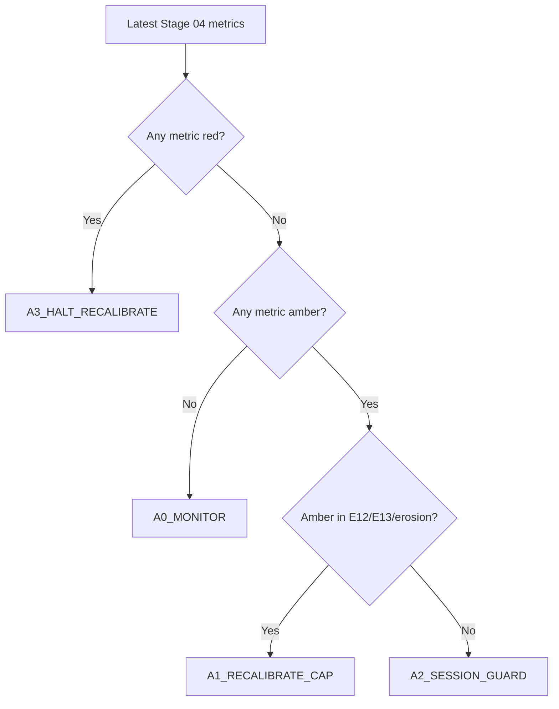
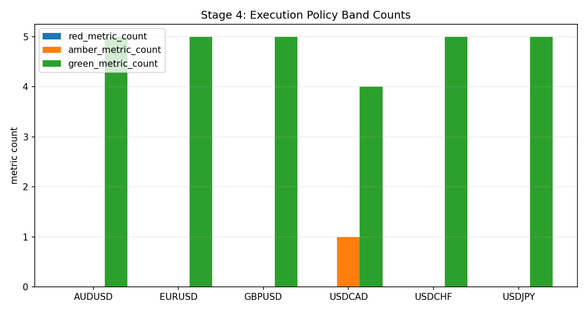

# Stage 4 - Execution Realism (Stop-Limit)

## Objective
Convert bar-level OCO outcomes to tick-aware stop-limit realism and quantify execution-driven EV erosion.

## Inputs
- Tickfill detail:
`data/analysis/tick_opportunity_mining/stop_limit_tickfill_fullcap/<SYMBOL>_stop_limit_tickfill_detail.csv`
- Cap sweep:
`data/analysis/tick_opportunity_mining/stop_limit_tickfill_fullcap/<SYMBOL>_stop_limit_tickfill_caps.csv`
- Summary:
`data/analysis/tick_opportunity_mining/stop_limit_tickfill_fullcap/summary.csv`
- Stage 04 policy output:
`data/analysis/tick_opportunity_mining/stage04_execution_policy_status.csv`
- Stage 04 session cap policy output:
`data/analysis/tick_opportunity_mining/stage04_cap_policy_by_session.csv`

## Process
- Reconstruct first-touch execution with tick-first crossing.
- Apply stop-limit cap sweep and classify execution-policy bands.
- Quantify cap robustness and overshoot/session dispersion diagnostics (`E11-E13`).
- Build causal rolling session caps before session-dispersion diagnostics.

## Exact Calculations
- session cap at event `t`: `q0.90(overshoot)` over `[t-20d, t)` with `min_periods=200`
- cap fallback chain: session cap -> global cap -> static symbol q0.90 fallback
- `overshoot_capped = min(overshoot_tick_pips, cap_applied_pips)`
- `E11_session_overshoot_dispersion = std(mean_overshoot_capped_by_session) / mean(mean_overshoot_capped_by_session)`
- `E12_cap_plateau_width_pips`:
- width of cap interval where per-signal performance >= 95% of best
- `E13_nonfill_opportunity_cost_pips`:
- `(mean_per_signal_no_extra_slip - mean_per_signal_full_overshoot) * fill_rate` at best cap
- `erosion_spread_fee_plus_slip = base_mean_gross_pips - best_cap_mean_per_signal_full_overshoot`

### Execution Contract Semantics (Stop-Limit)
- A touch event is rebuilt from candidate metadata (`bar_ticks`, `horizon`, `barrier_pips`, `side`) and bar-level first-touch logic.
- For each touch bar, the first tick crossing the barrier is found inside `[touch_open_ts, touch_close_ts]`.
- Overshoot is measured in pips from barrier to first crossing tick:
- Buy side: `overshoot = (first_tick_px - barrier_px) / pip`
- Sell side: `overshoot = (barrier_px - first_tick_px) / pip`
- Cap (`cap_pips`) means maximum allowed overshoot for fill acceptance:
- Fill if `touch_found_tick == 1` and `overshoot_tick_pips <= cap_pips`
- No fill otherwise

### Why Stop-Limit (vs Market / Passive Limit)
- Market-at-touch captures almost all triggers but pays worst overshoot tails during bursty ticks.
- Passive limit can avoid overshoot but misses momentum breaks when price does not retrace.
- Stop-limit is the controllable middle ground: trigger on break, but reject fills with excessive overshoot.

### What a Cap Is
- `cap_pips` is the maximum entry slippage tolerance after trigger.
- Smaller caps improve realized entry quality but reduce fill rate.
- Larger caps increase fill rate but admit more adverse overshoot.
- Stage 04 policy chooses and monitors this trade-off explicitly.

### Stage 04 Policy Bands and Actions
- Metrics and directions:
- `E11_session_overshoot_dispersion` lower is better
- `E12_cap_plateau_width_pips` higher is better
- `E13_nonfill_opportunity_cost_pips` lower is better
- `erosion_spread_fee_plus_slip` lower is better
- `tick_overshoot_p95_pips` lower is better
- Bands:
- `green`: within stable operating region
- `amber`: degraded but tradable with mitigation
- `red`: unsafe; halt/recalibrate before relying on results
- Action codes:
- `A0_MONITOR`: continue, no parameter change
- `A1_RECALIBRATE_CAP`: rerun cap sweep and reselect cap
- `A2_SESSION_GUARD`: add session-specific safeguards/filters
- `A3_HALT_RECALIBRATE`: pause deployment and revalidate
- `A9_DATA_GAP`: missing diagnostics; block until resolved

### Cap Recalibration Decision Tree


### Degradation Playbooks
- `A1_RECALIBRATE_CAP`:
- Recompute cap sweep on most recent month and prior train window.
- Require stable `E12` plateau and non-negative per-signal expectancy at selected cap.
- `A2_SESSION_GUARD`:
- Identify worst overshoot UTC buckets and gate/scale entries in those sessions.
- Re-check `E11` after guard.
- `A3_HALT_RECALIBRATE`:
- Stop symbol for deployment.
- Re-run Stage 03 -> Stage 08 checks after recalibration.
- `A9_DATA_GAP`:
- Do not interpret Stage 04 pass/fail.
- Regenerate missing stop-limit detail/cap artifacts and rerun docs-contract checks.

### Worked Example
- If `E12` collapses from `0.7` to `0.2` pips while `E13` rises above `0.35`, cap robustness is unstable.
- Policy outcome should escalate to `A3_HALT_RECALIBRATE` because slippage sensitivity dominates expectancy.

## Causality / Leakage Controls
- Uses realized tick path around touch events only.
- No future month leakage in execution diagnostics.

## Failure Modes
- Overshoot tail thickening in specific sessions.
- Performance dependent on razor-thin cap choice.
- Unrealistic fill assumptions causing optimistic net.

## Interpretation Guide
- Lower `E11` indicates more uniform execution quality across sessions.
- Larger `E12` indicates more robust cap choice.
- Higher `E13` indicates more opportunity loss from realistic fill behavior.

## Validation Gates
- Hard execution gates live in `E01-E10` preflight audit.
- `E11-E13` are informational hardening diagnostics.
- Stage 04 policy status (`stage04_execution_policy_status.csv`) must map every required metric to band + action.

## Canonical Analysis Reports
- `docs/analysis/oco_execution_risk_prelive_report.md`
- `docs/analysis/oco_stop_limit_tickfill_fullcap_report.md`
- `docs/analysis/oco_execution_drift_report.md`
- `docs/strategy_bible/signal_lifecycle_reference.md`
- `docs/strategy_bible/operator_runbook.md`

## Operator Decision Tree
- If any hard gate in this stage fails, block promotion and escalate using the operator runbook.
- If only warning/amber diagnostics trigger, continue with mitigation and add an owner/deadline in remediation artifacts.

## How To Run
- Run the `Reproduction Commands` in this stage exactly as listed.
- Confirm artifacts are refreshed and timestamps are current before interpreting outcomes.

## How To Interpret Outputs
- Read `Key Results` first for pass/fail posture and core health metrics.
- Use `Interpretation Notes` and `Action Trigger Summary` to map observed values to operational actions.

## What To Do If It Fails
- `critical/high`: halt deployment progression, remediate root cause, rerun stage and downstream dependent stages.
- `medium/low`: open tracked remediation with owner and ETA, monitor for recurrence in next cycle.

## Reproduction Commands
```bash
uv run python scripts/analyze_oco_stop_limit_tickfill.py \
  --symbols EURUSD,GBPUSD,USDJPY,USDCHF
uv run python scripts/build_oco_execution_drift_report.py

uv run python scripts/build_oco_strategy_bible.py \
  --manifest configs/research/docs/oco_bible_manifest.yaml --strict false
```

## Traceability
- `scripts/analyze_oco_stop_limit_tickfill.py`
- `scripts/build_oco_execution_drift_report.py`
- `docs/analysis/oco_stop_limit_tickfill_fullcap_report.md`
- `docs/strategy_bible/generated/stage_04_snapshot.md`

## Generated Run Snapshot
<!-- GENERATED:STAGE_04:START -->
### Auto Snapshot - Stage 04

- generated_at: `2026-03-04 19:24:58 UTC`
- Execution realism is applied with tick first-cross overshoot.
- Session-aware rolling caps are built causally (20D lookback, q=0.90) before E11 dispersion is measured.
- Cap curve highlights fill-rate versus signal-level expectancy.
- E11-E13 are informational execution diagnostics: session dispersion, plateau width, and non-fill opportunity cost.
- Policy status artifact: data/analysis/tick_opportunity_mining/stage04_execution_policy_status.csv
- Session cap artifact: data/analysis/tick_opportunity_mining/stage04_cap_policy_by_session.csv

#### Key Results
| symbol   |   rows |   touch_found_rate |   base_mean_gross_pips |   tick_overshoot_mean_pips |   tick_overshoot_p95_pips |   e11_session_overshoot_dispersion |   e12_cap_plateau_width_pips |   e13_nonfill_opportunity_cost_pips |
|:---------|-------:|-------------------:|-----------------------:|---------------------------:|--------------------------:|-----------------------------------:|-----------------------------:|------------------------------------:|
| EURUSD   | 430032 |           0.999821 |               1.42876  |                   0.144764 |                      0.5  |                           0.202143 |                          1.2 |                           0.121883  |
| GBPUSD   | 392129 |           0.99999  |               1.02502  |                   0.143574 |                      0.5  |                           0.278869 |                          1.2 |                           0.119252  |
| AUDUSD   | 444263 |           0.989605 |               0.667691 |                   0.118081 |                      0.4  |                           0.288899 |                          1.2 |                           0.0933759 |
| USDJPY   | 459073 |           0.999956 |               1.36299  |                   0.219538 |                      0.7  |                           0.136441 |                          1.2 |                           0.190838  |
| USDCHF   | 370769 |           0.99576  |               0.939665 |                   0.182206 |                      0.52 |                           0.976806 |                          1.2 |                           0.110524  |
| USDCAD   | 379629 |           0.996657 |               0.824065 |                   0.188771 |                      0.7  |                           0.356605 |                          1   |                           0.145914  |

#### Interpretation Notes
- Execution realism is applied with tick first-cross overshoot.
- Session-aware rolling caps are built causally (20D lookback, q=0.90) before E11 dispersion is measured.
- Cap curve highlights fill-rate versus signal-level expectancy.

#### Action Trigger Summary
| symbol   | metric_id                         | band   | severity   | action_code           | action_summary         | owner     |
|:---------|:----------------------------------|:-------|:-----------|:----------------------|:-----------------------|:----------|
| AUDUSD   | E11_session_overshoot_dispersion  | red    | high       | A3_HALT_AND_REMEDIATE | escalate and remediate | execution |
| AUDUSD   | E12_cap_plateau_width_pips        | green  | info       | A0_MONITOR            | within policy band     | execution |
| AUDUSD   | E13_nonfill_opportunity_cost_pips | green  | info       | A0_MONITOR            | within policy band     | execution |
| EURUSD   | E11_session_overshoot_dispersion  | green  | info       | A0_MONITOR            | within policy band     | execution |
| EURUSD   | E12_cap_plateau_width_pips        | green  | info       | A0_MONITOR            | within policy band     | execution |
| EURUSD   | E13_nonfill_opportunity_cost_pips | green  | info       | A0_MONITOR            | within policy band     | execution |
| GBPUSD   | E11_session_overshoot_dispersion  | red    | high       | A3_HALT_AND_REMEDIATE | escalate and remediate | execution |
| GBPUSD   | E12_cap_plateau_width_pips        | green  | info       | A0_MONITOR            | within policy band     | execution |
| GBPUSD   | E13_nonfill_opportunity_cost_pips | green  | info       | A0_MONITOR            | within policy band     | execution |
| USDCAD   | E11_session_overshoot_dispersion  | red    | high       | A3_HALT_AND_REMEDIATE | escalate and remediate | execution |
| USDCAD   | E12_cap_plateau_width_pips        | green  | info       | A0_MONITOR            | within policy band     | execution |
| USDCAD   | E13_nonfill_opportunity_cost_pips | green  | info       | A0_MONITOR            | within policy band     | execution |

#### Details
| symbol   |   cap_pips |   fill_rate |   mean_per_signal_full_overshoot |
|:---------|-----------:|------------:|---------------------------------:|
| AUDUSD   |        0.5 |    0.95624  |                         0.518406 |
| AUDUSD   |        0.8 |    0.97411  |                         0.531925 |
| AUDUSD   |        1   |    0.979224 |                         0.540876 |
| AUDUSD   |        1.2 |    0.981119 |                         0.546253 |
| AUDUSD   |        1.5 |    0.984147 |                         0.547482 |
| AUDUSD   |        2   |    0.986348 |                         0.549962 |
| EURUSD   |        0.5 |    0.939663 |                         1.15874  |
| EURUSD   |        0.8 |    0.972793 |                         1.21456  |
| EURUSD   |        1   |    0.983799 |                         1.22979  |
| EURUSD   |        1.2 |    0.987792 |                         1.24333  |
| EURUSD   |        1.5 |    0.992115 |                         1.26369  |
| EURUSD   |        2   |    0.995712 |                         1.26526  |
| GBPUSD   |        0.5 |    0.947971 |                         0.836742 |
| GBPUSD   |        0.8 |    0.980369 |                         0.863707 |
| GBPUSD   |        1   |    0.988455 |                         0.879063 |
| GBPUSD   |        1.2 |    0.990569 |                         0.880922 |
| GBPUSD   |        1.5 |    0.993143 |                         0.884192 |
| GBPUSD   |        2   |    0.995389 |                         0.882237 |
| USDCAD   |        0.5 |    0.911392 |                         0.562624 |
| USDCAD   |        0.8 |    0.957993 |                         0.600578 |
| USDCAD   |        1   |    0.971833 |                         0.609734 |
| USDCAD   |        1.2 |    0.976485 |                         0.618088 |
| USDCAD   |        1.5 |    0.982083 |                         0.632659 |
| USDCAD   |        2   |    0.988128 |                         0.638021 |
| USDCHF   |        0.5 |    0.941524 |                         0.713679 |
| USDCHF   |        0.8 |    0.964412 |                         0.745307 |
| USDCHF   |        1   |    0.97072  |                         0.747465 |
| USDCHF   |        1.2 |    0.97366  |                         0.751208 |
| USDCHF   |        1.5 |    0.978847 |                         0.76447  |
| USDCHF   |        2   |    0.982725 |                         0.767479 |
| USDJPY   |        0.5 |    0.920052 |                         1.04681  |
| USDJPY   |        0.8 |    0.964269 |                         1.09684  |
| USDJPY   |        1   |    0.979043 |                         1.11966  |
| USDJPY   |        1.2 |    0.983558 |                         1.12492  |
| USDJPY   |        1.5 |    0.990274 |                         1.14272  |
| USDJPY   |        2   |    0.993999 |                         1.15058  |

#### Plots



#### Execution Risk Pre-Live
| symbol   |   checks_total |   checks_failed |   high_critical_failed |   e02_min_month_fill_rate |   e03_tail_above_cap |   e10_lb95_month_signal_net |
|:---------|---------------:|----------------:|-----------------------:|--------------------------:|---------------------:|----------------------------:|
| EURUSD   |             10 |               1 |                      0 |                  0.981402 |           0.0120315  |                    0.984822 |
| GBPUSD   |             10 |               0 |                      0 |                  0.984229 |           0.00942047 |                    0.787091 |
| AUDUSD   |             10 |               0 |                      0 |                  0.971047 |           0.0085751  |                    0.204919 |
| USDJPY   |             10 |               0 |                      0 |                  0.972786 |           0.016399   |                    0.952701 |
| USDCHF   |             10 |               0 |                      0 |                  0.940946 |           0.0221941  |                    0.304502 |
| USDCAD   |             10 |               0 |                      0 |                  0.970947 |           0.02024    |                    0.39901  |

#### Policy Status
| symbol   |   metrics_total |   green_metric_count |   amber_metric_count |   red_metric_count | worst_band   | recommended_action_code   | recommended_action_summary                               | red_metrics   | amber_metrics           |
|:---------|----------------:|---------------------:|---------------------:|-------------------:|:-------------|:--------------------------|:---------------------------------------------------------|:--------------|:------------------------|
| AUDUSD   |               5 |                    5 |                    0 |                  0 | green        | A0_MONITOR                | within execution policy limits; monitor only             |               |                         |
| EURUSD   |               5 |                    5 |                    0 |                  0 | green        | A0_MONITOR                | within execution policy limits; monitor only             |               |                         |
| GBPUSD   |               5 |                    5 |                    0 |                  0 | green        | A0_MONITOR                | within execution policy limits; monitor only             |               |                         |
| USDCAD   |               5 |                    4 |                    1 |                  0 | amber        | A2_SESSION_GUARD          | overshoot tail elevated; apply session guard and monitor |               | tick_overshoot_p95_pips |
| USDCHF   |               5 |                    5 |                    0 |                  0 | green        | A0_MONITOR                | within execution policy limits; monitor only             |               |                         |
| USDJPY   |               5 |                    5 |                    0 |                  0 | green        | A0_MONITOR                | within execution policy limits; monitor only             |               |                         |

- policy_csv: `data/analysis/tick_opportunity_mining/stage04_execution_policy_status.csv`

#### Policy Metric Mapping (Detail)
| symbol   | metric_id                         |   metric_value | band   | action_code      | green_threshold   | amber_threshold   |
|:---------|:----------------------------------|---------------:|:-------|:-----------------|:------------------|:------------------|
| EURUSD   | E11_session_overshoot_dispersion  |      0.202143  | green  | A0_MONITOR       | <= 1.0000         | <= 1.3000         |
| EURUSD   | E12_cap_plateau_width_pips        |      1.2       | green  | A0_MONITOR       | >= 0.5000         | >= 0.3000         |
| EURUSD   | E13_nonfill_opportunity_cost_pips |      0.121883  | green  | A0_MONITOR       | <= 0.2000         | <= 0.3500         |
| EURUSD   | erosion_spread_fee_plus_slip      |      0.163503  | green  | A0_MONITOR       | <= 0.3000         | <= 0.5000         |
| EURUSD   | tick_overshoot_p95_pips           |      0.5       | green  | A0_MONITOR       | <= 0.7000         | <= 1.0000         |
| GBPUSD   | E11_session_overshoot_dispersion  |      0.278869  | green  | A0_MONITOR       | <= 1.0000         | <= 1.3000         |
| GBPUSD   | E12_cap_plateau_width_pips        |      1.2       | green  | A0_MONITOR       | >= 0.5000         | >= 0.3000         |
| GBPUSD   | E13_nonfill_opportunity_cost_pips |      0.119252  | green  | A0_MONITOR       | <= 0.2000         | <= 0.3500         |
| GBPUSD   | erosion_spread_fee_plus_slip      |      0.140823  | green  | A0_MONITOR       | <= 0.3000         | <= 0.5000         |
| GBPUSD   | tick_overshoot_p95_pips           |      0.5       | green  | A0_MONITOR       | <= 0.7000         | <= 1.0000         |
| AUDUSD   | E11_session_overshoot_dispersion  |      0.288899  | green  | A0_MONITOR       | <= 1.0000         | <= 1.3000         |
| AUDUSD   | E12_cap_plateau_width_pips        |      1.2       | green  | A0_MONITOR       | >= 0.5000         | >= 0.3000         |
| AUDUSD   | E13_nonfill_opportunity_cost_pips |      0.0933759 | green  | A0_MONITOR       | <= 0.2000         | <= 0.3500         |
| AUDUSD   | erosion_spread_fee_plus_slip      |      0.117729  | green  | A0_MONITOR       | <= 0.3000         | <= 0.5000         |
| AUDUSD   | tick_overshoot_p95_pips           |      0.4       | green  | A0_MONITOR       | <= 0.7000         | <= 1.0000         |
| USDJPY   | E11_session_overshoot_dispersion  |      0.136441  | green  | A0_MONITOR       | <= 1.0000         | <= 1.3000         |
| USDJPY   | E12_cap_plateau_width_pips        |      1.2       | green  | A0_MONITOR       | >= 0.5000         | >= 0.3000         |
| USDJPY   | E13_nonfill_opportunity_cost_pips |      0.190838  | green  | A0_MONITOR       | <= 0.2000         | <= 0.3500         |
| USDJPY   | erosion_spread_fee_plus_slip      |      0.212412  | green  | A0_MONITOR       | <= 0.3000         | <= 0.5000         |
| USDJPY   | tick_overshoot_p95_pips           |      0.7       | green  | A0_MONITOR       | <= 0.7000         | <= 1.0000         |
| USDCHF   | E11_session_overshoot_dispersion  |      0.976806  | green  | A0_MONITOR       | <= 1.0000         | <= 1.3000         |
| USDCHF   | E12_cap_plateau_width_pips        |      1.2       | green  | A0_MONITOR       | >= 0.5000         | >= 0.3000         |
| USDCHF   | E13_nonfill_opportunity_cost_pips |      0.110524  | green  | A0_MONITOR       | <= 0.2000         | <= 0.3500         |
| USDCHF   | erosion_spread_fee_plus_slip      |      0.172186  | green  | A0_MONITOR       | <= 0.3000         | <= 0.5000         |
| USDCHF   | tick_overshoot_p95_pips           |      0.52      | green  | A0_MONITOR       | <= 0.7000         | <= 1.0000         |
| USDCAD   | E11_session_overshoot_dispersion  |      0.356605  | green  | A0_MONITOR       | <= 1.0000         | <= 1.3000         |
| USDCAD   | E12_cap_plateau_width_pips        |      1         | green  | A0_MONITOR       | >= 0.5000         | >= 0.3000         |
| USDCAD   | E13_nonfill_opportunity_cost_pips |      0.145914  | green  | A0_MONITOR       | <= 0.2000         | <= 0.3500         |
| USDCAD   | erosion_spread_fee_plus_slip      |      0.186044  | green  | A0_MONITOR       | <= 0.3000         | <= 0.5000         |
| USDCAD   | tick_overshoot_p95_pips           |      0.7       | amber  | A2_SESSION_GUARD | <= 0.7000         | <= 1.0000         |

#### Session Rolling Cap Policy
| symbol   | session_bucket   |   lookback_days |   cap_quantile |   cap_pips |   rows_used |   session_cap_rows |   global_cap_rows |   fallback_rows |
|:---------|:-----------------|----------------:|---------------:|-----------:|------------:|-------------------:|------------------:|----------------:|
| EURUSD   | ASIA             |              20 |            0.9 |       0.2  |      128713 |             128513 |                72 |             128 |
| EURUSD   | LATE             |              20 |            0.9 |       0.2  |       15033 |              14133 |               900 |               0 |
| EURUSD   | LONDON           |              20 |            0.9 |       0.3  |      165311 |             165111 |               200 |               0 |
| EURUSD   | NY               |              20 |            0.9 |       0.7  |      120485 |             120285 |               128 |              72 |
| GBPUSD   | ASIA             |              20 |            0.9 |       0.3  |      161014 |             160814 |                 6 |             194 |
| GBPUSD   | LATE             |              20 |            0.9 |       0.4  |        5804 |               4883 |               921 |               0 |
| GBPUSD   | LONDON           |              20 |            0.9 |       0.3  |      164544 |             164344 |               200 |               0 |
| GBPUSD   | NY               |              20 |            0.9 |       0.4  |       60439 |              60239 |               200 |               0 |
| AUDUSD   | ASIA             |              20 |            0.9 |       0.2  |      125519 |             125319 |                 8 |             192 |
| AUDUSD   | LATE             |              20 |            0.9 |       0.1  |       29760 |              29560 |               200 |               0 |
| AUDUSD   | LONDON           |              20 |            0.9 |       0.2  |      153982 |             153782 |               200 |               0 |
| AUDUSD   | NY               |              20 |            0.9 |       0.4  |      130074 |             129874 |               200 |               0 |
| USDJPY   | ASIA             |              20 |            0.9 |       0.4  |      194490 |             194290 |                 0 |             200 |
| USDJPY   | LATE             |              20 |            0.9 |       0.5  |       23571 |              23371 |               200 |               0 |
| USDJPY   | LONDON           |              20 |            0.9 |       0.4  |      120207 |             120007 |               200 |               0 |
| USDJPY   | NY               |              20 |            0.9 |       0.6  |      120421 |             120221 |               200 |               0 |
| USDCHF   | ASIA             |              20 |            0.9 |       0.2  |      170015 |             169815 |                 1 |             199 |
| USDCHF   | LATE             |              20 |            0.9 |       0.2  |        4857 |               4055 |               802 |               0 |
| USDCHF   | LONDON           |              20 |            0.9 |       0.2  |      150730 |             150530 |               200 |               0 |
| USDCHF   | NY               |              20 |            0.9 |       2.33 |       43283 |              43083 |               200 |               0 |
| USDCAD   | ASIA             |              20 |            0.9 |       0.2  |       63540 |              63340 |                62 |             138 |
| USDCAD   | LATE             |              20 |            0.9 |       0.3  |        5710 |               4982 |               728 |               0 |
| USDCAD   | LONDON           |              20 |            0.9 |       0.2  |      179333 |             179133 |               138 |              62 |
| USDCAD   | NY               |              20 |            0.9 |       0.5  |      129597 |             129397 |               200 |               0 |
<!-- GENERATED:STAGE_04:END -->
