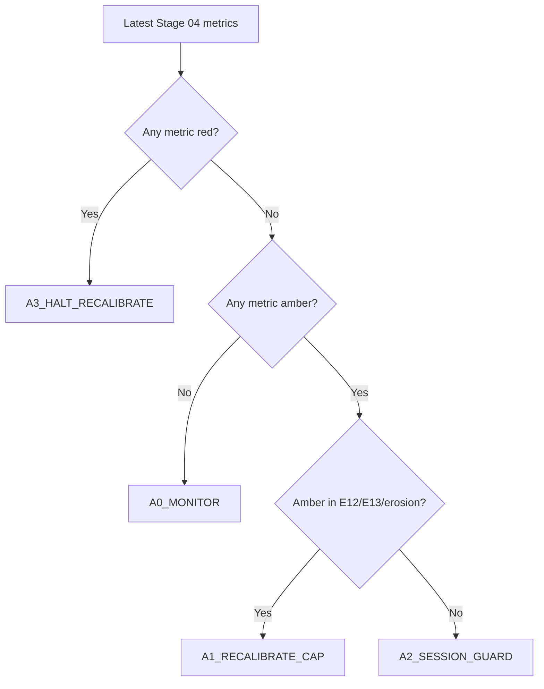

# Stage 4 - Execution Realism (Stop-Limit)

## Objective
Convert bar-level OCO outcomes to tick-aware stop-limit realism and quantify execution-driven EV erosion.

## Inputs
- Tickfill detail:
`data/analysis/tick_opportunity_mining/stop_limit_tickfill_fullcap/<SYMBOL>_stop_limit_tickfill_detail.csv`
- Cap sweep:
`data/analysis/tick_opportunity_mining/stop_limit_tickfill_fullcap/<SYMBOL>_stop_limit_tickfill_caps.csv`
- Summary:
`data/analysis/tick_opportunity_mining/stop_limit_tickfill_fullcap/summary.csv`
- Stage 04 policy output:
`data/analysis/tick_opportunity_mining/stage04_execution_policy_status.csv`

## Process
- Reconstruct first-touch execution with tick-first crossing.
- Apply stop-limit cap sweep and classify execution-policy bands.
- Quantify cap robustness and overshoot/session dispersion diagnostics (`E11-E13`).

## Exact Calculations
- `E11_session_overshoot_dispersion = std(mean_overshoot_by_hour) / mean(mean_overshoot_by_hour)`
- `E12_cap_plateau_width_pips`:
- width of cap interval where per-signal performance >= 95% of best
- `E13_nonfill_opportunity_cost_pips`:
- `(mean_per_signal_no_extra_slip - mean_per_signal_full_overshoot) * fill_rate` at best cap
- `erosion_spread_fee_plus_slip = base_mean_gross_pips - best_cap_mean_per_signal_full_overshoot`

### Execution Contract Semantics (Stop-Limit)
- A touch event is rebuilt from candidate metadata (`bar_ticks`, `horizon`, `barrier_pips`, `side`) and bar-level first-touch logic.
- For each touch bar, the first tick crossing the barrier is found inside `[touch_open_ts, touch_close_ts]`.
- Overshoot is measured in pips from barrier to first crossing tick:
- Buy side: `overshoot = (first_tick_px - barrier_px) / pip`
- Sell side: `overshoot = (barrier_px - first_tick_px) / pip`
- Cap (`cap_pips`) means maximum allowed overshoot for fill acceptance:
- Fill if `touch_found_tick == 1` and `overshoot_tick_pips <= cap_pips`
- No fill otherwise

### Why Stop-Limit (vs Market / Passive Limit)
- Market-at-touch captures almost all triggers but pays worst overshoot tails during bursty ticks.
- Passive limit can avoid overshoot but misses momentum breaks when price does not retrace.
- Stop-limit is the controllable middle ground: trigger on break, but reject fills with excessive overshoot.

### What a Cap Is
- `cap_pips` is the maximum entry slippage tolerance after trigger.
- Smaller caps improve realized entry quality but reduce fill rate.
- Larger caps increase fill rate but admit more adverse overshoot.
- Stage 04 policy chooses and monitors this trade-off explicitly.

### Stage 04 Policy Bands and Actions
- Metrics and directions:
- `E11_session_overshoot_dispersion` lower is better
- `E12_cap_plateau_width_pips` higher is better
- `E13_nonfill_opportunity_cost_pips` lower is better
- `erosion_spread_fee_plus_slip` lower is better
- `tick_overshoot_p95_pips` lower is better
- Bands:
- `green`: within stable operating region
- `amber`: degraded but tradable with mitigation
- `red`: unsafe; halt/recalibrate before relying on results
- Action codes:
- `A0_MONITOR`: continue, no parameter change
- `A1_RECALIBRATE_CAP`: rerun cap sweep and reselect cap
- `A2_SESSION_GUARD`: add session-specific safeguards/filters
- `A3_HALT_RECALIBRATE`: pause deployment and revalidate
- `A9_DATA_GAP`: missing diagnostics; block until resolved

### Cap Recalibration Decision Tree


### Degradation Playbooks
- `A1_RECALIBRATE_CAP`:
- Recompute cap sweep on most recent month and prior train window.
- Require stable `E12` plateau and non-negative per-signal expectancy at selected cap.
- `A2_SESSION_GUARD`:
- Identify worst overshoot UTC buckets and gate/scale entries in those sessions.
- Re-check `E11` after guard.
- `A3_HALT_RECALIBRATE`:
- Stop symbol for deployment.
- Re-run Stage 03 -> Stage 08 checks after recalibration.
- `A9_DATA_GAP`:
- Do not interpret Stage 04 pass/fail.
- Regenerate missing stop-limit detail/cap artifacts and rerun docs-contract checks.

### Worked Example
- If `E12` collapses from `0.7` to `0.2` pips while `E13` rises above `0.35`, cap robustness is unstable.
- Policy outcome should escalate to `A3_HALT_RECALIBRATE` because slippage sensitivity dominates expectancy.

## Causality / Leakage Controls
- Uses realized tick path around touch events only.
- No future month leakage in execution diagnostics.

## Failure Modes
- Overshoot tail thickening in specific sessions.
- Performance dependent on razor-thin cap choice.
- Unrealistic fill assumptions causing optimistic net.

## Interpretation Guide
- Lower `E11` indicates more uniform execution quality across sessions.
- Larger `E12` indicates more robust cap choice.
- Higher `E13` indicates more opportunity loss from realistic fill behavior.

## Validation Gates
- Hard execution gates live in `E01-E10` preflight audit.
- `E11-E13` are informational hardening diagnostics.
- Stage 04 policy status (`stage04_execution_policy_status.csv`) must map every required metric to band + action.

## Reproduction Commands
```bash
uv run python scripts/analyze_oco_stop_limit_tickfill.py \
  --symbols EURUSD,GBPUSD,USDJPY

uv run python scripts/build_oco_strategy_bible.py \
  --manifest configs/research/docs/oco_bible_manifest.yaml --strict false
```

## Traceability
- `scripts/analyze_oco_stop_limit_tickfill.py`
- `docs/analysis/oco_stop_limit_tickfill_fullcap_report.md`
- `docs/strategy_bible/generated/stage_04_snapshot.md`

## Generated Run Snapshot
<!-- GENERATED:STAGE_04:START -->
### Auto Snapshot - Stage 04

- generated_at: `2026-02-27 09:11:16 UTC`
- Execution realism is applied with tick first-cross overshoot.
- Cap curve highlights fill-rate versus signal-level expectancy.
- E11-E13 are informational execution diagnostics: session dispersion, plateau width, and non-fill opportunity cost.
- Policy status artifact: /Users/danielfisher/repositories/behemoth/data/analysis/tick_opportunity_mining/stage04_execution_policy_status.csv

#### Key Results
| symbol   |   rows |   touch_found_rate |   base_mean_gross_pips |   tick_overshoot_mean_pips |   tick_overshoot_p95_pips |   e11_session_overshoot_dispersion |   e12_cap_plateau_width_pips |   e13_nonfill_opportunity_cost_pips |
|:---------|-------:|-------------------:|-----------------------:|---------------------------:|--------------------------:|-----------------------------------:|-----------------------------:|------------------------------------:|
| EURUSD   | 324963 |           0.999985 |                1.04109 |                   0.136206 |                       0.5 |                           0.851988 |                          0.7 |                            0.116807 |
| GBPUSD   | 414128 |           0.999978 |                1.01745 |                   0.141476 |                       0.5 |                           1.20518  |                          0.7 |                            0.11825  |
| USDJPY   | 459585 |           0.999954 |                1.37853 |                   0.221513 |                       0.7 |                           0.958511 |                          0.7 |                            0.185352 |

#### Details
| symbol   |   cap_pips |   fill_rate |   mean_per_signal_full_overshoot |
|:---------|-----------:|------------:|---------------------------------:|
| EURUSD   |        0.8 |    0.975843 |                         0.849812 |
| EURUSD   |        1   |    0.986275 |                         0.865469 |
| EURUSD   |        1.2 |    0.990054 |                         0.877019 |
| EURUSD   |        1.5 |    0.993919 |                         0.889102 |
| GBPUSD   |        0.8 |    0.980955 |                         0.858803 |
| GBPUSD   |        1   |    0.988796 |                         0.87368  |
| GBPUSD   |        1.2 |    0.990858 |                         0.875675 |
| GBPUSD   |        1.5 |    0.993398 |                         0.878747 |
| USDJPY   |        0.8 |    0.963719 |                         1.11047  |
| USDJPY   |        1   |    0.978787 |                         1.13374  |
| USDJPY   |        1.2 |    0.983461 |                         1.13861  |
| USDJPY   |        1.5 |    0.990209 |                         1.1564   |

#### Plots


#### Execution Risk Pre-Live
| symbol   |   checks_total |   checks_failed |   high_critical_failed |   e02_min_month_fill_rate |   e03_tail_above_cap |   e10_lb95_month_signal_net |
|:---------|---------------:|----------------:|-----------------------:|--------------------------:|---------------------:|----------------------------:|
| EURUSD   |             10 |               0 |                      0 |                  0.985912 |           0.00993051 |                    0.541982 |
| GBPUSD   |             10 |               0 |                      0 |                  0.985112 |           0.00912057 |                    0.787315 |
| USDJPY   |             10 |               0 |                      0 |                  0.974161 |           0.0164939  |                    0.958587 |

#### Policy Status
| symbol   |   metrics_total |   green_metric_count |   amber_metric_count |   red_metric_count | worst_band   | recommended_action_code   | recommended_action_summary                                   | red_metrics   | amber_metrics                    |
|:---------|----------------:|---------------------:|---------------------:|-------------------:|:-------------|:--------------------------|:-------------------------------------------------------------|:--------------|:---------------------------------|
| EURUSD   |               5 |                    5 |                    0 |                  0 | green        | A0_MONITOR                | within execution policy limits; monitor only                 |               |                                  |
| GBPUSD   |               5 |                    4 |                    1 |                  0 | amber        | A2_SESSION_GUARD          | session overshoot uneven; add session guard and re-check E11 |               | E11_session_overshoot_dispersion |
| USDJPY   |               5 |                    5 |                    0 |                  0 | green        | A0_MONITOR                | within execution policy limits; monitor only                 |               |                                  |

- policy_csv: `/Users/danielfisher/repositories/behemoth/data/analysis/tick_opportunity_mining/stage04_execution_policy_status.csv`

#### Policy Metric Mapping (Detail)
| symbol   | metric_id                         |   metric_value | band   | action_code      | green_threshold   | amber_threshold   |
|:---------|:----------------------------------|---------------:|:-------|:-----------------|:------------------|:------------------|
| EURUSD   | E11_session_overshoot_dispersion  |       0.851988 | green  | A0_MONITOR       | <= 1.0000         | <= 1.3000         |
| EURUSD   | E12_cap_plateau_width_pips        |       0.7      | green  | A0_MONITOR       | >= 0.5000         | >= 0.3000         |
| EURUSD   | E13_nonfill_opportunity_cost_pips |       0.116807 | green  | A0_MONITOR       | <= 0.2000         | <= 0.3500         |
| EURUSD   | erosion_spread_fee_plus_slip      |       0.151985 | green  | A0_MONITOR       | <= 0.3000         | <= 0.5000         |
| EURUSD   | tick_overshoot_p95_pips           |       0.5      | green  | A0_MONITOR       | <= 0.7000         | <= 1.0000         |
| GBPUSD   | E11_session_overshoot_dispersion  |       1.20518  | amber  | A2_SESSION_GUARD | <= 1.0000         | <= 1.3000         |
| GBPUSD   | E12_cap_plateau_width_pips        |       0.7      | green  | A0_MONITOR       | >= 0.5000         | >= 0.3000         |
| GBPUSD   | E13_nonfill_opportunity_cost_pips |       0.11825  | green  | A0_MONITOR       | <= 0.2000         | <= 0.3500         |
| GBPUSD   | erosion_spread_fee_plus_slip      |       0.138699 | green  | A0_MONITOR       | <= 0.3000         | <= 0.5000         |
| GBPUSD   | tick_overshoot_p95_pips           |       0.5      | green  | A0_MONITOR       | <= 0.7000         | <= 1.0000         |
| USDJPY   | E11_session_overshoot_dispersion  |       0.958511 | green  | A0_MONITOR       | <= 1.0000         | <= 1.3000         |
| USDJPY   | E12_cap_plateau_width_pips        |       0.7      | green  | A0_MONITOR       | >= 0.5000         | >= 0.3000         |
| USDJPY   | E13_nonfill_opportunity_cost_pips |       0.185352 | green  | A0_MONITOR       | <= 0.2000         | <= 0.3500         |
| USDJPY   | erosion_spread_fee_plus_slip      |       0.222132 | green  | A0_MONITOR       | <= 0.3000         | <= 0.5000         |
| USDJPY   | tick_overshoot_p95_pips           |       0.7      | green  | A0_MONITOR       | <= 0.7000         | <= 1.0000         |
<!-- GENERATED:STAGE_04:END -->
