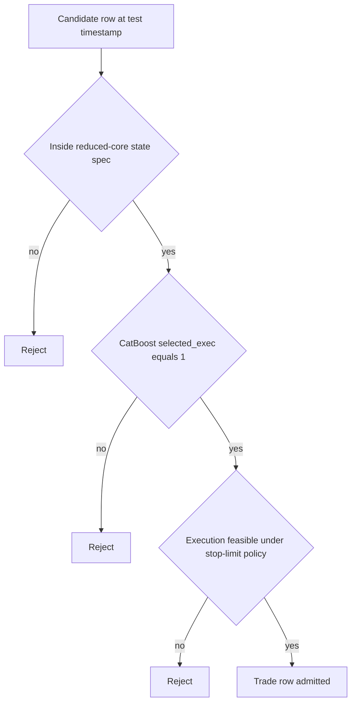

# Stage 5 - Reduced Core Selection

## Objective
Reduce candidate universe to a stable, capacity-valid core set with preserved expectancy.

## Inputs
- Reduced summary:
- `data/analysis/tick_opportunity_mining/reduced_core_rolling*/<SYMBOL>_oco_reduced_summary.csv`
- Reduced monthly:
- `data/analysis/tick_opportunity_mining/reduced_core_rolling*/<SYMBOL>_oco_reduced_monthly.csv`
- State churn:
- `data/analysis/tick_opportunity_mining/reduced_core_rolling*/<SYMBOL>_oco_reduced_state_churn.csv`

## Process
- Select reduced states month-by-month using prior train window.
- Validate capacity floor and state churn constraints.
- Compute reduction diagnostics (`R01-R03`).
- Enforce that reduced states stay inside the pre-registered rule universe contract.

## Dependency on Stage 3 (CatBoost Outputs)
- Stage 5 consumes Stage 3 prediction artifacts (`*_monthly_predictions.parquet`) and does not refit CatBoost.
- Default reduced-core entry set is controlled by `selection_mode`:
- `auto` / `exec_flag`: uses Stage 3 execution flag (`selected_exec == 1`).
- `monthly_quantile`: recomputes monthwise quantile filter from `pred_prob` when explicitly configured.
- Stage 3 is model-level row ranking; Stage 5 is state-level governance filtering:
- model layer: probability thresholding (`pred_prob`, `threshold_exec`, `selected_exec`)
- state layer: stability/capacity/risk gates across rolling train months
- If Stage 3 predictions are stale for the current test month, Stage 5 outputs are operationally invalid.

## CatBoost x Core Spec Interaction
- Final tradable rows are the strict intersection of three gates:
- `core_spec_match == 1` (row is inside reduced-core state set)
- `selected_exec == 1` (Stage 3 CatBoost passed execution threshold)
- `execution_feasible == 1` (Stage 4 stop-limit realism/fill constraints passed)
- Operational rule:
- `trade_row = core_spec_match AND selected_exec AND execution_feasible`
- Rejection logic:
- CatBoost positive but outside core spec -> reject.
- Core spec match but CatBoost below threshold -> reject.
- Passes both but execution infeasible (for configured cap/fill policy) -> reject.



### Row-Level Example
- Example row:
- `state_key=tf30_revert_b2_h3`
- `core_spec_match=1`
- `pred_prob=0.84`
- `threshold_exec=0.79`
- `selected_exec=1`
- `execution_feasible=1`
- Outcome: admitted (`trade_row=1`).
- If the same row had `core_spec_match=0`, it would be rejected even with `selected_exec=1`.

## Exact Calculations
- `R01_post_pre_row_ratio = reduced_rows / prefilter_wfo_selected_rows`
- `R02_top_state_dependency = max_top_state_share` (or `top_state_share` if available)
- `R03_reselection_stability = 1 - mean(state_churn_rate)`

## Rule-Universe Enforcement
- Registry artifact: `configs/research/governance/oco_rule_universe_registry.yaml`
- Allowed reduced dimensions:
- families: `allowed_families`
- barriers: `allowed_barrier_keep`
- horizons: `allowed_horizon_keep`
- Contract checks:
- `RU08`: reduced states file exists per symbol.
- `RU09`: every reduced state row is inside the registered universe.
- Artifacts:
- `data/analysis/tick_opportunity_mining/oco_rule_universe_registry_checks.csv`
- `data/analysis/tick_opportunity_mining/oco_rule_universe_registry_issues.csv`
- `docs/analysis/oco_rule_universe_registry_report.md`

## Causality / Leakage Controls
- State schedule and selection produced from prior-month training only.
- Universe lock prevents post-hoc adding states/families discovered after out-of-sample review.

## Failure Modes
- Over-pruning removes too much capacity.
- Top-state dependency increases fragility.
- High churn indicates unstable core.

## Interpretation Guide
- `R01` too low: likely over-pruned.
- `R02` high: concentration risk.
- `R03` high: more stable monthly state persistence.

## Validation Gates
- Capacity and stability conditions are hard gates in reduced-core outputs.
- `R01-R03` are monitoring diagnostics.
- Hard governance condition: reduced states must pass registry scope checks (`RU09`, surfaced by `C33`).

## Canonical Analysis Reports
- `docs/analysis/eurusd_oco_reduced_core_rolling_report.md`
- `docs/analysis/gbpusd_oco_reduced_core_rolling_report.md`
- `docs/analysis/usdjpy_oco_reduced_core_rolling_report.md`
- `docs/analysis/oco_rule_universe_registry_report.md`

## Operator Decision Tree
- If any hard gate in this stage fails, block promotion and escalate using the operator runbook.
- If only warning/amber diagnostics trigger, continue with mitigation and add an owner/deadline in remediation artifacts.

## How To Run
- Run the `Reproduction Commands` in this stage exactly as listed.
- Confirm artifacts are refreshed and timestamps are current before interpreting outcomes.

## How To Interpret Outputs
- Read `Key Results` first for pass/fail posture and core health metrics.
- Use `Interpretation Notes` and `Action Trigger Summary` to map observed values to operational actions.

## What To Do If It Fails
- `critical/high`: halt deployment progression, remediate root cause, rerun stage and downstream dependent stages.
- `medium/low`: open tracked remediation with owner and ETA, monitor for recurrence in next cycle.

## Reproduction Commands
```bash
uv run python scripts/select_oco_reduced_core_rolling.py \
  --symbols EURUSD,GBPUSD,USDJPY,USDCHF,AUDUSD,USDCAD
uv run python scripts/validate_oco_rule_universe_registry.py
```

## Traceability
- `scripts/select_oco_reduced_core_rolling.py`
- `scripts/validate_oco_rule_universe_registry.py`
- `docs/analysis/*_oco_reduced_core_rolling_report.md`
- `docs/analysis/oco_rule_universe_registry_report.md`
- `docs/strategy_bible/generated/stage_05_snapshot.md`

## Generated Run Snapshot
<!-- GENERATED:STAGE_05:START -->
### Auto Snapshot - Stage 05

- generated_at: `2026-03-11 21:50:05 UTC`
- State schedule is selected month-by-month using only prior-month train data.
- Summary emphasizes full-path gross behavior after reduced-core filtering.
- R01-R03 track pruning severity, state concentration, and re-selection stability.

#### Key Results
| symbol   |   rows_total |   mean_gross_pips |   lb95_month_mean_gross_pips |   fill_rate_overall |   positive_months |   months_total |   r01_post_pre_row_ratio |   r02_top_state_dependency |   r03_reselection_stability |
|:---------|-------------:|------------------:|-----------------------------:|--------------------:|------------------:|---------------:|-------------------------:|---------------------------:|----------------------------:|
| EURUSD   |         5871 |           2.65767 |                      1.69083 |            0.989383 |                10 |             15 |                0.0136096 |                       0.35 |                    0.516667 |
| GBPUSD   |        12066 |           2.64533 |                      2.38286 |            0.992188 |                11 |             15 |                0.0283759 |                       0.35 |                    0.423611 |
| AUDUSD   |         7705 |           1.59043 |                      1.08835 |            0.989216 |                11 |             15 |                0.0185368 |                       0.35 |                    0.319444 |
| USDJPY   |        12957 |           3.63856 |                      3.18986 |            0.976707 |                11 |             15 |                0.0279385 |                       0.35 |                    0.405556 |
| USDCHF   |        10280 |           2.03296 |                      1.16257 |            0.987702 |                11 |             15 |                0.0294683 |                       0.35 |                    0.243056 |
| USDCAD   |         7728 |           2.13679 |                      1.17527 |            0.989627 |                11 |             15 |                0.0157458 |                       0.35 |                    0.333333 |

#### Interpretation Notes
- State schedule is selected month-by-month using only prior-month train data.
- Summary emphasizes full-path gross behavior after reduced-core filtering.
- R01-R03 track pruning severity, state concentration, and re-selection stability.

#### Action Trigger Summary
| symbol   | metric_id                | band   | severity   | action_code   | action_summary     | owner    |
|:---------|:-------------------------|:-------|:-----------|:--------------|:-------------------|:---------|
| AUDUSD   | R02_top_state_dependency | green  | info       | A0_MONITOR    | within policy band | research |
| EURUSD   | R02_top_state_dependency | green  | info       | A0_MONITOR    | within policy band | research |
| GBPUSD   | R02_top_state_dependency | green  | info       | A0_MONITOR    | within policy band | research |
| USDCAD   | R02_top_state_dependency | green  | info       | A0_MONITOR    | within policy band | research |
| USDCHF   | R02_top_state_dependency | green  | info       | A0_MONITOR    | within policy band | research |
| USDJPY   | R02_top_state_dependency | green  | info       | A0_MONITOR    | within policy band | research |

#### Details
| symbol   |   months |   rows_total |   mean_fill_rate |   mean_gross |
|:---------|---------:|-------------:|-----------------:|-------------:|
| AUDUSD   |       15 |         7705 |         0.986329 |      1.27832 |
| EURUSD   |       15 |         5871 |         0.990948 |      2.10269 |
| GBPUSD   |       15 |        12066 |         0.990454 |      2.55929 |
| USDCAD   |       15 |         7728 |         0.992683 |      1.45782 |
| USDCHF   |       15 |        10280 |         0.985263 |      1.46407 |
| USDJPY   |       15 |        12957 |         0.977706 |      3.43668 |

#### Plots


#### State Churn
| symbol   | test_month   |   states_selected |   state_churn_rate |   top_state_share |   state_hhi |   stability_pass | status         |
|:---------|:-------------|------------------:|-------------------:|------------------:|------------:|-----------------:|:---------------|
| EURUSD   | 2025-01      |                 0 |         nan        |        nan        |  nan        |              nan | warmup_skip    |
| EURUSD   | 2025-02      |                 0 |         nan        |        nan        |  nan        |              nan | warmup_skip    |
| EURUSD   | 2025-03      |                 0 |         nan        |        nan        |  nan        |              nan | warmup_skip    |
| EURUSD   | 2025-04      |                 2 |           0        |          0.680941 |    0.56548  |                0 | ok             |
| EURUSD   | 2025-05      |                 2 |           0.666667 |          0.679602 |    0.564514 |                0 | ok             |
| EURUSD   | 2025-06      |                 1 |           1        |          1        |    1        |                0 | ok             |
| EURUSD   | 2025-07      |                 2 |           0.5      |          0.516484 |    0.500543 |                0 | ok             |
| EURUSD   | 2025-08      |                 2 |           0        |          0.536101 |    0.502607 |                0 | ok             |
| EURUSD   | 2025-09      |                 1 |           0.5      |          1        |    1        |                0 | ok             |
| EURUSD   | 2025-10      |                 2 |           0.5      |          0.606936 |    0.522871 |                0 | ok             |
| EURUSD   | 2025-11      |                 2 |           0.666667 |          0.570552 |    0.509955 |                0 | ok             |
| EURUSD   | 2025-12      |                 1 |           1        |          1        |    1        |                0 | ok             |
| EURUSD   | 2026-01      |                 1 |           0        |          1        |    1        |                0 | ok             |
| EURUSD   | 2026-02      |                 0 |         nan        |        nan        |  nan        |              nan | no_gate_states |
| EURUSD   | 2026-03      |                 0 |         nan        |        nan        |  nan        |              nan | no_gate_states |
| GBPUSD   | 2025-01      |                 0 |         nan        |        nan        |  nan        |              nan | warmup_skip    |
| GBPUSD   | 2025-02      |                 0 |         nan        |        nan        |  nan        |              nan | warmup_skip    |
| GBPUSD   | 2025-03      |                 0 |         nan        |        nan        |  nan        |              nan | warmup_skip    |
| GBPUSD   | 2025-04      |                 2 |           0        |          0.629094 |    0.53333  |                0 | ok             |
| GBPUSD   | 2025-05      |                 2 |           0        |          0.575334 |    0.511351 |                0 | ok             |
| GBPUSD   | 2025-06      |                 2 |           0.666667 |          0.742493 |    0.617606 |                0 | ok             |
| GBPUSD   | 2025-07      |                 2 |           0.666667 |          0.504235 |    0.500036 |                0 | ok             |
| GBPUSD   | 2025-08      |                 3 |           0.75     |          0.397891 |    0.348338 |                0 | ok             |
| GBPUSD   | 2025-09      |                 2 |           0.75     |          0.502564 |    0.500013 |                0 | ok             |
| GBPUSD   | 2025-10      |                 2 |           0.666667 |          0.526316 |    0.501385 |                0 | ok             |
| GBPUSD   | 2025-11      |                 2 |           0.666667 |          0.524372 |    0.501188 |                0 | ok             |
| GBPUSD   | 2025-12      |                 2 |           0.666667 |          0.514739 |    0.500434 |                0 | ok             |
| GBPUSD   | 2026-01      |                 2 |           0.666667 |          0.503429 |    0.500024 |                0 | ok             |
| GBPUSD   | 2026-02      |                 2 |           0.666667 |          0.545858 |    0.504206 |                0 | ok             |
| GBPUSD   | 2026-03      |                 3 |           0.75     |        nan        |  nan        |                0 | no_test_rows   |
| AUDUSD   | 2025-01      |                 0 |         nan        |        nan        |  nan        |              nan | warmup_skip    |
| AUDUSD   | 2025-02      |                 0 |         nan        |        nan        |  nan        |              nan | warmup_skip    |
| AUDUSD   | 2025-03      |                 0 |         nan        |        nan        |  nan        |              nan | warmup_skip    |
| AUDUSD   | 2025-04      |                 2 |           0        |          0.545059 |    0.504061 |                0 | ok             |
| AUDUSD   | 2025-05      |                 2 |           0        |          0.512245 |    0.5003   |                0 | ok             |
| AUDUSD   | 2025-06      |                 2 |           1        |          0.63752  |    0.537823 |                0 | ok             |
| AUDUSD   | 2025-07      |                 2 |           1        |          0.5547   |    0.505984 |                0 | ok             |
| AUDUSD   | 2025-08      |                 2 |           1        |          0.553254 |    0.505672 |                0 | ok             |
| AUDUSD   | 2025-09      |                 2 |           0.666667 |          0.519403 |    0.500753 |                0 | ok             |
| AUDUSD   | 2025-10      |                 2 |           0        |          0.534831 |    0.502426 |                0 | ok             |
| AUDUSD   | 2025-11      |                 1 |           1        |          1        |    1        |                0 | ok             |
| AUDUSD   | 2025-12      |                 1 |           1        |          1        |    1        |                0 | ok             |
| AUDUSD   | 2026-01      |                 1 |           1        |          1        |    1        |                0 | ok             |
| AUDUSD   | 2026-02      |                 2 |           0.5      |          0.511461 |    0.500263 |                0 | ok             |
| AUDUSD   | 2026-03      |                 2 |           1        |        nan        |  nan        |                0 | no_test_rows   |
| USDJPY   | 2025-01      |                 0 |         nan        |        nan        |  nan        |              nan | warmup_skip    |
| USDJPY   | 2025-02      |                 0 |         nan        |        nan        |  nan        |              nan | warmup_skip    |
| USDJPY   | 2025-03      |                 0 |         nan        |        nan        |  nan        |              nan | warmup_skip    |
| USDJPY   | 2025-04      |                 2 |           0        |          0.600821 |    0.52033  |                0 | ok             |
| USDJPY   | 2025-05      |                 2 |           0.666667 |          0.568205 |    0.509304 |                0 | ok             |
| USDJPY   | 2025-06      |                 2 |           0        |          0.558222 |    0.50678  |                0 | ok             |
| USDJPY   | 2025-07      |                 2 |           0.666667 |          0.582063 |    0.513469 |                0 | ok             |
| USDJPY   | 2025-08      |                 2 |           0.666667 |          0.511747 |    0.500276 |                0 | ok             |
| USDJPY   | 2025-09      |                 2 |           0.666667 |          0.50541  |    0.500059 |                0 | ok             |
| USDJPY   | 2025-10      |                 3 |           0.333333 |          0.403698 |    0.361758 |                0 | ok             |
| USDJPY   | 2025-11      |                 3 |           0.8      |          0.376607 |    0.336328 |                0 | ok             |
| USDJPY   | 2025-12      |                 2 |           1        |          0.510638 |    0.500226 |                0 | ok             |
| USDJPY   | 2026-01      |                 2 |           0.666667 |          0.559378 |    0.507052 |                0 | ok             |
| USDJPY   | 2026-02      |                 2 |           0.666667 |          0.574448 |    0.511085 |                0 | ok             |
| USDJPY   | 2026-03      |                 2 |           1        |        nan        |  nan        |                0 | no_test_rows   |
| USDCHF   | 2025-01      |                 0 |         nan        |        nan        |  nan        |              nan | warmup_skip    |
| USDCHF   | 2025-02      |                 0 |         nan        |        nan        |  nan        |              nan | warmup_skip    |
| USDCHF   | 2025-03      |                 0 |         nan        |        nan        |  nan        |              nan | warmup_skip    |
| USDCHF   | 2025-04      |                 2 |           0        |          0.706288 |    0.58511  |                0 | ok             |
| USDCHF   | 2025-05      |                 2 |           0.666667 |          0.704288 |    0.583467 |                0 | ok             |
| USDCHF   | 2025-06      |                 3 |           0.75     |          0.592466 |    0.43716  |                0 | ok             |
| USDCHF   | 2025-07      |                 2 |           0.75     |          0.79661  |    0.675955 |                0 | ok             |
| USDCHF   | 2025-08      |                 3 |           0.75     |          0.436639 |    0.381808 |                0 | ok             |
| USDCHF   | 2025-09      |                 2 |           0.75     |          0.546778 |    0.504376 |                0 | ok             |
| USDCHF   | 2025-10      |                 2 |           1        |          0.558887 |    0.506935 |                0 | ok             |
| USDCHF   | 2025-11      |                 3 |           1        |          0.436516 |    0.352568 |                0 | ok             |
| USDCHF   | 2025-12      |                 2 |           0.75     |          0.629213 |    0.533392 |                0 | ok             |
| USDCHF   | 2026-01      |                 3 |           1        |          0.386765 |    0.339096 |                0 | ok             |
| USDCHF   | 2026-02      |                 1 |           0.666667 |          1        |    1        |                0 | ok             |
| USDCHF   | 2026-03      |                 1 |           1        |        nan        |  nan        |                0 | no_test_rows   |
| USDCAD   | 2025-01      |                 0 |         nan        |        nan        |  nan        |              nan | warmup_skip    |
| USDCAD   | 2025-02      |                 0 |         nan        |        nan        |  nan        |              nan | warmup_skip    |
| USDCAD   | 2025-03      |                 0 |         nan        |        nan        |  nan        |              nan | warmup_skip    |
| USDCAD   | 2025-04      |                 2 |           0        |          0.675817 |    0.561823 |                0 | ok             |
| USDCAD   | 2025-05      |                 1 |           0.5      |          1        |    1        |                0 | ok             |
| USDCAD   | 2025-06      |                 2 |           1        |          0.751918 |    0.626926 |                0 | ok             |
| USDCAD   | 2025-07      |                 2 |           1        |          0.707106 |    0.585786 |                0 | ok             |
| USDCAD   | 2025-08      |                 2 |           0.666667 |          0.563307 |    0.508016 |                0 | ok             |
| USDCAD   | 2025-09      |                 2 |           0.666667 |          0.616352 |    0.527076 |                0 | ok             |
| USDCAD   | 2025-10      |                 2 |           0.666667 |          0.533708 |    0.502272 |                0 | ok             |
| USDCAD   | 2025-11      |                 1 |           1        |          1        |    1        |                0 | ok             |
| USDCAD   | 2025-12      |                 2 |           0.5      |          0.572025 |    0.510375 |                0 | ok             |
| USDCAD   | 2026-01      |                 2 |           0.666667 |          0.711268 |    0.589268 |                0 | ok             |
| USDCAD   | 2026-02      |                 2 |           0.666667 |          0.881119 |    0.790503 |                0 | ok             |
| USDCAD   | 2026-03      |                 0 |         nan        |        nan        |  nan        |              nan | no_gate_states |

#### Leakage/Label Integrity (Reduced-Core Focus)
| symbol   |   checks_total |   checks_failed | failed_check_ids   |
|:---------|---------------:|----------------:|:-------------------|
| EURUSD   |              3 |               0 |                    |
| GBPUSD   |              3 |               0 |                    |
| AUDUSD   |              3 |               0 |                    |
| USDJPY   |              3 |               0 |                    |
| USDCHF   |              3 |               0 |                    |
| USDCAD   |              3 |               0 |                    |
<!-- GENERATED:STAGE_05:END -->
