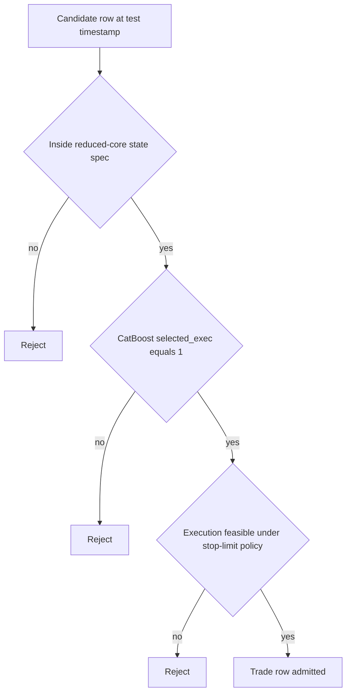

# Stage 5 - Reduced-Core Rolling

## Objective
Run Reduced-Core Rolling to turn the Monthly WFO output into a stable, capacity-valid reduced-core state set with preserved expectancy.

## Inputs
- Reduced summary:
- `data/analysis/tick_opportunity_mining/reduced_core_rolling*/<SYMBOL>_oco_reduced_summary.csv`
- Reduced monthly:
- `data/analysis/tick_opportunity_mining/reduced_core_rolling*/<SYMBOL>_oco_reduced_monthly.csv`
- State churn:
- `data/analysis/tick_opportunity_mining/reduced_core_rolling*/<SYMBOL>_oco_reduced_state_churn.csv`

## Process
- Select the reduced-core state set month-by-month using the prior train window.
- Validate capacity floor and state churn constraints.
- Compute reduction diagnostics (`R01-R03`).
- Enforce that the selected reduced-core states stay inside the pre-registered rule universe contract.

## Dependency on Stage 3 (CatBoost Outputs)
- Stage 5 consumes Stage 3 prediction artifacts (`*_monthly_predictions.parquet`) and does not refit CatBoost.
- Default reduced-core entry set is controlled by `selection_mode`:
- `auto` / `exec_flag`: uses Stage 3 execution flag (`selected_exec == 1`).
- `monthly_quantile`: recomputes monthwise quantile filter from `pred_prob` when explicitly configured.
- Stage 3 provides ranking and threshold-selection outputs; Stage 5 applies Reduced-Core Rolling governance filtering:
- model layer: probability thresholding (`pred_prob`, `threshold_exec`, `selected_exec`)
- state layer: reduced-core state stability/capacity/risk gates across rolling train months
- If Stage 3 predictions are stale for the current test month, Stage 5 outputs are operationally invalid.

## CatBoost x Core Spec Interaction
- Final tradable rows are the strict intersection of three gates:
- `core_spec_match == 1` (row is inside the reduced-core state set)
- `selected_exec == 1` (Stage 3 CatBoost passed execution threshold)
- `execution_feasible == 1` (Stage 4 stop-limit realism/fill constraints passed)
- Operational rule:
- `trade_row = core_spec_match AND selected_exec AND execution_feasible`
- Rejection logic:
- CatBoost positive but outside core spec -> reject.
- Reduced-core state row but CatBoost below threshold -> reject.
- Passes both but execution infeasible (for configured cap/fill policy) -> reject.



### Row-Level Example
- Example row:
- `state_key=tf30_revert_b2_h3`
- `core_spec_match=1`
- `pred_prob=0.84`
- `threshold_exec=0.79`
- `selected_exec=1`
- `execution_feasible=1`
- Outcome: admitted (`trade_row=1`).
- If the same row had `core_spec_match=0`, it would fall outside the reduced-core state set and be rejected even with `selected_exec=1`.

## Exact Calculations
- `R01_post_pre_row_ratio = reduced_rows / prefilter_wfo_selected_rows`
- `R02_top_state_dependency = max_top_state_share` (or `top_state_share` if available)
- `R03_reselection_stability = 1 - mean(state_churn_rate)`

## Rule-Universe Enforcement
- Registry artifact: `configs/research/governance/oco_rule_universe_registry.yaml`
- Allowed reduced dimensions:
- families: `allowed_families`
- barriers: `allowed_barrier_keep`
- horizons: `allowed_horizon_keep`
- Contract checks:
- `RU08`: reduced states file exists per symbol.
- `RU09`: every reduced state row is inside the registered universe.
- Artifacts:
- `data/analysis/tick_opportunity_mining/oco_rule_universe_registry_checks.csv`
- `data/analysis/tick_opportunity_mining/oco_rule_universe_registry_issues.csv`
- `docs/analysis/oco_rule_universe_registry_report.md`

## Causality / Leakage Controls
- Reduced-Core Rolling state schedule and state selection are produced from prior-month training only.
- Universe lock prevents post-hoc adding states/families discovered after out-of-sample review.

## Failure Modes
- Over-pruning removes too much capacity.
- Top-state dependency increases fragility.
- High churn indicates an unstable reduced-core state set.

## Interpretation Guide
- `R01` too low: likely over-pruned.
- `R02` high: concentration risk.
- `R03` high: more stable monthly state persistence.

## Validation Gates
- Capacity and stability conditions are hard gates in reduced-core outputs.
- `R01-R03` are monitoring diagnostics.
- Hard governance condition: reduced states must pass registry scope checks (`RU09`, surfaced by `C33`).
- Reduced-Core Rolling narrows the reduced-core state set; later governance artifacts translate that state set into deployment manifests and symbol-level `GO`/`NO_GO` decisions.

## Canonical Analysis Reports
- `docs/analysis/eurusd_oco_reduced_core_rolling_report.md`
- `docs/analysis/gbpusd_oco_reduced_core_rolling_report.md`
- `docs/analysis/usdjpy_oco_reduced_core_rolling_report.md`
- `docs/analysis/oco_rule_universe_registry_report.md`

## Operator Decision Tree
- If any hard gate in this stage fails, block promotion and escalate using the operator runbook.
- If only warning/amber diagnostics trigger, continue with mitigation and add an owner/deadline in remediation artifacts.

## How To Run
- Run the `Reproduction Commands` in this stage exactly as listed.
- Confirm artifacts are refreshed and timestamps are current before interpreting outcomes.

## How To Interpret Outputs
- Read `Key Results` first for reduced-core state stability, capacity, and concentration posture.
- Use `Interpretation Notes` and `Action Trigger Summary` to map observed values to operational actions.

## What To Do If It Fails
- `critical/high`: halt promotion progression, remediate root cause, and rerun this stage plus downstream dependent stages.
- `medium/low`: open tracked remediation with owner and ETA, monitor for recurrence in next cycle.

## Reproduction Commands
```bash
uv run python scripts/select_reduced_core_regimes.py \
  --symbols EURUSD,GBPUSD,USDJPY,USDCHF,AUDUSD,USDCAD
uv run python scripts/validate_oco_rule_universe_registry.py
```

## Traceability
- `scripts/select_reduced_core_regimes.py`
- `scripts/validate_oco_rule_universe_registry.py`
- `docs/analysis/*_oco_reduced_core_rolling_report.md`
- `docs/analysis/oco_rule_universe_registry_report.md`
- `docs/strategy_bible/generated/stage_05_snapshot.md`

## Generated Run Snapshot
<!-- GENERATED:STAGE_05:START -->
### Auto Snapshot - Stage 05

- generated_at: `2026-04-12 17:21:09 UTC`
- State schedule is selected month-by-month using only prior-month train data.
- Summary emphasizes full-path gross behavior after reduced-core filtering.
- R01-R03 track pruning severity, state concentration, and re-selection stability.

#### Key Results
| symbol   |   rows_total |   mean_gross_pips |   lb95_month_mean_gross_pips |   fill_rate_overall |   positive_months |   months_total |   r01_post_pre_row_ratio |   r02_top_state_dependency |   r03_reselection_stability |
|:---------|-------------:|------------------:|-----------------------------:|--------------------:|------------------:|---------------:|-------------------------:|---------------------------:|----------------------------:|
| EURUSD   |         6386 |           7.58188 |                      6.66186 |            0.993157 |                12 |             16 |                0.0557646 |                       0.35 |                    0.807692 |
| GBPUSD   |         7128 |           7.72466 |                      7.04495 |            0.991239 |                12 |             16 |                0.0514687 |                       0.35 |                    0.410256 |
| AUDUSD   |         2305 |           5.62386 |                      5.3192  |            0.965243 |                 7 |             16 |                0.0738853 |                       0.35 |                    0.729167 |
| USDJPY   |         5136 |          10.9672  |                     10.1658  |            0.986744 |                12 |             16 |                0.0206801 |                       0.35 |                    0.461538 |
| USDCHF   |         1710 |           5.9738  |                      4.69595 |            0.964467 |                 6 |             16 |                0.0591736 |                       0.35 |                    0.428571 |
| USDCAD   |         4029 |           5.4964  |                      4.83413 |            0.991876 |                10 |             16 |                0.0853783 |                       0.35 |                    0.666667 |

#### Interpretation Notes
- State schedule is selected month-by-month using only prior-month train data.
- Summary emphasizes full-path gross behavior after reduced-core filtering.
- R01-R03 track pruning severity, state concentration, and re-selection stability.

#### Action Trigger Summary
| symbol   | metric_id                | band   | severity   | action_code   | action_summary     | owner    |
|:---------|:-------------------------|:-------|:-----------|:--------------|:-------------------|:---------|
| AUDUSD   | R02_top_state_dependency | green  | info       | A0_MONITOR    | within policy band | research |
| EURUSD   | R02_top_state_dependency | green  | info       | A0_MONITOR    | within policy band | research |
| GBPUSD   | R02_top_state_dependency | green  | info       | A0_MONITOR    | within policy band | research |
| USDCAD   | R02_top_state_dependency | green  | info       | A0_MONITOR    | within policy band | research |
| USDCHF   | R02_top_state_dependency | green  | info       | A0_MONITOR    | within policy band | research |
| USDJPY   | R02_top_state_dependency | green  | info       | A0_MONITOR    | within policy band | research |

#### Details
| symbol   |   months |   rows_total |   mean_fill_rate |   mean_gross |
|:---------|---------:|-------------:|-----------------:|-------------:|
| AUDUSD   |       16 |         2305 |         0.980361 |      5.76455 |
| EURUSD   |       16 |         6386 |         0.994602 |      7.21115 |
| GBPUSD   |       16 |         7128 |         0.991299 |      7.73462 |
| USDCAD   |       16 |         4029 |         0.995581 |      5.53439 |
| USDCHF   |       16 |         1710 |         0.974309 |      5.74226 |
| USDJPY   |       16 |         5136 |         0.986288 |     11.6629  |

#### Plots


#### State Churn
| symbol   | test_month   |   states_selected |   state_churn_rate |   top_state_share |   state_hhi |   stability_pass | status         |
|:---------|:-------------|------------------:|-------------------:|------------------:|------------:|-----------------:|:---------------|
| EURUSD   | 2025-01      |                 0 |         nan        |        nan        |  nan        |              nan | warmup_skip    |
| EURUSD   | 2025-02      |                 0 |         nan        |        nan        |  nan        |              nan | warmup_skip    |
| EURUSD   | 2025-03      |                 0 |         nan        |        nan        |  nan        |              nan | warmup_skip    |
| EURUSD   | 2025-04      |                 2 |           0        |          0.542014 |    0.50353  |                0 | ok             |
| EURUSD   | 2025-05      |                 1 |           0.5      |          1        |    1        |                0 | ok             |
| EURUSD   | 2025-06      |                 1 |           0        |          1        |    1        |                0 | ok             |
| EURUSD   | 2025-07      |                 1 |           0        |          1        |    1        |                0 | ok             |
| EURUSD   | 2025-08      |                 1 |           0        |          1        |    1        |                0 | ok             |
| EURUSD   | 2025-09      |                 2 |           0.5      |          0.510903 |    0.500238 |                0 | ok             |
| EURUSD   | 2025-10      |                 1 |           0.5      |          1        |    1        |                0 | ok             |
| EURUSD   | 2025-11      |                 1 |           0        |          1        |    1        |                0 | ok             |
| EURUSD   | 2025-12      |                 1 |           0        |          1        |    1        |                0 | ok             |
| EURUSD   | 2026-01      |                 1 |           0        |          1        |    1        |                0 | ok             |
| EURUSD   | 2026-02      |                 1 |           0        |          1        |    1        |                0 | ok             |
| EURUSD   | 2026-03      |                 2 |           0.5      |          0.503734 |    0.500028 |                0 | ok             |
| EURUSD   | 2026-04      |                 1 |           0.5      |        nan        |  nan        |                0 | no_test_rows   |
| GBPUSD   | 2025-01      |                 0 |         nan        |        nan        |  nan        |              nan | warmup_skip    |
| GBPUSD   | 2025-02      |                 0 |         nan        |        nan        |  nan        |              nan | warmup_skip    |
| GBPUSD   | 2025-03      |                 0 |         nan        |        nan        |  nan        |              nan | warmup_skip    |
| GBPUSD   | 2025-04      |                 1 |           0        |          1        |    1        |                0 | ok             |
| GBPUSD   | 2025-05      |                 2 |           0.5      |          0.58774  |    0.515397 |                0 | ok             |
| GBPUSD   | 2025-06      |                 1 |           1        |          1        |    1        |                0 | ok             |
| GBPUSD   | 2025-07      |                 2 |           0.5      |          0.523737 |    0.501127 |                0 | ok             |
| GBPUSD   | 2025-08      |                 1 |           0.5      |          1        |    1        |                0 | ok             |
| GBPUSD   | 2025-09      |                 1 |           0        |          1        |    1        |                0 | ok             |
| GBPUSD   | 2025-10      |                 2 |           1        |          0.576224 |    0.51162  |                0 | ok             |
| GBPUSD   | 2025-11      |                 2 |           0        |          0.548148 |    0.504636 |                0 | ok             |
| GBPUSD   | 2025-12      |                 2 |           1        |          0.522184 |    0.500984 |                0 | ok             |
| GBPUSD   | 2026-01      |                 1 |           1        |          1        |    1        |                0 | ok             |
| GBPUSD   | 2026-02      |                 2 |           0.5      |          0.539197 |    0.503073 |                0 | ok             |
| GBPUSD   | 2026-03      |                 2 |           0.666667 |          0.567219 |    0.509037 |                0 | ok             |
| GBPUSD   | 2026-04      |                 2 |           1        |        nan        |  nan        |                0 | no_test_rows   |
| AUDUSD   | 2025-01      |                 0 |         nan        |        nan        |  nan        |              nan | warmup_skip    |
| AUDUSD   | 2025-02      |                 0 |         nan        |        nan        |  nan        |              nan | warmup_skip    |
| AUDUSD   | 2025-03      |                 0 |         nan        |        nan        |  nan        |              nan | warmup_skip    |
| AUDUSD   | 2025-04      |                 2 |           0        |          0.517711 |    0.500627 |                0 | ok             |
| AUDUSD   | 2025-05      |                 1 |           0.5      |          1        |    1        |                0 | ok             |
| AUDUSD   | 2025-06      |                 2 |           0.5      |          0.545872 |    0.504208 |                0 | ok             |
| AUDUSD   | 2025-07      |                 2 |           0.666667 |          0.589862 |    0.51615  |                0 | ok             |
| AUDUSD   | 2025-08      |                 2 |           0        |          0.581731 |    0.51336  |                0 | ok             |
| AUDUSD   | 2025-09      |                 1 |           0.5      |          1        |    1        |                0 | ok             |
| AUDUSD   | 2025-10      |                 0 |         nan        |        nan        |  nan        |              nan | no_gate_states |
| AUDUSD   | 2025-11      |                 0 |         nan        |        nan        |  nan        |              nan | no_gate_states |
| AUDUSD   | 2025-12      |                 0 |         nan        |        nan        |  nan        |              nan | no_gate_states |
| AUDUSD   | 2026-01      |                 1 |           0        |          1        |    1        |                0 | ok             |
| AUDUSD   | 2026-02      |                 0 |         nan        |        nan        |  nan        |              nan | no_gate_states |
| AUDUSD   | 2026-03      |                 0 |         nan        |        nan        |  nan        |              nan | no_gate_states |
| AUDUSD   | 2026-04      |                 1 |           0        |        nan        |  nan        |                1 | no_test_rows   |
| USDJPY   | 2025-01      |                 0 |         nan        |        nan        |  nan        |              nan | warmup_skip    |
| USDJPY   | 2025-02      |                 0 |         nan        |        nan        |  nan        |              nan | warmup_skip    |
| USDJPY   | 2025-03      |                 0 |         nan        |        nan        |  nan        |              nan | warmup_skip    |
| USDJPY   | 2025-04      |                 1 |           0        |          1        |    1        |                0 | ok             |
| USDJPY   | 2025-05      |                 1 |           0        |          1        |    1        |                0 | ok             |
| USDJPY   | 2025-06      |                 2 |           0.5      |          0.521739 |    0.500945 |                0 | ok             |
| USDJPY   | 2025-07      |                 1 |           0.5      |          1        |    1        |                0 | ok             |
| USDJPY   | 2025-08      |                 2 |           0.5      |          0.606299 |    0.522599 |                0 | ok             |
| USDJPY   | 2025-09      |                 2 |           1        |          0.55814  |    0.50676  |                0 | ok             |
| USDJPY   | 2025-10      |                 1 |           0.5      |          1        |    1        |                0 | ok             |
| USDJPY   | 2025-11      |                 2 |           0.5      |          0.532725 |    0.502142 |                0 | ok             |
| USDJPY   | 2025-12      |                 2 |           1        |          0.668616 |    0.556863 |                0 | ok             |
| USDJPY   | 2026-01      |                 1 |           0.5      |          1        |    1        |                0 | ok             |
| USDJPY   | 2026-02      |                 1 |           0        |          1        |    1        |                0 | ok             |
| USDJPY   | 2026-03      |                 1 |           1        |          1        |    1        |                0 | ok             |
| USDJPY   | 2026-04      |                 1 |           1        |        nan        |  nan        |                0 | no_test_rows   |
| USDCHF   | 2025-01      |                 0 |         nan        |        nan        |  nan        |              nan | warmup_skip    |
| USDCHF   | 2025-02      |                 0 |         nan        |        nan        |  nan        |              nan | warmup_skip    |
| USDCHF   | 2025-03      |                 0 |         nan        |        nan        |  nan        |              nan | warmup_skip    |
| USDCHF   | 2025-04      |                 1 |           0        |          1        |    1        |                0 | ok             |
| USDCHF   | 2025-05      |                 2 |           1        |          0.593156 |    0.517356 |                0 | ok             |
| USDCHF   | 2025-06      |                 1 |           0.5      |          1        |    1        |                0 | ok             |
| USDCHF   | 2025-07      |                 1 |           0        |          1        |    1        |                0 | ok             |
| USDCHF   | 2025-08      |                 2 |           1        |          0.51952  |    0.500762 |                0 | ok             |
| USDCHF   | 2025-09      |                 1 |           0.5      |          1        |    1        |                0 | ok             |
| USDCHF   | 2025-10      |                 0 |         nan        |        nan        |  nan        |              nan | no_gate_states |
| USDCHF   | 2025-11      |                 0 |         nan        |        nan        |  nan        |              nan | no_gate_states |
| USDCHF   | 2025-12      |                 0 |         nan        |        nan        |  nan        |              nan | no_gate_states |
| USDCHF   | 2026-01      |                 0 |         nan        |        nan        |  nan        |              nan | no_gate_states |
| USDCHF   | 2026-02      |                 0 |         nan        |        nan        |  nan        |              nan | no_gate_states |
| USDCHF   | 2026-03      |                 0 |         nan        |        nan        |  nan        |              nan | no_gate_states |
| USDCHF   | 2026-04      |                 1 |           1        |        nan        |  nan        |                0 | no_test_rows   |
| USDCAD   | 2025-01      |                 0 |         nan        |        nan        |  nan        |              nan | warmup_skip    |
| USDCAD   | 2025-02      |                 0 |         nan        |        nan        |  nan        |              nan | warmup_skip    |
| USDCAD   | 2025-03      |                 0 |         nan        |        nan        |  nan        |              nan | warmup_skip    |
| USDCAD   | 2025-04      |                 2 |           0        |          0.566641 |    0.508882 |                0 | ok             |
| USDCAD   | 2025-05      |                 2 |           0        |          0.621138 |    0.529349 |                0 | ok             |
| USDCAD   | 2025-06      |                 1 |           0.5      |          1        |    1        |                0 | ok             |
| USDCAD   | 2025-07      |                 2 |           0.5      |          0.523923 |    0.501145 |                0 | ok             |
| USDCAD   | 2025-08      |                 2 |           0.666667 |          0.589109 |    0.515881 |                0 | ok             |
| USDCAD   | 2025-09      |                 1 |           1        |          1        |    1        |                0 | ok             |
| USDCAD   | 2025-10      |                 1 |           0        |          1        |    1        |                0 | ok             |
| USDCAD   | 2025-11      |                 1 |           0        |          1        |    1        |                0 | ok             |
| USDCAD   | 2025-12      |                 0 |         nan        |        nan        |  nan        |              nan | no_gate_states |
| USDCAD   | 2026-01      |                 0 |         nan        |        nan        |  nan        |              nan | no_gate_states |
| USDCAD   | 2026-02      |                 1 |           1        |          1        |    1        |                0 | ok             |
| USDCAD   | 2026-03      |                 1 |           0        |          1        |    1        |                0 | ok             |
| USDCAD   | 2026-04      |                 1 |           0        |        nan        |  nan        |                1 | no_test_rows   |
<!-- GENERATED:STAGE_05:END -->
