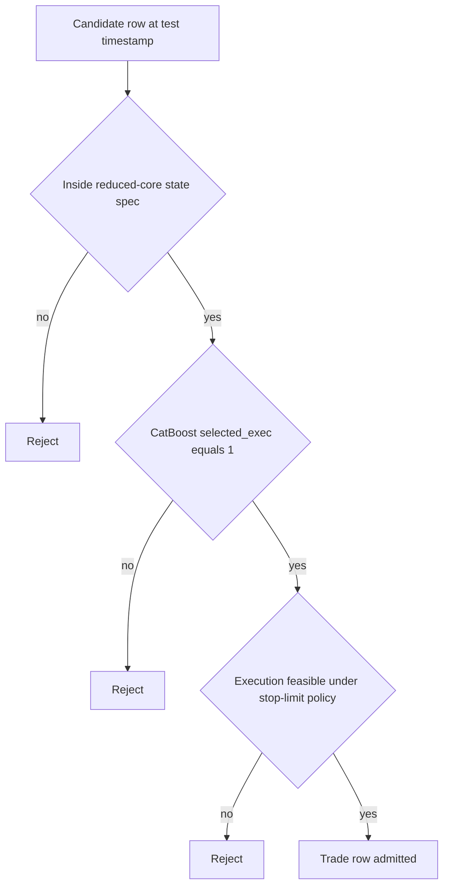

# Stage 5 - Reduced Core Selection

## Objective
Reduce candidate universe to a stable, capacity-valid core set with preserved expectancy.

## Inputs
- Reduced summary:
- `data/analysis/tick_opportunity_mining/reduced_core_rolling*/<SYMBOL>_oco_reduced_summary.csv`
- Reduced monthly:
- `data/analysis/tick_opportunity_mining/reduced_core_rolling*/<SYMBOL>_oco_reduced_monthly.csv`
- State churn:
- `data/analysis/tick_opportunity_mining/reduced_core_rolling*/<SYMBOL>_oco_reduced_state_churn.csv`

## Process
- Select reduced states month-by-month using prior train window.
- Validate capacity floor and state churn constraints.
- Compute reduction diagnostics (`R01-R03`).
- Enforce that reduced states stay inside the pre-registered rule universe contract.

## Dependency on Stage 3 (CatBoost Outputs)
- Stage 5 consumes Stage 3 prediction artifacts (`*_monthly_predictions.parquet`) and does not refit CatBoost.
- Default reduced-core entry set is controlled by `selection_mode`:
- `auto` / `exec_flag`: uses Stage 3 execution flag (`selected_exec == 1`).
- `monthly_quantile`: recomputes monthwise quantile filter from `pred_prob` when explicitly configured.
- Stage 3 is model-level row ranking; Stage 5 is state-level governance filtering:
- model layer: probability thresholding (`pred_prob`, `threshold_exec`, `selected_exec`)
- state layer: stability/capacity/risk gates across rolling train months
- If Stage 3 predictions are stale for the current test month, Stage 5 outputs are operationally invalid.

## CatBoost x Core Spec Interaction
- Final tradable rows are the strict intersection of three gates:
- `core_spec_match == 1` (row is inside reduced-core state set)
- `selected_exec == 1` (Stage 3 CatBoost passed execution threshold)
- `execution_feasible == 1` (Stage 4 stop-limit realism/fill constraints passed)
- Operational rule:
- `trade_row = core_spec_match AND selected_exec AND execution_feasible`
- Rejection logic:
- CatBoost positive but outside core spec -> reject.
- Core spec match but CatBoost below threshold -> reject.
- Passes both but execution infeasible (for configured cap/fill policy) -> reject.



### Row-Level Example
- Example row:
- `state_key=tf30_revert_b2_h3`
- `core_spec_match=1`
- `pred_prob=0.84`
- `threshold_exec=0.79`
- `selected_exec=1`
- `execution_feasible=1`
- Outcome: admitted (`trade_row=1`).
- If the same row had `core_spec_match=0`, it would be rejected even with `selected_exec=1`.

## Exact Calculations
- `R01_post_pre_row_ratio = reduced_rows / prefilter_wfo_selected_rows`
- `R02_top_state_dependency = max_top_state_share` (or `top_state_share` if available)
- `R03_reselection_stability = 1 - mean(state_churn_rate)`

## Rule-Universe Enforcement
- Registry artifact: `configs/research/governance/oco_rule_universe_registry.yaml`
- Allowed reduced dimensions:
- families: `allowed_families`
- barriers: `allowed_barrier_keep`
- horizons: `allowed_horizon_keep`
- Contract checks:
- `RU08`: reduced states file exists per symbol.
- `RU09`: every reduced state row is inside the registered universe.
- Artifacts:
- `data/analysis/tick_opportunity_mining/oco_rule_universe_registry_checks.csv`
- `data/analysis/tick_opportunity_mining/oco_rule_universe_registry_issues.csv`
- `docs/analysis/oco_rule_universe_registry_report.md`

## Causality / Leakage Controls
- State schedule and selection produced from prior-month training only.
- Universe lock prevents post-hoc adding states/families discovered after out-of-sample review.

## Failure Modes
- Over-pruning removes too much capacity.
- Top-state dependency increases fragility.
- High churn indicates unstable core.

## Interpretation Guide
- `R01` too low: likely over-pruned.
- `R02` high: concentration risk.
- `R03` high: more stable monthly state persistence.

## Validation Gates
- Capacity and stability conditions are hard gates in reduced-core outputs.
- `R01-R03` are monitoring diagnostics.
- Hard governance condition: reduced states must pass registry scope checks (`RU09`, surfaced by `C33`).

## Canonical Analysis Reports
- `docs/analysis/eurusd_oco_reduced_core_rolling_report.md`
- `docs/analysis/gbpusd_oco_reduced_core_rolling_report.md`
- `docs/analysis/usdjpy_oco_reduced_core_rolling_report.md`
- `docs/analysis/oco_rule_universe_registry_report.md`

## Operator Decision Tree
- If any hard gate in this stage fails, block promotion and escalate using the operator runbook.
- If only warning/amber diagnostics trigger, continue with mitigation and add an owner/deadline in remediation artifacts.

## How To Run
- Run the `Reproduction Commands` in this stage exactly as listed.
- Confirm artifacts are refreshed and timestamps are current before interpreting outcomes.

## How To Interpret Outputs
- Read `Key Results` first for pass/fail posture and core health metrics.
- Use `Interpretation Notes` and `Action Trigger Summary` to map observed values to operational actions.

## What To Do If It Fails
- `critical/high`: halt deployment progression, remediate root cause, rerun stage and downstream dependent stages.
- `medium/low`: open tracked remediation with owner and ETA, monitor for recurrence in next cycle.

## Reproduction Commands
```bash
uv run python scripts/select_oco_reduced_core_rolling.py \
  --symbols EURUSD,GBPUSD,USDJPY,USDCHF
uv run python scripts/validate_oco_rule_universe_registry.py
```

## Traceability
- `scripts/select_oco_reduced_core_rolling.py`
- `scripts/validate_oco_rule_universe_registry.py`
- `docs/analysis/*_oco_reduced_core_rolling_report.md`
- `docs/analysis/oco_rule_universe_registry_report.md`
- `docs/strategy_bible/generated/stage_05_snapshot.md`

## Generated Run Snapshot
<!-- GENERATED:STAGE_05:START -->
### Auto Snapshot - Stage 05

- generated_at: `2026-03-05 00:54:34 UTC`
- State schedule is selected month-by-month using only prior-month train data.
- Summary emphasizes full-path gross behavior after reduced-core filtering.
- R01-R03 track pruning severity, state concentration, and re-selection stability.

#### Key Results
| symbol   |   rows_total |   mean_gross_pips |   lb95_month_mean_gross_pips |   fill_rate_overall |   positive_months |   months_total |   r01_post_pre_row_ratio |   r02_top_state_dependency |   r03_reselection_stability |
|:---------|-------------:|------------------:|-----------------------------:|--------------------:|------------------:|---------------:|-------------------------:|---------------------------:|----------------------------:|
| EURUSD   |         6628 |          2.45668  |                     1.67265  |            0.987044 |                11 |             15 |               0.0154128  |                       0.35 |                    0.363636 |
| GBPUSD   |         6928 |          2.53606  |                     2.29926  |            0.992835 |                 6 |             10 |               0.0176677  |                       0.35 |                    0.37381  |
| AUDUSD   |         4202 |          0.959424 |                     0.754892 |            0.994086 |                 6 |             10 |               0.00945836 |                       0.35 |                    0.440476 |
| USDJPY   |         8101 |          3.30796  |                     2.96223  |            0.989616 |                 6 |             10 |               0.0176464  |                       0.35 |                    0.333333 |
| USDCHF   |         4077 |          1.27177  |                     1.00213  |            0.977698 |                 6 |             10 |               0.0109961  |                       0.35 |                    0.630952 |
| USDCAD   |         3544 |          1.42023  |                     1.09225  |            0.991606 |                 6 |             10 |               0.00933543 |                       0.35 |                    0.452381 |

#### Interpretation Notes
- State schedule is selected month-by-month using only prior-month train data.
- Summary emphasizes full-path gross behavior after reduced-core filtering.
- R01-R03 track pruning severity, state concentration, and re-selection stability.

#### Action Trigger Summary
| symbol   | metric_id                | band   | severity   | action_code   | action_summary     | owner    |
|:---------|:-------------------------|:-------|:-----------|:--------------|:-------------------|:---------|
| AUDUSD   | R02_top_state_dependency | green  | info       | A0_MONITOR    | within policy band | research |
| EURUSD   | R02_top_state_dependency | green  | info       | A0_MONITOR    | within policy band | research |
| GBPUSD   | R02_top_state_dependency | green  | info       | A0_MONITOR    | within policy band | research |
| USDCAD   | R02_top_state_dependency | green  | info       | A0_MONITOR    | within policy band | research |
| USDCHF   | R02_top_state_dependency | green  | info       | A0_MONITOR    | within policy band | research |
| USDJPY   | R02_top_state_dependency | green  | info       | A0_MONITOR    | within policy band | research |

#### Details
| symbol   |   months |   rows_total |   mean_fill_rate |   mean_gross |
|:---------|---------:|-------------:|-----------------:|-------------:|
| AUDUSD   |       10 |         4202 |         0.994046 |     0.959656 |
| EURUSD   |       15 |         6628 |         0.988438 |     1.99027  |
| GBPUSD   |       10 |         6928 |         0.992449 |     2.56976  |
| USDCAD   |       10 |         3544 |         0.991843 |     1.28907  |
| USDCHF   |       10 |         4077 |         0.976204 |     1.24516  |
| USDJPY   |       10 |         8101 |         0.989579 |     3.26221  |

#### Plots


#### State Churn
| symbol   | test_month   |   states_selected |   state_churn_rate |   top_state_share |   state_hhi |   stability_pass | status         |
|:---------|:-------------|------------------:|-------------------:|------------------:|------------:|-----------------:|:---------------|
| EURUSD   | 2025-01      |                 0 |         nan        |        nan        |  nan        |              nan | warmup_skip    |
| EURUSD   | 2025-02      |                 0 |         nan        |        nan        |  nan        |              nan | warmup_skip    |
| EURUSD   | 2025-03      |                 0 |         nan        |        nan        |  nan        |              nan | warmup_skip    |
| EURUSD   | 2025-04      |                 2 |           0        |          0.710202 |    0.58837  |                0 | ok             |
| EURUSD   | 2025-05      |                 2 |           0.666667 |          0.701987 |    0.581597 |                0 | ok             |
| EURUSD   | 2025-06      |                 2 |           0.666667 |          0.597911 |    0.519173 |                0 | ok             |
| EURUSD   | 2025-07      |                 2 |           0.666667 |          0.515326 |    0.50047  |                0 | ok             |
| EURUSD   | 2025-08      |                 2 |           0.666667 |          0.53068  |    0.501883 |                0 | ok             |
| EURUSD   | 2025-09      |                 1 |           0.5      |          1        |    1        |                0 | ok             |
| EURUSD   | 2025-10      |                 1 |           1        |          1        |    1        |                0 | ok             |
| EURUSD   | 2025-11      |                 2 |           0.5      |          0.521084 |    0.500889 |                0 | ok             |
| EURUSD   | 2025-12      |                 2 |           0.666667 |          0.55988  |    0.507171 |                0 | ok             |
| EURUSD   | 2026-01      |                 2 |           0.666667 |          0.571014 |    0.510086 |                0 | ok             |
| EURUSD   | 2026-02      |                 1 |           1        |          1        |    1        |                0 | ok             |
| EURUSD   | 2026-03      |                 0 |         nan        |        nan        |  nan        |              nan | no_gate_states |
| GBPUSD   | 2025-04      |                 0 |         nan        |        nan        |  nan        |              nan | warmup_skip    |
| GBPUSD   | 2025-05      |                 0 |         nan        |        nan        |  nan        |              nan | warmup_skip    |
| GBPUSD   | 2025-06      |                 0 |         nan        |        nan        |  nan        |              nan | warmup_skip    |
| GBPUSD   | 2025-07      |                 2 |           0        |          0.618954 |    0.5283   |                0 | ok             |
| GBPUSD   | 2025-08      |                 2 |           0.666667 |          0.517463 |    0.50061  |                0 | ok             |
| GBPUSD   | 2025-09      |                 3 |           0.75     |          0.469992 |    0.381077 |                0 | ok             |
| GBPUSD   | 2025-10      |                 2 |           0.75     |          0.522317 |    0.500996 |                0 | ok             |
| GBPUSD   | 2025-11      |                 2 |           0.666667 |          0.523419 |    0.501097 |                0 | ok             |
| GBPUSD   | 2025-12      |                 3 |           0.75     |          0.375591 |    0.341332 |                0 | ok             |
| GBPUSD   | 2026-01      |                 3 |           0.8      |        nan        |  nan        |                0 | no_test_rows   |
| AUDUSD   | 2025-04      |                 0 |         nan        |        nan        |  nan        |              nan | warmup_skip    |
| AUDUSD   | 2025-05      |                 0 |         nan        |        nan        |  nan        |              nan | warmup_skip    |
| AUDUSD   | 2025-06      |                 0 |         nan        |        nan        |  nan        |              nan | warmup_skip    |
| AUDUSD   | 2025-07      |                 2 |           0        |          0.727163 |    0.603206 |                0 | ok             |
| AUDUSD   | 2025-08      |                 3 |           0.75     |          0.505185 |    0.381325 |                0 | ok             |
| AUDUSD   | 2025-09      |                 2 |           0.75     |          0.548632 |    0.50473  |                0 | ok             |
| AUDUSD   | 2025-10      |                 2 |           0.666667 |          0.528024 |    0.501571 |                0 | ok             |
| AUDUSD   | 2025-11      |                 2 |           0.666667 |          0.565015 |    0.508454 |                0 | ok             |
| AUDUSD   | 2025-12      |                 3 |           0.333333 |          0.46477  |    0.361106 |                0 | ok             |
| AUDUSD   | 2026-01      |                 2 |           0.75     |        nan        |  nan        |                0 | no_test_rows   |
| USDJPY   | 2025-04      |                 0 |         nan        |        nan        |  nan        |              nan | warmup_skip    |
| USDJPY   | 2025-05      |                 0 |         nan        |        nan        |  nan        |              nan | warmup_skip    |
| USDJPY   | 2025-06      |                 0 |         nan        |        nan        |  nan        |              nan | warmup_skip    |
| USDJPY   | 2025-07      |                 2 |           0        |          0.500778 |    0.500001 |                0 | ok             |
| USDJPY   | 2025-08      |                 2 |           0.666667 |          0.585451 |    0.514604 |                0 | ok             |
| USDJPY   | 2025-09      |                 2 |           1        |          0.516742 |    0.500561 |                0 | ok             |
| USDJPY   | 2025-10      |                 3 |           0.75     |          0.469903 |    0.406992 |                0 | ok             |
| USDJPY   | 2025-11      |                 2 |           0.75     |          0.506458 |    0.500083 |                0 | ok             |
| USDJPY   | 2025-12      |                 3 |           0.75     |          0.34104  |    0.333599 |                0 | ok             |
| USDJPY   | 2026-01      |                 2 |           0.75     |        nan        |  nan        |                0 | no_test_rows   |
| USDCHF   | 2025-04      |                 0 |         nan        |        nan        |  nan        |              nan | warmup_skip    |
| USDCHF   | 2025-05      |                 0 |         nan        |        nan        |  nan        |              nan | warmup_skip    |
| USDCHF   | 2025-06      |                 0 |         nan        |        nan        |  nan        |              nan | warmup_skip    |
| USDCHF   | 2025-07      |                 1 |           0        |          1        |    1        |                0 | ok             |
| USDCHF   | 2025-08      |                 2 |           0.5      |          0.578512 |    0.512328 |                0 | ok             |
| USDCHF   | 2025-09      |                 2 |           0        |          0.657005 |    0.549301 |                0 | ok             |
| USDCHF   | 2025-10      |                 2 |           0.666667 |          0.684625 |    0.568173 |                0 | ok             |
| USDCHF   | 2025-11      |                 2 |           0.666667 |          0.551095 |    0.505221 |                0 | ok             |
| USDCHF   | 2025-12      |                 2 |           0        |          0.530864 |    0.501905 |                0 | ok             |
| USDCHF   | 2026-01      |                 3 |           0.75     |        nan        |  nan        |                0 | no_test_rows   |
| USDCAD   | 2025-04      |                 0 |         nan        |        nan        |  nan        |              nan | warmup_skip    |
| USDCAD   | 2025-05      |                 0 |         nan        |        nan        |  nan        |              nan | warmup_skip    |
| USDCAD   | 2025-06      |                 0 |         nan        |        nan        |  nan        |              nan | warmup_skip    |
| USDCAD   | 2025-07      |                 2 |           0        |          0.564516 |    0.508325 |                0 | ok             |
| USDCAD   | 2025-08      |                 2 |           0.666667 |          0.555411 |    0.506141 |                0 | ok             |
| USDCAD   | 2025-09      |                 2 |           0.666667 |          0.501613 |    0.500005 |                0 | ok             |
| USDCAD   | 2025-10      |                 1 |           0.5      |          1        |    1        |                0 | ok             |
| USDCAD   | 2025-11      |                 2 |           1        |          0.60686  |    0.522838 |                0 | ok             |
| USDCAD   | 2025-12      |                 2 |           1        |          0.573196 |    0.510715 |                0 | ok             |
| USDCAD   | 2026-01      |                 2 |           0        |        nan        |  nan        |                1 | no_test_rows   |

#### Leakage/Label Integrity (Reduced-Core Focus)
| symbol   |   checks_total |   checks_failed | failed_check_ids   |
|:---------|---------------:|----------------:|:-------------------|
| EURUSD   |              3 |               0 |                    |
| GBPUSD   |              3 |               0 |                    |
| AUDUSD   |              3 |               0 |                    |
| USDJPY   |              3 |               0 |                    |
| USDCHF   |              3 |               0 |                    |
| USDCAD   |              3 |               0 |                    |
<!-- GENERATED:STAGE_05:END -->
