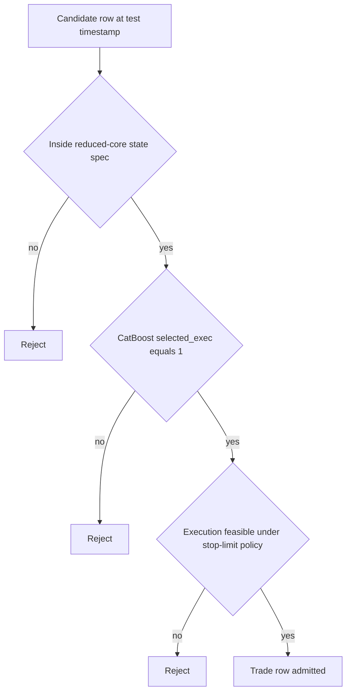

# Stage 5 - Reduced Core Selection

## Objective
Reduce candidate universe to a stable, capacity-valid core set with preserved expectancy.

## Inputs
- Reduced summary:
- `data/analysis/tick_opportunity_mining/reduced_core_rolling*/<SYMBOL>_oco_reduced_summary.csv`
- Reduced monthly:
- `data/analysis/tick_opportunity_mining/reduced_core_rolling*/<SYMBOL>_oco_reduced_monthly.csv`
- State churn:
- `data/analysis/tick_opportunity_mining/reduced_core_rolling*/<SYMBOL>_oco_reduced_state_churn.csv`

## Process
- Select reduced states month-by-month using prior train window.
- Validate capacity floor and state churn constraints.
- Compute reduction diagnostics (`R01-R03`).
- Enforce that reduced states stay inside the pre-registered rule universe contract.

## Dependency on Stage 3 (CatBoost Outputs)
- Stage 5 consumes Stage 3 prediction artifacts (`*_monthly_predictions.parquet`) and does not refit CatBoost.
- Default reduced-core entry set is controlled by `selection_mode`:
- `auto` / `exec_flag`: uses Stage 3 execution flag (`selected_exec == 1`).
- `monthly_quantile`: recomputes monthwise quantile filter from `pred_prob` when explicitly configured.
- Stage 3 is model-level row ranking; Stage 5 is state-level governance filtering:
- model layer: probability thresholding (`pred_prob`, `threshold_exec`, `selected_exec`)
- state layer: stability/capacity/risk gates across rolling train months
- If Stage 3 predictions are stale for the current test month, Stage 5 outputs are operationally invalid.

## CatBoost x Core Spec Interaction
- Final tradable rows are the strict intersection of three gates:
- `core_spec_match == 1` (row is inside reduced-core state set)
- `selected_exec == 1` (Stage 3 CatBoost passed execution threshold)
- `execution_feasible == 1` (Stage 4 stop-limit realism/fill constraints passed)
- Operational rule:
- `trade_row = core_spec_match AND selected_exec AND execution_feasible`
- Rejection logic:
- CatBoost positive but outside core spec -> reject.
- Core spec match but CatBoost below threshold -> reject.
- Passes both but execution infeasible (for configured cap/fill policy) -> reject.



### Row-Level Example
- Example row:
- `state_key=tf30_revert_b2_h3`
- `core_spec_match=1`
- `pred_prob=0.84`
- `threshold_exec=0.79`
- `selected_exec=1`
- `execution_feasible=1`
- Outcome: admitted (`trade_row=1`).
- If the same row had `core_spec_match=0`, it would be rejected even with `selected_exec=1`.

## Exact Calculations
- `R01_post_pre_row_ratio = reduced_rows / prefilter_wfo_selected_rows`
- `R02_top_state_dependency = max_top_state_share` (or `top_state_share` if available)
- `R03_reselection_stability = 1 - mean(state_churn_rate)`

## Rule-Universe Enforcement
- Registry artifact: `configs/research/governance/oco_rule_universe_registry.yaml`
- Allowed reduced dimensions:
- families: `allowed_families`
- barriers: `allowed_barrier_keep`
- horizons: `allowed_horizon_keep`
- Contract checks:
- `RU08`: reduced states file exists per symbol.
- `RU09`: every reduced state row is inside the registered universe.
- Artifacts:
- `data/analysis/tick_opportunity_mining/oco_rule_universe_registry_checks.csv`
- `data/analysis/tick_opportunity_mining/oco_rule_universe_registry_issues.csv`
- `docs/analysis/oco_rule_universe_registry_report.md`

## Causality / Leakage Controls
- State schedule and selection produced from prior-month training only.
- Universe lock prevents post-hoc adding states/families discovered after out-of-sample review.

## Failure Modes
- Over-pruning removes too much capacity.
- Top-state dependency increases fragility.
- High churn indicates unstable core.

## Interpretation Guide
- `R01` too low: likely over-pruned.
- `R02` high: concentration risk.
- `R03` high: more stable monthly state persistence.

## Validation Gates
- Capacity and stability conditions are hard gates in reduced-core outputs.
- `R01-R03` are monitoring diagnostics.
- Hard governance condition: reduced states must pass registry scope checks (`RU09`, surfaced by `C33`).

## Canonical Analysis Reports
- `docs/analysis/eurusd_oco_reduced_core_rolling_report.md`
- `docs/analysis/gbpusd_oco_reduced_core_rolling_report.md`
- `docs/analysis/usdjpy_oco_reduced_core_rolling_report.md`
- `docs/analysis/oco_rule_universe_registry_report.md`

## Operator Decision Tree
- If any hard gate in this stage fails, block promotion and escalate using the operator runbook.
- If only warning/amber diagnostics trigger, continue with mitigation and add an owner/deadline in remediation artifacts.

## How To Run
- Run the `Reproduction Commands` in this stage exactly as listed.
- Confirm artifacts are refreshed and timestamps are current before interpreting outcomes.

## How To Interpret Outputs
- Read `Key Results` first for pass/fail posture and core health metrics.
- Use `Interpretation Notes` and `Action Trigger Summary` to map observed values to operational actions.

## What To Do If It Fails
- `critical/high`: halt deployment progression, remediate root cause, rerun stage and downstream dependent stages.
- `medium/low`: open tracked remediation with owner and ETA, monitor for recurrence in next cycle.

## Reproduction Commands
```bash
uv run python scripts/select_oco_reduced_core_rolling.py \
  --symbols EURUSD,GBPUSD,USDJPY,USDCHF,AUDUSD,USDCAD
uv run python scripts/validate_oco_rule_universe_registry.py
```

## Traceability
- `scripts/select_oco_reduced_core_rolling.py`
- `scripts/validate_oco_rule_universe_registry.py`
- `docs/analysis/*_oco_reduced_core_rolling_report.md`
- `docs/analysis/oco_rule_universe_registry_report.md`
- `docs/strategy_bible/generated/stage_05_snapshot.md`

## Generated Run Snapshot
<!-- GENERATED:STAGE_05:START -->
### Auto Snapshot - Stage 05

- generated_at: `2026-03-30 10:10:58 UTC`
- State schedule is selected month-by-month using only prior-month train data.
- Summary emphasizes full-path gross behavior after reduced-core filtering.
- R01-R03 track pruning severity, state concentration, and re-selection stability.

#### Key Results
| symbol   |   rows_total |   mean_gross_pips |   lb95_month_mean_gross_pips |   fill_rate_overall |   positive_months |   months_total |   r01_post_pre_row_ratio |   r02_top_state_dependency |   r03_reselection_stability |
|:---------|-------------:|------------------:|-----------------------------:|--------------------:|------------------:|---------------:|-------------------------:|---------------------------:|----------------------------:|
| EURUSD   |         4005 |           2.38732 |                     1.62774  |            0.938599 |                10 |             15 |                0.01018   |                       0.35 |                    0.333333 |
| GBPUSD   |         8212 |           2.55844 |                     1.97469  |            0.840016 |                11 |             15 |                0.0185952 |                       0.35 |                    0.378788 |
| AUDUSD   |         5432 |           1.50689 |                     0.94026  |            0.8902   |                10 |             15 |                0.0133598 |                       0.35 |                    0.316667 |
| USDJPY   |         7883 |           3.59345 |                     2.96441  |            0.788142 |                11 |             15 |                0.0166106 |                       0.35 |                    0.560606 |
| USDCHF   |         5685 |           1.76814 |                     1.01747  |            0.838248 |                11 |             15 |                0.0155253 |                       0.35 |                    0.363636 |
| USDCAD   |         7366 |           1.90352 |                     0.561625 |            0.927474 |                10 |             15 |                0.0162698 |                       0.35 |                    0.439394 |

#### Interpretation Notes
- State schedule is selected month-by-month using only prior-month train data.
- Summary emphasizes full-path gross behavior after reduced-core filtering.
- R01-R03 track pruning severity, state concentration, and re-selection stability.

#### Action Trigger Summary
| symbol   | metric_id                | band   | severity   | action_code   | action_summary     | owner    |
|:---------|:-------------------------|:-------|:-----------|:--------------|:-------------------|:---------|
| AUDUSD   | R02_top_state_dependency | green  | info       | A0_MONITOR    | within policy band | research |
| EURUSD   | R02_top_state_dependency | green  | info       | A0_MONITOR    | within policy band | research |
| GBPUSD   | R02_top_state_dependency | green  | info       | A0_MONITOR    | within policy band | research |
| USDCAD   | R02_top_state_dependency | green  | info       | A0_MONITOR    | within policy band | research |
| USDCHF   | R02_top_state_dependency | green  | info       | A0_MONITOR    | within policy band | research |
| USDJPY   | R02_top_state_dependency | green  | info       | A0_MONITOR    | within policy band | research |

#### Details
| symbol   |   months |   rows_total |   mean_fill_rate |   mean_gross |
|:---------|---------:|-------------:|-----------------:|-------------:|
| AUDUSD   |       15 |         5432 |         0.866181 |      1.19206 |
| EURUSD   |       15 |         4005 |         0.869747 |      2.06499 |
| GBPUSD   |       15 |         8212 |         0.790343 |      2.29287 |
| USDCAD   |       15 |         7366 |         0.779859 |      1.25452 |
| USDCHF   |       15 |         5685 |         0.786154 |      1.3357  |
| USDJPY   |       15 |         7883 |         0.791625 |      3.26464 |

#### Plots


#### State Churn
| symbol   | test_month   |   states_selected |   state_churn_rate |   top_state_share |   state_hhi |   stability_pass | status         |
|:---------|:-------------|------------------:|-------------------:|------------------:|------------:|-----------------:|:---------------|
| EURUSD   | 2025-01      |                 0 |         nan        |        nan        |  nan        |              nan | warmup_skip    |
| EURUSD   | 2025-02      |                 0 |         nan        |        nan        |  nan        |              nan | warmup_skip    |
| EURUSD   | 2025-03      |                 0 |         nan        |        nan        |  nan        |              nan | warmup_skip    |
| EURUSD   | 2025-04      |                 2 |           0        |          0.582207 |    0.513516 |                0 | ok             |
| EURUSD   | 2025-05      |                 2 |           1        |          0.844828 |    0.737812 |                0 | ok             |
| EURUSD   | 2025-06      |                 1 |           1        |          1        |    1        |                0 | ok             |
| EURUSD   | 2025-07      |                 2 |           0.5      |          0.620795 |    0.529183 |                0 | ok             |
| EURUSD   | 2025-08      |                 2 |           0.666667 |          0.791176 |    0.669567 |                0 | ok             |
| EURUSD   | 2025-09      |                 2 |           1        |          0.644531 |    0.541779 |                0 | ok             |
| EURUSD   | 2025-10      |                 1 |           1        |          1        |    1        |                0 | ok             |
| EURUSD   | 2025-11      |                 1 |           0        |          1        |    1        |                0 | ok             |
| EURUSD   | 2025-12      |                 2 |           1        |          0.639785 |    0.53908  |                0 | ok             |
| EURUSD   | 2026-01      |                 1 |           0.5      |          1        |    1        |                0 | ok             |
| EURUSD   | 2026-02      |                 0 |         nan        |        nan        |  nan        |              nan | no_gate_states |
| EURUSD   | 2026-03      |                 0 |         nan        |        nan        |  nan        |              nan | no_gate_states |
| GBPUSD   | 2025-01      |                 0 |         nan        |        nan        |  nan        |              nan | warmup_skip    |
| GBPUSD   | 2025-02      |                 0 |         nan        |        nan        |  nan        |              nan | warmup_skip    |
| GBPUSD   | 2025-03      |                 0 |         nan        |        nan        |  nan        |              nan | warmup_skip    |
| GBPUSD   | 2025-04      |                 1 |           0        |          1        |    1        |                0 | ok             |
| GBPUSD   | 2025-05      |                 2 |           1        |          0.66474  |    0.554278 |                0 | ok             |
| GBPUSD   | 2025-06      |                 1 |           1        |          1        |    1        |                0 | ok             |
| GBPUSD   | 2025-07      |                 2 |           0.5      |          0.724813 |    0.601082 |                0 | ok             |
| GBPUSD   | 2025-08      |                 2 |           0.666667 |          0.529492 |    0.50174  |                0 | ok             |
| GBPUSD   | 2025-09      |                 2 |           0.666667 |          0.504474 |    0.50004  |                0 | ok             |
| GBPUSD   | 2025-10      |                 2 |           0        |          0.502857 |    0.500016 |                0 | ok             |
| GBPUSD   | 2025-11      |                 2 |           0.666667 |          0.516349 |    0.500535 |                0 | ok             |
| GBPUSD   | 2025-12      |                 2 |           0.666667 |          0.527778 |    0.501543 |                0 | ok             |
| GBPUSD   | 2026-01      |                 2 |           0.666667 |          0.543478 |    0.503781 |                0 | ok             |
| GBPUSD   | 2026-02      |                 1 |           1        |          1        |    1        |                0 | ok             |
| GBPUSD   | 2026-03      |                 0 |         nan        |        nan        |  nan        |              nan | no_gate_states |
| AUDUSD   | 2025-01      |                 0 |         nan        |        nan        |  nan        |              nan | warmup_skip    |
| AUDUSD   | 2025-02      |                 0 |         nan        |        nan        |  nan        |              nan | warmup_skip    |
| AUDUSD   | 2025-03      |                 0 |         nan        |        nan        |  nan        |              nan | warmup_skip    |
| AUDUSD   | 2025-04      |                 1 |           0        |          1        |    1        |                0 | ok             |
| AUDUSD   | 2025-05      |                 2 |           0.5      |          0.859773 |    0.758874 |                0 | ok             |
| AUDUSD   | 2025-06      |                 2 |           0.666667 |          0.53373  |    0.502275 |                0 | ok             |
| AUDUSD   | 2025-07      |                 2 |           1        |          0.672598 |    0.55958  |                0 | ok             |
| AUDUSD   | 2025-08      |                 2 |           1        |          0.567251 |    0.509046 |                0 | ok             |
| AUDUSD   | 2025-09      |                 2 |           0.666667 |          0.562334 |    0.507771 |                0 | ok             |
| AUDUSD   | 2025-10      |                 2 |           0.666667 |          0.567073 |    0.508998 |                0 | ok             |
| AUDUSD   | 2025-11      |                 2 |           0.666667 |          0.551637 |    0.505333 |                0 | ok             |
| AUDUSD   | 2025-12      |                 2 |           0.666667 |          0.565097 |    0.508475 |                0 | ok             |
| AUDUSD   | 2026-01      |                 1 |           1        |          1        |    1        |                0 | ok             |
| AUDUSD   | 2026-02      |                 0 |         nan        |        nan        |  nan        |              nan | no_gate_states |
| AUDUSD   | 2026-03      |                 0 |         nan        |        nan        |  nan        |              nan | no_gate_states |
| USDJPY   | 2025-01      |                 0 |         nan        |        nan        |  nan        |              nan | warmup_skip    |
| USDJPY   | 2025-02      |                 0 |         nan        |        nan        |  nan        |              nan | warmup_skip    |
| USDJPY   | 2025-03      |                 0 |         nan        |        nan        |  nan        |              nan | warmup_skip    |
| USDJPY   | 2025-04      |                 1 |           0        |          1        |    1        |                0 | ok             |
| USDJPY   | 2025-05      |                 1 |           0        |          1        |    1        |                0 | ok             |
| USDJPY   | 2025-06      |                 1 |           0        |          1        |    1        |                0 | ok             |
| USDJPY   | 2025-07      |                 2 |           0.5      |          0.581205 |    0.513189 |                0 | ok             |
| USDJPY   | 2025-08      |                 2 |           0.666667 |          0.558696 |    0.50689  |                0 | ok             |
| USDJPY   | 2025-09      |                 2 |           1        |          0.516408 |    0.500538 |                0 | ok             |
| USDJPY   | 2025-10      |                 2 |           1        |          0.614929 |    0.526417 |                0 | ok             |
| USDJPY   | 2025-11      |                 2 |           0        |          0.525038 |    0.501254 |                0 | ok             |
| USDJPY   | 2025-12      |                 2 |           0.666667 |          0.564029 |    0.508199 |                0 | ok             |
| USDJPY   | 2026-01      |                 3 |           0.333333 |          0.387709 |    0.340589 |                0 | ok             |
| USDJPY   | 2026-02      |                 1 |           0.666667 |          1        |    1        |                0 | ok             |
| USDJPY   | 2026-03      |                 0 |         nan        |        nan        |  nan        |              nan | no_gate_states |
| USDCHF   | 2025-01      |                 0 |         nan        |        nan        |  nan        |              nan | warmup_skip    |
| USDCHF   | 2025-02      |                 0 |         nan        |        nan        |  nan        |              nan | warmup_skip    |
| USDCHF   | 2025-03      |                 0 |         nan        |        nan        |  nan        |              nan | warmup_skip    |
| USDCHF   | 2025-04      |                 2 |           0        |          0.507504 |    0.500113 |                0 | ok             |
| USDCHF   | 2025-05      |                 1 |           0.5      |          1        |    1        |                0 | ok             |
| USDCHF   | 2025-06      |                 2 |           1        |          0.810127 |    0.692357 |                0 | ok             |
| USDCHF   | 2025-07      |                 1 |           1        |          1        |    1        |                0 | ok             |
| USDCHF   | 2025-08      |                 1 |           0        |          1        |    1        |                0 | ok             |
| USDCHF   | 2025-09      |                 2 |           0.5      |          0.525    |    0.50125  |                0 | ok             |
| USDCHF   | 2025-10      |                 3 |           0.75     |          0.440056 |    0.35388  |                0 | ok             |
| USDCHF   | 2025-11      |                 3 |           0.5      |          0.368785 |    0.335242 |                0 | ok             |
| USDCHF   | 2025-12      |                 2 |           0.75     |          0.558313 |    0.506801 |                0 | ok             |
| USDCHF   | 2026-01      |                 2 |           1        |          0.568067 |    0.509266 |                0 | ok             |
| USDCHF   | 2026-02      |                 1 |           1        |          1        |    1        |                0 | ok             |
| USDCHF   | 2026-03      |                 0 |         nan        |        nan        |  nan        |              nan | no_gate_states |
| USDCAD   | 2025-01      |                 0 |         nan        |        nan        |  nan        |              nan | warmup_skip    |
| USDCAD   | 2025-02      |                 0 |         nan        |        nan        |  nan        |              nan | warmup_skip    |
| USDCAD   | 2025-03      |                 0 |         nan        |        nan        |  nan        |              nan | warmup_skip    |
| USDCAD   | 2025-04      |                 2 |           0        |          0.82104  |    0.706134 |                0 | ok             |
| USDCAD   | 2025-05      |                 2 |           0        |          0.926928 |    0.864536 |                0 | ok             |
| USDCAD   | 2025-06      |                 2 |           0.666667 |          0.578995 |    0.512481 |                0 | ok             |
| USDCAD   | 2025-07      |                 2 |           0.666667 |          0.573826 |    0.5109   |                0 | ok             |
| USDCAD   | 2025-08      |                 2 |           0.666667 |          0.669145 |    0.55722  |                0 | ok             |
| USDCAD   | 2025-09      |                 1 |           0.5      |          1        |    1        |                0 | ok             |
| USDCAD   | 2025-10      |                 2 |           0.5      |          0.597701 |    0.519091 |                0 | ok             |
| USDCAD   | 2025-11      |                 2 |           0.666667 |          0.605128 |    0.522104 |                0 | ok             |
| USDCAD   | 2025-12      |                 2 |           1        |          0.500864 |    0.500001 |                0 | ok             |
| USDCAD   | 2026-01      |                 1 |           0.5      |          1        |    1        |                0 | ok             |
| USDCAD   | 2026-02      |                 1 |           1        |          1        |    1        |                0 | ok             |
| USDCAD   | 2026-03      |                 0 |         nan        |        nan        |  nan        |              nan | no_gate_states |

#### Leakage/Label Integrity (Reduced-Core Focus)
| symbol   |   checks_total |   checks_failed | failed_check_ids   |
|:---------|---------------:|----------------:|:-------------------|
| EURUSD   |              3 |               0 |                    |
| GBPUSD   |              3 |               0 |                    |
| AUDUSD   |              3 |               0 |                    |
| USDJPY   |              3 |               0 |                    |
| USDCHF   |              3 |               0 |                    |
| USDCAD   |              3 |               0 |                    |
<!-- GENERATED:STAGE_05:END -->
