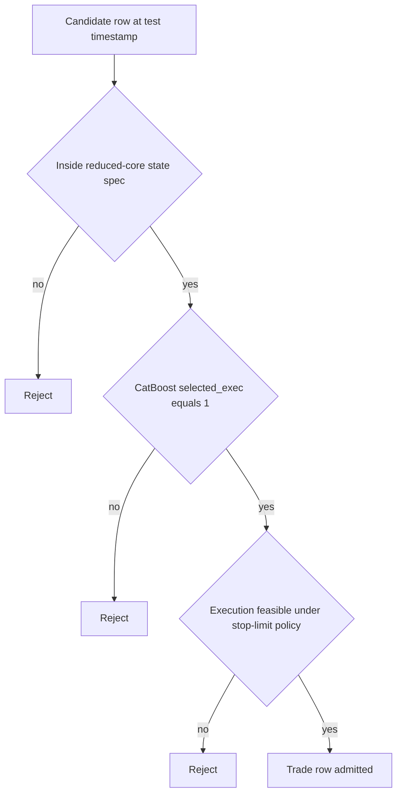

# Stage 5 - Reduced Core Selection

## Objective
Reduce candidate universe to a stable, capacity-valid core set with preserved expectancy.

## Inputs
- Reduced summary:
- `data/analysis/tick_opportunity_mining/reduced_core_rolling*/<SYMBOL>_oco_reduced_summary.csv`
- Reduced monthly:
- `data/analysis/tick_opportunity_mining/reduced_core_rolling*/<SYMBOL>_oco_reduced_monthly.csv`
- State churn:
- `data/analysis/tick_opportunity_mining/reduced_core_rolling*/<SYMBOL>_oco_reduced_state_churn.csv`

## Process
- Select reduced states month-by-month using prior train window.
- Validate capacity floor and state churn constraints.
- Compute reduction diagnostics (`R01-R03`).
- Enforce that reduced states stay inside the pre-registered rule universe contract.

## Dependency on Stage 3 (CatBoost Outputs)
- Stage 5 consumes Stage 3 prediction artifacts (`*_monthly_predictions.parquet`) and does not refit CatBoost.
- Default reduced-core entry set is controlled by `selection_mode`:
- `auto` / `exec_flag`: uses Stage 3 execution flag (`selected_exec == 1`).
- `monthly_quantile`: recomputes monthwise quantile filter from `pred_prob` when explicitly configured.
- Stage 3 is model-level row ranking; Stage 5 is state-level governance filtering:
- model layer: probability thresholding (`pred_prob`, `threshold_exec`, `selected_exec`)
- state layer: stability/capacity/risk gates across rolling train months
- If Stage 3 predictions are stale for the current test month, Stage 5 outputs are operationally invalid.

## CatBoost x Core Spec Interaction
- Final tradable rows are the strict intersection of three gates:
- `core_spec_match == 1` (row is inside reduced-core state set)
- `selected_exec == 1` (Stage 3 CatBoost passed execution threshold)
- `execution_feasible == 1` (Stage 4 stop-limit realism/fill constraints passed)
- Operational rule:
- `trade_row = core_spec_match AND selected_exec AND execution_feasible`
- Rejection logic:
- CatBoost positive but outside core spec -> reject.
- Core spec match but CatBoost below threshold -> reject.
- Passes both but execution infeasible (for configured cap/fill policy) -> reject.



### Row-Level Example
- Example row:
- `state_key=tf30_revert_b2_h3`
- `core_spec_match=1`
- `pred_prob=0.84`
- `threshold_exec=0.79`
- `selected_exec=1`
- `execution_feasible=1`
- Outcome: admitted (`trade_row=1`).
- If the same row had `core_spec_match=0`, it would be rejected even with `selected_exec=1`.

## Exact Calculations
- `R01_post_pre_row_ratio = reduced_rows / prefilter_wfo_selected_rows`
- `R02_top_state_dependency = max_top_state_share` (or `top_state_share` if available)
- `R03_reselection_stability = 1 - mean(state_churn_rate)`

## Rule-Universe Enforcement
- Registry artifact: `configs/research/governance/oco_rule_universe_registry.yaml`
- Allowed reduced dimensions:
- families: `allowed_families`
- barriers: `allowed_barrier_keep`
- horizons: `allowed_horizon_keep`
- Contract checks:
- `RU08`: reduced states file exists per symbol.
- `RU09`: every reduced state row is inside the registered universe.
- Artifacts:
- `data/analysis/tick_opportunity_mining/oco_rule_universe_registry_checks.csv`
- `data/analysis/tick_opportunity_mining/oco_rule_universe_registry_issues.csv`
- `docs/analysis/oco_rule_universe_registry_report.md`

## Causality / Leakage Controls
- State schedule and selection produced from prior-month training only.
- Universe lock prevents post-hoc adding states/families discovered after out-of-sample review.

## Failure Modes
- Over-pruning removes too much capacity.
- Top-state dependency increases fragility.
- High churn indicates unstable core.

## Interpretation Guide
- `R01` too low: likely over-pruned.
- `R02` high: concentration risk.
- `R03` high: more stable monthly state persistence.

## Validation Gates
- Capacity and stability conditions are hard gates in reduced-core outputs.
- `R01-R03` are monitoring diagnostics.
- Hard governance condition: reduced states must pass registry scope checks (`RU09`, surfaced by `C33`).

## Canonical Analysis Reports
- `docs/analysis/eurusd_oco_reduced_core_rolling_report.md`
- `docs/analysis/gbpusd_oco_reduced_core_rolling_report.md`
- `docs/analysis/usdjpy_oco_reduced_core_rolling_report.md`
- `docs/analysis/oco_rule_universe_registry_report.md`

## Operator Decision Tree
- If any hard gate in this stage fails, block promotion and escalate using the operator runbook.
- If only warning/amber diagnostics trigger, continue with mitigation and add an owner/deadline in remediation artifacts.

## How To Run
- Run the `Reproduction Commands` in this stage exactly as listed.
- Confirm artifacts are refreshed and timestamps are current before interpreting outcomes.

## How To Interpret Outputs
- Read `Key Results` first for pass/fail posture and core health metrics.
- Use `Interpretation Notes` and `Action Trigger Summary` to map observed values to operational actions.

## What To Do If It Fails
- `critical/high`: halt deployment progression, remediate root cause, rerun stage and downstream dependent stages.
- `medium/low`: open tracked remediation with owner and ETA, monitor for recurrence in next cycle.

## Reproduction Commands
```bash
uv run python scripts/select_oco_reduced_core_rolling.py \
  --symbols EURUSD,GBPUSD,USDJPY,USDCHF,AUDUSD,USDCAD
uv run python scripts/validate_oco_rule_universe_registry.py
```

## Traceability
- `scripts/select_oco_reduced_core_rolling.py`
- `scripts/validate_oco_rule_universe_registry.py`
- `docs/analysis/*_oco_reduced_core_rolling_report.md`
- `docs/analysis/oco_rule_universe_registry_report.md`
- `docs/strategy_bible/generated/stage_05_snapshot.md`

## Generated Run Snapshot
<!-- GENERATED:STAGE_05:START -->
### Auto Snapshot - Stage 05

- generated_at: `2026-03-23 20:05:07 UTC`
- State schedule is selected month-by-month using only prior-month train data.
- Summary emphasizes full-path gross behavior after reduced-core filtering.
- R01-R03 track pruning severity, state concentration, and re-selection stability.

#### Key Results
| symbol   |   rows_total |   mean_gross_pips |   lb95_month_mean_gross_pips |   fill_rate_overall |   positive_months |   months_total |   r01_post_pre_row_ratio |   r02_top_state_dependency |   r03_reselection_stability |
|:---------|-------------:|------------------:|-----------------------------:|--------------------:|------------------:|---------------:|-------------------------:|---------------------------:|----------------------------:|
| EURUSD   |         4320 |           2.3906  |                     1.4302   |            0.970568 |                 8 |             15 |               0.00977462 |                       0.35 |                    0.333333 |
| GBPUSD   |         8918 |           2.6216  |                     2.09206  |            0.883933 |                11 |             15 |               0.0206839  |                       0.35 |                    0.343939 |
| AUDUSD   |         4722 |           1.65684 |                     0.992865 |            0.858545 |                 9 |             15 |               0.0122462  |                       0.35 |                    0.351852 |
| USDJPY   |         8611 |           3.572   |                     2.87881  |            0.842399 |                11 |             15 |               0.018268   |                       0.35 |                    0.530303 |
| USDCHF   |         4874 |           1.8317  |                     1.28827  |            0.854189 |                11 |             15 |               0.0139665  |                       0.35 |                    0.287879 |
| USDCAD   |         7083 |         nan       |                     1.23389  |            0.941388 |                10 |             15 |               0.014137   |                       0.35 |                    0.5      |

#### Interpretation Notes
- State schedule is selected month-by-month using only prior-month train data.
- Summary emphasizes full-path gross behavior after reduced-core filtering.
- R01-R03 track pruning severity, state concentration, and re-selection stability.

#### Action Trigger Summary
| symbol   | metric_id                | band   | severity   | action_code   | action_summary     | owner    |
|:---------|:-------------------------|:-------|:-----------|:--------------|:-------------------|:---------|
| AUDUSD   | R02_top_state_dependency | green  | info       | A0_MONITOR    | within policy band | research |
| EURUSD   | R02_top_state_dependency | green  | info       | A0_MONITOR    | within policy band | research |
| GBPUSD   | R02_top_state_dependency | green  | info       | A0_MONITOR    | within policy band | research |
| USDCAD   | R02_top_state_dependency | green  | info       | A0_MONITOR    | within policy band | research |
| USDCHF   | R02_top_state_dependency | green  | info       | A0_MONITOR    | within policy band | research |
| USDJPY   | R02_top_state_dependency | green  | info       | A0_MONITOR    | within policy band | research |

#### Details
| symbol   |   months |   rows_total |   mean_fill_rate |   mean_gross |
|:---------|---------:|-------------:|-----------------:|-------------:|
| AUDUSD   |       15 |         4722 |         0.861511 |      1.23782 |
| EURUSD   |       15 |         4320 |         0.968597 |      1.93697 |
| GBPUSD   |       15 |         8918 |         0.790857 |      2.3668  |
| USDCAD   |       15 |         7083 |         0.782772 |      1.46948 |
| USDCHF   |       15 |         4874 |         0.789643 |      1.57772 |
| USDJPY   |       15 |         8611 |         0.792541 |      3.2536  |

#### Plots


#### State Churn
| symbol   | test_month   |   states_selected |   state_churn_rate |   top_state_share |   state_hhi |   stability_pass | status         |
|:---------|:-------------|------------------:|-------------------:|------------------:|------------:|-----------------:|:---------------|
| EURUSD   | 2025-01      |                 0 |         nan        |        nan        |  nan        |              nan | warmup_skip    |
| EURUSD   | 2025-02      |                 0 |         nan        |        nan        |  nan        |              nan | warmup_skip    |
| EURUSD   | 2025-03      |                 0 |         nan        |        nan        |  nan        |              nan | warmup_skip    |
| EURUSD   | 2025-04      |                 2 |           0        |          0.557143 |    0.506531 |                0 | ok             |
| EURUSD   | 2025-05      |                 2 |           1        |          0.654297 |    0.547615 |                0 | ok             |
| EURUSD   | 2025-06      |                 2 |           1        |          0.848921 |    0.743492 |                0 | ok             |
| EURUSD   | 2025-07      |                 2 |           0.666667 |          0.520362 |    0.500829 |                0 | ok             |
| EURUSD   | 2025-08      |                 2 |           0        |          0.529304 |    0.501717 |                0 | ok             |
| EURUSD   | 2025-09      |                 1 |           1        |          1        |    1        |                0 | ok             |
| EURUSD   | 2025-10      |                 2 |           1        |          0.653527 |    0.547141 |                0 | ok             |
| EURUSD   | 2025-11      |                 2 |           0.666667 |          0.514124 |    0.500399 |                0 | ok             |
| EURUSD   | 2025-12      |                 0 |         nan        |        nan        |  nan        |              nan | no_gate_states |
| EURUSD   | 2026-01      |                 0 |         nan        |        nan        |  nan        |              nan | no_gate_states |
| EURUSD   | 2026-02      |                 0 |         nan        |        nan        |  nan        |              nan | no_gate_states |
| EURUSD   | 2026-03      |                 0 |         nan        |        nan        |  nan        |              nan | no_gate_states |
| GBPUSD   | 2025-01      |                 0 |         nan        |        nan        |  nan        |              nan | warmup_skip    |
| GBPUSD   | 2025-02      |                 0 |         nan        |        nan        |  nan        |              nan | warmup_skip    |
| GBPUSD   | 2025-03      |                 0 |         nan        |        nan        |  nan        |              nan | warmup_skip    |
| GBPUSD   | 2025-04      |                 1 |           0        |          1        |    1        |                0 | ok             |
| GBPUSD   | 2025-05      |                 2 |           1        |          0.566923 |    0.508957 |                0 | ok             |
| GBPUSD   | 2025-06      |                 1 |           1        |          1        |    1        |                0 | ok             |
| GBPUSD   | 2025-07      |                 3 |           0.666667 |          0.465217 |    0.401853 |                0 | ok             |
| GBPUSD   | 2025-08      |                 3 |           0.8      |          0.510676 |    0.397962 |                0 | ok             |
| GBPUSD   | 2025-09      |                 2 |           0.75     |          0.506815 |    0.500093 |                0 | ok             |
| GBPUSD   | 2025-10      |                 2 |           0        |          0.512907 |    0.500333 |                0 | ok             |
| GBPUSD   | 2025-11      |                 2 |           0.666667 |          0.606884 |    0.522848 |                0 | ok             |
| GBPUSD   | 2025-12      |                 2 |           0.666667 |          0.511727 |    0.500275 |                0 | ok             |
| GBPUSD   | 2026-01      |                 2 |           0.666667 |          0.597841 |    0.519146 |                0 | ok             |
| GBPUSD   | 2026-02      |                 1 |           1        |          1        |    1        |                0 | ok             |
| GBPUSD   | 2026-03      |                 0 |         nan        |        nan        |  nan        |              nan | no_gate_states |
| AUDUSD   | 2025-01      |                 0 |         nan        |        nan        |  nan        |              nan | warmup_skip    |
| AUDUSD   | 2025-02      |                 0 |         nan        |        nan        |  nan        |              nan | warmup_skip    |
| AUDUSD   | 2025-03      |                 0 |         nan        |        nan        |  nan        |              nan | warmup_skip    |
| AUDUSD   | 2025-04      |                 1 |           0        |          1        |    1        |                0 | ok             |
| AUDUSD   | 2025-05      |                 2 |           0.5      |          0.860034 |    0.759249 |                0 | ok             |
| AUDUSD   | 2025-06      |                 2 |           0.666667 |          0.553528 |    0.50573  |                0 | ok             |
| AUDUSD   | 2025-07      |                 2 |           1        |          0.678161 |    0.563483 |                0 | ok             |
| AUDUSD   | 2025-08      |                 2 |           1        |          0.559441 |    0.507066 |                0 | ok             |
| AUDUSD   | 2025-09      |                 2 |           0.666667 |          0.613971 |    0.525979 |                0 | ok             |
| AUDUSD   | 2025-10      |                 1 |           0.5      |          1        |    1        |                0 | ok             |
| AUDUSD   | 2025-11      |                 0 |         nan        |        nan        |  nan        |              nan | no_gate_states |
| AUDUSD   | 2025-12      |                 1 |           1        |          1        |    1        |                0 | ok             |
| AUDUSD   | 2026-01      |                 2 |           0.5      |          0.506494 |    0.500084 |                0 | ok             |
| AUDUSD   | 2026-02      |                 0 |         nan        |        nan        |  nan        |              nan | no_gate_states |
| AUDUSD   | 2026-03      |                 0 |         nan        |        nan        |  nan        |              nan | no_gate_states |
| USDJPY   | 2025-01      |                 0 |         nan        |        nan        |  nan        |              nan | warmup_skip    |
| USDJPY   | 2025-02      |                 0 |         nan        |        nan        |  nan        |              nan | warmup_skip    |
| USDJPY   | 2025-03      |                 0 |         nan        |        nan        |  nan        |              nan | warmup_skip    |
| USDJPY   | 2025-04      |                 1 |           0        |          1        |    1        |                0 | ok             |
| USDJPY   | 2025-05      |                 1 |           0        |          1        |    1        |                0 | ok             |
| USDJPY   | 2025-06      |                 1 |           0        |          1        |    1        |                0 | ok             |
| USDJPY   | 2025-07      |                 2 |           0.5      |          0.504601 |    0.500042 |                0 | ok             |
| USDJPY   | 2025-08      |                 2 |           0        |          0.501551 |    0.500005 |                0 | ok             |
| USDJPY   | 2025-09      |                 2 |           1        |          0.666343 |    0.55534  |                0 | ok             |
| USDJPY   | 2025-10      |                 2 |           0.666667 |          0.509766 |    0.500191 |                0 | ok             |
| USDJPY   | 2025-11      |                 2 |           0.666667 |          0.532258 |    0.502081 |                0 | ok             |
| USDJPY   | 2025-12      |                 2 |           0.666667 |          0.555219 |    0.506098 |                0 | ok             |
| USDJPY   | 2026-01      |                 2 |           0.666667 |          0.57196  |    0.510357 |                0 | ok             |
| USDJPY   | 2026-02      |                 1 |           1        |          1        |    1        |                0 | ok             |
| USDJPY   | 2026-03      |                 0 |         nan        |        nan        |  nan        |              nan | no_gate_states |
| USDCHF   | 2025-01      |                 0 |         nan        |        nan        |  nan        |              nan | warmup_skip    |
| USDCHF   | 2025-02      |                 0 |         nan        |        nan        |  nan        |              nan | warmup_skip    |
| USDCHF   | 2025-03      |                 0 |         nan        |        nan        |  nan        |              nan | warmup_skip    |
| USDCHF   | 2025-04      |                 1 |           0        |          1        |    1        |                0 | ok             |
| USDCHF   | 2025-05      |                 1 |           1        |          1        |    1        |                0 | ok             |
| USDCHF   | 2025-06      |                 2 |           1        |          0.763333 |    0.638689 |                0 | ok             |
| USDCHF   | 2025-07      |                 1 |           1        |          1        |    1        |                0 | ok             |
| USDCHF   | 2025-08      |                 2 |           0.5      |          0.522496 |    0.501012 |                0 | ok             |
| USDCHF   | 2025-09      |                 2 |           0.666667 |          0.554415 |    0.505922 |                0 | ok             |
| USDCHF   | 2025-10      |                 1 |           1        |          1        |    1        |                0 | ok             |
| USDCHF   | 2025-11      |                 1 |           0        |          1        |    1        |                0 | ok             |
| USDCHF   | 2025-12      |                 2 |           1        |          0.629921 |    0.533759 |                0 | ok             |
| USDCHF   | 2026-01      |                 2 |           0.666667 |          0.535645 |    0.502541 |                0 | ok             |
| USDCHF   | 2026-02      |                 2 |           1        |          0.836634 |    0.726644 |                0 | ok             |
| USDCHF   | 2026-03      |                 0 |         nan        |        nan        |  nan        |              nan | no_gate_states |
| USDCAD   | 2025-01      |                 0 |         nan        |        nan        |  nan        |              nan | warmup_skip    |
| USDCAD   | 2025-02      |                 0 |         nan        |        nan        |  nan        |              nan | warmup_skip    |
| USDCAD   | 2025-03      |                 0 |         nan        |        nan        |  nan        |              nan | warmup_skip    |
| USDCAD   | 2025-04      |                 2 |           0        |          0.771871 |    0.647827 |                0 | ok             |
| USDCAD   | 2025-05      |                 2 |           0        |          0.938333 |    0.884272 |                0 | ok             |
| USDCAD   | 2025-06      |                 2 |           0.666667 |          0.62995  |    0.533774 |                0 | ok             |
| USDCAD   | 2025-07      |                 2 |           0.666667 |          0.537112 |    0.502755 |                0 | ok             |
| USDCAD   | 2025-08      |                 2 |           0.666667 |          0.751004 |    0.626006 |                0 | ok             |
| USDCAD   | 2025-09      |                 2 |           1        |          0.688356 |    0.570956 |                0 | ok             |
| USDCAD   | 2025-10      |                 1 |           0.5      |          1        |    1        |                0 | ok             |
| USDCAD   | 2025-11      |                 1 |           1        |          1        |    1        |                0 | ok             |
| USDCAD   | 2025-12      |                 1 |           0        |          1        |    1        |                0 | ok             |
| USDCAD   | 2026-01      |                 2 |           0.5      |          0.798206 |    0.677854 |                0 | ok             |
| USDCAD   | 2026-02      |                 1 |           0.5      |          1        |    1        |                0 | ok             |
| USDCAD   | 2026-03      |                 0 |         nan        |        nan        |  nan        |              nan | no_gate_states |

#### Leakage/Label Integrity (Reduced-Core Focus)
| symbol   |   checks_total |   checks_failed | failed_check_ids   |
|:---------|---------------:|----------------:|:-------------------|
| EURUSD   |              3 |               0 |                    |
| GBPUSD   |              3 |               0 |                    |
| AUDUSD   |              3 |               0 |                    |
| USDJPY   |              3 |               0 |                    |
| USDCHF   |              3 |               0 |                    |
| USDCAD   |              3 |               0 |                    |
<!-- GENERATED:STAGE_05:END -->
