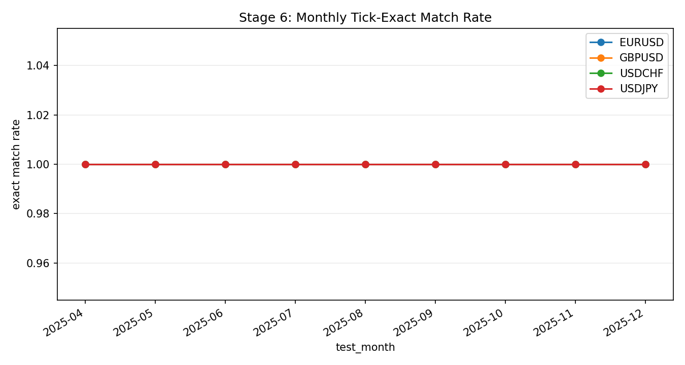

# Stage 6 - Tick-Exact Verification and Portability

## Objective
Verify label/path correctness at tick level and assess whether family-level edge transfers across symbols.

## Inputs
- Tick-exact summary/monthly/replay:
- `data/analysis/tick_opportunity_mining/reduced_core_rolling*/<SYMBOL>_oco_tick_exact_*.csv`
- Candidate catalogs across symbols:
- `data/analysis/tick_opportunity_mining/<SYMBOL>_oco_candidates.csv`

## Process
- Recompute outcomes with independent tick replay checks.
- Compare replay outcomes vs stored labels.
- Build cross-symbol family portability diagnostics (`X01-X03`).

## Exact Calculations
- `X01_portable_family_count`:
- count of families with positive mean gross across all tracked symbols
- `X02_family_std_mean`:
- mean across families of std(symbol-level family mean gross)
- `X03_family_spread_mean`:
- mean across families of (max-min symbol-level family mean gross)

## Causality / Leakage Controls
- Replay validation uses the same event keys and tick chronology.
- Portability uses historical outcomes only; no forward leakage.

## Failure Modes
- Hidden replay mismatches despite aggregate pass rates.
- Edge that appears strong but is symbol-specific and non-transferable.

## Interpretation Guide
- Higher tick-exact rates imply contract fidelity.
- Higher `X01` implies better transferability.
- Lower `X02/X03` imply lower cross-symbol dispersion.

## Validation Gates
- Tick-exact contract checks are hard.
- `X01-X03` are informational for universality assessment.

## Canonical Analysis Reports
- `docs/analysis/eurusd_oco_tick_exact_rolling_report.md`
- `docs/analysis/gbpusd_oco_tick_exact_rolling_report.md`
- `docs/analysis/usdjpy_oco_tick_exact_rolling_report.md`

## Operator Decision Tree
- If any hard gate in this stage fails, block promotion and escalate using the operator runbook.
- If only warning/amber diagnostics trigger, continue with mitigation and add an owner/deadline in remediation artifacts.

## How To Run
- Run the `Reproduction Commands` in this stage exactly as listed.
- Confirm artifacts are refreshed and timestamps are current before interpreting outcomes.

## How To Interpret Outputs
- Read `Key Results` first for pass/fail posture and core health metrics.
- Use `Interpretation Notes` and `Action Trigger Summary` to map observed values to operational actions.

## What To Do If It Fails
- `critical/high`: halt deployment progression, remediate root cause, rerun stage and downstream dependent stages.
- `medium/low`: open tracked remediation with owner and ETA, monitor for recurrence in next cycle.

## Reproduction Commands
```bash
uv run python scripts/verify_oco_tick_exact_shortlist.py \
  --symbols EURUSD,GBPUSD,USDJPY,USDCHF
```

## Traceability
- `scripts/verify_oco_tick_exact_shortlist.py`
- `docs/analysis/*_oco_tick_exact_rolling_report.md`
- `docs/strategy_bible/generated/stage_06_snapshot.md`

## Generated Run Snapshot
<!-- GENERATED:STAGE_06:START -->
### Auto Snapshot - Stage 06

- generated_at: `2026-02-28 22:08:13 UTC`
- Verifier recomputes OCO outcomes independently from stored labels.
- All summary rates should remain near 1.0 for contract consistency.

#### Key Results
| symbol   |   rows_selected |   rows_verified |   exact_match_rate |   pos_label_match_rate | overall_pass   |
|:---------|----------------:|----------------:|-------------------:|-----------------------:|:---------------|
| EURUSD   |            5903 |            5903 |                  1 |                      1 | True           |
| GBPUSD   |            7767 |            7767 |                  1 |                      1 | True           |
| USDJPY   |           11582 |           11582 |                  1 |                      1 | True           |
| USDCHF   |           36965 |           36965 |                  1 |                      1 | True           |

#### Interpretation Notes
- Verifier recomputes OCO outcomes independently from stored labels.
- All summary rates should remain near 1.0 for contract consistency.

#### Action Trigger Summary
| trigger            | threshold_or_signal   | action_code                   | action_summary                                                          |
|:-------------------|:----------------------|:------------------------------|:------------------------------------------------------------------------|
| hard_gate_fail     | status=fail           | A3_HALT_RECALIBRATE           | Block promotion and rerun upstream stage diagnostics before continuing. |
| monitoring_warning | band=amber            | A0_MONITOR/A1_RECALIBRATE_CAP | Apply stage runbook remediation and confirm next-run recovery.          |

#### Details
| symbol   |   months |   exact_min |   exact_mean |   pos_min |   pos_mean |
|:---------|---------:|------------:|-------------:|----------:|-----------:|
| EURUSD   |        9 |           1 |            1 |         1 |          1 |
| GBPUSD   |        9 |           1 |            1 |         1 |          1 |
| USDCHF   |        9 |           1 |            1 |         1 |          1 |
| USDJPY   |        9 |           1 |            1 |         1 |          1 |

#### Plots


#### Cross-Symbol Portability (X01-X03)
| family                |   symbols_covered |   mean_across_symbols |   std_across_symbols |   spread_max_min |   x01_all_symbols_positive |
|:----------------------|------------------:|----------------------:|---------------------:|-----------------:|---------------------------:|
| oco_first_touch_clean |                 6 |              1.66269  |            0.85245   |         2.36643  |                        nan |
| oco_first_touch       |                 6 |              0.176557 |            0.0590746 |         0.139407 |                        nan |
<!-- GENERATED:STAGE_06:END -->
