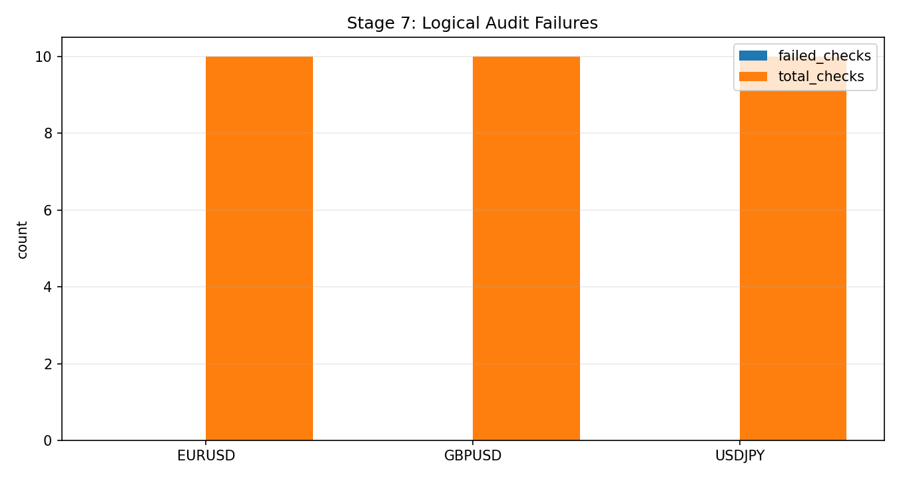

# Stage 7 - Logical and Statistical Audit

## Objective
Enforce logical pipeline contracts and summarize multiplicity-aware significance diagnostics.

## Inputs
- Logical audit checks/issues:
- `data/analysis/tick_opportunity_mining/oco_logical_audit_checks.csv`
- `data/analysis/tick_opportunity_mining/oco_logical_audit_issues.csv`
- Robustness summary (for inference ladder inputs):
- `data/analysis/tick_opportunity_mining/full_robustness/<SYMBOL>_oco_robustness_summary.csv`

## Process
- Evaluate `C01-C10` logical checks.
- Aggregate fails by symbol/severity.
- Build inference ladder diagnostics (`S01-S03`).

## Exact Calculations
- `S01_lb95_dependence_gap`:
- preferred: `lb95_trade_mean_gross_pips_iid - lb95_trade_mean_gross_pips_month_block`
- fallback: `lb95_trade_mean_gross_pips - lb95_trade_mean_gross_pips_month_block`
- sentinel if unavailable: `0.0`
- `S02_practical_lb95_gt0 = 1[lb95_trade_mean_gross_pips > 0]`
- `S03_multiplicity_survival = 1[bonferroni_pass OR fdr_pass]`

## Causality / Leakage Controls
- Logical checks include key ordering, partitioning, and lineage integrity.
- Significance metrics are interpreted only on out-of-sample WFO outputs.

## Failure Modes
- Hidden contract breaks despite positive PnL.
- Multiplicity-adjusted significance collapse.

## Interpretation Guide
- `S01` near 0 means minimal gap under dependence-aware lower bounds.
- `S02=1` indicates practical conservative positivity.
- `S03=1` indicates survival under multiplicity correction.

## Validation Gates
- `C01-C10` are hard logical gates.
- `S01-S03` are statistical interpretation diagnostics.

## Operator MRM Checks
- Verify any `S01` jump is explained by known dependence structure changes.
- Escalate if `S02` drops below 1 for any production symbol.
- Treat repeated `S03=0` as a model-risk event requiring re-selection review.

## Escalation Matrix
| condition | owner | action |
| --- | --- | --- |
| `S02 < 1` | research | halt symbol from promotion pipeline |
| `S03 = 0` in two consecutive runs | research + risk | rerun Stage 2-5 with constrained state family |
| `S01` exceeds historical p95 | risk | add temporary uncertainty uplift and monitor |

## Canonical Analysis Reports
- `docs/analysis/oco_logical_audit_report.md`
- `docs/analysis/oco_edge_clarity_report.md`
- `docs/analysis/oco_governance_explainability_report.md`
- `docs/strategy_bible/operator_runbook.md`

## Operator Decision Tree
- If any hard gate in this stage fails, block promotion and escalate using the operator runbook.
- If only warning/amber diagnostics trigger, continue with mitigation and add an owner/deadline in remediation artifacts.

## How To Run
- Run the `Reproduction Commands` in this stage exactly as listed.
- Confirm artifacts are refreshed and timestamps are current before interpreting outcomes.

## How To Interpret Outputs
- Read `Key Results` first for pass/fail posture and core health metrics.
- Use `Interpretation Notes` and `Action Trigger Summary` to map observed values to operational actions.

## What To Do If It Fails
- `critical/high`: halt deployment progression, remediate root cause, rerun stage and downstream dependent stages.
- `medium/low`: open tracked remediation with owner and ETA, monitor for recurrence in next cycle.

## Reproduction Commands
```bash
uv run python scripts/audit_oco_pipeline_logical_issues.py
```

## Traceability
- `scripts/audit_oco_pipeline_logical_issues.py`
- `docs/analysis/oco_logical_audit_report.md`
- `docs/strategy_bible/generated/stage_07_snapshot.md`

## Generated Run Snapshot
<!-- GENERATED:STAGE_07:START -->
### Auto Snapshot - Stage 07

- generated_at: `2026-03-05 14:41:51 UTC`
- C01..C10 checks are the logical contract gate before robustness sign-off.
- Open issue rows: 0.

#### Key Results
| symbol   |   total_checks |   failed_checks |
|:---------|---------------:|----------------:|
| AUDUSD   |             10 |               0 |
| EURUSD   |             10 |               0 |
| GBPUSD   |             10 |               0 |
| USDCAD   |             10 |               0 |
| USDCHF   |             10 |               0 |
| USDJPY   |             10 |               0 |

#### Interpretation Notes
- C01..C10 checks are the logical contract gate before robustness sign-off.
- Open issue rows: 0.

#### Action Trigger Summary
| symbol   | metric_id               | band   | severity   | action_code    | action_summary         | owner    |
|:---------|:------------------------|:-------|:-----------|:---------------|:-----------------------|:---------|
| AUDUSD   | S01_lb95_dependence_gap | green  | info       | A0_MONITOR     | within policy band     | research |
| AUDUSD   | S02_practical_lb95_gt0  | green  | info       | A0_MONITOR     | within policy band     | research |
| EURUSD   | S01_lb95_dependence_gap | red    | high       | A2_RECALIBRATE | escalate and remediate | research |
| EURUSD   | S02_practical_lb95_gt0  | green  | info       | A0_MONITOR     | within policy band     | research |
| GBPUSD   | S01_lb95_dependence_gap | green  | info       | A0_MONITOR     | within policy band     | research |
| GBPUSD   | S02_practical_lb95_gt0  | green  | info       | A0_MONITOR     | within policy band     | research |
| USDCAD   | S01_lb95_dependence_gap | green  | info       | A0_MONITOR     | within policy band     | research |
| USDCAD   | S02_practical_lb95_gt0  | green  | info       | A0_MONITOR     | within policy band     | research |
| USDCHF   | S01_lb95_dependence_gap | green  | info       | A0_MONITOR     | within policy band     | research |
| USDCHF   | S02_practical_lb95_gt0  | green  | info       | A0_MONITOR     | within policy band     | research |
| USDJPY   | S01_lb95_dependence_gap | amber  | medium     | A1_REVIEW      | review and monitor     | research |
| USDJPY   | S02_practical_lb95_gt0  | green  | info       | A0_MONITOR     | within policy band     | research |

#### Details
| check_id   | status   |   size |
|:-----------|:---------|-------:|
| C01        | pass     |      6 |
| C02        | pass     |      6 |
| C03        | pass     |      6 |
| C04        | pass     |      6 |
| C05        | pass     |      6 |
| C06        | pass     |      6 |
| C07        | pass     |      6 |
| C08        | pass     |      6 |
| C09        | pass     |      6 |
| C10        | pass     |      6 |

#### Plots


#### Statistical Inference Ladder (S01-S03)
| symbol   |   lb95_trade_mean_gross_pips |   s01_lb95_dependence_gap |   pvalue_bonferroni |   pvalue_fdr_bh |   s02_practical_lb95_gt0 |   s03_multiplicity_survival |
|:---------|-----------------------------:|--------------------------:|--------------------:|----------------:|-------------------------:|----------------------------:|
| AUDUSD   |                     0.952247 |                  0.11299  |                   0 |               0 |                        1 |                           1 |
| EURUSD   |                     2.5027   |                  0.69806  |                   0 |               0 |                        1 |                           1 |
| GBPUSD   |                     2.57413  |                  0.124853 |                   0 |               0 |                        1 |                           1 |
| USDCAD   |                     1.41111  |                  0.201013 |                   0 |               0 |                        1 |                           1 |
| USDCHF   |                     1.37476  |                  0.160085 |                   0 |               0 |                        1 |                           1 |
| USDJPY   |                     3.41566  |                  0.25702  |                   0 |               0 |                        1 |                           1 |
<!-- GENERATED:STAGE_07:END -->
