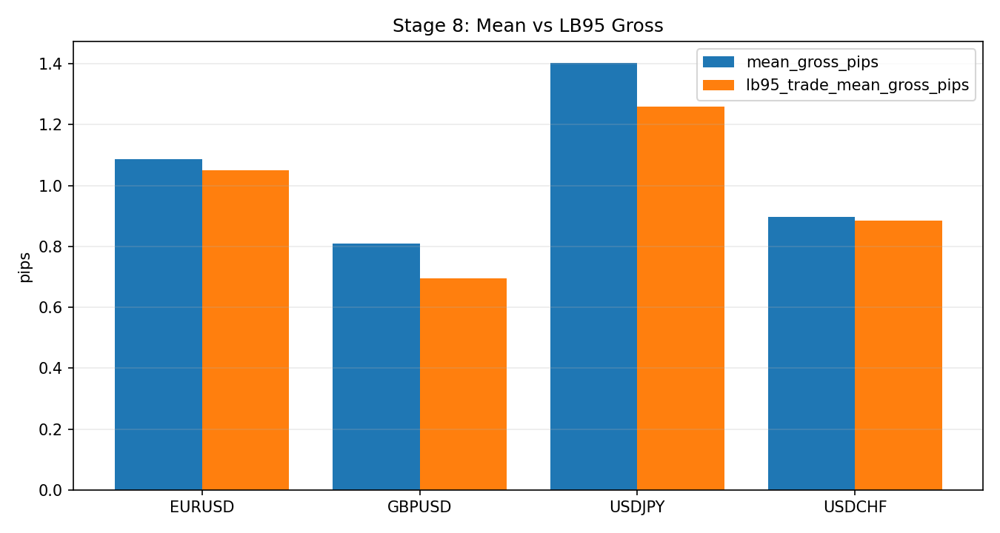
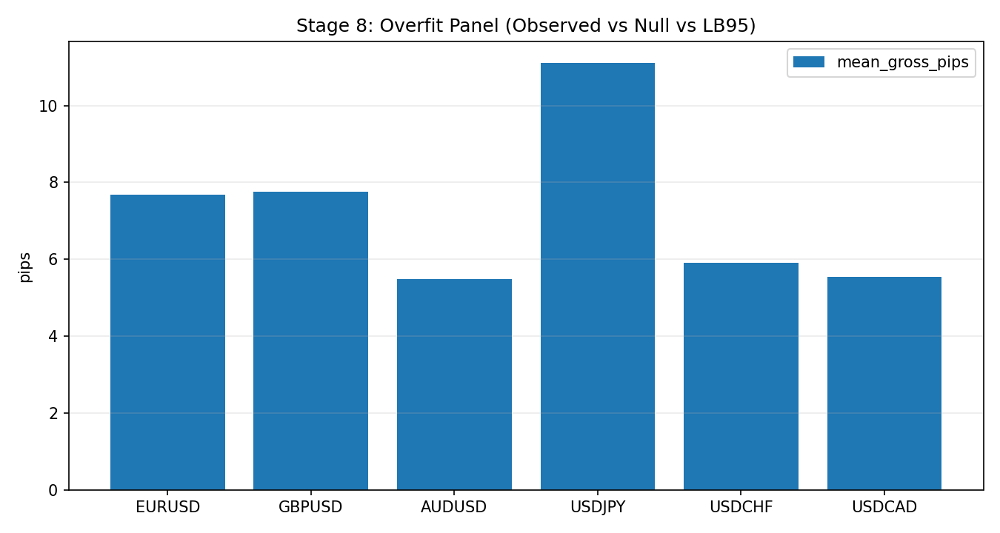

# Stage 8 - Robustness and Stress

## Objective
Quantify conservative expectancy and stress elasticity under cost and regime perturbations.

## Inputs
- Robustness summary:
- `data/analysis/tick_opportunity_mining/full_robustness/<SYMBOL>_oco_robustness_summary.csv`
- Reduced monthly outputs:
- `data/analysis/tick_opportunity_mining/reduced_core_rolling*/<SYMBOL>_oco_reduced_monthly.csv`

## Process
- Evaluate bootstrap LB95 and multiplicity-adjusted metrics.
- Evaluate cost-plus stress curve behavior.
- Compute stress diagnostics (`T01-T04`).

## Exact Calculations
- `T01_stress_elasticity`:
- slope across available `mean_net_pips_costplus_*` levels
- `T02_first_negative_costplus`:
- minimum stress level where net turns negative; if never negative, set to max tested level
- `T03_post_worst_month_recovery`:
- `mean_gross(next_month_after_worst) / abs(mean_gross(worst_month))`
- `T04_max_survivable_cost_lb95_trade`:
- highest extra round-trip cost where `lb95_trade_mean_net_pips_costplus_* > 0`
- if crossing exists between stress points, estimate crossing with linear interpolation

## Causality / Leakage Controls
- Uses finalized out-of-sample monthly artifacts only.

## Failure Modes
- Positive mean but negative conservative lower bound.
- Excessive sensitivity to cost assumptions.
- Poor recovery after adverse month.

## Interpretation Guide
- `T01` less negative is more resilient.
- Higher `T02` implies deeper cost resilience.
- Higher `T04` gives a direct operational extra-cost headroom estimate under LB95.
- Higher `T03` suggests stronger post-worst-month recovery efficiency.

## Validation Gates
- Robustness LB95 and monthly consistency are hard promotion criteria.
- `T01-T04` are stress diagnostics for hardening.

## Canonical Analysis Reports
- `docs/analysis/eurusd_oco_monthly_wfo_robustness_fullcap_report.md`
- `docs/analysis/gbpusd_oco_monthly_wfo_robustness_fullcap_report.md`
- `docs/analysis/usdjpy_oco_monthly_wfo_robustness_fullcap_report.md`
- `docs/analysis/remediation_metric_decomposition.md`

## Operator Decision Tree
- If any hard gate in this stage fails, block promotion and escalate using the operator runbook.
- If only warning/amber diagnostics trigger, continue with mitigation and add an owner/deadline in remediation artifacts.

## How To Run
- Run the `Reproduction Commands` in this stage exactly as listed.
- Confirm artifacts are refreshed and timestamps are current before interpreting outcomes.

## How To Interpret Outputs
- Read `Key Results` first for pass/fail posture and core health metrics.
- Use `Interpretation Notes` and `Action Trigger Summary` to map observed values to operational actions.

## What To Do If It Fails
- `critical/high`: halt deployment progression, remediate root cause, rerun stage and downstream dependent stages.
- `medium/low`: open tracked remediation with owner and ETA, monitor for recurrence in next cycle.

## Reproduction Commands
```bash
uv run python scripts/analyze_oco_monthly_wfo_robustness.py \
  --symbols EURUSD,GBPUSD,USDJPY,USDCHF
```

## Traceability
- `scripts/analyze_oco_monthly_wfo_robustness.py`
- `docs/analysis/*_oco_monthly_wfo_robustness_*_report.md`
- `docs/strategy_bible/generated/stage_08_snapshot.md`

## Generated Run Snapshot
<!-- GENERATED:STAGE_08:START -->
### Auto Snapshot - Stage 08

- generated_at: `2026-03-03 22:07:07 UTC`
- Robustness summary uses bootstrap lower bounds from the configured smoke/full run artifacts.
- Interpretation: LB95 > 0 indicates conservative positive expectancy under sampled uncertainty.
- Overfit panel adds month-stratified null uplift and dependence-aware LB95 comparisons.
- T01-T04 summarize stress elasticity, negative-cost crossing, max survivable cost, and post-worst-month recovery efficiency.

#### Key Results
| symbol   |   quantile |   rows |   months |   mean_gross_pips |   lb95_trade_mean_gross_pips |   positive_months |
|:---------|-----------:|-------:|---------:|------------------:|-----------------------------:|------------------:|
| EURUSD   |        0.9 |   6715 |       11 |           2.61078 |                     2.5027   |                11 |
| GBPUSD   |        0.9 |   6978 |        6 |           2.66873 |                     2.57413  |                 6 |
| AUDUSD   |        0.9 |   4227 |        6 |           1.04687 |                     0.952247 |                 6 |
| USDJPY   |        0.9 |   8186 |        6 |           3.52446 |                     3.41566  |                 6 |
| USDCHF   |        0.9 |   4170 |        6 |           1.4852  |                     1.37476  |                 6 |
| USDCAD   |        0.9 |   3574 |        6 |           1.52731 |                     1.41111  |                 6 |

#### Interpretation Notes
- Robustness summary uses bootstrap lower bounds from the configured smoke/full run artifacts.
- Interpretation: LB95 > 0 indicates conservative positive expectancy under sampled uncertainty.
- Overfit panel adds month-stratified null uplift and dependence-aware LB95 comparisons.

#### Action Trigger Summary
| symbol   | metric_id                     | band   | severity   | action_code    | action_summary         | owner   |
|:---------|:------------------------------|:-------|:-----------|:---------------|:-----------------------|:--------|
| AUDUSD   | T01_stress_elasticity         | green  | info       | A0_MONITOR     | within policy band     | risk    |
| AUDUSD   | T02_first_negative_costplus   | green  | info       | A0_MONITOR     | within policy band     | risk    |
| AUDUSD   | T03_post_worst_month_recovery | red    | high       | A2_RECALIBRATE | escalate and remediate | risk    |
| EURUSD   | T01_stress_elasticity         | green  | info       | A0_MONITOR     | within policy band     | risk    |
| EURUSD   | T02_first_negative_costplus   | green  | info       | A0_MONITOR     | within policy band     | risk    |
| EURUSD   | T03_post_worst_month_recovery | red    | high       | A2_RECALIBRATE | escalate and remediate | risk    |
| GBPUSD   | T01_stress_elasticity         | green  | info       | A0_MONITOR     | within policy band     | risk    |
| GBPUSD   | T02_first_negative_costplus   | green  | info       | A0_MONITOR     | within policy band     | risk    |
| GBPUSD   | T03_post_worst_month_recovery | green  | info       | A0_MONITOR     | within policy band     | risk    |
| USDCAD   | T01_stress_elasticity         | green  | info       | A0_MONITOR     | within policy band     | risk    |
| USDCAD   | T02_first_negative_costplus   | green  | info       | A0_MONITOR     | within policy band     | risk    |
| USDCAD   | T03_post_worst_month_recovery | red    | high       | A2_RECALIBRATE | escalate and remediate | risk    |

#### Details
| symbol   |   pvalue_month_mean_gt0 |   pvalue_bonferroni |   pvalue_fdr_bh |   t01_stress_elasticity |   t02_first_negative_costplus |   t04_max_survivable_cost_lb95_trade |   t03_post_worst_month_recovery |   lb95_trade_mean_net_pips_costplus_0.10 |   lb95_trade_mean_net_pips_costplus_0.20 |   lb95_trade_mean_net_pips_costplus_0.30 |   lb95_trade_mean_net_pips_costplus_0.50 |
|:---------|------------------------:|--------------------:|----------------:|------------------------:|------------------------------:|-------------------------------------:|--------------------------------:|-----------------------------------------:|-----------------------------------------:|-----------------------------------------:|-----------------------------------------:|
| EURUSD   |                       0 |                   0 |               0 |                      -1 |                          2    |                             2        |                       nan       |                                 2.4017   |                                  2.30075 |                                 2.20463  |                                 2.00484  |
| GBPUSD   |                       0 |                   0 |               0 |                      -1 |                          2    |                             2        |                         1.33224 |                                 2.47431  |                                  2.37179 |                                 2.2695   |                                 2.06504  |
| AUDUSD   |                       0 |                   0 |               0 |                      -1 |                          1.25 |                             0.952033 |                       nan       |                                 0.858455 |                                  0.75712 |                                 0.653463 |                                 0.454145 |
| USDJPY   |                       0 |                   0 |               0 |                      -1 |                          2    |                             2        |                         1.04299 |                                 3.31926  |                                  3.21768 |                                 3.11615  |                                 2.91812  |
| USDCHF   |                       0 |                   0 |               0 |                      -1 |                          1.5  |                             1.37441  |                         1.03157 |                                 1.27737  |                                  1.17565 |                                 1.07228  |                                 0.876746 |
| USDCAD   |                       0 |                   0 |               0 |                      -1 |                          1.75 |                             1.41285  |                       nan       |                                 1.31144  |                                  1.21327 |                                 1.1118   |                                 0.912847 |

#### Plots


<!-- GENERATED:STAGE_08:END -->
