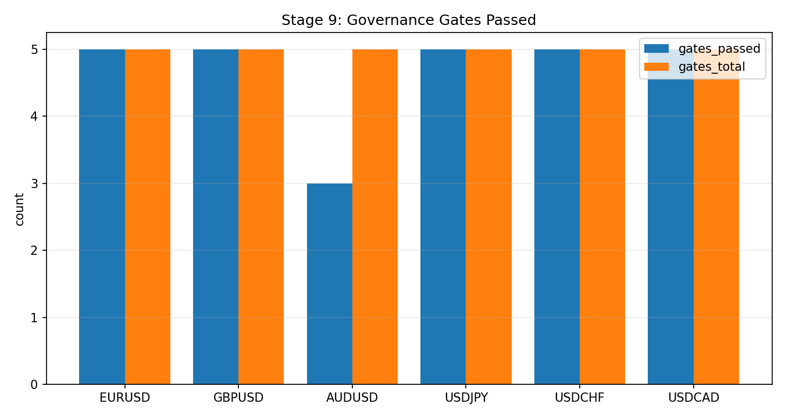
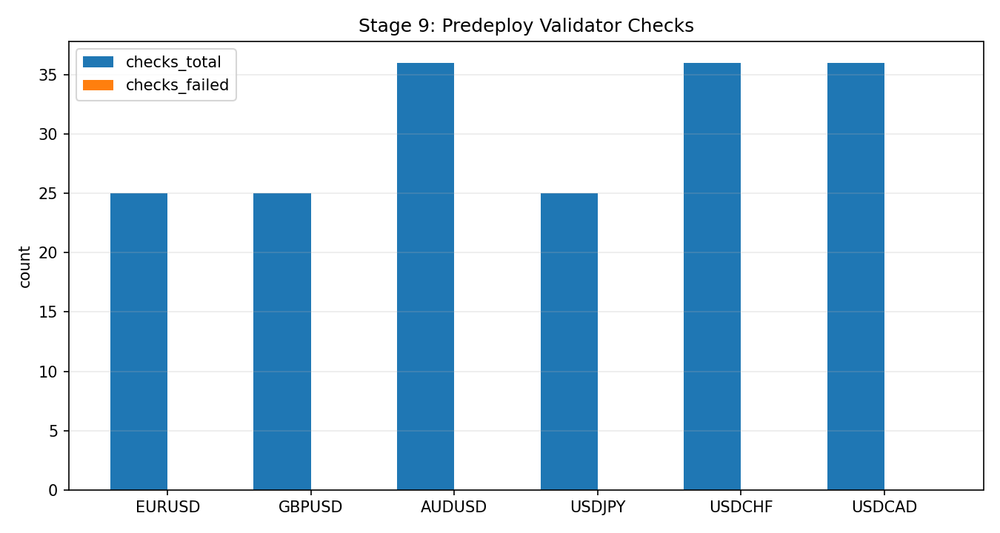

# Stage 9 - Live Governance And Deployment

## Objective
Freeze and validate allowed runtime behavior so deployment remains consistent with validated research contracts.

## Inputs
- Frozen lock artifacts and allowed state tables.
- Current deployment configs and selected state universe.

Implementations:
- Freeze: `scripts/freeze_oco_live_governance.py`
- Validate: `scripts/validate_oco_live_governance.py`

Default lock location:
- `configs/research/governance/oco/<symbol>_oco_live_lock.json`
- `configs/research/governance/oco/<symbol>_oco_allowed_states.csv`

## Process
- Freeze governance lock from validated outputs.
- Validate runtime settings against lock constraints.
- Enforce retrain/deploy windows and state-universe hash consistency.
- Validate the pre-registered rule universe against lock + reduced-core artifacts.
- Apply remediation dispositions for non-green monitoring alerts.

## Lock Manifest Schema (Canonical)
Top-level keys written by freeze script:
- `schema_version`
- `frozen_at_utc`
- `symbol`
- `git`:
- `commit`, `branch`, `dirty`
- `artifacts`:
- config/artifact paths + SHA256 hashes
- `tick_exact_overall_pass`
- `locked_runtime`:
- threshold, hold-mode, selection policy contract
- `state_universe`:
- `count`, `sha256`, `rows[]`
- `retrain_policy`:
- `mode`, `cadence_days`, `anchor_day_utc`, `window_days`

State universe hash contract:
- rows normalized to key columns
- sorted deterministically
- serialized to JSON
- `sha256(serialized_rows)` stored in lock

## Validator Check Set
`validate_oco_live_governance.py` enforces:
- `wfo_config_hash`
- `reduced_config_hash`
- `reduced_states_hash`
- optional data reliability gate checks:
- `data_reliability_artifact_exists`
- `data_reliability_rows_present`
- `data_reliability_no_critical_failures`
- `data_reliability_no_high_failures`
- optional leakage/label integrity gate checks:
- `leakage_artifact_exists`
- `leakage_rows_present`
- `leakage_no_critical_failures`
- `leakage_no_high_failures`
- optional execution-risk preflight gate checks:
- `execution_risk_artifact_exists`
- `execution_risk_rows_present`
- `execution_risk_no_critical_failures`
- `execution_risk_no_high_failures`
- optional runtime config key equality checks:
- WFO keys:
- `threshold_mode`, `rolling_threshold_days`, `rolling_threshold_min_history`
- `execution_quantile`, `oco_hold_mode`, `oco_include_no_touch`
- reduced-core keys:
- `locked_quantile`, `selection_mode`, `family_keep`, `barrier_keep`, `horizon_keep`
- `state_universe_exact_match`
- retrain/deploy window check:
- deploy mode: `as_of <= window_end`
- retrain mode: `window_start <= as_of <= window_end`

## Retrain Window Math
From lock:
- `frozen_date = date(frozen_at_utc)`
- `due = frozen_date + cadence_days`
- `window_start = due - window_days`
- `window_end = due + window_days`

## Exact Calculations
- Retrain due date:
- `due = date(frozen_at_utc) + cadence_days`
- Allowed retrain window:
- `[due - window_days, due + window_days]`
- Deploy validity:
- `as_of <= window_end`

## Outputs
- Governance artifacts under `configs/research/governance/oco/`
- Lock/validation reports in docs and logs.

## Causality / Leakage Controls
- Live runtime cannot expand beyond locked state universe.
- Threshold/hold-mode policy must match frozen governance contract.

## Edge Hypothesis
- Not an alpha source; this stage preserves validity of prior alpha findings during live use.

## Validation Gates
- Deploy validation passes.
- Retrain window policy passes.
- State hash and config hash match frozen lock.
- Rule-universe registry check has zero high/critical failures.
- Non-green drift/threshold alerts have active disposition records.

Hard deploy gate table:

| Gate | Rule | Severity |
| --- | --- | --- |
| G9.1 | all file SHA checks pass | Critical |
| G9.2 | runtime config keys equal lock values | Critical |
| G9.3 | state universe exact key-set match | Critical |
| G9.4 | deploy date not beyond lock window end | High |

Diagnostics-first governance checks (informational, not blockers yet):
- `G01`: near-fail pressure count from validator checks with low margin heuristics.
- `G02`: open-risk warning age (days) from SLA tracker.
- `G03`: lock drift flags from hash/state-universe related checks.

## Failure Modes
- Silent drift in runtime configs.
- Unapproved state expansion in production.
- Deploying with expired lock window.
- Lock generated from stale or mismatched artifacts.

## Interpretation Guide
- `checks_failed = 0` and `blocker = false` is required for deploy.
- Any hash/state mismatch indicates governance drift and must block release.
- `G01-G03` diagnostics indicate pressure and should be trended even if deploy passes.

## Operational Notes
- Any change to selection or threshold policy requires governance refresh and re-validation.

## Data/Docs Freshness Policy
- Freshness SLA: governed analysis artifacts must be refreshed within `168h` (7 days).
- Stale evidence is treated as a deployment blocker when it affects Stage 4, Stage 8, or Stage 9 decision inputs.
- Evidence sources:
- `docs/analysis/oco_docs_contract_report.md` (`C6 generated_artifacts_recency`)
- `docs/analysis/oco_alert_remediation_report.md` (active exceptions/expiry)
- `docs/analysis/oco_governance_explainability_report.md` (metric-level action context)
- If stale:
- rerun generation commands for affected stages,
- refresh governance lock validation,
- attach updated evidence before promotion.

## Operator Escalation Matrix
| trigger | severity | required action |
| --- | --- | --- |
| any hash mismatch (`G9.1-G9.3`) | critical | block deploy; restore frozen lock alignment |
| deploy outside window (`G9.4`) | high | refresh lock via approved retrain cycle |
| `G01` rising for 3 runs | medium | open risk review task; tighten predeploy checks |
| non-zero `G03` | high | halt release until lock drift root cause is closed |

Deployment runbook:
1. Freeze lock from freshly validated research outputs.
2. Validate deploy mode against lock using live config paths.
3. If any check fails, block deploy and rerun upstream stage(s).
4. Persist validator JSON output with release artifact.

Rollback rule:
- if live config/state drift is detected, revert to last passing lock + allowed states set and redeploy.

## Canonical Analysis Reports
- `docs/analysis/oco_live_governance_lock.md`
- `docs/analysis/oco_rule_universe_registry_report.md`
- `docs/analysis/run_delta_dashboard.md`
- `docs/analysis/operator_action_report.md`
- `docs/analysis/oco_alert_remediation_report.md`
- `docs/analysis/oco_governance_explainability_report.md`
- `docs/analysis/oco_threshold_sensitivity_report.md`
- `docs/strategy_bible/operator_runbook.md`

## Operator Decision Tree
- If any hard gate in this stage fails, block promotion and escalate using the operator runbook.
- If only warning/amber diagnostics trigger, continue with mitigation and add an owner/deadline in remediation artifacts.

## How To Run
- Run the `Reproduction Commands` in this stage exactly as listed.
- Confirm artifacts are refreshed and timestamps are current before interpreting outcomes.

## How To Interpret Outputs
- Read `Key Results` first for pass/fail posture and core health metrics.
- Use `Interpretation Notes` and `Action Trigger Summary` to map observed values to operational actions.

## What To Do If It Fails
- `critical/high`: halt deployment progression, remediate root cause, rerun stage and downstream dependent stages.
- `medium/low`: open tracked remediation with owner and ETA, monitor for recurrence in next cycle.

## Reproduction Commands
Freeze:
```bash
uv run python scripts/freeze_oco_live_governance.py \
  --symbols EURUSD,GBPUSD,USDJPY,USDCHF \
  --out-dir configs/research/governance/oco
```

Validate deploy:
```bash
uv run python scripts/validate_oco_live_governance.py \
  --lock-path configs/research/governance/oco/eurusd_oco_live_lock.json \
  --mode deploy \
  --state-csv data/analysis/tick_opportunity_mining/reduced_core/EURUSD_oco_reduced_states.csv \
  --wfo-config configs/research/experiments/eurusd_tick_opportunity_monthly_wfo_oco_fullcap_2025.yaml \
  --reduced-config configs/research/experiments/eurusd_oco_reduced_core_2025.yaml \
  --data-reliability-checks-csv data/analysis/tick_opportunity_mining/data_reliability_checks.csv \
  --leakage-checks-csv data/analysis/tick_opportunity_mining/oco_leakage_integrity_checks.csv \
  --execution-risk-checks-csv data/analysis/tick_opportunity_mining/oco_execution_risk_checks.csv \
  --out-json data/analysis/tick_opportunity_mining/eurusd_governance_validate.json
uv run python scripts/validate_oco_rule_universe_registry.py
uv run python scripts/remediate_oco_monitoring_alerts.py
uv run python scripts/build_oco_governance_explainability_report.py
uv run python scripts/build_oco_threshold_sensitivity_report.py
```

## Traceability
- `scripts/freeze_oco_live_governance.py`
- `scripts/validate_oco_live_governance.py`
- `scripts/validate_oco_rule_universe_registry.py`
- `scripts/remediate_oco_monitoring_alerts.py`
- `scripts/build_oco_governance_explainability_report.py`
- `scripts/build_oco_threshold_sensitivity_report.py`
- `tests/test_oco_live_governance.py`
- `docs/analysis/oco_live_governance_lock.md`

## Generated Run Snapshot
<!-- GENERATED:STAGE_09:START -->
### Auto Snapshot - Stage 09

- generated_at: `2026-03-01 07:53:15 UTC`
- Governance snapshot combines symbol gate matrix with artifact inventory completeness.
- Missing required artifacts: 4.

#### Key Results
| symbol   |   gate_reduced_lb95_month_gt0 |   gate_tick_exact |   gate_robust_lb95_trade_gt0 |   gate_robust_months_majority | symbol_all_gates_pass   |
|:---------|------------------------------:|------------------:|-----------------------------:|------------------------------:|:------------------------|
| EURUSD   |                             0 |                 1 |                            1 |                             1 | False                   |
| GBPUSD   |                             1 |                 1 |                            1 |                             1 | True                    |
| AUDUSD   |                           nan |               nan |                          nan |                           nan | False                   |
| USDJPY   |                             1 |                 1 |                            1 |                             1 | True                    |
| USDCHF   |                             1 |                 1 |                            1 |                             1 | True                    |
| USDCAD   |                           nan |               nan |                          nan |                           nan | False                   |

#### Interpretation Notes
- Governance snapshot combines symbol gate matrix with artifact inventory completeness.
- Missing required artifacts: 4.

#### Action Trigger Summary
| symbol   | metric_id            | band   | severity   | action_code   | action_summary     | owner      |
|:---------|:---------------------|:-------|:-----------|:--------------|:-------------------|:-----------|
| EURUSD   | G01_near_fail_count  | green  | info       | A0_MONITOR    | within policy band | governance |
| EURUSD   | G03_lock_drift_flags | green  | info       | A0_MONITOR    | within policy band | governance |
| GBPUSD   | G01_near_fail_count  | green  | info       | A0_MONITOR    | within policy band | governance |
| GBPUSD   | G03_lock_drift_flags | green  | info       | A0_MONITOR    | within policy band | governance |
| USDJPY   | G01_near_fail_count  | green  | info       | A0_MONITOR    | within policy band | governance |
| USDJPY   | G03_lock_drift_flags | green  | info       | A0_MONITOR    | within policy band | governance |

#### Details
| group   | symbol   | artifact               | path                                                                                                               |
|:--------|:---------|:-----------------------|:-------------------------------------------------------------------------------------------------------------------|
| symbol  | AUDUSD   | tick_exact_report_md   | configs/research/docs/docs/analysis/audusd_oco_tick_exact_rolling_report.md                                        |
| symbol  | AUDUSD   | tick_exact_summary_csv | configs/research/docs/data/analysis/tick_opportunity_mining/reduced_core_rolling/AUDUSD_oco_tick_exact_summary.csv |
| symbol  | USDCAD   | tick_exact_report_md   | configs/research/docs/docs/analysis/usdcad_oco_tick_exact_rolling_report.md                                        |
| symbol  | USDCAD   | tick_exact_summary_csv | configs/research/docs/data/analysis/tick_opportunity_mining/reduced_core_rolling/USDCAD_oco_tick_exact_summary.csv |

#### Plots



#### Predeploy Validator Status
| symbol   | status   | blocker   |   checks_total |   checks_failed |   leakage_high_critical_issues |   execution_risk_high_critical_issues |   g01_near_fail_count |   g03_lock_drift_flags | as_of      | window_end   | failed_checks                                                                  |
|:---------|:---------|:----------|---------------:|----------------:|-------------------------------:|--------------------------------------:|----------------------:|-----------------------:|:-----------|:-------------|:-------------------------------------------------------------------------------|
| EURUSD   | pass     | False     |             25 |               0 |                              0 |                                     0 |                     0 |                      0 | 2026-02-26 | 2026-03-31   |                                                                                |
| GBPUSD   | pass     | False     |             25 |               0 |                              0 |                                     0 |                     0 |                      0 | 2026-02-26 | 2026-03-31   |                                                                                |
| AUDUSD   | missing  | True      |              1 |               1 |                              0 |                                     0 |                   nan |                    nan | nan        | nan          | missing_predeploy_json                                                         |
| USDJPY   | pass     | False     |             25 |               0 |                              0 |                                     0 |                     0 |                      0 | 2026-02-26 | 2026-03-31   |                                                                                |
| USDCHF   | fail     | True      |             19 |               3 |                              0 |                                     0 |                     0 |                      0 | 2026-02-28 | 2026-04-02   | data_reliability_rows_present,leakage_rows_present,execution_risk_rows_present |
| USDCAD   | missing  | True      |              1 |               1 |                              1 |                                     0 |                   nan |                    nan | nan        | nan          | missing_predeploy_json                                                         |

- Missing predeploy JSON for one or more symbols. Generate with `scripts/validate_oco_live_governance.py --mode deploy --data-reliability-checks-csv ... --leakage-checks-csv ... --execution-risk-checks-csv ... --out-json ...` per symbol.
<!-- GENERATED:STAGE_09:END -->
