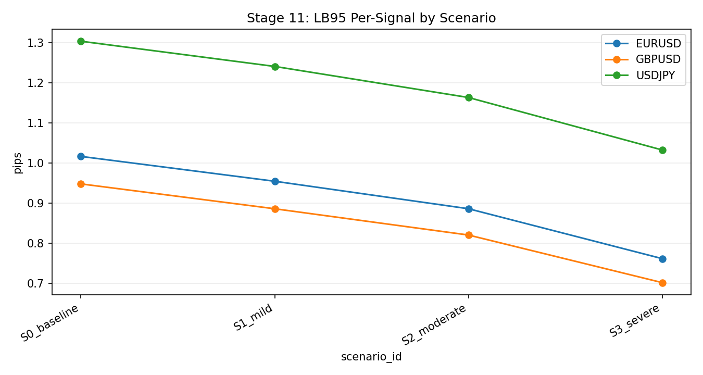
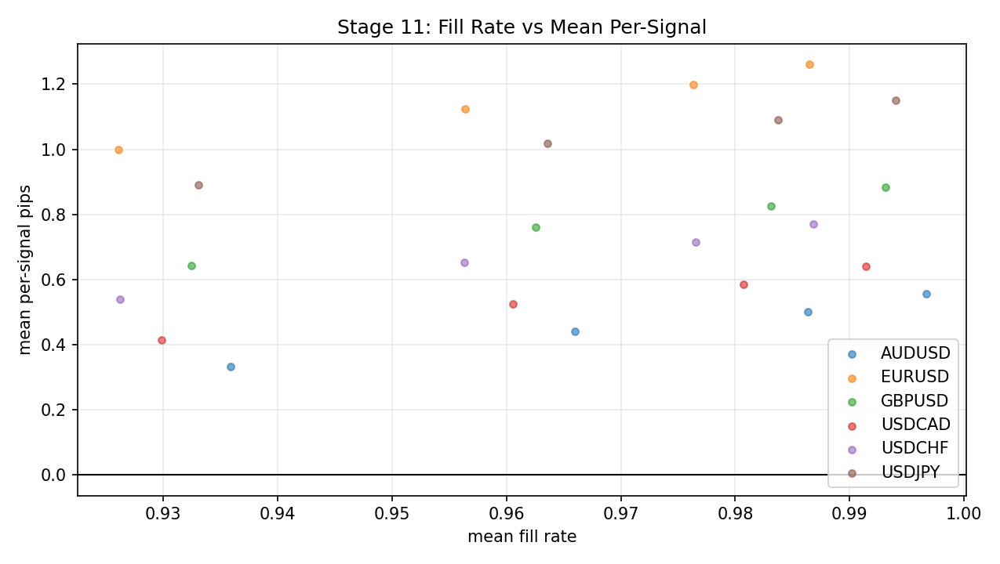

# Stage 11 - Execution Monte Carlo

## Objective
Stress-test stop-limit execution realism using month x session Monte Carlo scenarios and quantify deployment envelopes.

## Inputs
- `data/analysis/tick_opportunity_mining/stop_limit_tickfill_fullcap/<SYMBOL>_stop_limit_tickfill_detail.csv`
- `data/analysis/tick_opportunity_mining/stop_limit_tickfill_fullcap/<SYMBOL>_stop_limit_tickfill_caps.csv`
- `data/analysis/tick_opportunity_mining/execution_mc_month_session_summary.csv`
- `data/analysis/tick_opportunity_mining/execution_mc_symbol_scenarios.csv`
- `data/analysis/tick_opportunity_mining/execution_mc_checks.csv`

## Process
- Select production cap per symbol from Stage 04 cap sweep (`max mean_per_signal_full_overshoot`).
- Bucket events by `test_month x session_bucket`.
- Apply scenario stress transforms on cap and slippage.
- Simulate per-group and per-month distributions over `N` iterations.
- Aggregate to symbol scenario summaries and run governance checks `EM01..EM05`.

## Exact Calculations
- `cap_eff = max(cap_pips - latency_shift_pips, 0)`
- `extra_slip = spread_add_pips + max(0, overshoot_tick_pips - cap_eff)` (if cap-eligible, else 0)
- `pnl_pre = target_gross_pips - extra_slip` (if cap-eligible, else 0)
- `q_keep = 1 - fill_decay` (if cap-eligible, else 0)
- Per-signal random variable: `X = pnl_pre * Bernoulli(q_keep)`
- Group-level `mean_per_signal` draws use moment-matched normal approximation:
- `mu = E[X]`, `var = E[X^2] - mu^2`, draw `mu_draw ~ Normal(mu, sqrt(var/n))`
- Month-level and symbol-level draws are weighted sums of group draws.

## Causality / Leakage Controls
- Uses only realized tickfill artifacts already fixed in time.
- No future month labels are introduced.
- Scenario transforms are mechanical and do not use future outcomes for tuning.

## Failure Modes
- Over-optimistic pass when stress levels are too mild.
- Unstable estimates in sparse month/session buckets.
- Distribution shift beyond historical overshoot behavior.

## Interpretation Guide
- Higher `lb95_per_signal_pips` and `lb99_per_signal_pips` indicate stronger execution robustness.
- Lower `prob_negative_month` indicates better month-to-month stability.
- Lower `fill_rate_drop_vs_S0` indicates lower sensitivity to stress.
- `drawdown_proxy_p95` closer to zero indicates better downside containment.

## Validation Gates
- `EM01`: `lb95_per_signal_pips > 0` in `S1_mild`
- `EM02`: `lb95_per_signal_pips >= 0` in `S2_moderate`
- `EM03`: `prob_negative_month <= 0.35` in `S1_mild`
- `EM04`: `fill_rate_drop_vs_S0 <= 0.12` in `S1_mild`
- `EM05`: no NaN in core scenario outputs

## Canonical Analysis Reports
- `docs/analysis/oco_execution_monte_carlo_report.md`
- `docs/analysis/oco_execution_monte_carlo_validation_report.md`
- `docs/strategy_bible/operator_runbook.md`

## Operator Decision Tree
- If any hard gate in this stage fails, block promotion and escalate using the operator runbook.
- If only warning/amber diagnostics trigger, continue with mitigation and add an owner/deadline in remediation artifacts.

## How To Run
- Run the `Reproduction Commands` in this stage exactly as listed.
- Confirm artifacts are refreshed and timestamps are current before interpreting outcomes.

## How To Interpret Outputs
- Read `Key Results` first for pass/fail posture and core health metrics.
- Use `Interpretation Notes` and `Action Trigger Summary` to map observed values to operational actions.

## What To Do If It Fails
- `critical/high`: halt deployment progression, remediate root cause, rerun stage and downstream dependent stages.
- `medium/low`: open tracked remediation with owner and ETA, monitor for recurrence in next cycle.

## Reproduction Commands
```bash
uv run python scripts/run_execution_monte_carlo.py \
  --symbols EURUSD,GBPUSD,USDJPY,USDCHF

uv run python scripts/validate_execution_monte_carlo.py
```

## Traceability
- `scripts/run_execution_monte_carlo.py`
- `scripts/validate_execution_monte_carlo.py`
- `docs/analysis/oco_execution_monte_carlo_report.md`
- `docs/strategy_bible/generated/stage_11_snapshot.md`

## Generated Run Snapshot
<!-- GENERATED:STAGE_11:START -->
### Auto Snapshot - Stage 11

- generated_at: `2026-03-01 07:42:01 UTC`
- Execution Monte Carlo uses month x session stress scenarios derived from Stage 04 tickfill artifacts.
- EM01-EM05 summarize mild/moderate survival, month negativity risk, fill-rate decay, and data integrity.

#### Key Results
| symbol   |   signals |   lb95_s1 |   lb95_s2 |   prob_negative_month_s1 |   fill_rate_drop_s1 |   drawdown_proxy_p95_s1 |
|:---------|----------:|----------:|----------:|-------------------------:|--------------------:|------------------------:|
| EURUSD   |     59955 |  0.954467 |  0.885904 |                0.0526667 |           0.0103174 |              -0.0926176 |
| GBPUSD   |     70579 |  0.885835 |  0.820324 |                0         |           0.0105115 |               0.453491  |
| USDJPY   |     77785 |  1.24084  |  1.16332  |                0         |           0.0102528 |               0.681343  |

#### Interpretation Notes
- Execution Monte Carlo uses month x session stress scenarios derived from Stage 04 tickfill artifacts.
- EM01-EM05 summarize mild/moderate survival, month negativity risk, fill-rate decay, and data integrity.

#### Action Trigger Summary
| symbol   | metric_id                    | band   | severity   | action_code   | action_summary     | owner     |
|:---------|:-----------------------------|:-------|:-----------|:--------------|:-------------------|:----------|
| EURUSD   | EM03_prob_negative_month_s1  | green  | info       | A0_MONITOR    | within policy band | risk      |
| EURUSD   | EM04_fill_rate_drop_vs_s0_s1 | green  | info       | A0_MONITOR    | within policy band | execution |
| EURUSD   | EM05_nan_core_fields         | green  | info       | A0_MONITOR    | within policy band | data      |
| GBPUSD   | EM03_prob_negative_month_s1  | green  | info       | A0_MONITOR    | within policy band | risk      |
| GBPUSD   | EM04_fill_rate_drop_vs_s0_s1 | green  | info       | A0_MONITOR    | within policy band | execution |
| GBPUSD   | EM05_nan_core_fields         | green  | info       | A0_MONITOR    | within policy band | data      |
| USDJPY   | EM03_prob_negative_month_s1  | green  | info       | A0_MONITOR    | within policy band | risk      |
| USDJPY   | EM04_fill_rate_drop_vs_s0_s1 | green  | info       | A0_MONITOR    | within policy band | execution |
| USDJPY   | EM05_nan_core_fields         | green  | info       | A0_MONITOR    | within policy band | data      |

#### Details
| symbol   | scenario_id   |   mean_per_signal_pips |   lb95_per_signal_pips |   lb99_per_signal_pips |   mean_per_trade_pips |   mean_fill_rate |   prob_negative_month |   fill_rate_drop_vs_S0 |   drawdown_proxy_p95 |
|:---------|:--------------|-----------------------:|-----------------------:|-----------------------:|----------------------:|-----------------:|----------------------:|-----------------------:|---------------------:|
| EURUSD   | S0_baseline   |               1.05405  |               1.0164   |               1.00221  |              1.05775  |         0.996497 |             0.0203889 |              0         |           -0.043202  |
| EURUSD   | S1_mild       |               0.99154  |               0.954467 |               0.937237 |              1.00544  |         0.98618  |             0.0526667 |              0.0103174 |           -0.0926176 |
| EURUSD   | S2_moderate   |               0.923664 |               0.885904 |               0.871152 |              0.955984 |         0.966192 |             0.0855    |              0.030305  |           -0.14122   |
| EURUSD   | S3_severe     |               0.800246 |               0.76142  |               0.748062 |              0.855378 |         0.935548 |             0.109556  |              0.0609491 |           -0.227716  |
| GBPUSD   | S0_baseline   |               0.980829 |               0.947845 |               0.93458  |              0.988787 |         0.991952 |             0         |              0         |            0.506413  |
| GBPUSD   | S1_mild       |               0.918779 |               0.885835 |               0.870367 |              0.936153 |         0.981441 |             0         |              0.0105115 |            0.453491  |
| GBPUSD   | S2_moderate   |               0.852017 |               0.820324 |               0.805722 |              0.887021 |         0.960538 |             0         |              0.0314144 |            0.397051  |
| GBPUSD   | S3_severe     |               0.732035 |               0.701601 |               0.688771 |              0.786534 |         0.930712 |             0         |              0.0612406 |            0.292474  |
| USDJPY   | S0_baseline   |               1.34484  |               1.30366  |               1.28715  |              1.35508  |         0.992441 |             0         |              0         |            0.73494   |
| USDJPY   | S1_mild       |               1.28056  |               1.24084  |               1.22015  |              1.30379  |         0.982188 |             0         |              0.0102528 |            0.681343  |
| USDJPY   | S2_moderate   |               1.2045   |               1.16332  |               1.1456   |              1.25219  |         0.961918 |             0         |              0.0305226 |            0.608868  |
| USDJPY   | S3_severe     |               1.07092  |               1.03241  |               1.01325  |              1.15     |         0.931234 |             0         |              0.0612063 |            0.502254  |

#### Plots



#### Monte Carlo Governance Checks
| symbol   |   checks_total |   checks_failed |   high_critical_failed |
|:---------|---------------:|----------------:|-----------------------:|
| EURUSD   |              5 |               0 |                      0 |
| GBPUSD   |              5 |               0 |                      0 |
| USDJPY   |              5 |               0 |                      0 |

#### Month x Session Summary (head)
| symbol   | scenario_id   | test_month   | session_bucket   |   signals |   mean_per_signal_pips |   lb95_per_signal_pips |   mean_fill_rate |
|:---------|:--------------|:-------------|:-----------------|----------:|-----------------------:|-----------------------:|-----------------:|
| EURUSD   | S0_baseline   | 2025-04      | ASIA             |      7945 |              1.37264   |              1.25038   |         0.999371 |
| EURUSD   | S0_baseline   | 2025-04      | LATE             |      1044 |              0.842221  |              0.619214  |         1        |
| EURUSD   | S0_baseline   | 2025-04      | LONDON           |      6409 |              1.16997   |              1.05508   |         0.997035 |
| EURUSD   | S0_baseline   | 2025-04      | NY               |      5038 |              1.66718   |              1.46693   |         0.992854 |
| EURUSD   | S0_baseline   | 2025-05      | ASIA             |      3388 |              0.642873  |              0.50323   |         0.995573 |
| EURUSD   | S0_baseline   | 2025-05      | LATE             |       248 |              0.0104031 |             -0.332928  |         1        |
| EURUSD   | S0_baseline   | 2025-05      | LONDON           |      2049 |              0.743419  |              0.570539  |         0.999024 |
| EURUSD   | S0_baseline   | 2025-05      | NY               |      1237 |              0.710502  |              0.45903   |         0.958771 |
| EURUSD   | S0_baseline   | 2025-06      | ASIA             |      3389 |              0.606685  |              0.490639  |         0.998525 |
| EURUSD   | S0_baseline   | 2025-06      | LATE             |       233 |              1.01237   |              0.487442  |         0.987124 |
| EURUSD   | S0_baseline   | 2025-06      | LONDON           |      1655 |              1.0353    |              0.843488  |         0.996979 |
| EURUSD   | S0_baseline   | 2025-06      | NY               |      1335 |              0.838401  |              0.610803  |         0.997004 |
| EURUSD   | S0_baseline   | 2025-07      | ASIA             |      1161 |              1.12263   |              0.908203  |         1        |
| EURUSD   | S0_baseline   | 2025-07      | LATE             |       184 |              0.312063  |             -0.0708095 |         1        |
| EURUSD   | S0_baseline   | 2025-07      | LONDON           |      3290 |              1.87818   |              1.6712    |         0.992401 |
| EURUSD   | S0_baseline   | 2025-07      | NY               |      1248 |              1.22231   |              1.00394   |         0.999199 |
| EURUSD   | S0_baseline   | 2025-08      | ASIA             |       870 |              1.2878    |              1.03865   |         1        |
| EURUSD   | S0_baseline   | 2025-08      | LATE             |       100 |              1.03942   |              0.544942  |         1        |
| EURUSD   | S0_baseline   | 2025-08      | LONDON           |      2908 |              1.75022   |              1.53704   |         0.998281 |
| EURUSD   | S0_baseline   | 2025-08      | NY               |      1281 |              0.696691  |              0.509271  |         0.989852 |
| EURUSD   | S0_baseline   | 2025-09      | ASIA             |      1228 |              0.682916  |              0.481822  |         1        |
| EURUSD   | S0_baseline   | 2025-09      | LATE             |       168 |             -0.26903   |             -0.575437  |         1        |
| EURUSD   | S0_baseline   | 2025-09      | LONDON           |      2059 |              1.1988    |              0.999213  |         0.996115 |
| EURUSD   | S0_baseline   | 2025-09      | NY               |       870 |              1.04899   |              0.803132  |         0.998851 |
| EURUSD   | S0_baseline   | 2025-10      | ASIA             |      1912 |              0.769773  |              0.628142  |         1        |
| EURUSD   | S0_baseline   | 2025-10      | LATE             |        27 |             -0.141453  |             -0.874925  |         1        |
| EURUSD   | S0_baseline   | 2025-10      | LONDON           |      1709 |              0.551922  |              0.395891  |         0.997659 |
| EURUSD   | S0_baseline   | 2025-10      | NY               |       739 |              1.21598   |              0.919593  |         1        |
| EURUSD   | S0_baseline   | 2025-11      | ASIA             |      1721 |             -0.189005  |             -0.314725  |         0.998838 |
| EURUSD   | S0_baseline   | 2025-11      | LATE             |        26 |              0.966271  |              0.173004  |         1        |
| EURUSD   | S0_baseline   | 2025-11      | LONDON           |      1516 |              0.246497  |              0.0740008 |         1        |
| EURUSD   | S0_baseline   | 2025-11      | NY               |       255 |              0.483031  |              0.162271  |         0.988235 |
| EURUSD   | S0_baseline   | 2025-12      | ASIA             |       919 |              0.635621  |              0.454893  |         1        |
| EURUSD   | S0_baseline   | 2025-12      | LATE             |         4 |             -0.0192074 |             -0.901287  |         1        |
| EURUSD   | S0_baseline   | 2025-12      | LONDON           |      1424 |              0.690249  |              0.540183  |         1        |
| EURUSD   | S0_baseline   | 2025-12      | NY               |       366 |              0.780565  |              0.400719  |         0.991803 |
| EURUSD   | S1_mild       | 2025-04      | ASIA             |      7945 |              1.31001   |              1.18701   |         0.988971 |
| EURUSD   | S1_mild       | 2025-04      | LATE             |      1044 |              0.783692  |              0.564918  |         0.989994 |
| EURUSD   | S1_mild       | 2025-04      | LONDON           |      6409 |              1.09997   |              0.983138  |         0.986897 |
| EURUSD   | S1_mild       | 2025-04      | NY               |      5038 |              1.5962    |              1.39517   |         0.982735 |

- month_session_rows_shown: `40` of `428`
- full_month_session_artifact: `data/analysis/tick_opportunity_mining/execution_mc_month_session_summary.csv`
<!-- GENERATED:STAGE_11:END -->
