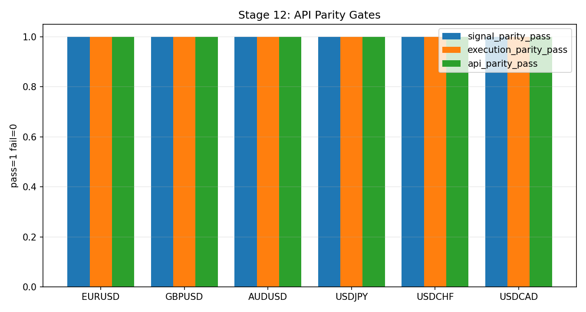

# Stage 12 - API Parity Against Reduced Core

## Objective
Confirm that the production Python/API runtime, when driven by canonical parquet ticks, reproduces reduced-core research truth and produces the Stage 12 prerequisite artifacts consumed by the unified Stage 12 -> Stage 13 certification flow.

## Inputs
- `data/analysis/backtest_reconcile/<SYMBOL>_stage12_api_parity_summary.csv`
- `data/analysis/backtest_reconcile/<SYMBOL>_stage12_api_parity_checks.csv`
- `data/analysis/backtest_reconcile/<SYMBOL>_stage12_api_parity_mismatches.csv`
- `docs/analysis/<SYMBOL>_stage12_api_parity_report.md`
- `data/analysis/tick_opportunity_mining/stop_limit_tickfill_fullcap/<SYMBOL>_stop_limit_tickfill_detail.csv`
- `data/analysis/tick_opportunity_mining/reduced_core_rolling/<SYMBOL>_oco_reduced_state_schedule.csv`

## Process
- Run the unified Stage 12 -> Stage 13 certification command for the active universe or a requested symbol subset.
- Stage 12 executes first for each symbol.
- Trigger prediction only on completed bars, matching cBot cadence.
- In historical replay mode, preserve exact tick-bar phase using the full-history tail:
  - warmup sent = `warmup_ticks + (all_prior_ticks mod bar_ticks)`
  - this prevents month-boundary or lookback-window phase drift.
- In historical replay mode, gate API evaluation to the locked repo prediction universe for the requested month:
  - only `(candidate_uid, close_ts)` rows present in the locked predictions parquet are eligible.
  - this prevents the API from evaluating bars the research pipeline never treated as candidate events.
- In that locked historical path, the repo prediction-universe row is already regime-qualified, so Stage 12 does not apply a second runtime regime veto on top of the locked row.
- Compare API-selected keys to reduced-core truth on `candidate_uid + close_ts`.
- Emit `*_stage12_api_parity_summary.csv` per symbol.
- Allow Stage 13 replay generation only for Stage 12-passing symbols.

## Exact Calculations
- Signal parity passes only when:
  - `selected_missing_expected == 0`
  - `selected_extra_runtime == 0`
- Execution parity passes only when the execution validator has:
  - `overall_pass == true`
  - no high/critical failing checks
- Stage 12 passes only when both signal parity and execution parity pass.

## Causality / Leakage Controls
- Canonical-feed replay is restricted to the requested validation window plus warmup.
- Reduced-core filtering is applied before parity comparison.
- API inference is evaluated on replay-time bar completion only; no direct research-side shortcut is allowed.
- Historical parity truth is always repo-side reduced-core output:
  - signal truth comes from the locked predictions parquet filtered by reduced-core state schedule
  - execution truth comes from stop-limit detail filtered by the same reduced-core schedule
- Stage 12 does not treat cTrader broker-side data as truth. cTrader remains supplemental reconciliation, not canonical truth for this gate.

## Failure Modes
- API emits extra selected setups not present in reduced-core truth.
- API misses reduced-core selected setups.
- Execution lifecycle diverges after a nominally matched signal.
- Warmup or ingestion errors leave the API in a degraded state.
- Stage 12 artifacts are missing or stale.

## Interpretation Guide
- `signal_parity_pass=false` means the API decision stream is not research-equivalent.
- `execution_parity_pass=false` means downstream lifecycle behavior diverges even if selection is close.
- `stage12_api_parity_pass=false` is a deployment blocker.
- If `selected_extra_runtime > 0`, the API is admitting rows outside reduced-core truth and must be treated as over-trading.
- If `selected_missing_expected > 0`, the API is suppressing repo-approved reduced-core rows and must be treated as under-trading.

## Validation Gates
- Stage 12 is a hard gate.
- If Check 2 fails, Stage 12 fails critically.
- If Check 3 fails, Stage 12 fails critically.
- If either Stage 12 artifacts or Stage 12 docs outputs are missing, treat the stage as failed.

## Operator Decision Tree
- If signal parity fails: stop and reconcile the API decision path before any deployment work.
- If execution parity fails: inspect trade lifecycle translation, timing, and runtime DB outputs.
- If both pass: Stage 12 may be treated as satisfied for the validated window only.

## Historical Replay Contract
- Canonical runner: `make stage12-stage13-cert-artifacts`
- Canonical truth window: repo reduced-core outputs for the requested `START_TS/END_TS`
- Canonical feed: Dukascopy parquet under `/Users/danielfisher/Desktop/dukascopy_ticks`
- Canonical warmup mode: `history_tail`
- Canonical historical lock source: `configs/research/governance/oco_history_dukascopy_candidate/<YYYY-MM>/<symbol>_oco_live_lock.json`
- Canonical expectations:
  - exact signal parity on `candidate_uid + close_ts`
  - green Stage 12 prerequisite summary
  - any miss or extra row is a critical failure

## How To Run
```bash
make stage12-stage13-cert-artifacts \
  SYMBOLS=EURUSD \
  MODEL_MONTH=2025-07 \
  HISTORY_DIR=configs/research/governance/oco_history_dukascopy_candidate \
  TICK_ROOT=/Users/danielfisher/Desktop/dukascopy_ticks \
  START_TS=2025-07-07T00:00:00Z \
  END_TS=2025-07-09T00:00:00Z
```

## How To Interpret Outputs
- Use the Stage 12 summary CSV for pass/fail status and counts.
- Use the Stage 12 checks CSV to isolate which parity gate failed.
- Use the Stage 12 mismatches CSV and per-symbol report for concrete offending rows.

## What To Do If It Fails
- Treat the failure as critical.
- Do not infer deployability from Stage 04, Stage 06, or Stage 11 if Stage 12 is red.
- Fix the API/replay/runtime behavior and rerun `make stage12-stage13-cert-artifacts` until the Stage 12 prerequisite is green.

## Canonical Analysis Reports
- `docs/analysis/EURUSD_stage12_api_parity_report.md`
- `docs/analysis/stage13_dukascopy_testclient_report.md`

## Reproduction Commands
```bash
uv run python scripts/run_stage12_stage13_certification.py \
  --symbols EURUSD \
  --model-month 2025-07 \
  --history-dir configs/research/governance/oco_history_dukascopy_candidate \
  --tick-root /Users/danielfisher/Desktop/dukascopy_ticks \
  --start-ts 2025-07-07T00:00:00Z \
  --end-ts 2025-07-09T00:00:00Z
```

## Traceability
- `scripts/run_stage12_stage13_certification.py`
- `scripts/validate_api_parity.py`
- `scripts/build_oco_strategy_bible.py`
- `scripts/validate_oco_docs_contract.py`

### Auto Snapshot - Stage 12
<!-- GENERATED:STAGE_12:START -->
### Auto Snapshot - Stage 12

- generated_at: `2026-04-03 12:49:19 UTC`
- Stage 12 is a hard gate: strict signal parity and execution parity must both match reduced-core truth.
- Any non-green Stage 12 symbol is a critical deployment blocker.

#### Key Results
| symbol   | signal_parity_pass   | execution_parity_pass   | api_parity_pass   |   selected_missing_expected |   selected_extra_runtime |   execution_failed_checks_high_critical | verdict   | report_path                                       |
|:---------|:---------------------|:------------------------|:------------------|----------------------------:|-------------------------:|----------------------------------------:|:----------|:--------------------------------------------------|
| EURUSD   | True                 | True                    | True              |                           0 |                        0 |                                       0 | green     | docs/analysis/EURUSD_stage12_api_parity_report.md |
| GBPUSD   | True                 | True                    | True              |                           0 |                        0 |                                       0 | green     | docs/analysis/GBPUSD_stage12_api_parity_report.md |
| AUDUSD   | True                 | True                    | True              |                           0 |                        0 |                                       0 | green     | docs/analysis/AUDUSD_stage12_api_parity_report.md |
| USDJPY   | True                 | True                    | True              |                           0 |                        0 |                                       0 | green     | docs/analysis/USDJPY_stage12_api_parity_report.md |
| USDCHF   | True                 | True                    | True              |                           0 |                        0 |                                       0 | green     | docs/analysis/USDCHF_stage12_api_parity_report.md |
| USDCAD   | True                 | True                    | True              |                           0 |                        0 |                                       0 | green     | docs/analysis/USDCAD_stage12_api_parity_report.md |

#### Interpretation Notes
- Stage 12 is a hard gate: strict signal parity and execution parity must both match reduced-core truth.
- Any non-green Stage 12 symbol is a critical deployment blocker.

#### Action Trigger Summary
| trigger            | threshold_or_signal   | action_code                   | action_summary                                                          |
|:-------------------|:----------------------|:------------------------------|:------------------------------------------------------------------------|
| hard_gate_fail     | status=fail           | A3_HALT_RECALIBRATE           | Block promotion and rerun upstream stage diagnostics before continuing. |
| monitoring_warning | band=amber            | A0_MONITOR/A1_RECALIBRATE_CAP | Apply stage runbook remediation and confirm next-run recovery.          |

#### Plots

<!-- GENERATED:STAGE_12:END -->
