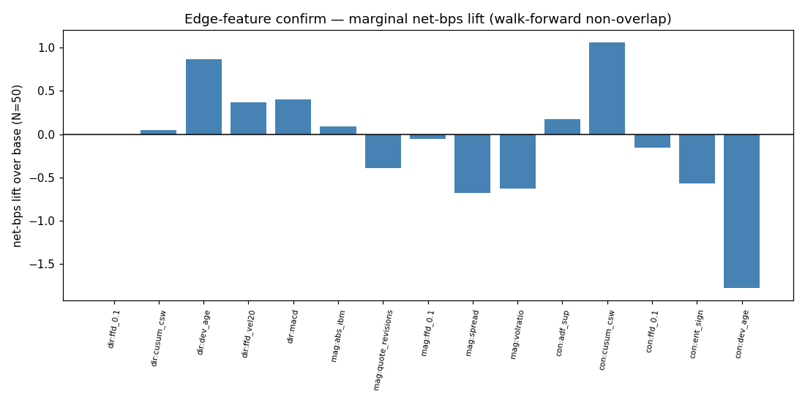

# Edge-Based Feature Search — Report

Two-track (direction, magnitude) + conditioning lens. Stage-1 screen (|ret|-weighted dir IC / IC vs |ret| / tercile net-bps spread) -> Stage-2 marginal net-bps lift over the fixed base (fade ffd_zvol20 x top-decile |ffd_zvol20|), walk-forward non-overlap, cost 1.0bps.

**No modelling.** All combinations are simple non-fit rules. Full higher-order non-linear interaction discovery (HistGBM importance under a P&L objective) is the deferred next phase.

## Confirm — marginal net-bps lift (N=50)

| role        | feature         |       lift |   cand_net |   base_net |   folds_pos |
|:------------|:----------------|-----------:|-----------:|-----------:|------------:|
| conditioner | cusum_csw       |  1.06185   |  1.66941   |   0.607557 |           3 |
| direction   | dev_age         |  0.866303  |  1.47386   |   0.607557 |           3 |
| direction   | macd            |  0.402659  |  1.01022   |   0.607557 |           4 |
| direction   | ffd_vel20       |  0.368863  |  0.97642   |   0.607557 |           4 |
| conditioner | adf_sup         |  0.17407   |  0.781627  |   0.607557 |           2 |
| magnitude   | abs_ibm         |  0.0876722 |  0.695229  |   0.607557 |           4 |
| direction   | cusum_csw       |  0.0460459 |  0.653603  |   0.607557 |           2 |
| direction   | ffd_0.1         |  0         |  0.607557  |   0.607557 |           4 |
| magnitude   | ffd_0.1         | -0.0570574 |  0.5505    |   0.607557 |           3 |
| conditioner | ffd_0.1         | -0.151777  |  0.45578   |   0.607557 |           2 |
| magnitude   | quote_revisions | -0.392536  |  0.215021  |   0.607557 |           2 |
| conditioner | ent_sign        | -0.569474  |  0.038083  |   0.607557 |           2 |
| magnitude   | volratio        | -0.631426  | -0.0238689 |   0.607557 |           2 |
| magnitude   | spread          | -0.675711  | -0.0681543 |   0.607557 |           1 |
| conditioner | dev_age         | -1.77972   | -1.17217   |   0.607557 |           2 |
