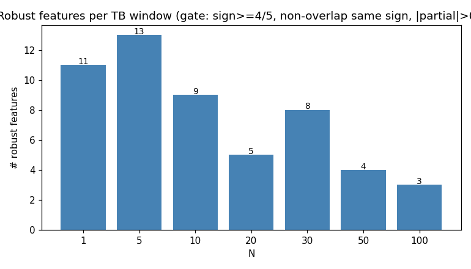
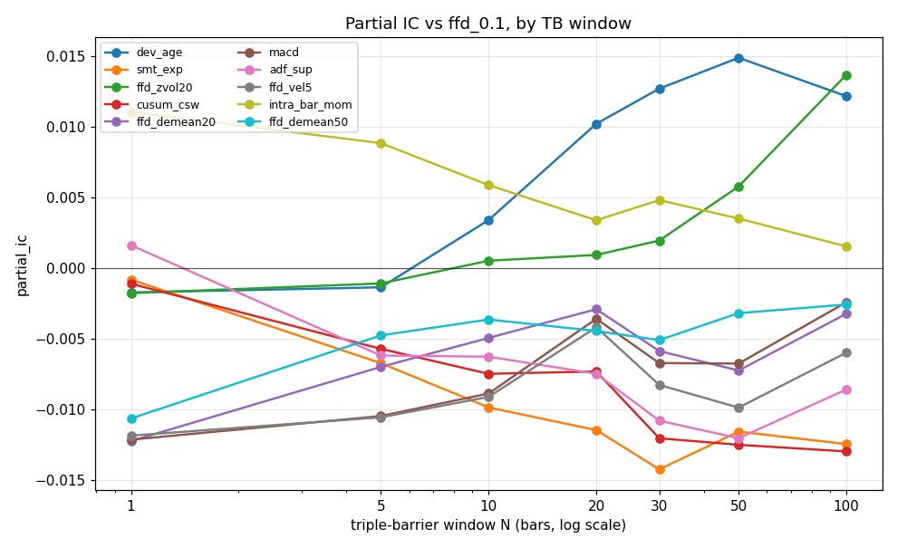
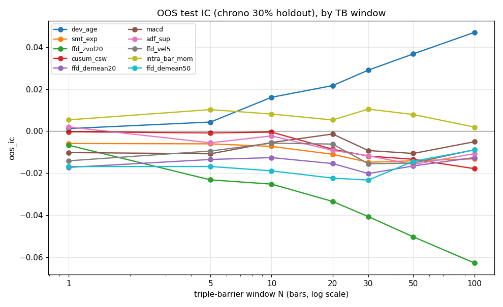
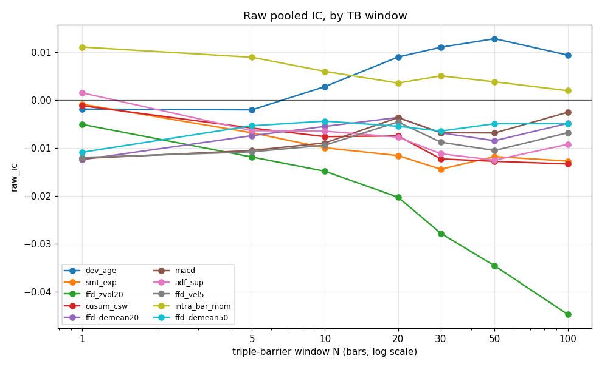
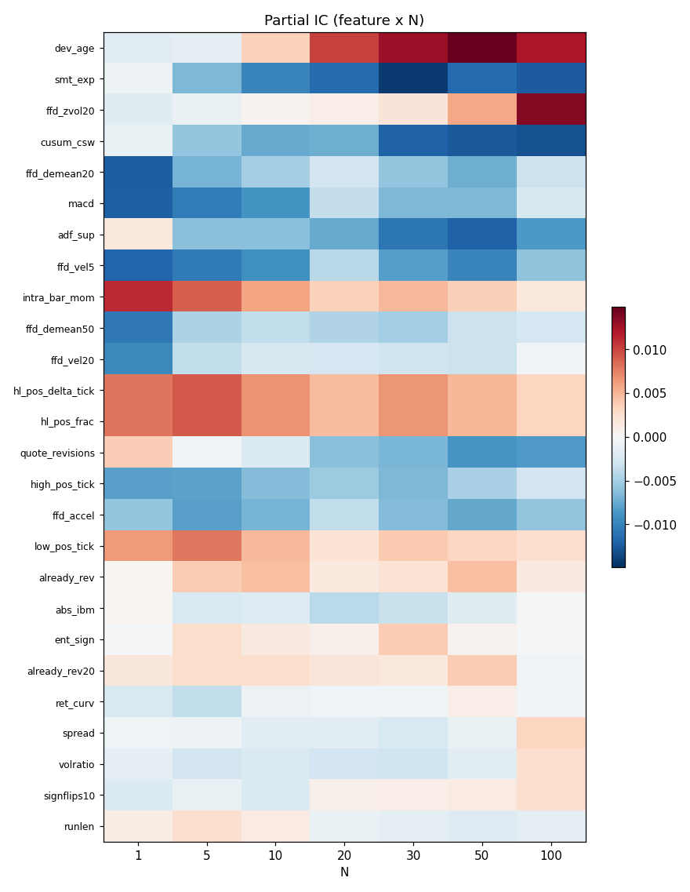
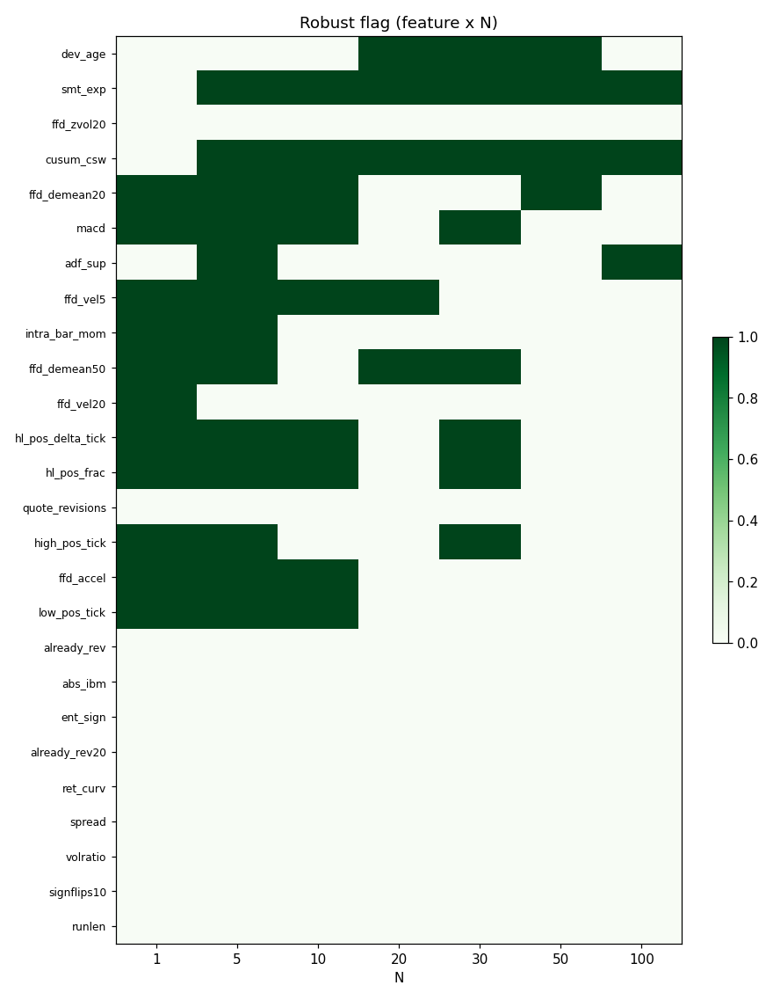

# Definitive Feature-IC Study — Report

**Setup:** 1000-tick bars, pooled 5 ex-JPY majors, N-bar triple-barrier target (vol-scaled symmetric barriers `1.0*vol*sqrt(N)`), 40k events/symbol. Partial IC controls for `ffd_0.1`; sign = k/5 majors; OOS = chrono 30% holdout; non-overlap IC = every N-th event. Significance deliberately not reported (OOS is the arbiter).

## Robust features per N

## IC vs window

## Heatmaps

## Robustness gate by N

### N = 1 — 11 robust

| feature | raw_ic | partial_ic | oos_ic | sign | nov_ic |
| --- | --- | --- | --- | --- | --- |
| ffd_demean20 | -0.0124 | -0.0122 | -0.0173 | 5 | -0.0124 |
| macd | -0.0122 | -0.0121 | -0.0102 | 5 | -0.0122 |
| ffd_vel5 | -0.0119 | -0.0119 | -0.0141 | 5 | -0.0119 |
| intra_bar_mom | 0.0111 | 0.0111 | 0.0054 | 5 | 0.0111 |
| ffd_demean50 | -0.0109 | -0.0106 | -0.0169 | 5 | -0.0109 |
| ffd_vel20 | -0.0098 | -0.0096 | -0.0142 | 5 | -0.0098 |
| high_pos_tick | -0.0082 | -0.0081 | -0.0042 | 5 | -0.0082 |
| hl_pos_frac | 0.0080 | 0.0080 | 0.0023 | 5 | 0.0080 |
| hl_pos_delta_tick | 0.0080 | 0.0080 | 0.0023 | 5 | 0.0080 |
| low_pos_tick | 0.0064 | 0.0064 | 0.0000 | 4 | 0.0064 |
| ffd_accel | -0.0059 | -0.0059 | -0.0073 | 5 | -0.0059 |

### N = 5 — 13 robust

| feature | raw_ic | partial_ic | oos_ic | sign | nov_ic |
| --- | --- | --- | --- | --- | --- |
| ffd_vel5 | -0.0108 | -0.0106 | -0.0095 | 5 | -0.0080 |
| macd | -0.0105 | -0.0105 | -0.0108 | 5 | -0.0133 |
| hl_pos_frac | 0.0093 | 0.0092 | 0.0138 | 5 | 0.0098 |
| hl_pos_delta_tick | 0.0093 | 0.0092 | 0.0138 | 5 | 0.0098 |
| intra_bar_mom | 0.0090 | 0.0089 | 0.0102 | 5 | 0.0071 |
| ffd_accel | -0.0081 | -0.0080 | -0.0034 | 5 | -0.0071 |
| high_pos_tick | -0.0081 | -0.0080 | -0.0117 | 4 | -0.0040 |
| low_pos_tick | 0.0079 | 0.0078 | 0.0124 | 5 | 0.0107 |
| ffd_demean20 | -0.0074 | -0.0070 | -0.0135 | 5 | -0.0117 |
| smt_exp | -0.0068 | -0.0067 | -0.0061 | 4 | -0.0133 |
| adf_sup | -0.0064 | -0.0062 | -0.0056 | 4 | -0.0081 |
| cusum_csw | -0.0058 | -0.0057 | -0.0009 | 4 | -0.0096 |
| ffd_demean50 | -0.0053 | -0.0048 | -0.0168 | 5 | -0.0129 |

### N = 10 — 9 robust

| feature | raw_ic | partial_ic | oos_ic | sign | nov_ic |
| --- | --- | --- | --- | --- | --- |
| smt_exp | -0.0099 | -0.0099 | -0.0073 | 4 | -0.0118 |
| ffd_vel5 | -0.0094 | -0.0091 | -0.0057 | 5 | -0.0155 |
| macd | -0.0089 | -0.0089 | -0.0054 | 5 | -0.0051 |
| cusum_csw | -0.0076 | -0.0075 | -0.0005 | 4 | -0.0094 |
| ffd_accel | -0.0069 | -0.0069 | -0.0009 | 5 | -0.0051 |
| hl_pos_frac | 0.0069 | 0.0067 | 0.0115 | 4 | 0.0025 |
| hl_pos_delta_tick | 0.0069 | 0.0067 | 0.0115 | 4 | 0.0025 |
| ffd_demean20 | -0.0055 | -0.0049 | -0.0126 | 4 | -0.0054 |
| low_pos_tick | 0.0050 | 0.0049 | 0.0106 | 4 | 0.0040 |

### N = 20 — 5 robust

| feature | raw_ic | partial_ic | oos_ic | sign | nov_ic |
| --- | --- | --- | --- | --- | --- |
| smt_exp | -0.0116 | -0.0115 | -0.0110 | 4 | -0.0116 |
| dev_age | 0.0090 | 0.0102 | 0.0217 | 5 | 0.0243 |
| cusum_csw | -0.0074 | -0.0073 | -0.0086 | 4 | -0.0179 |
| ffd_demean50 | -0.0054 | -0.0044 | -0.0224 | 5 | -0.0041 |
| ffd_vel5 | -0.0045 | -0.0042 | -0.0062 | 4 | -0.0018 |

### N = 30 — 8 robust

| feature | raw_ic | partial_ic | oos_ic | sign | nov_ic |
| --- | --- | --- | --- | --- | --- |
| smt_exp | -0.0144 | -0.0142 | -0.0148 | 4 | -0.0368 |
| dev_age | 0.0111 | 0.0127 | 0.0290 | 4 | 0.0183 |
| cusum_csw | -0.0122 | -0.0120 | -0.0119 | 4 | -0.0331 |
| macd | -0.0068 | -0.0067 | -0.0092 | 4 | -0.0053 |
| high_pos_tick | -0.0071 | -0.0067 | -0.0130 | 4 | -0.0015 |
| hl_pos_frac | 0.0070 | 0.0066 | 0.0132 | 4 | 0.0010 |
| hl_pos_delta_tick | 0.0070 | 0.0066 | 0.0132 | 4 | 0.0010 |
| ffd_demean50 | -0.0064 | -0.0051 | -0.0233 | 5 | -0.0049 |

### N = 50 — 4 robust

| feature | raw_ic | partial_ic | oos_ic | sign | nov_ic |
| --- | --- | --- | --- | --- | --- |
| dev_age | 0.0129 | 0.0149 | 0.0367 | 5 | 0.0261 |
| cusum_csw | -0.0127 | -0.0125 | -0.0134 | 4 | -0.0278 |
| smt_exp | -0.0118 | -0.0116 | -0.0141 | 4 | -0.0125 |
| ffd_demean20 | -0.0084 | -0.0072 | -0.0166 | 5 | -0.0123 |

### N = 100 — 3 robust

| feature | raw_ic | partial_ic | oos_ic | sign | nov_ic |
| --- | --- | --- | --- | --- | --- |
| cusum_csw | -0.0133 | -0.0130 | -0.0179 | 4 | -0.0120 |
| smt_exp | -0.0127 | -0.0125 | -0.0132 | 4 | -0.0098 |
| adf_sup | -0.0092 | -0.0086 | -0.0107 | 4 | -0.0308 |

